*On October 21, 2017, at the MIT Media Lab,* [*Processing Community Day*](https://day.processing.org/) *convened for the first time, bringing together longtime and new contributors, fellowship and Google Summer of Code alumni, guest speakers, and the Processing Foundation Board. This series of articles reflects the experiences of three participants who were there.*

---

**Background**

Hello! I’m Shipra Gupta, an information and user experience designer. My professional work involves making websites and apps intuitive for users through the multidisciplinary practice of domain research, information architecture, interaction, and graphic design. Coding is therefore one of the tools I use to make design come alive.

One of my recent works includes articulating and implementing the user experience of care assurance portal enterprise applications at [AT&T](http://delabyrinthe.com/project/att/). While business applications are challenging due to their inherent complexity, my true passion is working at the intersection of art and science. [The Great Arc](http://delabyrinthe.com/project/the-great-arc/) exhibition and illustrations for [SEED](http://delabyrinthe.com/client/seed-media-group/) are pertinent client project examples that demonstrate the kind of subjects I love to work on.

More recently, I am gravitating toward developing interactive objects for early childhood and middle school education. My child attends a montessori preschool, and their idea of manipulatives works perfectly with responsive projects because they are self-correcting. In other words, unless interacted with correctly, the system won’t provide feedback, thereby nudging the child to problem solve to make it work. The classroom encourages parents to participate, and I was able to conduct a paper circuit exercise with the students, which was well received. Here, the manipulative was the circuit, whose feedback was a lit up LED. If it did not light up, the student went down the path of formulating questions, experimenting, and learning.

It was while working on The Great Arc exhibition that I first observed how technology was changing the face of traditional graphic design. Eager to learn more, I began a search that led me to Ben Fry ([Computational Information Design](http://benfry.com/phd/)), Jared Tarbell ([Levitated](http://levitated.net/daily/index.html)), and others. Their work spoke to the kind of art-science-tech synergy I was hoping to pursue in my own work.

**Chasing Ben Fry**

In 2007 I immigrated to the United States to study at the Parsons Design and Technology Program. The program taught art and design using Processing. It was my first experience with programming, my first time building websites, my first time doing anything with code. I also got exposure to Actionscript, PHP, MySQL, Python, and OpenFrameworks.

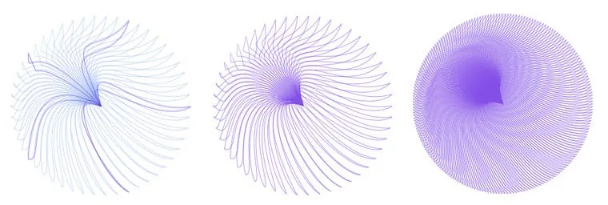

**Sketches made with Processing at Parsons.**

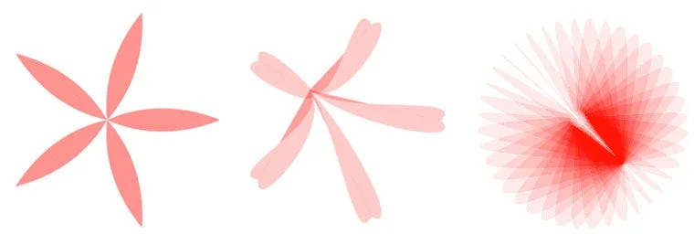

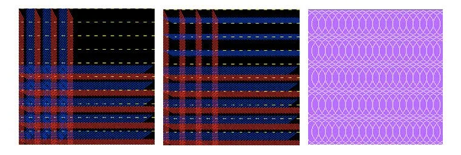

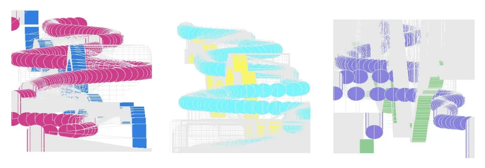

I learned a tremendous amount. I came to understand the basic structure of programs (variables, functions, loops, etc), I became conversant in a variety of languages by being able to compare their structural parallels, and I was able to define the logic of my programs in plain-speak and write simple programs.

Yet when I graduated in 2009, I was still overwhelmed by syntax and couldn’t write more complex programs that would enable me to create a meaningful visualization. Neither had my additional statistics classes made me confident in cleaning or thinking about data. For example, [Mapping Architecture](https://www.dropbox.com/s/kb39ps9bojjjswi/01-mappingArchitectureDoc.pdf?dl=0) and [Conserving Freshwater](http://delabyrinthe.com/shipra/water.html) were projects that I would’ve liked to develop further.

I wanted to work with Ben Fry to keep learning. I almost managed it when I got a temporary gig at SEED — only to discover that Ben was leaving to start Fathom Information Design. I considered moving to Boston to try to work at Fathom, but life had other plans.

**Processing Community Day**

Fast forward seven years. Here I was, updating my website and resume, preparing to phase back into full-time work after having children. I was hoping to connect with scientists, educators, and designers working to make information more accessible and intuitive to their audiences, whether they be situated in a museum, a classroom, or an app. And then I got an email about the first Processing Community Day — a chance to meet Ben Fry, Casey Reas, do a workshop with Fathom, and meet others working in the community!

My husband and I left Jersey City before dawn to drive up to Boston. We had met at Parsons, where we collaborated on various projects, one of them being [*Jim*](https://www.dropbox.com/s/e52jsy32k35uylh/03-Lobby%20Pet-doc.pdf?dl=0), an interactive projection built with Processing. Both of us felt like this was going to be a chance to relive some of our school experiences.

The community day didn’t disappoint. In the first talk, I felt nostalgic as Casey described his own school years with John Maeda as teacher — the vision, history, and early years of the Design By Numbers project that we now know as Processing.

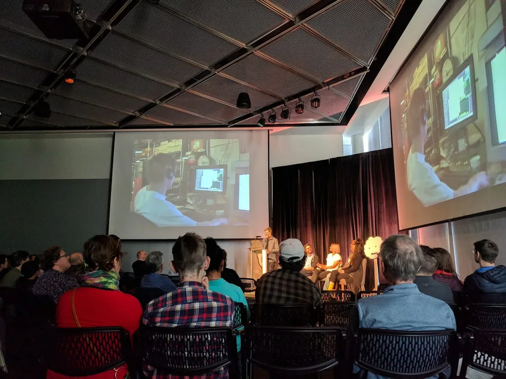

**Casey Reas presenting on the origins of Processing, which was initiated by Reas and Ben Fry as graduate students at the MIT Media Lab in 2001.**

The project presentations were a fascinating survey of the possible applications of Processing. Gottfried Haider’s responsive sculptures running on [Raspberry Pi](https://projects.raspberrypi.org/en/projects/introduction-to-processing) looked very promising as teaching aids. Maxime Damecour’s [Freeliner](http://freeliner.xyz/) project was magical!

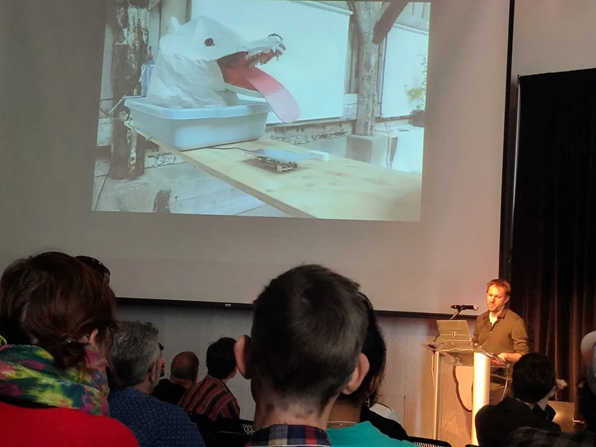

**Gottfried Haider’s responsive sculpture.**

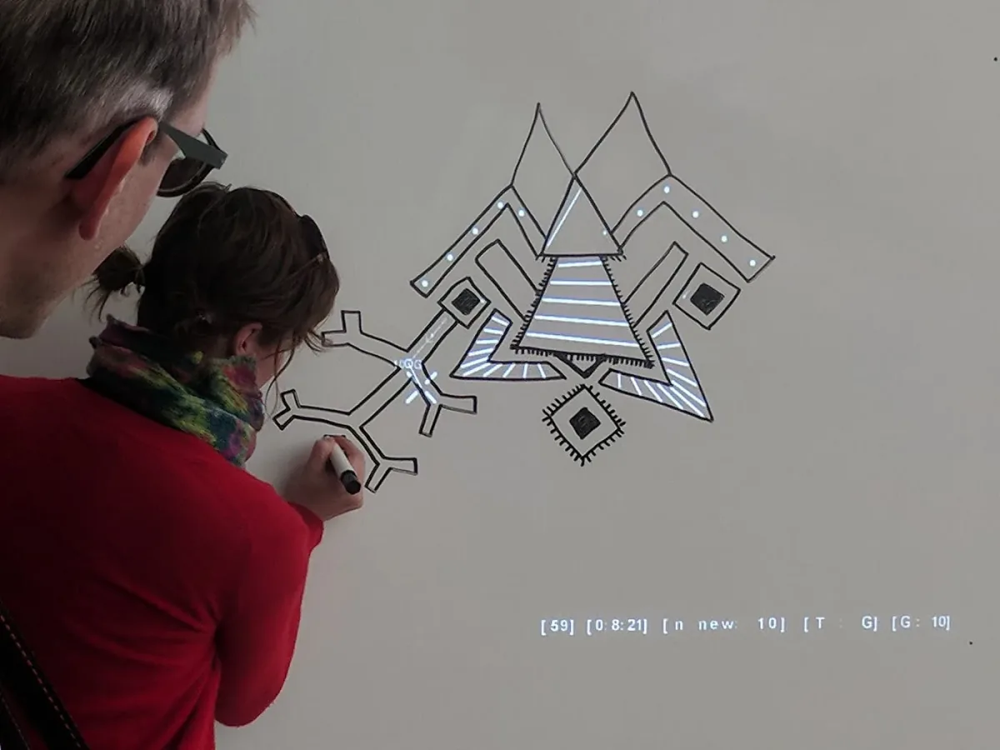

**Maxime Damecour demonstrating his Freeliner project.**

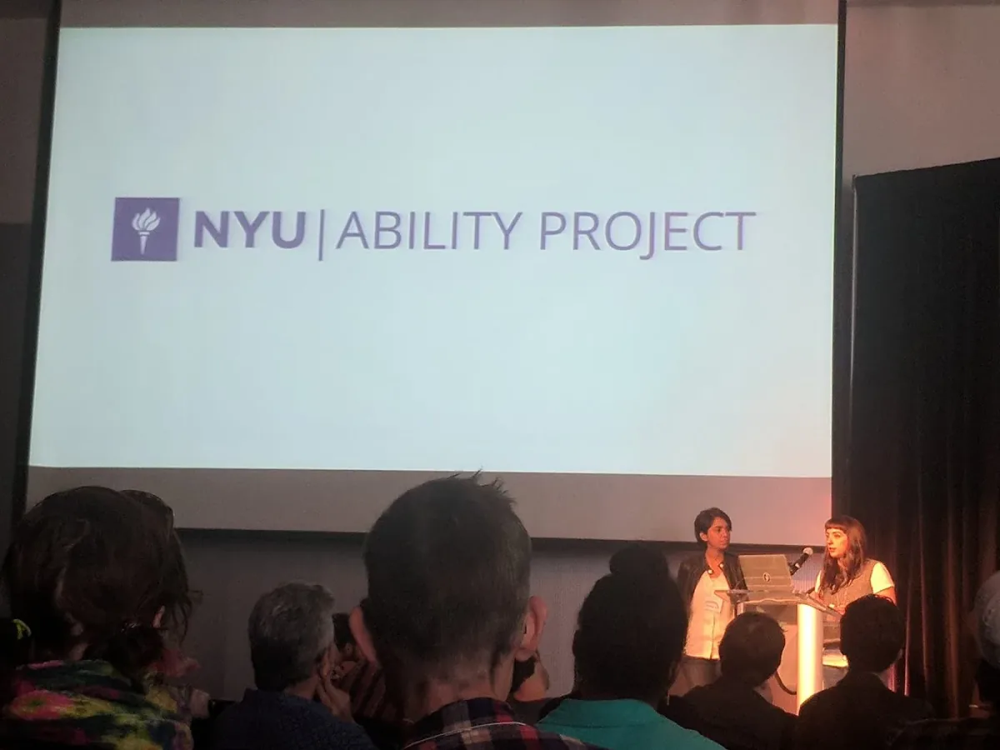

**Claire Kearney-Volpe and Mathura* Govindarajan presenting their work on making p5.js accessible to the blind and visually impaired.*

Claire and Mathura’s Ability Project caught my attention and got me brainstorming. The team is working to develop non-visual programing interfaces for the blind and visually impaired. The explorations they presented used auditory feedback to communicate the Processing sketch. I had seen some work done with ferrofluid in the past and wondered if they had explored tactile interfaces. I was able to connect with Claire during lunch to discuss. Claire mentioned they had looked into pin-array type tactile devices and ferrofluid would be an interesting technology to consider.

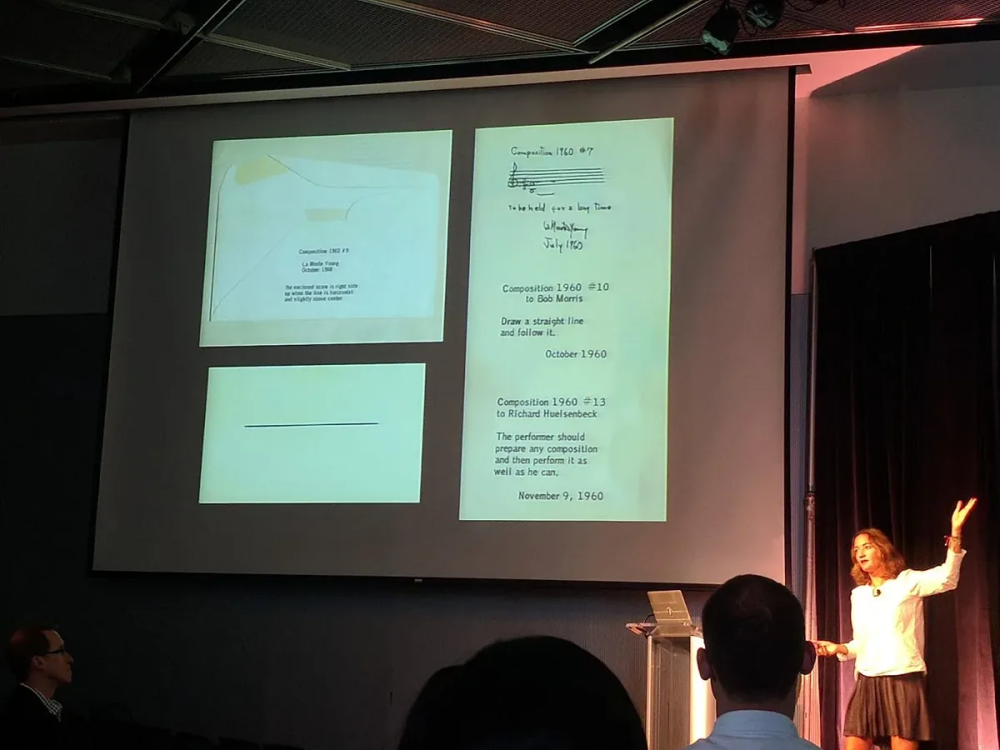

**Eva Diaz presenting on Black Mountain College.**

Eva Diaz’s talk on the history of Black Mountain College brought back memories of studying art history in school. While business as usual is all about completing client projects, it served as a reminder that art was not just a practice, but also a way to interrogate creative activity at large.

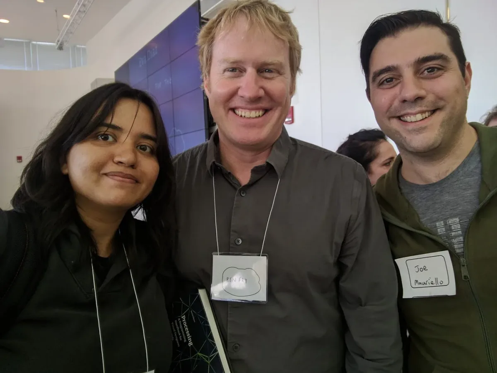

**Joe and myself with Ben Fry!**

Being present at the community felt like a walk amongst giants. It was special to meet Casey Reas and Golan Levin in person. And I was awed to meet Ben Fry! I recounted the impact of his work and how it sets the bar for what I wish to achieve in my own work. He advised me that the best way of overcoming the fear of syntax is to keep coding and not give up, even when it seems overwhelming. The practice over time is what builds the confidence in solving problems.

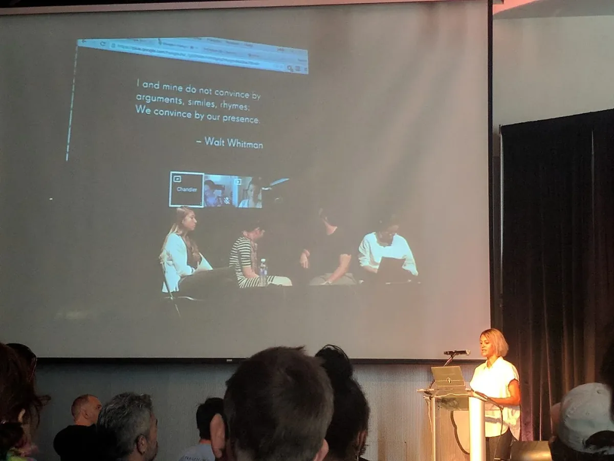

**Lauren McCarthy presenting on the origins of p5.js.**

The event was encapsulated for me by Lauren McCarthy’s talk about her struggles with making a presence within coding communities. She described a journey that went from her being unsure of how she could contribute, to following Casey Reas’s advice of “just doing something,” to an eventual culmination in her developing p5.js.

Her story was heartening, as it spoke to where I currently find myself — a nervous hopeful looking to engage again with the environment that I left seven years ago. It’s intimidating, yet to rephrase Lauren, “Sometimes we are seeking an invitation to participate, and starting with ‘just do something’ can become a catalyst.”

I think the Processing Community Day was designed as the invitation for someone like me, and Lauren’s talk certainly drove the message home. I am grateful to all members of the Processing Community for an inclusive environment, where creatives at any level of expertise can thrive in constructive encouragement and support. Thank you!
