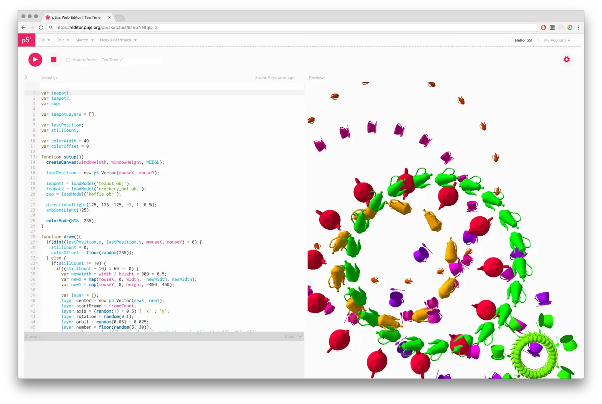
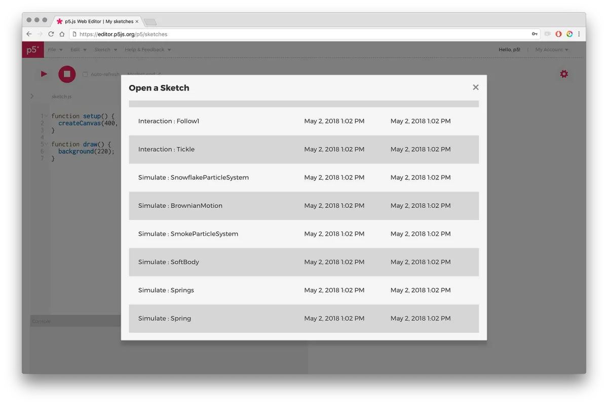
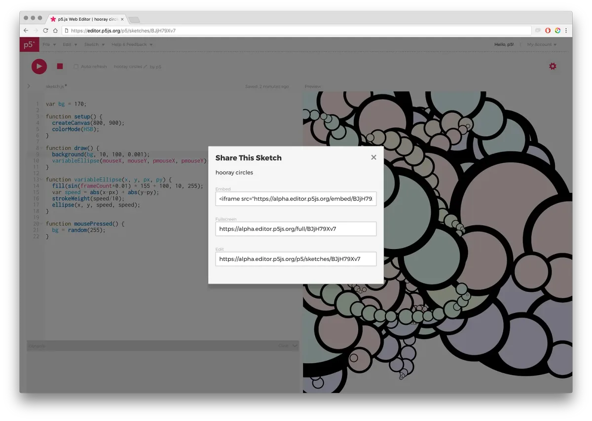
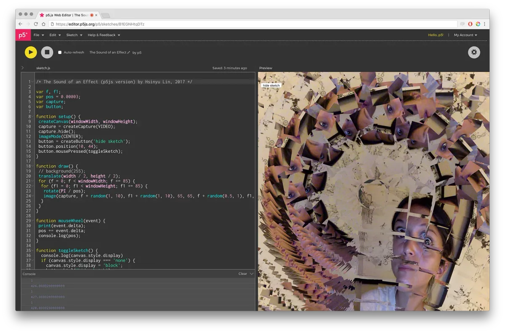

  <iframe src="https://www.youtube.com/embed/dtHxDggkBYc?feature=oembed" frameborder="0" scrolling="no"></iframe>

Designed for all ages and abilities, anyone can get started quickly creating,
editing, and sharing [p5.js](https://p5js.org) sketches.

_p5.js Web Editor featuring “Tea Time” by Matthew Kaney \[image description:
Screenshot of p5.js Web Editor in browser tab with sketch of tea objects
spiraling\]_

Visit [editor.p5js.org](https://editor.p5js.org) to begin making a project. You
can start with one of the many [examples](https://editor.p5js.org/p5/sketches),
or start from scratch. It is free and the open source, no sign up, setup, or
download required. Using p5.js you can use JavaScript, HTML, and CSS to create
graphics in 2D and 3D, add text, images, video, and audio, and make your sketch
interactive with mouse, touch, webcam input, and motion sensing.

_Examples built into the p5.js Web Editor \[image description: Screenshot of
p5.js Web Editor with panel displaying multiple example sketches with topics
“interaction” and “simulate”\]_

All the sketch files are stored online, and you can easily share a link to your
sketch or embed it in blogs and websites.

_\[image description: Screenshot of p5.js Web Editor with panel with links to
the sketch URL and embed code\]_

The p5.js Web Editor has been in development since 2016 led by
[Cassie Tarakajian](https://cassietarakajian.com/). You can read more about her
process
[here](https://medium.com/processing-foundation/a-p5-js-web-editor-for-all-64aaa3f9d767).
In the video below, Cassie gives an overview of features and introduction to
coding with p5.js in the Web Editor.

  <iframe src="https://www.youtube.com/embed/x1rJJRVTpAI?feature=oembed" frameborder="0" scrolling="no"></iframe>

### The p5.js Web Editor is accessible!

From the start, we’ve been building the p5.js Web Editor to be accessible to
people with visual impairment. This means making the editor and p5.js resources
usable with screen readers, and also making sure that the drawing canvas is
available in the form of text and sound. Below, Mathura Govindarajan gives a
tour of the accessibility features.

  <iframe src="https://www.youtube.com/embed/gEAoEpmclmE?feature=oembed" frameborder="0" scrolling="no"></iframe>

This effort has been led by Processing Foundation Fellows Claire Kearney-Volpe,
Mathura Govindarajan, and Luis Morales-Navarro. You can read more about Claire,
Mathura, and Luis’ work in developing p5.js accessibility
[here](https://medium.com/processing-foundation/making-p5-js-accessible-e2ce366e05a0)
and
[here](https://medium.com/processing-foundation/p5-accessibility-115d84535fa8).

_p5.js Web Editor in high contrast mode featuring “The Sound of an Effect” by
Xin Xin \[image description: Screenshot of p5.js Web Editor with high contrast
colors, displaying a sketch using webcam to create abstract images\]_

### Designed with students and teachers in mind

The p5.js Web Editor is designed for learning. We aim to make p5.js as friendly
and welcoming as possible for beginners. There’s an extensive
[reference](https://p5js.org/reference) with interactive examples,
[friendly error messages](https://medium.com/processing-foundation/2017-marks-the-processing-foundations-sixth-year-participating-in-google-summer-of-code-d365f62fc463)
to help with debugging, and tools to make teaching and collaborating with p5.js
easy. It’s designed for use in K12 to university classrooms and beyond. Because
everything is stored online, students can easily share at home with parents and
friends. Below, Processing Foundation Fellow Saber Khan walks through the basics
of p5.js for educators, features for students, and curricula resources.

  <iframe src="https://www.youtube.com/embed/cu-qESR40IE?feature=oembed" frameborder="0" scrolling="no"></iframe>

The p5.js Web Editor was developed with support from
[NYU’s Interactive Telecommunications Program (ITP)](http://tisch.nyu.edu/itp)
and the [NYC Department of Education CS4All Team](https://www.csforall.org/).
The Processing Foundation and the NYC DOE CS4All Team are collaborating on a new
[creative computing curriculum](https://nycdoe-cs4all.github.io/) for high
schools that uses the p5.js and the Web Editor.

### **The p5.js Web Editor is Open Source**

While this project is maintained by the Processing Foundation, led by Cassie, it
is a collaborative effort. The project has been created with
[technical contributions from all around the world](https://github.com/processing/p5.js-web-editor/graphs/contributors),
and also many non-technical efforts, including project management from Ana
Giraldo-Wingler, UI/UX design from Jerel Johnson, and bug reports and feature
requests from dedicated users. This project built on earlier p5.js editor
concepts developed by Sam Lavigne and Jason Sigal. We are open to many different
types of contributions to this project, and
[we welcome everyone to get involved](https://p5js.org/community#contribute).

We hope you like it! You can submit ideas, thoughts, and feedback
[here](https://editor.p5js.org/feedback). Or discuss your own p5.js projects
with the community on our [forum](https://discourse.processing.org/categories).

#### **Visit** [editor.p5js.org](https://editor.p5js.org) **to start sketching with code :)**

_The videos were edited by by Mathieu Blanchette, produced by Ana
Giraldo-Wingler, with animations by_
[Marty Tzonev](https://martintzonev.info/)_, and music by Louis Schwadron._

_You can help_
[support this work by donating to the Processing Foundation](https://processingfoundation.org/support)_._
❤
