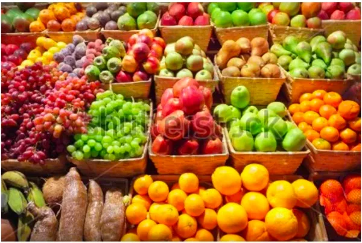
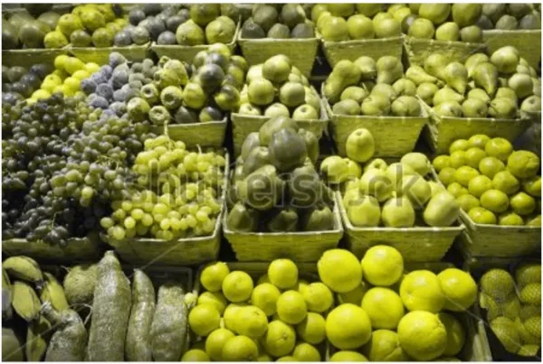
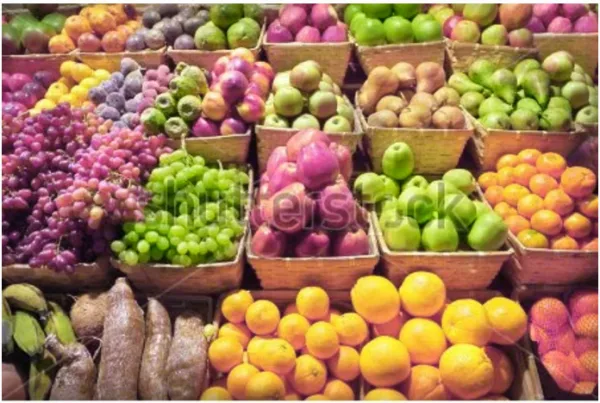
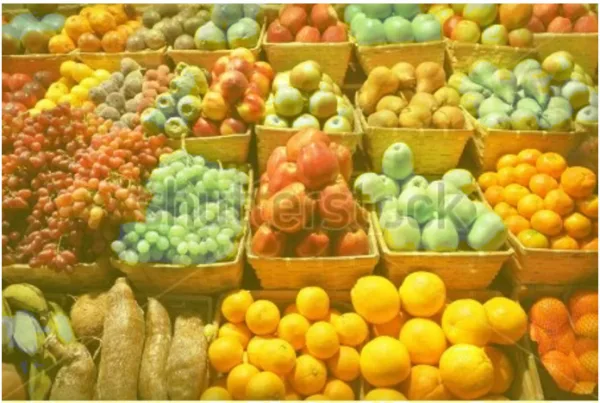
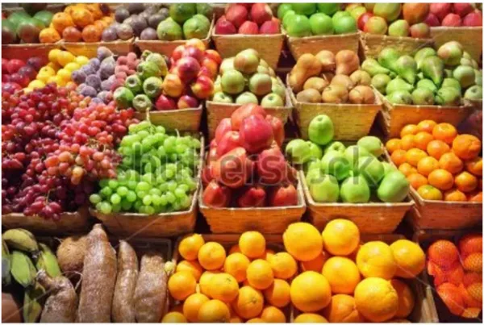
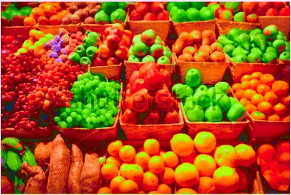

2017 marks the Processing Foundation’s sixth year participating in [Google Summer of Code](https://summerofcode.withgoogle.com/). We were able to offer sixteen positions to students. Now that the summer is wrapping up, we’ll be posting a few articles by students describing their projects.

By [Sarjak Thakkar](https://www.facebook.com/tsarjak)  
mentored by [Claire Kearney-Volpe](http://www.takinglifeseriously.com/index.html)

As a participant of Google Summer of Code ’17, I proposed the development of a library that would address the needs of those with protanopia, more commonly known as red-green colorblindness. The library would be able to manipulate images in a way that would not only simulate colorblindness, but also correct the images. A difficulty to this technique is scaling it to large images, so this was a key problem to solve.

The project can be divided in three steps:

1.  some informal research was conducted, using surveys, about various techniques;
2.  the algorithm was tweaked to improve optimization and make it scalable for large images;
3.  the implementation for the library.

I made simple prototypes using Python and took help from redditors that belong to the colorblindness forum. For every survey conducted, I received around fifty responses. I am quite thankful to all those who responded, without whose help I wouldn’t have been able to complete the research.

The first algorithm I implemented was for simulation, using what’s called Daltonization. The Daltonization algorithm doesn’t work on the basic RGB model, which we use in almost all the image processing algorithms, but instead, works on the LMS Color Space — a model that tries to imitate the working of human brain. LMS stands for Long-Medium-Short Waves. Our brains detects all these waves simultaneously using the three cones present in our eyes and then produces an output, i.e. the detected color.

The entire process of Daltonization can be summarised as the following steps: gamma correction, changing to LMS color space, calculating the loss, changing RGB color space, and then inverse gamma correction to get the final values. You can find more details [here](https://gsocsarjak.wordpress.com/2017/06/21/simulating-colorblindness-how-it-works/).

*The above image shows an image processed with all colors. People with protanopia cannot perceive the color red, hence they only visualize the green and blue component of the image. There is no way for them to tell apart different fruits in the photograph.*

*This image shows how the above image appears with colorblindness.*

For the duration of these three months, I worked on four correction algorithms — namely Color Difference Method, RGB Contrast Method, HSV Contrast Method, and LAB Contrast Method.

The Color Difference Method algorithm builds on top of the Daltonization method which is used for simulation of the image. We first calculate the difference in color values of the original image and the simulated image. The matrix transformation then rotates a particular point (color from the difference image) to the visible image space in gamut, based on the type of colorblindness.

*This image isprocessed with the Color Difference Method. The difference might not seem like a lot, but many of the survey responders upvoted the output image.*

The rest of the techniques work on the same principle of increasing regional contras.

The advantage of using the RGB Color Contrast Method is that there’s no need to change the color space of the image and hence it’s significantly faster. However, the downside of this technique is controlling the yellow component of the image, which usually results in a yellowish tint.

*The yellow tint here, using the RGB Color Contrast Method, is quite visible.*

With the HSV Color Contrast Method, the color space provides a better chance to manipulate the colors in a more meaningful way. With changes in hue, saturation, and luminosity of the image, desired changes are possible.

*The image above was processed with the HSV Color Contrast Method: there is no yellow tint as seen in RGB Color Contrast method, and the contrast is significantly improved as well.*

The LAB Color Contrast Method turned out to be the best method for image correction due to its close relationship to how the human eyes work, as well as because it uses the RGB colorspace. A\* values decide the Red-Green Component, B\* values decide the Blue-Yellow component, while L\* stands for luminosity. In the survey conducted on Reddit, LAB method received the most positive response.

*This image, processed with LAB Color Contrast Method, received the most positive response in a survey on Reddit. Here the contrast might seem pretty high but in fact, it makes the color differentiation easier than any other methods.*

For a high-quality image, the processing time would be very high, so using the algorithm in real time is not feasible. I realized that by tweaking the implementation by a naive sounding method, I would be able to scale the algorithms for large images as well.

Let’s consider all the possible pixel values: 256 R values, 256 G values, 256 B values. Multiplying these together, we have a total of 16,777,216 possible combinations. To hold the details of one pixel, we need eight bits of data (as 2⁸ = 256). That brings the total memory required as 134,217,728 bits of data, or 128MB. An average computer RAM can easily store this much of data, and fetching a value using the index has O(1) time complexity, where O(1) is an expression that describes the time complexity of any algorithm (it basically means that the amount of time taken by the algorithm is independent of the size of input or output). In other words, this method can work faster than the method of processing every pixel in the image.

**Conclusion**

The experience of developing a library for the open source community has been amazing. The difficulties I faced as I progressed through these three months and the happiness that came with solving various issues are the two things I’ll carry with me forever.

I would like to thank my mentor, Claire Kearney-Volpe, without whose suggestions the project would not have reached the place it is today. It was an amazing experience working with her on the project. Also, in developing this library, I was able to get many Redditors with colorblindness on board; without their help, this research would have been difficult. They helped me in discovering issues and fixing them.

*Documentation about the library and other details can be found* [here](https://gsocsarjak.wordpress.com/2017/08/23/image-processing-library-to-ease-differentiation-of-colors-for-colorblind-people/)*.*
