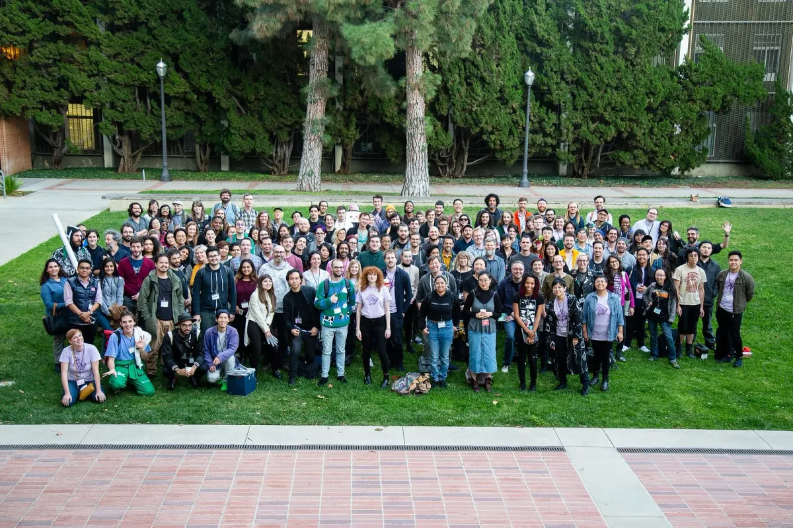
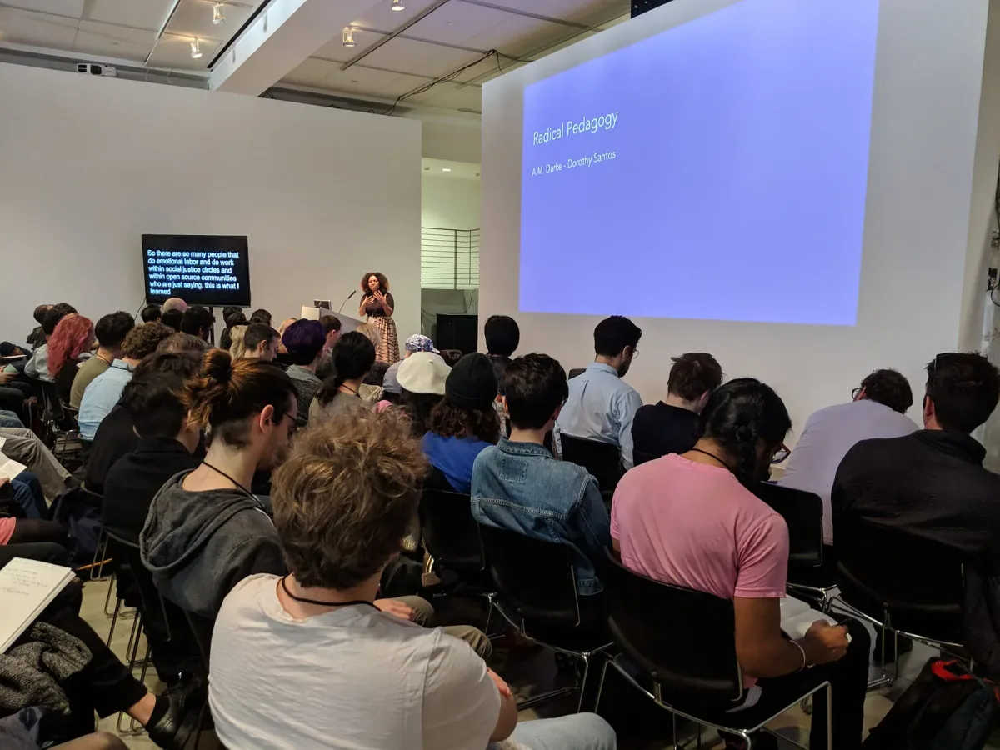
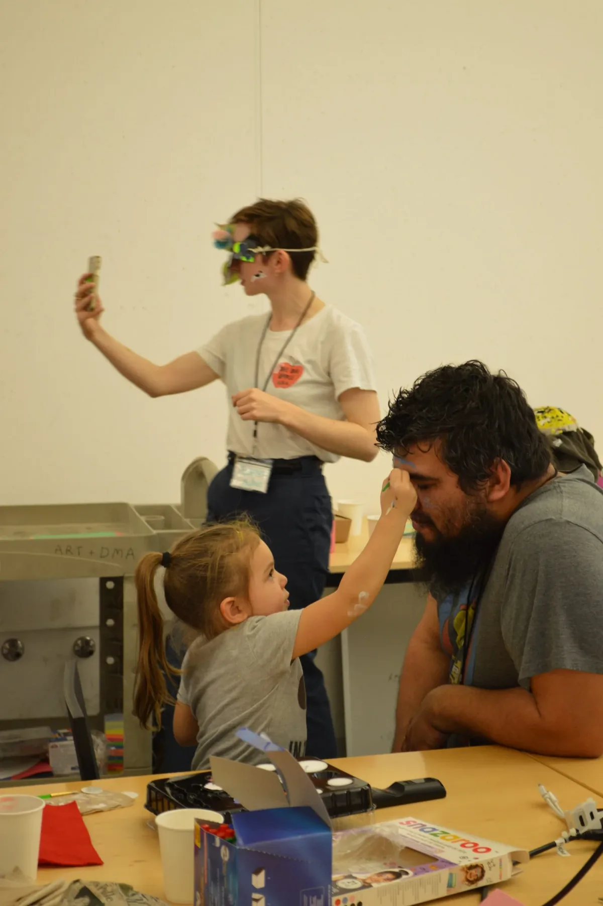
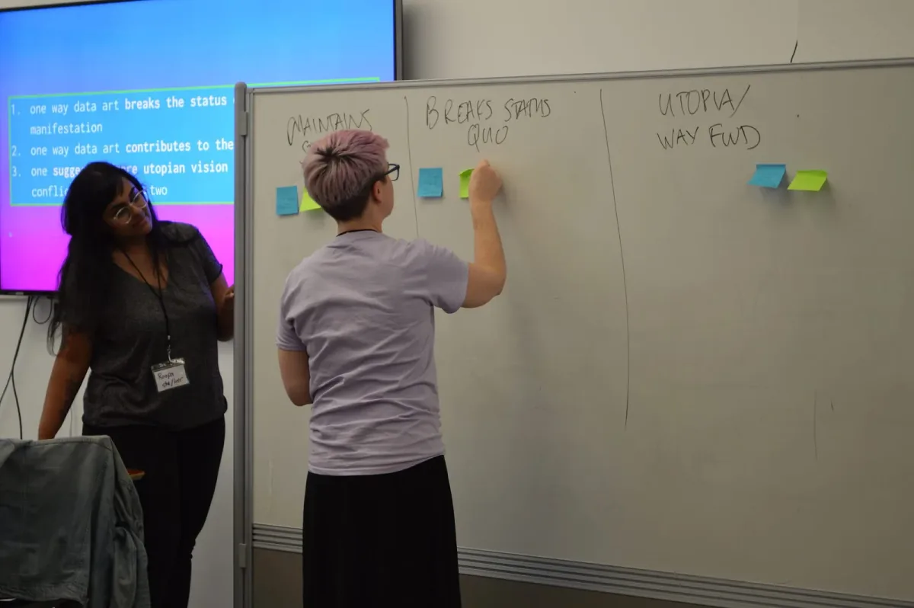

[*Processing Community Day @ Los Angeles*](https://day.processing.org/pcd-la-tracks.html) *— a day to celebrate art, code, and diversity — took place on January 19, 2019, at UCLA. This month we’ll be posting a series of reflections and interviews with the day’s participants and contributors.*

*PCD@LA 2019! \[image description: A group photo of approximately 140 people stand outside on a lawn.\]*

Organizing Processing Community Day, Los Angeles was an incredible experience. As a community organizer and an educator, I often need to imagine a we during a planning process. This leads to a series of questions I ask myself: Will the participants find the program interesting and beneficial? Will my students see the things I see and feel the things I feel? Am I including challenging but important subject matter? Am I proposing a world that is intentional and empowering?

Starting from the first day of organizing PCD@LA, imagining a we led me to ask this question: Are we interested in co-creating a time and space where artists, designers, coders, activists, children, and teenagers don’t need to pretend that our realities are mutually exclusive? And, can we engage with one another person to person, rather than professional to professional?

*A.M. Darke, track coordinator, introduces the Radical Pedagogy track. \[image description: An audience of roughly 40 people are seated in an auditorium. A woman speaks from a lectern. On the right is a projection on a large wall, with blue background and white text that reads: “Radical Pedagogy, A.M. Darke — Dorothy Santos.” On the left is a smaller screen with CART captioning, in white text on a black background. The text reads: “So there are so many people that do emotional labor and do work within social justice circles and within open source communities who are just saying, this is what I learned.”*

These initial questions became a guiding principle during the concept phase, open calls, visual promotions, to designing and implementing the program. After working with the organizing team through an eight-month planning process, we were able to gradually implement these underlying questions in various aspects of the event. What we ended up with was a total of 65 conference guests presenting in four differently themed tracks, with self-organized sessions, live-captioning, childcare, and individual communication channels dedicated to POC and queer folks.

The size of the program was ambitious but highly intentional. Without this we wouldn’t be able to bring a multitude of people into the same room and include a wide array of important topics relating to art, technology, and activism. For this I am extremely proud and grateful for all the lightning talk speakers and session organizers whose contributions truly gave the day its substance.

*Participants of the workshop “My Face is My Own! : Helping Kids Beat Facial Recognition Software with README,“ from the Epic Play track. \[image description: Three people are pictured. In the foreground, a child paints blue lines on the forehead of an adult. In the background, an adult wearing a mask that resembles flower petals takes a selfie.\]*

Making an expansive and inclusive program with a small team means that there were many moving parts to oversee throughout the day. Of course this created a healthy dose of anxiety prior to the event. For months I played out many different scenarios of how each part of the day could happen. Many reflections and doubts were related to whether I was making the right decisions and framing the event in a way that would produce empowering outcomes. But as we started to count down to the event, these anxieties became unproductive, and I realized that after all the organizing effort, it was left to the PCD@LA community — which wouldn’t be fully formed until the day of the event — to create the Processing Community Day they’d like to have.

In order to create something new we also have to not be afraid to fail. Failures are so scrutinized in the society we live in, though they are often accepted as part of everyday life in certain non-Western cultures. There are a couple things that took place during the organizing process and the event that I would do differently in the future, for instance: designing a different presentation duration; providing higher compensation to art collectives; and reserving budget to hire an additional person to commit to community outreach, specifically to youth and kids programs, and the disability community. Prior to posting the open call, I would have loved to get more feedback from these communities on what they would like to see from the programs.

*From “Toward a Reflexive Data Culture,” a workshop with roopa vasudevan, part of the track, Under the Silicon, the Beach! \[image description: Two people stand in a classroom. One watches the other put post-its on a white board. The white board has been divided into three columns, which read: Maintains Status Quo, Breaks Status Quo, and Utopia/Way Fwd. Behind them is a projection on a wall of a slide with text that is partially covered by the white board. Some text that can be seen reads, “1. one way data art breaks the status…manifestation, 2. one way data art contributes to the… 3. one… utopian vision…”\]*

I feel very lucky that the event was extremely well received by the many people I came across during the day. I have never heard anyone describe a conference with the word “magical,” but this word was brought up to describe PCD@LA by a couple people I spoke to. This was such a pleasant surprise, and not something I could have anticipated prior to the event. It can only happen at the moment and for the moment, through the co-creation of conference guests, participants, organizers, and volunteers.

---

[*Xin Xin*](https://xin-xin.info/) *is an interdisciplinary artist and educator working at the intersection of technology, labor, and identity. Xin co-founded voidLab, a LA-based intersectional feminist collective dedicated to women, trans, and queer folks. They initiated the School of Otherness which seeks to empower marginalized communities through storytelling, forums, and workshops that process experiences of the other. Their work has been exhibited at Ars Electronica, the Hammer Museum, Gene Siskel Film Center, Tiger Strikes Asteroid, and Machine Project. Xin received their MFA from UCLA Design Media Arts and teaches at the University of Georgia as the Assistant Professor of Media Design and Women’s Studies.*
