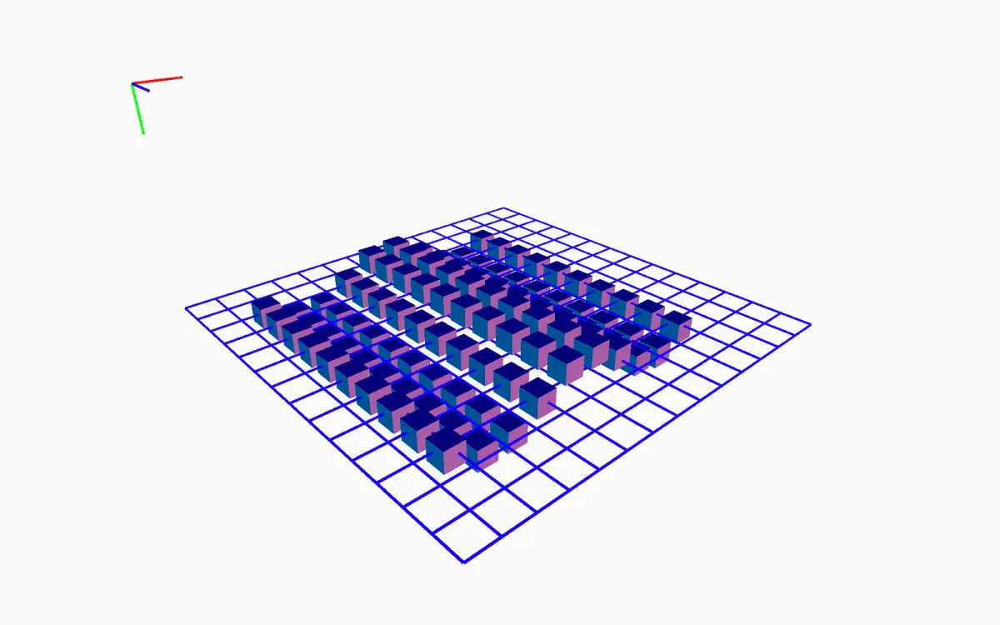
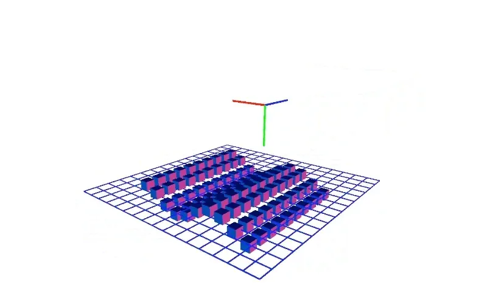
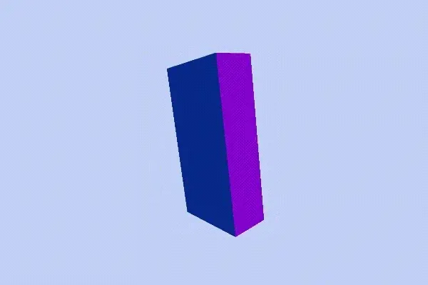
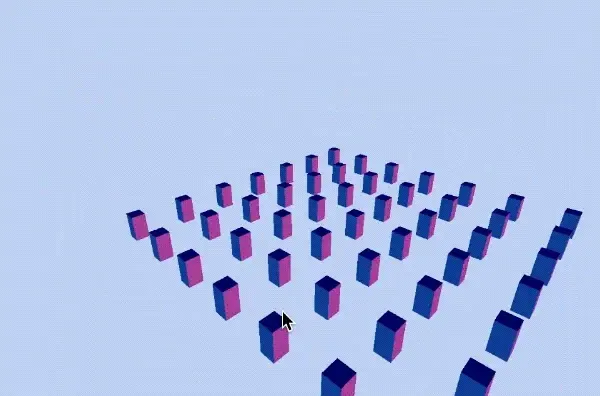
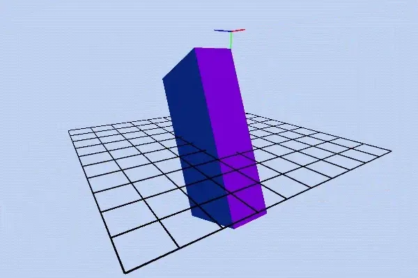

Google Summer of Code 2018

Mentored by [Kate Hollenbach](http://www.katehollenbach.com/)

---

*This summer was the Processing Foundation’s seventh year participating in Google Summer of Code. We received 112 applications, a significant increase from previous years, and were able to offer 16 positions. Over the next few weeks, we’ll be posting articles written by some of the GSoC students, explaining their projects in detail. The series will conclude with a wrap-up post of all the work done by this year’s cohort.*

---

*New features debugMode() and orbitControl() give a clear sense of 3D space. \[image description: A grid of boxes at different heights gives the sense of 3D depth in a 2D image.\]*

*\[image description: An animated gif shows a grid of boxes move up and down in 3D space as our view rotates around the scene.\]*

Imagine drawing a circle on a piece of paper. What steps do you take and in what order? Place the pen down, smoothly trace out an arc until the the shape is complete, and lift the pen. Now imagine drawing a sphere. It’s probably a good idea to start by drawing a circle, but what then? If you’ve ever taken a drawing class, you may start by shading: imagine where the light is coming from and where it would cast shadow, then blend between regions of shadow and highlight. Or, perhaps you draw your sphere on a surface, giving it somewhere to cast its shadow and adding perspective to your drawing. Whatever your approach, drawing three dimensions on a flat surface requires a great deal more thought.

For someone learning to program using p5.js, “drawing” in 3D can be daunting. In addition to understanding coding fundamentals, you must understand how the 3D coordinate system maps to a 2D screen, what the “camera” is and how it facilitates this mapping, and what tools are required to make depth visible. p5.js’s implementation of the WebGL (3D) system does a great deal to reduce this barrier-to-entry by providing default cameras, centering all new shapes on the canvas, and providing a normalMaterial() function, which allows the user to build and test ideas without implementing lighting. [As part of Google Summer of Code 2018, Adil Rabbani](https://medium.com/processing-foundation/gsoc-2018-my-summer-with-processing-foundation-5e5904e816fa) and I worked along with our mentors Stalgia Grigg and Kate Hollenbach to make using p5.js WebGL mode more functional and easier for beginners. Adil implemented missing 3D primitive shapes and I expanded options for interactivity and the camera in WebGL mode.

*p5.Camera*

In 3D graphics, what we call a “camera” is a set of mathematical operations that converts points in 3D space to the 2D representation we see on screen. In essence, it does the same thing as a real camera, only using math instead of a lens. My project expanded options for creating and controlling cameras in p5.js so that a beginner coder could more fully rely on this analogy to understand what is happening on screen.

In practice, it’s now possible to store and manipulate camera objects with a number of new camera methods based on real-world camera movements: pan, tilt, move, among others.

> let cam;

> function setup() {

> createCanvas(100, 100, WEBGL);

> normalMaterial();

> cam = createCamera();

> }

> function draw() {

> background(200);

> // look at a new random point every 60 frames

> if (frameCount % 60 === 0) {

> cam.lookAt(random(-50, 50), random(-50, 50), 0);

> }

> rotateX(frameCount \* 0.01);

> box(20);

> }

*Interaction*

Human depth perception is based on many sensory and contextual clues: shadows, sound, certain objects being in front of, or behind others, and lived experience (e.g., we understand an airplane in the sky to be larger than a bird, despite that their sizes appear similar; this lived experience makes us understand that the airplane must therefore be further away). However, when we start a new p5.js sketch in 3D and are faced with a blank canvas, all of these clues are absent. So, how are we to perceive depth? How do we know which way the camera is facing when there are no objects present? If there is movement in the sketch, how do we know whether the camera is moving, or the shapes in front of the camera are moving?

*Are we moving or is the box moving? Which way is up? \[image description: An animated gif of a rotating box in 3D space, without a frame of reference for box’s movement.\]*

In creating and debugging 3D sketches, we have two options to answer these questions: looking at our code or looking at our sketch. My project attempts to make it easier to answer these questions (and any others that come up) by providing options for interacting with the sketch. An expanded orbitControl() allows us to move the camera through space using the mouse:

*An expanded orbitControl() provides more options for a user to interact with the sketch. \[image description: An animated gif showing a grid of 3D boxes that are rotated and moved through space using mouse-based interaction.\]*

And debugMode() provides a frame of reference for our sketch, allowing us to perceive depth more easily:

*Orientation and movement are easier to identify with debugMode(). \[image description: An animated gif of a rotating box in debugMode(), with the camera orbiting the shape, and a black grid of squares and red-green-blue 3D axis for visual reference.\]*

Working with my mentor, Kate Hollenbach, and within the larger p5.js community this summer has been an incredible education in coding and in open-source. My hope is that this project will help more people feel comfortable using p5.js WebGL mode and trying out new ideas in 3D!

For further details about the project, see [this post](https://github.com/processing/p5.js/blob/master/developer_docs/project_wrapups/aidannelson_gsoc_2018.md) on the p5.js Github Repo.
