Mentored by [Stalgia Grigg](https://stalgiagrigg.name/)

---

*As of 2021, Processing Foundation has been participating in Google Summer of Code for a whole entire decade! Each year we’ve been honored to work with students on open-source projects that range from software development to community outreach, and this year’s cohort was no exception. Over the next couple weeks, we’ll post articles written by some of this year’s GSoC students, explaining their projects in detail and in their own words. The series will conclude with a wrap-up post of all the work done by this year’s GSoC students. Congrats, everyone, on a great summer!*

---

### Work Pull Requests and Issues

-   All of the pull requests made as a part of the project can be found [here](https://github.com/stalgiag/p5.xr/pulls?q=is%3Apr+author%3Aanagondesign+created%3A%3C2021-08-23).
-   All of the issues opened as part of the project can be found [here](https://github.com/stalgiag/p5.xr/issues?q=is%3Aissue+author%3Aanagondesign+created%3A%3C2021-08-23+).
-   All of the commits I made for the project can be found [here](https://github.com/stalgiag/p5.xr/commits?author=anagondesign).

### Overview

Over the course of this summer, I worked on improving the p5.xr library by creating a series of artistic examples with the guidance of my mentor [Stalgia Grigg](https://stalgiagrigg.name). The p5.xr library is an add-on for p5.js that adds the ability to run p5 sketches in Augmented Reality or Virtual Reality. It does this with the help of WebXR, and anyone who is familiar with p5 can experiment with this library as long as they have the necessary equipment.

The major goals of this project were to explore the possibilities of creative coding in p5.xr and show others how they can use p5 to work with the core concepts of immersive mediums. To accomplish this, the different themes of this project were broken down into a collection of simple and complex examples. The simple examples focused on the technical aspects of how to utilize VR specific functions within p5.XR, while the complex examples were more of an abstract/creative exploration of all these concepts.

### Work

### [Example #1: Immersive Typography](https://github.com/stalgiag/p5.xr/tree/master/examples/immersive-typography)

I like experimenting with type so this was the first theme I started working on . I started thinking about ways in which I could immerse myself with letterforms and I tried to imagine what that would look like through some sketches.

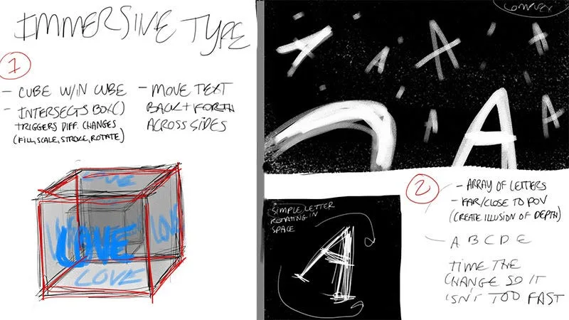

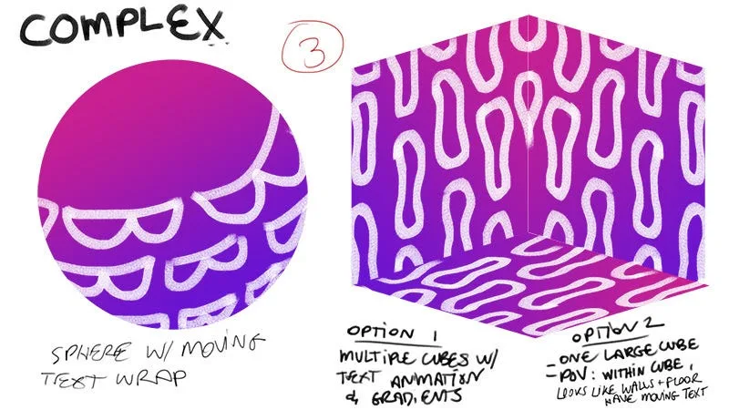

**Sketch ideas for the immersive typography section that include environments using type or shapes with typographic animations on their surfaces. \[****image description****: Top left: a hollow gray cube with the word “love” on each side of the cube. Top right: a black environment full of white letters that are at various positions within space. Bottom: A pink/purple sphere or cube with white text moving along its surface.\]**

I thought of including 3D shapes with moving typographic textures on them and floating letterforms that were scattered throughout space. When I started working on it in VR, I learned about how to use [intersectBox()](https://p5xr.org/#/reference/raycasting?id=intersectsbox), a VR-specific function that allows you to trigger changes in a box of a specific size by using raycasting. This function ended up being the basis for the basic example where I used it to change a box’s stroke color and text just by looking at it.

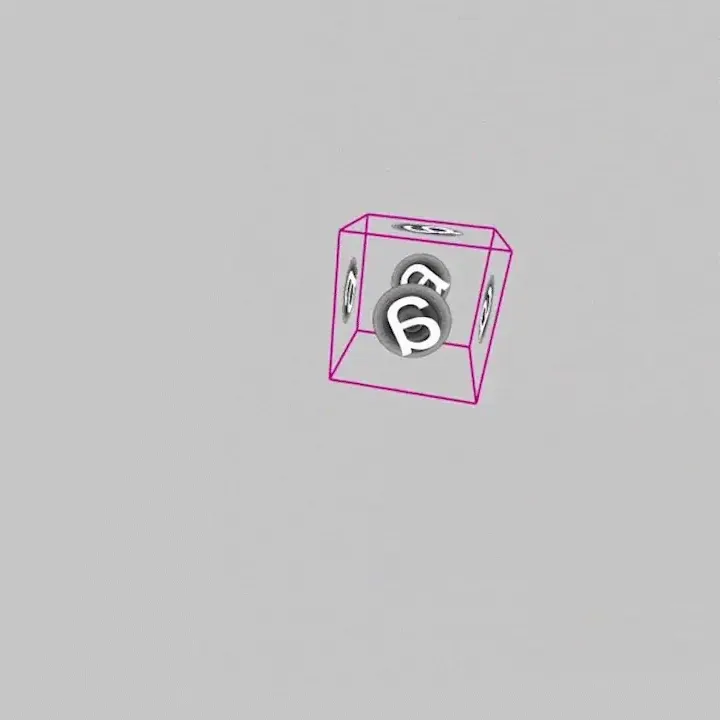

**A hollow box that changes its stroke color and texture with ray intersection. \[****image description****: A hollow 3D box with a white stroke and the letter ‘a’ on each face of the box. When the viewer looks at the box directly, it changes its stroke color to pink and switches letterforms from “a” to “e.”\]**

For the complex example, I started working on typographic textures in WEBGL first before bringing them into VR. These are some different versions of these tests: [1](https://editor.p5js.org/agonzal019/sketches/ZTjSOBQ7L), [2](https://editor.p5js.org/agonzal019/sketches/aFxmSlZ2w), [3](https://editor.p5js.org/agonzal019/sketches/PTaRhklbv). One of the first things I struggled with was not knowing how to use timing properly to reset an array. After talking with Stalgia about it, they taught me how to use modulo, which returns the remainder of something after division. This line of code would play a big role in many of the other examples I’ve created.

This is where I encountered my first issue. I found out that using plain text in VR was difficult because the text would only be visible at certain angles, so I decided to keep using createGraphics() to display the type instead. This process was going well until I tried to use deltaTime in one of the earlier versions of this example. The WEBGL example’s timing changes functioned perfectly in the browser but when I brought it into VR, the letters in the array wouldn’t switch. Luckily, after posting an [issue](https://github.com/stalgiag/p5.xr/issues/133) about it, the problem was resolved and deltaTime and millis() were now functioning.

After that was resolved, I finished the complex example by combining different parts of my earlier drafts all into one piece. I used intersectBox() to increase the scale of the box upon viewing it, the array of changing letterforms scattered through space that used deltaTime, textToPoints, and a planetary structure with rotating text to make my own galaxy of typography.

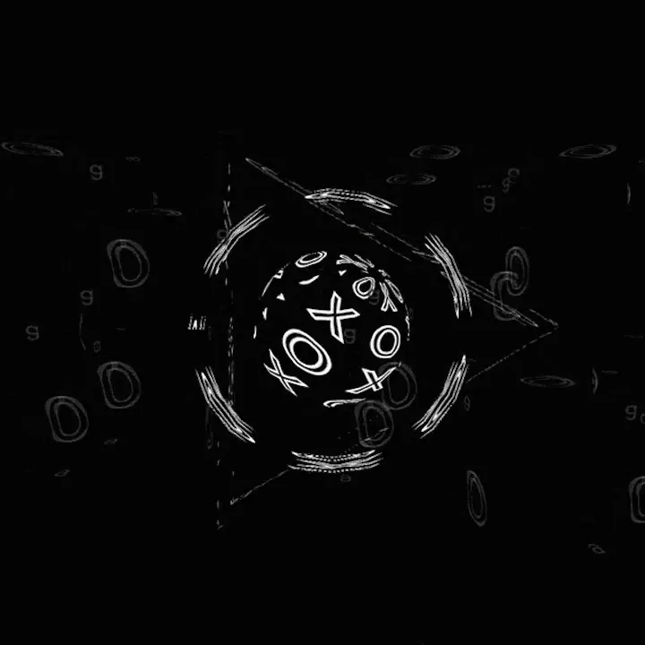

**A typographic galaxy is created through the display of a planet with moving white text and a background of wavy letter O’s and changing letterforms. \[****image description****: The black background is full of O’s with outlined strokes that appear to move in a wave-like motion as well as small, gray letterforms that switch in order from “a” to “e”. In the foreground, there’s a sphere that’s surrounded by a ring and triangle. All the foreground shapes are hollow and have the same texture of x’s and o’s that move along their surfaces.\]**

### [Example #2: Visual Art Making Tools](https://github.com/stalgiag/p5.xr/tree/master/examples/visual-art-making-tools)

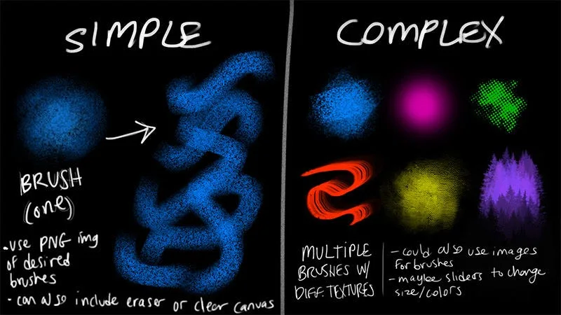

**A sketch for the “visual art making tools” section that shows a single brush type and color for the simple example and varying textures/colors for the complex example. \[****image description****: This image shows a sketch for the “visual art making tools” section. On the left, one type of brush type is shown: a fuzzy textured, blue brush. On the right, various brush textures and colors are shown.\]**

I started experimenting with using 3D shapes as drawing tools in WEBGL by removing background() from draw(), but quickly ran into problems when trying to do this same method in VR. I learned that if background() is put into draw(), one of the eyes of the headset becomes completely blocked out. This is because draw() runs twice in VR (once per eye), which is why [setVRBackgroundColor()](https://p5xr.org/#/reference/vr?id=setvrbackgroundcolor) goes in setup, so that the background is cleared after rendering for each eye.

Since I couldn’t use this approach of not drawing the background to keep previously drawn shapes, Stalgia showed me a different approach that stores an array of objects indicating previous brush strokes at the x, y, and z positions of the viewer’s controller. Now that the positioning was correct, we had to use [generateRay()](https://p5xr.org/#/reference/raycasting?id=generateray) to create a ray originating at the hand’s location in order to use intersectSphere(). It’s also necessary to use applyMatrix(hand.pose) to apply the position and rotation of the hand to a box indicating the location of the player’s hand.

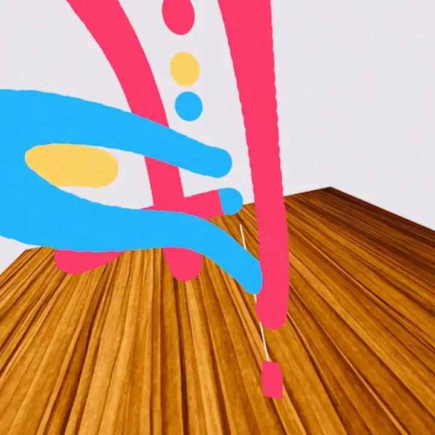

**As the viewer moves their hand, solid color brush strokes are drawn within a virtual space. \[****image description****: A curved, blue brush stroke is drawn within a virtual space. Next, the user’s brush moves upwards and points a white ray at a red sphere up in the distance. Then, the user moves their brush down and draws a red brush stroke.\]**

After I was able to actually draw something, I started thinking about ways in which I could add more variety. For the basic example, I used [intersectSphere()](https://p5xr.org/#/reference/raycasting?id=intersectssphere) to change the color of the brushstroke. This method of using ray intersection to change things became tedious in the complex example. I’d been using this method to change the color, size, and shape of the brush until I discovered that I could [utilize other buttons on my controller](https://github.com/stalgiag/p5.xr/blob/master/src/p5xr/core/p5xrInput.js) besides the trigger, so I started using those instead. *One thing to note for the Oculus Quest 2 is that the current input code for the touchpad buttons does not work at all.*

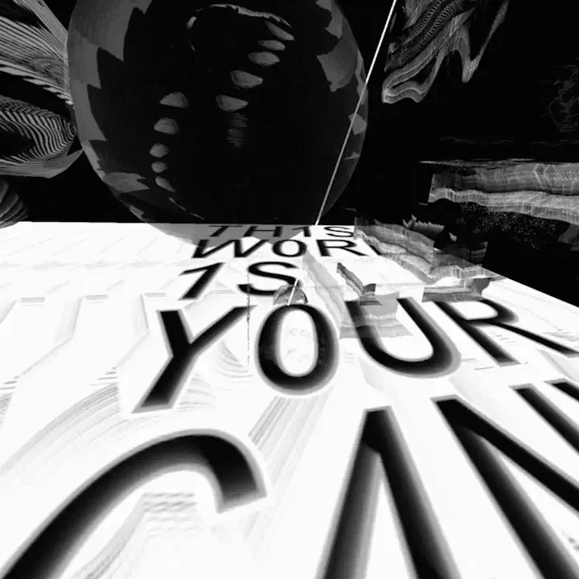

**The brush tool is used here to draw random shapes and textures within VR. \[****image description****: As the viewer moves their hand in a downward curve, random textures and shapes are drawn. The flat, white plane that the viewer is standing on displays moving black text that states “the world is your canvas.”\]**

For the textures in the complex example, I initially wanted to use a collection of custom textures made in p5.js as textures for the brushstroke, but that caused the sketch to run incredibly slow, so I improvised. I took screenshots of my textures, manipulated the images in Photoshop, and then used those images as my final textures for the sketch. I then made everything more fun and chaotic by randomizing the texture, shape, and size of the brush automatically when someone draws.

### [Example #3: Immersive 360](https://github.com/stalgiag/p5.xr/tree/master/examples/immersive-360)

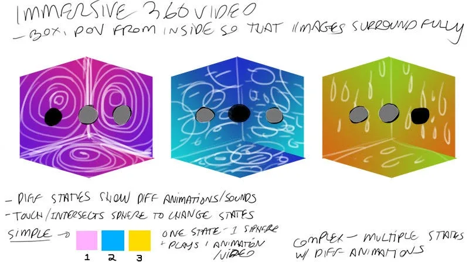

**A sketch that shows three different states of a room. Each state plays a different complex animation. \[****image description****: A sketch that shows three different states of a room. Each state plays a different complex animation. The first room is pink with white spiral shapes, the second room is blue with white circles and lines of differing sizes, and the third room is yellow with raindrop shapes falling down.\]**

I created p5.js animations in the browser and then displayed them within VR by using a specific function called [surroundTexture()](https://p5xr.org/#/reference/vr?id=surroundtexture). Normally intended for displaying 360° photos, this function creates a very large sphere with inverted scale that surrounds the viewer. Regarding functionality, both the basic and complex examples allow the viewer to switch between states by pressing the trigger button. For the complex example, I also included some typographic animations to stay consistent with my style.

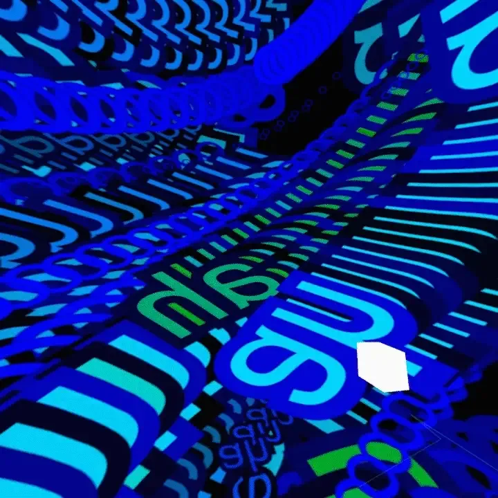

**Different shape and text-based animations play in a loop. \[****image description****: Different shape and text-based animations play in a loop. 1) light blue circles that change size in small, randomized increments are seen moving down the screen, 2) rows of large, black X’s and O’s move left to right or vice versa across the screen, 3) a group of purple circles decrease in size until they disappear into the black background and when they reappear they change to red and increase in size , 4) the word ‘ah’ is repeated multiple times and leaves blue trails as it moves across the screen, 5) blue stroked squares decrease in size and change color to orange when they increase in size.\]**

#### [Example #4: Physics](https://github.com/stalgiag/p5.xr/tree/master/examples/physics)

I’ve never worked with physics in code before so I watched a Coding Train tutorial on strings, but the example didn’t easily translate to the scale of VR. After speaking with my mentor about it, they showed me a working physics example that I was able to expand upon for the complex version of this theme. The basic example includes boundaries and a ball that can be held and thrown around.

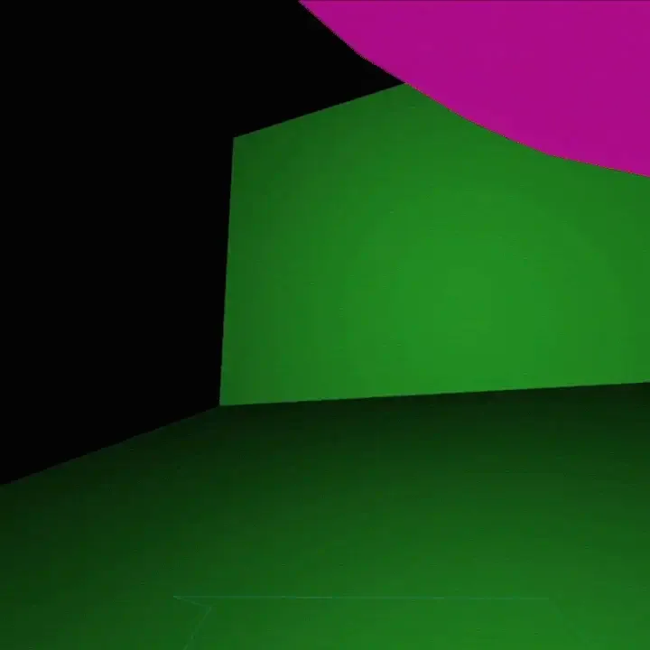

**The simple physics example where the ball changes color with every bounce. \[****image description****: A pink ball is thrown into the distance. The ball bounces on the floor and changes to a bright red color and then collides with the adjacent wall (changing to a darker red) before almost exiting offscreen.\]**

For the complex example, I made the Ball class from earlier generate multiple balls at random locations that could change size, shape, texture, and color the moment they collide with a boundary. I also tried to include type textures on the shapes too, but UV wrapping on the 3D shapes made them illegible. So instead I displayed the type textures on the boundaries of the room. I eventually removed the ability for the ball to change shape or texture since it felt too busy and just left it so it changes only size and color upon collision. Once I added in the other walls and ceiling, the whole thing really came together.

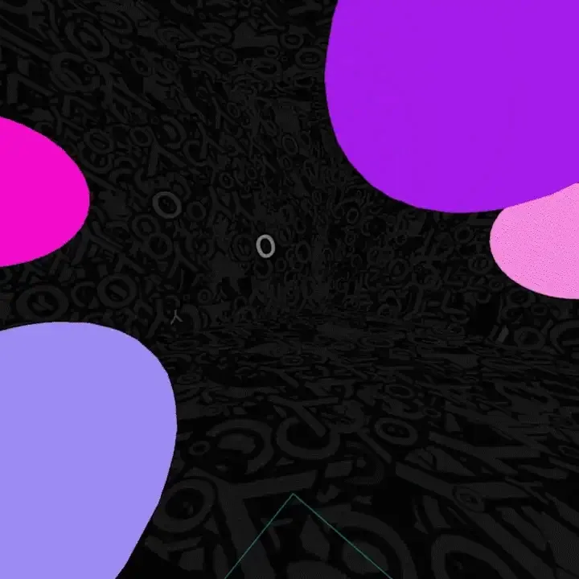

**The complex physics example shows a room with typography flashing on the walls and multiple balls that change color and size with each bounce. \[****image description****: Pink and purple balls bounce up and down within the confines of a dark room that displays rapidly changing letterforms. When the balls collide with the ground, they change size randomly.\]**

### [Example #5: Embodiment](https://github.com/stalgiag/p5.xr/tree/master/examples/embodiment)

For the embodiment example, my mentor explained p5.xr viewer properties that helped position objects relative to the body in VR. We can get the location of the camera with viewerPosition and we can also get the pose of the camera with viewerPoseMatrix. We can use applyMatrix(viewerPoseMatrix) on the head of the body, which allows it to mirror the direction and pose of the viewer’s head. By putting viewerPosition inside of translate, the other parts of the body will be relative to the location of the head.

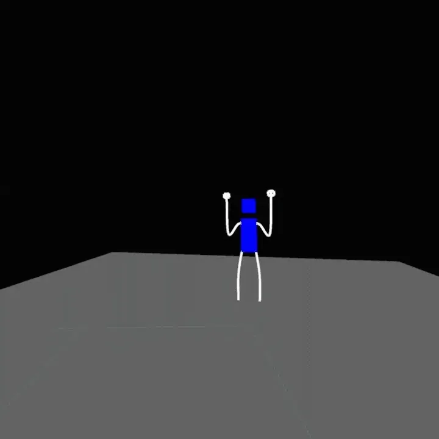

**A figure in the distance waves their arms back and forth in the embodiment example. \[****image description****: A figure with a head and torso made up of blue boxes and white strokes for arms and legs stands far away from the viewer on a gray platform. It’s arms are up in the air and waving back and forth as if to say “hello.“\]**

For the complex example, I wanted to create a dragon that the viewer could look at and move with, but there wasn’t enough time to finish it.

#### **Future**

Future work could investigate performance issues with text in VR and add specific input controls for the Oculus Quest 2’s x, y, a, and b buttons.

#### **Conclusion**

Even though it was challenging for me as a novice coder working with an experimental program, I had fun making these examples and I learned so many new things! First and foremost, I’d like to thank my mentor Stalgia Grigg for all the patience, kindness, and encouragement they’ve given to me this past summer. They’ve been such a great mentor to me and I don’t think I would have gotten this far in the program without them and their guidance. I would also like to thank the Processing Foundation and Google for giving me this opportunity to contribute something cool to their community ❤
