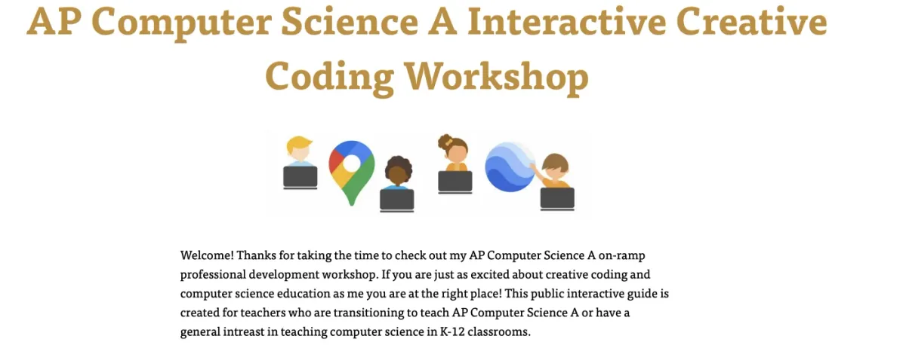

#### Tell us about yourself.

Sierra Gilliam is currently a Ph.D. student in the department of Learning Sciences at Georgia State University. Previously, she was a computer science teacher and founded the first drone technology program for Guilford County Public Schools in Greensboro, NC. She received her B.S. in Environmental Science and M.S. in Earth Science from North Carolina Central University.

She is from our nation’s capital Washington, DC and is extremely passionate about computer science and expanding access to computer science to youth and adults, particularly those living and working in historically underserved communities like the ones she grew up and has worked in. Her research interests are in computer science education with a particular focus on using Interaction Geography and Geographic Information Systems (GIS) to develop and study new teaching practices that support and broaden access to computer science learning and teaching. She hopes to teach, mentor, and continue to be of service to young intellectuals, guide them to delve deeper into complex computational learning strategies, and help them find their voice and purpose.

#### What was your fellowship project?

My project broadly addresses goals related to the teaching mission of the Processing Foundation — notably, issues of access, inclusivity, and equity are central to my project. My project uses creative coding to provide more meaningful, personal, and culturally relevant experiences for teachers interested in teaching or integrating computer science into their teaching. My project supports the computer science teaching community with open source resources that better help teachers and students in the greater Atlanta community to engage in creative coding and computer science in creative ways. I present interactive coding events, seminars, workshops, and coding boot camps that offer positive impacts on teachers to integrate or teach CS in K-12 settings. The fellowship project began in hopes of offering supporting teachers to integrate and teach CS concepts in their classrooms.

#### Who were sources of support for you throughout your fellowship? What were the challenges that you encountered while doing your project?

The Learning Science Department at Georgia State University and my mentor, [Saber Khan](https://www.edsaber.info/), Education Community Director at Processing Foundation were sources of support for me.

In terms of challenges, I honestly had a great experience. Of course deadlines can make you tense up sometimes. I just wanted to make sure I had enough time to innovate my ideas and not feel rushed. So overall my biggest challenge was time management.

#### **What are some of the joyful moments that you encountered while doing your project?**

Having the support of my mentor, Saber — he helped guide me through the thinking process and supported me in putting the pieces together to bring life to my idea. Processing was a great support. They really want to support your every need through the innovation process and I really appreciate that.

#### What are words of wisdom would you have for future fellows?

Plan and write every idea down on paper. Even if it may not seem clear at that moment, still believe in your idea. Be patient with the process and if you are stuck don’t be afraid to ask for help.

[Sierra Gilliam](https://sway.office.com/QkZAaq9RIQlUg3dC?ref=Link) *is a Ph.D. student in the department of Learning Sciences at Georgia State University. She is a mother of three amazing boys and enjoys traveling, reading, and baking treats for her sons on the weekends. She is extremely passionate about computer science education. Follow Sierra on* [twitter](https://twitter.com/Si_Gilliam)*.*
