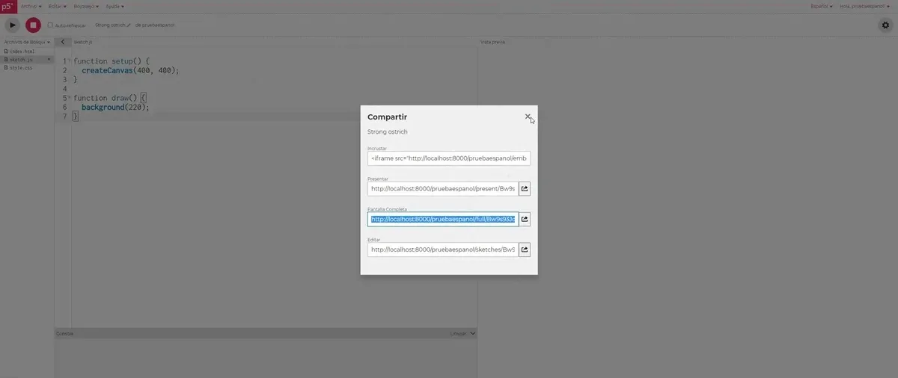
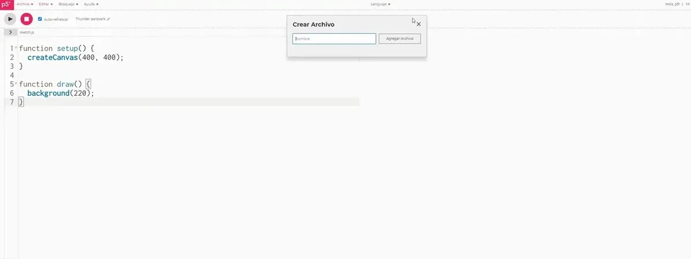

mentored by Andrew Nicolaou

---

*2020 marks the Processing Foundation’s ninth year participating in Google Summer of Code, where we work with students on open-source projects that range from software development to community outreach. This week, we’ll be posting articles written by some of the GSoC students, explaining their projects in detail. The series will conclude with a wrap-up post of all the work done by this year’s cohort.*

---

*Omar’s project improved and expanded the Spanish translation of the p5.js Web Editor and documentation. “I’m a Mexican based in London. I did my Bachelor’s and Master’s Degree in Computer Science, and I’m currently finishing my PhD in Experimental Psychology. I have been involved in games, interactive art, academia, and other random stuff. You can find me on [Github](https://github.com/oruburos) and [Linkedin](https://www.linkedin.com/in/omar-verduga-8159939/).” Omar was mentored by [Andrew Nicolaou](https://andrewnicolaou.co.uk/), who was a Processing Foundation Fellow in 2017.*

For my GSOC 2020 project, I worked on Internationalization and Spanish Localization for the p5.js Web Editor. The p5.js Web Editor is a web-based code editor that lets artists, educators, and programmers create and share p5.js sketches online. To apply to this specific organization, I considered the following aspects in my proposal:

-   I knew Processing from previous works; and it always has been an appealing project, even if I usually ended using OpenFrameworks or Unity3D.
-   Other Processing projects already had translations for their pages, which suggested to me that the Processing Foundation required that functionality in this particular project.
-   The project had been released, but there was a real opportunity to add value and reach, and to connect with people from Latin America (and Spanish-speakers in the U.S.), which given my background as a Spanish speaker, I perceived as a priority.
-   From a selfish point of view, I didn’t know anything about internationalization, localization, and basically all the tech stack involved in this project, so I thought it was a good idea to learn some skills over the summer.
-   I’m in the last year of my PhD, so it was now or never.

*The English version…*

*…and the Spanish version.*

Once I got accepted and had the first meetings with my mentor, [Andrew Nicolaou](https://andrewnicolaou.co.uk/), we agreed to narrow the scope of my proposal and specify a work dynamic, including weekly meetings, and open channels through Slack, email, and Google Meet to discuss any problem.

Some of the first tasks were:

-   Study the different alternatives that existed to internationalize software projects given the current libraries used by the project.
-   Define how to organize the translations, given that the p5.js Web Editor is a big project, and several components interact to provide functionality.
-   Take into account that moving from English to Spanish introduces some discussion about the use of gendered terms, and how to tackle those issues in concordance with Processing Foundation principles.

Going back to the project, once a library was defined, the project was considered in terms of three dimensions: what functionality is required (functionality), how to simplify the process for future contributors (workflow), and why the translations are performed in any specific way (accessibility).

The following functionality was required:

-   How to switch back and forth between languages
-   How to serve the translations just once per language
-   Dynamically load the translations when required
-   How to save the user’s preferred language
-   Provide the actual translations for the web page components

In the workflow side, the following issues were tackled:

-   How to split and organize the translation file : flat vs embedded structure
-   Naming conventions for the keys: CamelCase, etc
-   Specific problems: dates, interpolation, plurals

And in the cultural/accessibility side:

-   Do we have to use genders in the language, or we can use non-gender nouns?
-   What happens when this is not possible?
-   Are we thinking in terms of accessibility, using [ARIA](https://developer.mozilla.org/en-US/docs/Web/Accessibility/ARIA) labels, using the simplest option for Screen readers?

*Switching back and forth between languages.*

The [full list of Pull Requests I worked on is here](https://github.com/processing/p5.js-web-editor/pulls?q=is%3Apr+author%3Aoruburos+).

In the end, my participation in GSOC program was a great experience. I was lucky for being part of a welcoming community, and my first experience within an open-source community has been very likable, and I expect to contribute more in the future.
