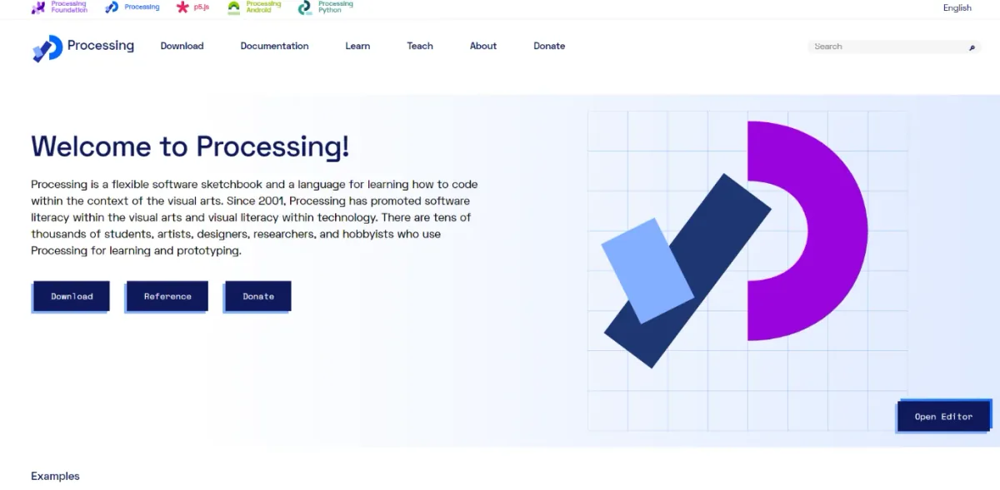
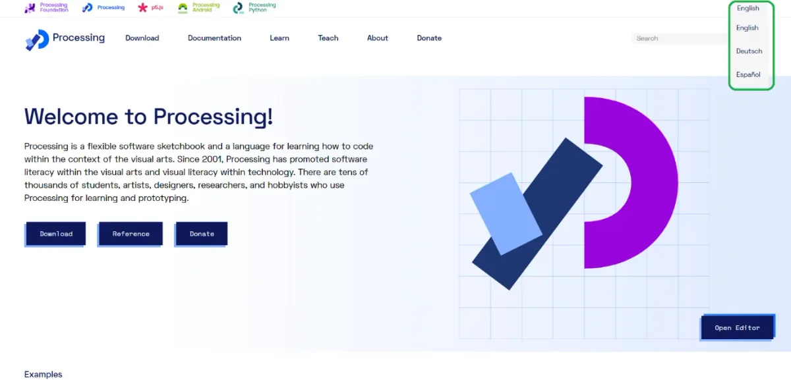
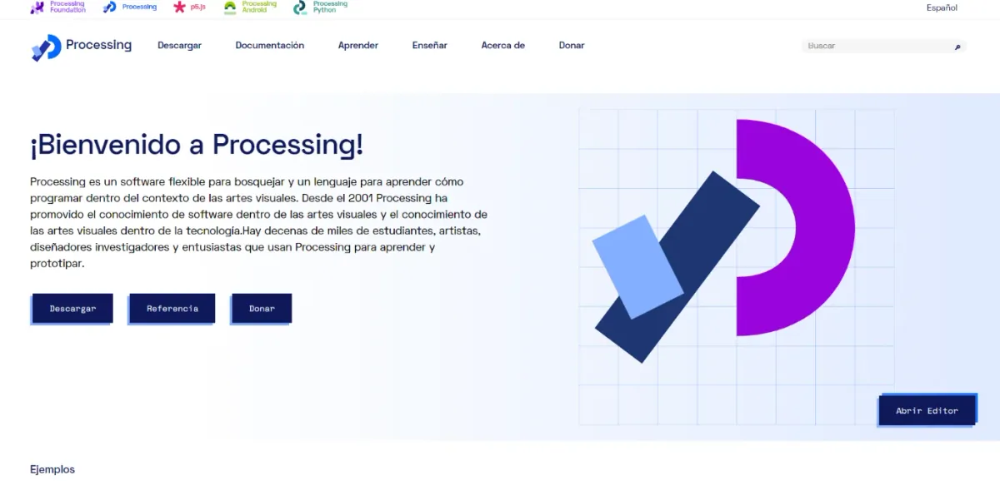
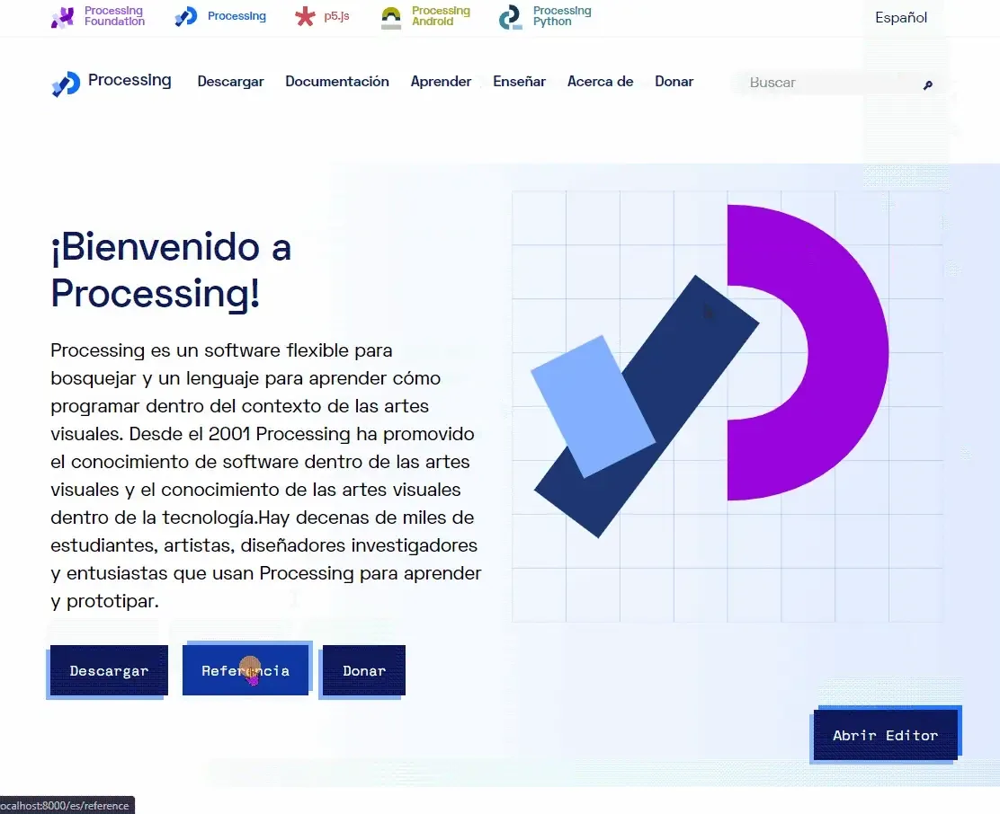
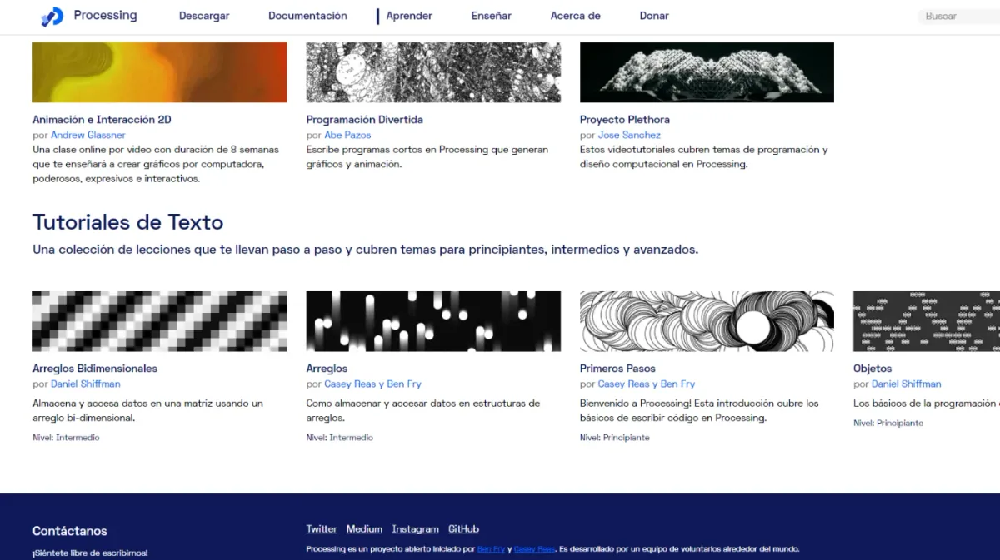
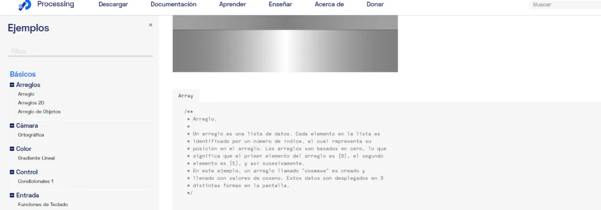

#### by Omar Verduga, Processing Foundation Fellow 2021

---

*For the sixth year of our annual Fellowship Program, we aimed to better support the new paradigm of remote and online contexts and socially distanced communities. We asked applicants to address at least one of four Priority Areas that, to us, felt especially important for finding ways to feel more connected right now: Accessibility, Internationalization, Continuing Support, and AI Ethics and Open Source. Additionally, we sponsored four Teaching Fellows, who developed teaching materials that will be made available for free, and are oriented toward remote learning within specific communities. We received 126 applications and were able to award six Fellowships, with four Teaching Fellowships. We are excited to note that this is our most international cohort ever, with Fellows based in Australia, Brazil, India, Mexico, Philippines, Switzerland; and in the U.S. in California, Portland, and New York. Over the next few weeks, we’ll be posting articles written by the fellows, or interviews with them, where they describe their projects in their own words. For an archive of our past Fellows* [*click here*](https://processingfoundation.org/fellowships)*, and to read our series of articles on past Fellowships,* [*click here*](https://medium.com/processing-foundation/https-medium-com-tag-pf-fellowships-la/home)*.*

---

In 2020, I participated in the Google Summer of Code program, after my proposal for the p5.js Web Editor was selected by the Processing Foundation. My proposal addressed how to engage in a discussion as an open-source community in order to define the platform’s libraries, architecture, and use of language — with the ultimate goal of translating the web editor’s text into other languages and, in particular, creating a localized Spanish version of the p5.js web editor. (Read more about my GSoC experience [here](https://medium.com/processing-foundation/internationalization-and-spanish-localization-for-p5-js-web-editor-6140ade3f7df).)

This year, when I was notified about the Open Call Processing Fellowship 2021 program, I immediately noticed that, according to the guidelines, a proposal to extend my 2020 program to other Processing projects would be well-considered given that two of the Foundation’s priority areas are Internationalization and Continuing Support, which, respectively, aim to make the platform accessible in countries around the world and to offer support for contributors who’ve been working on long-term projects. So I proposed to internationalize the website and create a localized (Latin American) Spanish version, which would include educational materials and documentation, and use the knowledge and support that I gained from my GSoC experience.

My first priority during these two projects was to define a process and simplify it, so that contributors can more easily release new material and languages for the different Processing projects. Once I was accepted and had early meetings with my mentor, Esteban Sandoval, we agreed to narrow the scope of my proposal and outline a work schedule, including weekly meetings and open communication through Slack, email, and Google Meet to discuss any problems.

*Processing homepage in English. \[**Image description**: Processing homepage, with a text introducing the software and several hyperlinked buttons enabling visitors to download the software, search for keyword references on the site, and donate to the organization that runs it. All the text is displayed in English.\]*

*Processing homepage, showing drop-down menu of language options. \[**Image description**: Processing homepage, with a text introducing the software and several hyperlinked buttons enabling visitors to download the software, search for keyword references on the site, and donate to the organization that runs it. At the top right of the screen, a drop-down menu shows the feature that enables users to select different languages of English, Deutsch, and Español.\]*

Some of the first tasks were:

-   Study the source code and the i18n library used for the website.
-   Define and provide further documentation for the translation workflow.
-   Understand how specific parts of the website are stored — some are in MDX, some in PDE, others in JSON. It was important to understand this because each format required different steps to translate the language. Some of them required translating all the text, while others required only the translation of specific parts so as not to break the site’s logic.

In particular, for Processing, a new version of the website was planned to release simultaneously with the organization’s 20th anniversary, and an internationalization library — named reactintl — was already defined, as was a workflow for the development of some of its content. In this case, I had to explore what functionality was required and how to simplify the workflow for future contributors. Last but not least, I needed to execute the actual translations.

*Spanish version of the Processing homepage. \[**Image description**: Processing homepage, with a Spanish text introducing the software and several hyperlinked buttons enabling visitors to download the software, search for keyword references on the site, and donate to the organization that runs it.\]*

The following functionality was required:

-   Translate code comments. (This introduced a new problem: how to assemble the pages.)
-   Provide the translations for the web page components.
-   Extend GraphQL queries to include the locale when appropriate.

On the workflow side, the following issues were tackled:

-   Establish naming conventions for the keys: CamelCase, etc.
-   Outline how to create content in specific languages.

The success of this Fellowship project lies in improving access for Spanish-speaking communities while paving the road for new localization efforts in other languages. These accomplishments have the ultimate goal of expanding the community of users for Processing software.

*A gif showing the user journey from one language version of the website to another. \[**Image description**: An animated gif that opens with the Processing homepage in English, then follows a cursor as it clicks onto the Spanish option in the drop-down menu, opening the Spanish language homepage and the keyword references page, also in Spanish.\]*

*The tutorial section on the Spanish language site, which now shows only tutorials in Spanish. \[**Image description**: Processing tutorial page on the Spanish language site, showing a grid of tutorial modules, or “Tutoriales de Texto,” with thumbnail images and text beneath — all in Spanish.\]*

*The Array Example, in the Examples section, with comments in code also appearing in Spanish. \[**Image description**: A page of the Examples section of the Processing website, now in Spanish and titled “Ejemplos,” with comments in code also translated into Spanish.\]*

The project, which is a work in progress and still requires the completion of entries in the Examples and References sections, currently lives on [GitHub](https://github.com/oruburos/processing-website).

When applying for this Fellowship, I considered these factors:

-   I had participated in Processing’s last Google Summer of Code, working on Internationalization and Spanish Localization efforts for the p5.js Web Editor.
-   I knew Processing from previous work, and it has always been appealing software, even if I usually end up using OpenFrameworks or Unity3D.
-   Other Processing projects already had translation features for their pages, which suggested to me that the Processing Foundation required that functionality in this particular project.
-   The internationalization idea was contemplated for Processing’s new website, but it would need some extra love in order to release it this year. Moreover, to fast-track translation efforts would bring a real opportunity to add value and reach to the site, and to connect with people from Latin America (and Spanish speakers in the U.S.), which — given my background as a Spanish speaker — I perceived as a priority.

I want to thank Esteban for his wise advice and the staff at Processing Foundation for their support, patience, and flexibility. I look forward to extending my participation in this and other projects for the Processing Foundation — and sharing with the community whenever I can. I am also super excited about what new languages will be used for future translations and in the examples the community will share for specific languages.

---

*Omar was mentored by* [*Esteban Sandoval*](https://ejsandoval.github.io/)*, a developer and designer focused on UX research and user interface development with an applied ethnographic approach.*
