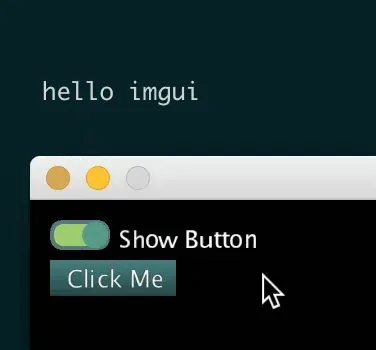
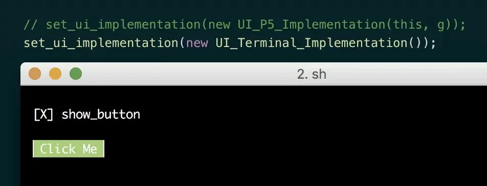
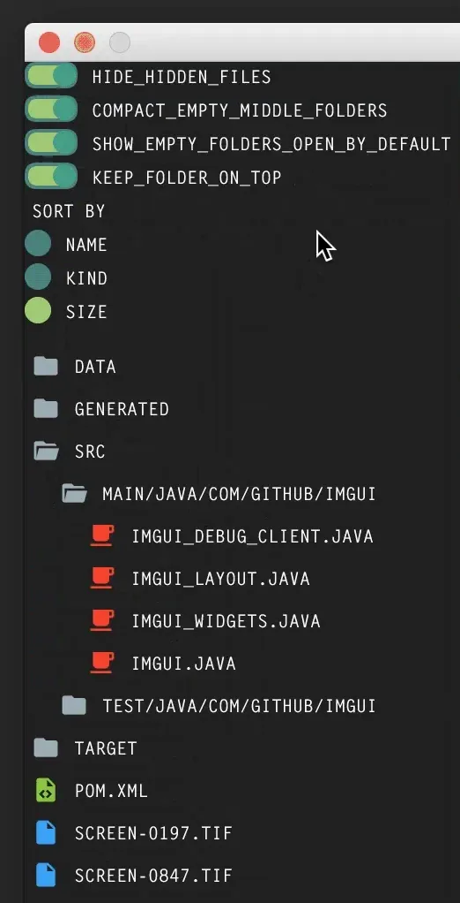

### An IMGUI for Processing

#### Interview with Doeke Wartena, 2019 Fellow

---

The 2019 Processing Foundation Fellowships sponsored nine projects from around the world that expanded the p5.js and Processing softwares and nurtured their communities. Fellows are paid a stipend for 100 hours of work, and offered mentorship from within the community. This year’s Fellows developed work ranging from Hindi translation of the p5.js website, to workshops for trans and gender nonconforming youth who live in New York City homeless shelters to learn basic programming and design. During the coming weeks, we’ll post interviews with the fellows, in conversation with Director of Advocacy Johanna Hedva, that showcase the vital and innovative work by this year’s cohort.

---

*The above code will show a toggle. If the toggle is on, it will show a button as well, and if the button is clicked it will println “hello imgui”. The code for creating this is shown below.*

**JH: Hi Doeke! Let’s start with a brief description of your fellowship project. What did you set out to do and what did you accomplish?**

**DW**: Hi Johanna! My main goal for this fellowship was to create an immediate graphic user interface (IMGUI) mode for the java version of Processing. With an IMGUI, buttons and other UI elements are created on the fly, which means that every frame of the whole UI is recreated.

To give a really simple example:

The immediate way of making interfaces, as opposed to the retained mode, makes it easy to quickly make interfaces that can change depending on the state of the program. Another important aspect for me was making it very easy to make own elements and to have multiple implementations that could be switched.

For me the web really failed in this department: changes to a CSS file often require changes to the DOM, and the other way around. There is no clear separation of structure and style. I hoped to correct this.

So far, I accomplished a working system with all the basic UI elements and the beginning of responsive layouts. Here’s another example:

*The same program as the first program, except this time it runs in the terminal. The code above is showing how the styling of the toggle is programmed.*

**JH: What were some of the challenges that arose in your work? Were they what you expected?**

**DW**: There where so many challenges that I hardly know where to start. The programming itself was not really the problem, but solving my thoughts of how something is supposed to work was difficult. Just like Processing, I wanted a low floor and a high ceiling. In other words, it should be easy for beginners to use, but at the same time not limited for people that want to do advanced and complex things. It can be tricky to raise the ceiling without also raising the floor.

I come from an art academy where a lot of experimentation is done in relation to interaction with devices. For example, if we take multiple people using the same touchscreen at the same time, approaching this from a technical perspective means it comes down to having multiple cursors. Doing this in a retained mode is easy, but in an immediate mode it suddenly becomes really complicated. For me opening up the road to advanced features is important because it makes experimenting eventually faster for users. But it can also build up a lot of constraints in the program, making it harder to maintain.

The challenges were quite unexpected. Normally when doing a project (e.g., an art piece) it’s not a big deal if certain parts are programmed in such a way that they can’t be reused, or that are hard to understand after a period of time. In the end, the project works and you move on. For libraries this is different, because they are meant to be used again in other projects. When it comes to a library for playing sound, for example, it is still pretty straight forward. But when it comes to a library for a user interface, there are so many ways an interface could be designed, which means the complexity of the library design increases by a large degree.

Further, some challenges I worked on were never attacked before, as far as I know. For example, an IMGUI has to run with a decent frame-rate in order to work, but this is not ideal when using mobile devices because it drains the battery. Solving how to make an IMGUI that does not require a constant draw loop was one of the many interesting challenges.

*One of the first tests of a file browser made with the library.*

**JH: What did these challenges teach you, and how did you respond?**

**DW**: When I did not have a solution to a problem, I would often keep the problem open and try to focus on something else. Then, over time, through other internal structural changes, a solution to an old problem would naturally reveal itself. Eventually, after many battles, I am extremely happy with the outcome.

**JH: What is there still to do with your project? How are you leaving it?**

**DW**: Apart from a million tiny things, the big pillars of what is left to do are:

-   a few different UI implementations
-   documentation
-   examples

On finalizing, the project will go into a closed beta, and shortly after that it will go into a public release, that is, if Processing supports Lambda’s by that time (which is being worked on now).

**JH: What are you taking away from your fellowship? What’s next for you?**

**DW**: I don’t think the project is done on its release, but rather, that’s really where it starts. I hope it will be well received by the Processing community, that people will make their own styles and share them with others, as well as their own UI Elements, like timelines and other things we consider complex at the moment.

Hopefully this allows Processing users an easier way to create tools, which might also bring some new life into the tools section of Processing. Eventually if it turns out that the library works great (time will tell), I would like to see a version made for p5.js as well.
