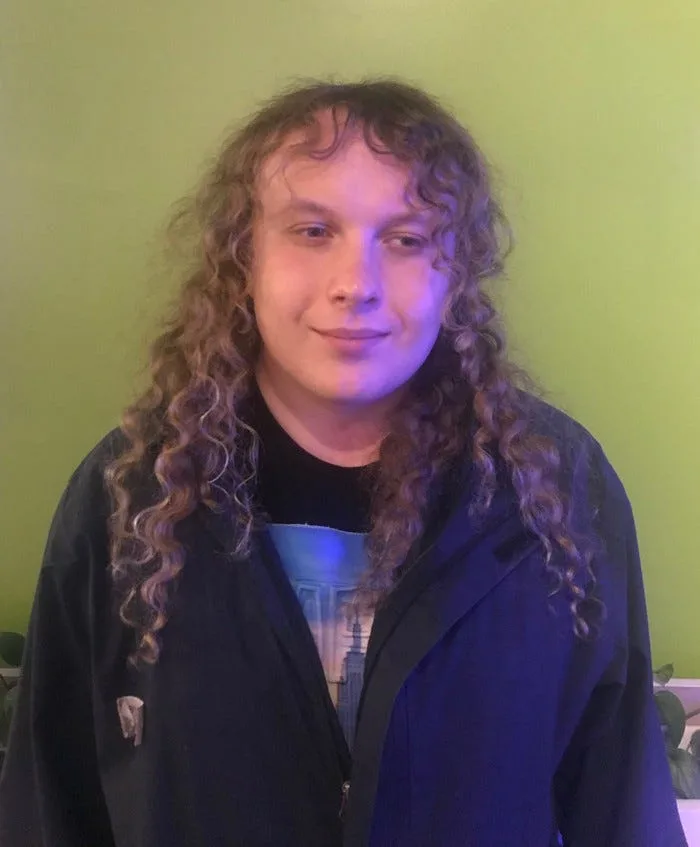

### Teaching Code to TGNC Homeless Youth in New York City

#### Interview with Matilda Wysocki, 2019 Fellow

---

*The 2019 Processing Foundation Fellowships sponsored nine projects from around the world that expanded the p5.js and Processing softwares and nurtured their communities. Fellows are paid a stipend for 100 hours of work, and offered mentorship from within the community. This year’s Fellows developed work ranging from Hindi translation of the p5.js website, to workshops for trans and gender nonconforming youth who live in New York City homeless shelters to learn basic programming and design. During the coming weeks, we’ll post interviews with the fellows, in conversation with Director of Advocacy Johanna Hedva, that showcase the vital and innovative work by this year’s cohort.*

---

*Matilda is a trans organizer, programmer, and artist with an interest in building tech infrastructure for organizing within and across boundaries, problematizing our catastrophic notion of community, and contributing to systems to uproot unjust socioeconomic systems.*

**JH: Hi Matilda! Tell me about your fellowship project. What did you set out to do, and what did you accomplish?**

**MW**: I set out to teach other TGNC (trans and gender-nonconfirming) youth, mostly in my homeless shelter system, about programming, art, and design using p5js. I wanted to use programming as a way to explore the inner workings of the tech we use, and that uses us. Personally, I wanted tech education to be less paternalistic and more exploratory, to allow us to imagine for ourselves the world we want to build, build it for our own needs, and train others to do the same. As much as this was a programming and tech empowerment class, it was far more an effort to organize, discover our identities, and learn to express ourselves in a world of media hostile to our bodies.

Indeed, I am finding a diversity of needs for programming skills among the students. Most students wanted to build brands as creatives (particularly in music), some were just curious, and only one person (so far) was dead-set on programming professionally. And yet, even as many tech training programs are only creating a new technical underclass (think Mined Minds), we still are going to be some of the first to go in the face of automated systems. The tech industry is still ageist, still cares where we go to school, and still has its informal codes of cultural fitness, as well as its downright exploitative philosophies and impact. TGNC people are misread by image recognition systems, and we are “legally” tracked, censored, and criminalized, which means that something like [Communal Control of Modern Technology](https://www.youtube.com/watch?v=EgiNbLfu1Ao), as once posited by the Black Panther Party, is necessary.

To begin doing this work, I was inspired by groups like [TechActivist.org](http://techactivist.org), and I also wanted to use the knowledge and drive I have to offer as a blooming programmer and organizer myself. Through it all, my goal has been to build a resilient community, the one that I would have liked to have. I think we are doing pretty well here: We are spending time together outside class, typically hanging out after class ends until I need to close up our space, and we’ve been going to group events together.

**JH: Your project addresses such urgent questions around one of the most vulnerable populations in the country. Can you talk about some of the challenges that arose? What did they teach you?**

**MW**: I knew turnover would be quite frequent, but I didn’t expect it to be as big as it was. In addition to teaching, I also sought out social services for many who came through, from English language classes to escort support (which I would end up providing myself). I knew this kind of care work would be needed — I needed it too — but I never expected it to take such a toll on my energy and time. Sometimes it felt like my efforts would yield no fruits, as is often the case with short-term community projects.

It also got me thinking about homelessness as an identity. We are in this state (ideally) temporarily in order to protect ourselves from marginalization due to who we are; a necessary response to an unjust and cold situation imposed upon us. As TGNC youth, we often must leave our homes/families because we are misunderstood, ostracized, and abused there. Also, our identity is used against us when we try to secure new, safe places to live. We do not want to be homeless, and yet because we cannot easily claim rootedness, our lack of a home seems to compound the other-ing we experience, and it becomes a part of us.

Many of us will come and go in the shelter system; I lost track of several people I connected with, and can do little more than hope they are doing well. I am thinking about how I can sustainably build a space that I may not and should not be in forever. Ideally, such a space will be useful until we have home guarantees, providing a much-needed safe harbor during a precarious time.

I also didn’t anticipate the difficulty in securing a space to hold class (a conflict with my first space arose at the last minute, then there was trouble with my second space between the space’s manager and their boss). To find a space that would be safe for us, I had to search through lots of spaces and schools. Thanks to Dorothy Santos I was able to connect with the people of [POWRPLNT](https://www.powrplnt.org/), an art, tech, and community garden for Brooklyn youth. Not only did this set us back by a month, it meant that so many who were interested at first, could not join us.

Ironically, teaching has been the easiest aspect of this work. Unfortunately, so many of those I worked with were interested in music, which was outside of my expertise. But it meant that I had to learn new skills, from my mentor Dan Shiffman, from myself as a programmer, and of course from those I worked with, who shared their musical tastes and interests. Finally, and most importantly, it has meant I could explore what it means to be trans, and by extension, to be me.

**JH: What’s next for you? Are you planning to expand what you started with this project? How do you see it evolving?**

**MW**: I am hoping to expand the network that emerged from class, so that we have more people to count on if we need to work on projects outside our meeting times, get job support, or need to go to the hospital, etc.

I see this work expanding through partnerships with advocacy groups, that provide job training, self-defense, art education, and security education. For this to happen I need to double down on lots of skills that I haven’t used for a long time. After opening my Instagram Account (after spending so much time away from social media), I realized my personal branding chops are more than a little rusty.

Pedagogically, I am wrestling with how to allow different learning styles to coexist. While [pair programming](https://en.wikipedia.org/wiki/Pair_programming) and support has helped a lot, I am trying to find ways to rethink some of the same activities to teach the same material, or focus components of a group project towards each of our interests. We have been in discussion of making a comic from code together to try this out.

I saw this as an organizing project as much as an educational one, and it is my personal hope that we may be able to create a voice for ourselves in campaigns for more LGBT housing and healthcare support, as well as campaigns against the carceral state.

That said, it has been difficult for any of us to do anything but projects of survival. For now, being a mutual support system seems to be our priority as we further our education about the systems working against us, as well as building tools we can use to make our dreams come true. Making sure we are safe and can thrive is my priority for now.
