### SuaCode Continues to Teach African Students to Code on Smartphones

#### Interview with Prince Steven Annor, 2019 Fellow

---

The 2019 Processing Foundation Fellowships sponsored nine projects from around the world that expanded the p5.js and Processing softwares and nurtured their communities. Fellows are paid a stipend for 100 hours of work, and offered mentorship from within the community. This year’s Fellows developed work ranging from Hindi translation of the p5.js website, to workshops for trans and gender nonconforming youth who live in New York City homeless shelters to learn basic programming and design. During the coming weeks, we’ll post interviews with the fellows, in conversation with Director of Advocacy Johanna Hedva, that showcase the vital and innovative work by this year’s cohort.

---

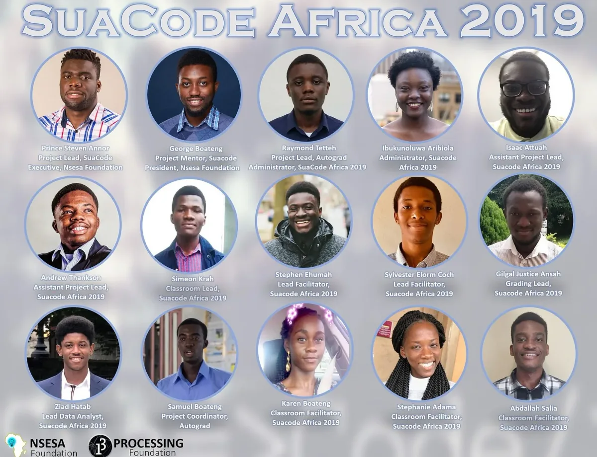

*Meet the team! Suacode Africa, Annor’s fellowship project, which continues work initiated by 2018 Fellow George Boateng, equips African youth with programming skills using their smartphones.*

**JH: Hi Prince! Let’s start with a brief description of your fellowship project. What did you set out to do and what did you accomplish?**

**PSA**: My fellowship project sought to build upon the work of [George Boateng, 2018 Processing Foundation Fellow](https://medium.com/processing-foundation/suacode-breaking-the-coding-barrier-in-africa-with-smartphones-f41a3e432199), who piloted SuaCode, a smartphone coding course with 30 high school and college students in Ghana. Having assisted George on the project as a member of his team, I sought to develop and expand that work. My goals during my fellowship were:

1) Improve the SuaCode curriculum and course files

2) Develop an automated grading system for the course assignments

3) Scale up the SuaCode course for 100 high school and college students in different parts of the African continent — we eventually reached students in 37 countries!

I started my fellowship in March with the development of the automated grading system for SuaCode, dubbed [AutoGrad](https://github.com/PrinceSAnnor/autograd), and the [search](https://cluedesk.org/2019/04/26/suacode-africa-programming-course-for-young-africans/) for [partnerships](https://www.ndangira.net/suacode-africa-programming-course-2019/) to [boost awareness](https://www.mwanampotevu.co.tz/2019/04/suacode-africa-programming-course-2019.html) about the [launch](https://regionweek.com/be-the-first-to-apply-for-suacode-africa-an-online-coding-course-for-africans/) of the SuaCode cohort dubbed, [SuaCode Africa](https://opportunitydesk.org/2019/04/24/suacode-africa-programming-course-2019/).

I then assembled a team of four developers to assist me in AutoGrad’s development, whilst later in April, I trained a team of 12 African facilitators and administrators based around the globe — in Miami, Rochester, Hanover, Chicago, San Francisco in the U.S. and Accra, Kumasi in Ghana — in preparation for the launch of SuaCode Africa. I revamped and extended the [SuaCode system and curriculum](https://github.com/Suacode-app/Suacode) and set up the Google Classroom course page in preparation for SuaCode Africa.

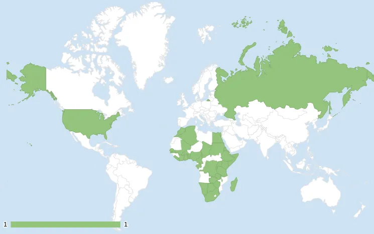

*Countries represented in SuaCode Africa.*

Seven hundred and nine students all over Africa applied to take part in SuaCode Africa, showing how great the interest is in smartphone-based coding. The initial plan was to introduce programming concepts to 100 high school and college students in different parts of the African continent. However, when the first version of AutoGrad was released in April, it became apparent that more students could be accommodated, so a system was devised to allow more students into the program.

This system involved an open admission that was contingent on the successful completion of the first two modules in the program, comprising two lessons and corresponding assignments. All 709 students who were conditionally admitted were from 37 countries in Africa and the diaspora, and they were invited to join the Google Classroom course. After the second module, 210 students from 27 countries were admitted into the main program, with 25 percent of the students being women.

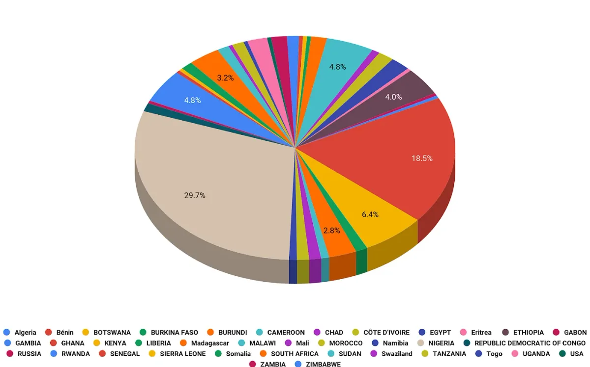

*Population distribution by nationality.*

Similar to previous cohorts, students read lesson notes in the Google Classroom app and wrote their code using the Android Processing Development Environment (APDE) application. For each assignment submission, the students included a reflection essay describing whether the lesson and assignment were fun, challenging, etc., and the experience of coding the assignment with their smartphones. They posted questions in the forum and received help from the facilitators and their peers.

A total of 151 out of the 210 students completed all four modules with a grade of 50 or more out of 80, and were granted certificates resulting in a completion rate of 72 percent. At 76 percent, the female pass rate was higher than the male pass rate, at 71 percent. Seventeen students, nine percent total, had a perfect score. Students who performed outstandingly are scheduled to have a mentoring session with a tech professional at Google, Amazon, or Facebook.

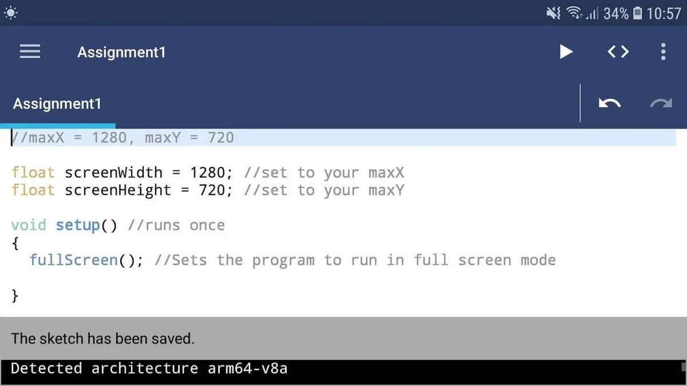

*Students wrote their code using the Android Processing Development Environment (APDE) application.*

The feedback from the students was great. Overall, the students enjoyed the lessons and assignments. Below are some quotes from the students.

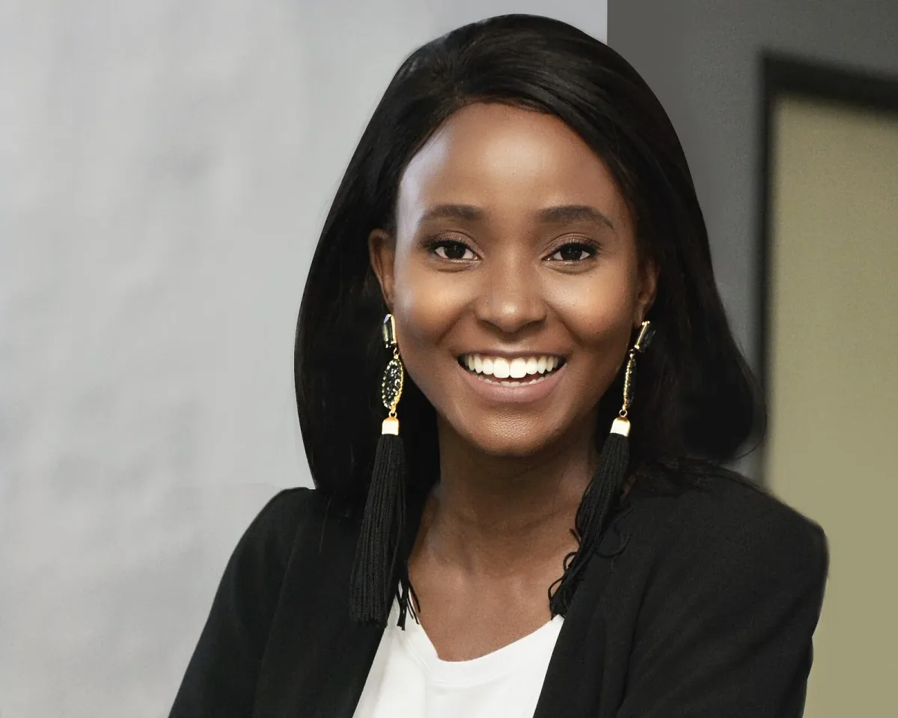

*Thato Nicole Tau, Botswana*

“As a first-time coder I had many reservations at the beginning of the program. From day one the Suacode team was very hands-on in whatever we needed assistance with. With every week of the program, I saw myself grow to enjoy coding more and more! This was such a great experience for me and I’m certain that I’ll be continuing on this journey.” — Thato Nicole Tau, Botswana

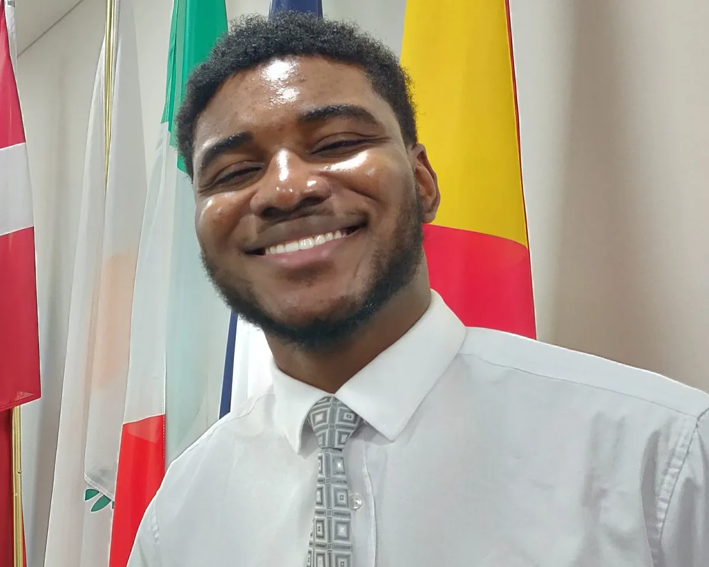

*Segun Omole, Nigeria*

“My experience at Suacode Africa was an absolute delight and a truly fulfilling experience. I joined the program with practically no knowledge of programming and left with a strong foundation in coding. The mentors were very supportive and always made themselves available to help us in any way we needed. I felt very pleased with the end result as I was able to make my very own video game in five weeks time. I fully recommend the program to every newcomer to code.” — Segun Omole, Nigeria

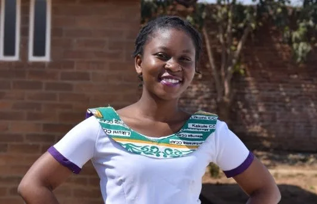

*Tiwonge Lwara, Malawi*

“SuaCode is one of the best online training opportunities. It was my first time to learn Processing Programming Language and I am grateful for the way SuaCode taught me the basic concepts. The learning materials were easy to follow and straight forward. I really like the way the tutors were committed to guide and aid us throughout the course. I can’t wait to be invited again for Advanced Lessons in the near future.” — Tiwonge Lwara, Malawi

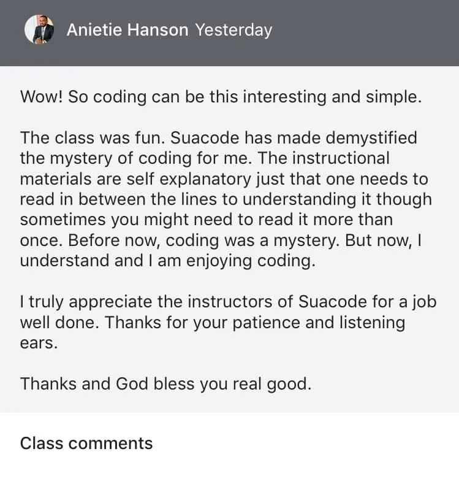

*Comments posted in the SuaCode Google Classroom.*

**JH: Can you talk about the origins of SuaCode? Your fellowship mentor is George Boateng, who was a Processing Foundation Fellow in 2018. How are your fellowships related?**

**PSA**: The idea for SuaCode was birthed out of the challenge of low computer ownership among students that was encountered during Nsesa Foundation’s annual innovation boot camp, Project iSWEST 2017. My mentor George is cofounder and president of Nsesa Foundation, and I was Lead Facilitator for the project’s Computer Programming course. From our survey, George and I realized that 100 percent of our students had smartphones, whereas only a quarter of them had personal laptops. Recognizing an opportunity to innovate, we modified our programming curriculum, which was based on Processing, so that teaching and learning could be done using smartphones, circumventing the problem of inadequate laptops.

We chose the Processing language for teaching because it is fun, interactive, and easy to learn. Within the first week of the boot camp, we introduced 27 students to core concepts in programming that culminated in the building of a Pong game. At the end of the program, 86 percent agreed that the in-class exercises and assignments were helpful in understanding the material, 77 percent completed the final project, 91 percent agreed that they are interested in learning advanced concepts in programming, and 100 percent agreed we inspired their interest in programming. More details are in this [peer-reviewed paper we published](https://ieeexplore.ieee.org/document/8340459). Importantly, though, our students built a Pong game on their smartphones, which was really exciting!

We found out that this lack of access to laptops is a problem across Africa, so along with Victor Kumbol (co-founder of Nsesa Foundation), we decided to expand the smartphone-coding course beyond the confines of a physical classroom. SuaCode, which means learn to code in Akan, a Ghanaian language, was born to scale! SuaCode seeks to teach coding fundamentals and how to code on a smartphone to millions across Africa, most of whom would otherwise have no opportunity to gain this crucial digital skill because of the lack of access to laptops.

This journey to implement SuaCode resulted in the [SuaCode idea being selected as a finalist for the Milken-­Penn GSE Education Business plan competition](https://nsesafoundation.org/nsesa-selected-finalist-milken-penn-education-business-plan-competition/). Then George and I ran the pilot of SuaCode.

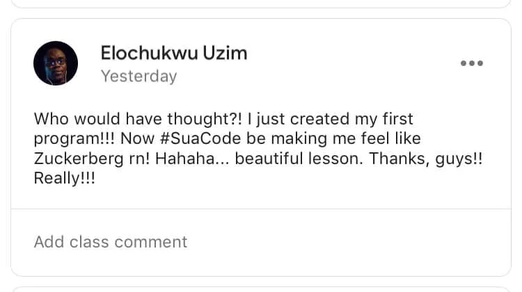

*A post in the SuaCode Google Classroom.*

This year, I built upon his work while addressing the challenges he faced and extending its impact. We needed to address the labor-intensiveness of manually grading students work, which affects the potential for scaling the course, and the low completion rates from before, with only seven of the 30 students completing the course.

My fellowship work resulted in me building AutoGrad and then scaling SuaCode to reach hundreds of Africans across 37 countries. My work made it possible to automatically grade hundreds of assignments and increase completion rates to 72 percent. My work builds an important part of the piece towards achieving the goal of scaling SuaCode to millions across Africa!

**JH: What were some of the challenges that arose in your work? Were they what you expected?**

**PSA**: The challenges I run into during the fellowship were variegated and most were expected.

Here’s what they were and how I addressed them:

*Forming partnerships and publicity —*

I reached out to hundreds of people and organizations, leveraging my connections in the United Arab Emirates, Ghana, Nigeria, and the United States to aid me in virtually meeting other organizations and persons.

*Max number of people per Google Classroom —*

I had to create and manage three total classrooms. There was a lot of having to post information multiple times and answering similar questions in all three classrooms. So I created and shared an FAQ document to all classrooms and dynamically updated it during the fellowship.

*French-speaking students —*

I relied on my limited French capacity, Google Translate, and support from Francophone friends. The French-speaking students also eventually got bilingual friends back home who helped them ask questions and read the notes.

*AutoGrad’s assignment return feature was not fully functional at the start of the cohort. And AutoGrad wasn’t ready for all the use cases for Assignment 3 and Assignment 4 —*

I had to return the grades for Assignment 1 manually. By Assignment 2, it was fully functional. I had to manually grade and return almost half of the submissions that didn’t fit those use cases.

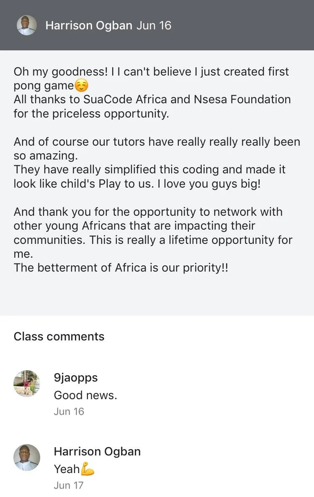

*Students posting and commenting in the SuaCode Google Classroom.*

**JH: What did these challenges teach you, and how did you respond?**

**PSA**: I became a much better leader, programmer, instructor, and researcher. The challenges taught me a lot about leading big projects, allocating funds and working with other organizations. I tried to calm down when I stumbled on an unexpected challenge and think through it with my team. I also talked to George when I wasn’t sure about a solution and the best way to go about its implementation.

Generally, I have acquired a lot of experiential knowledge and broadened my perspective by leading this project.

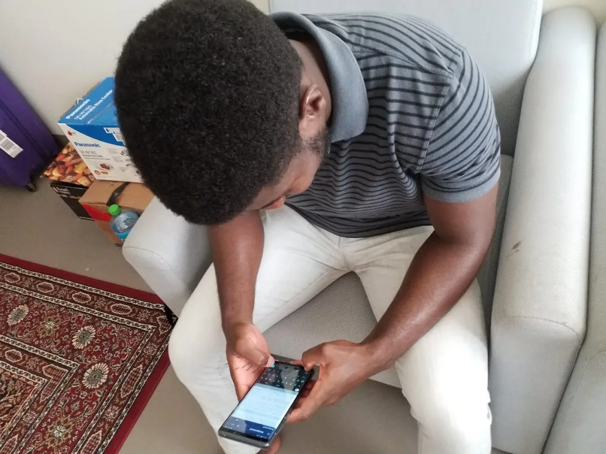

*A student doing his assignment on his phone.*
