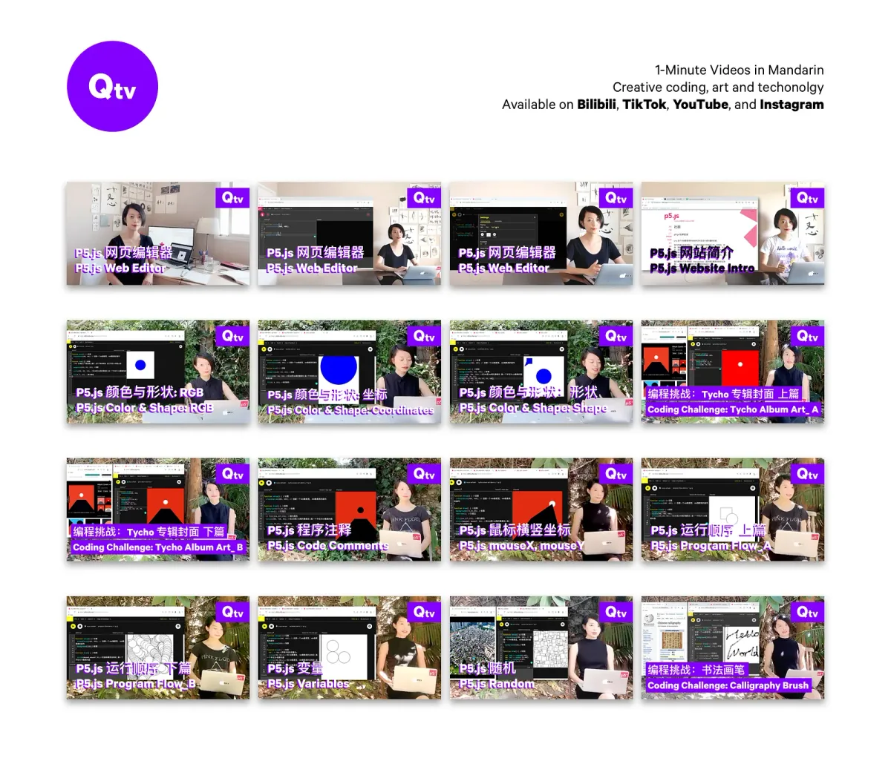
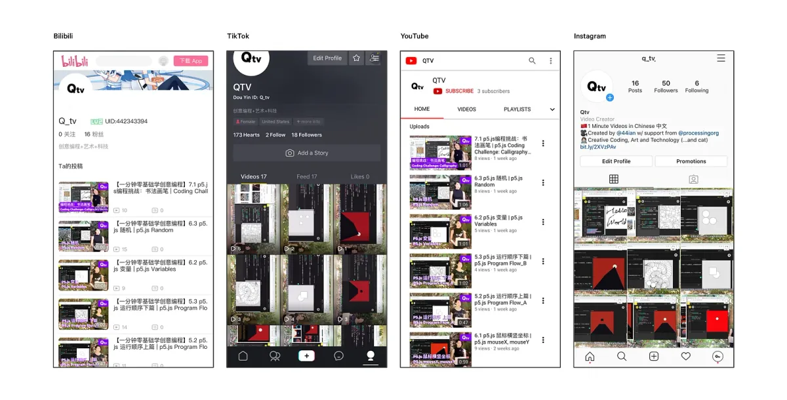
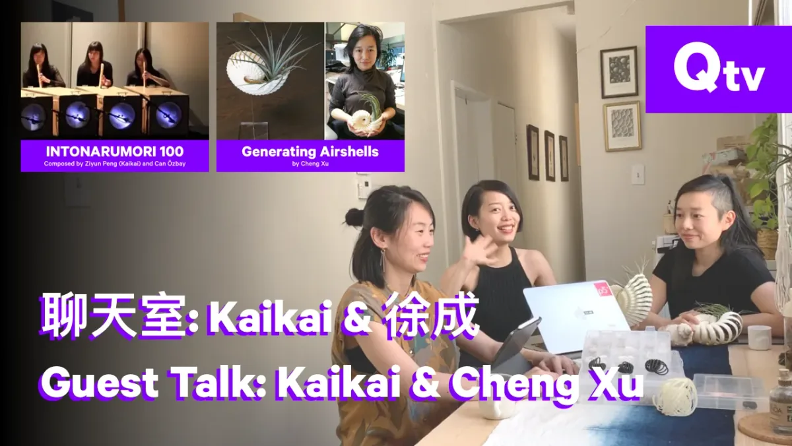
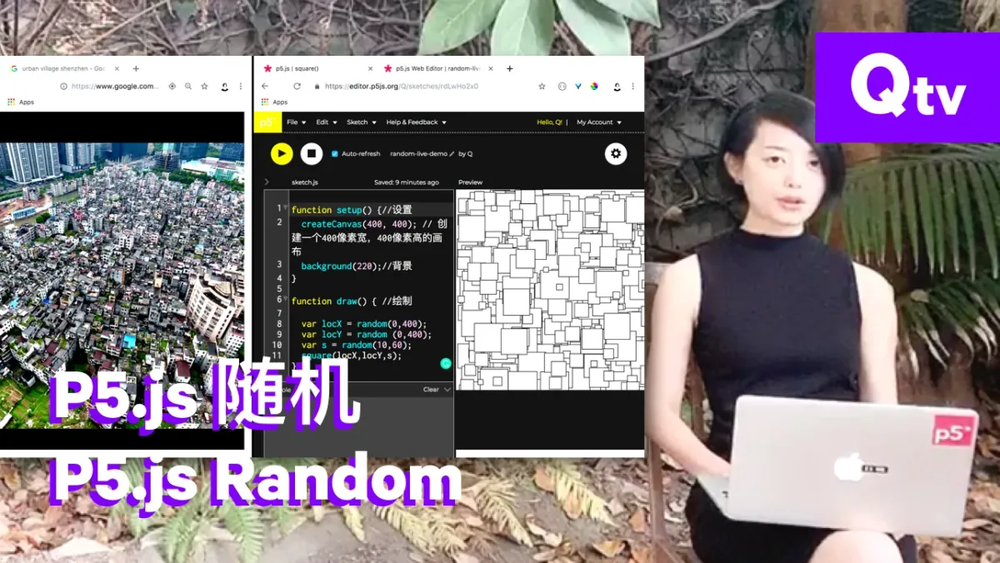
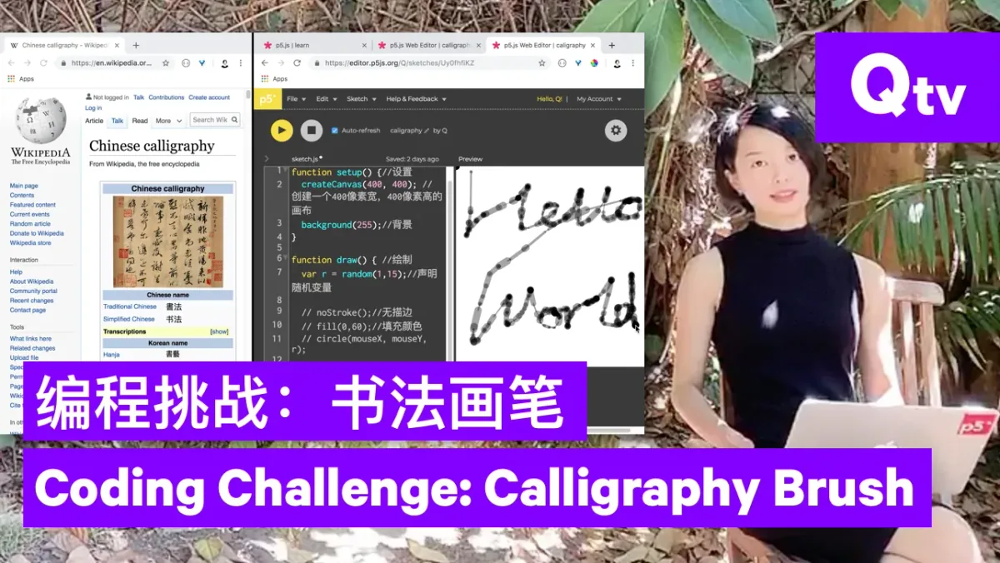

### p5.js Tutorials for Womxn in China

#### Interview with Qianqian Ye, 2019 Fellow

---

The 2019 Processing Foundation Fellowships sponsored nine projects from around the world that expanded the p5.js and Processing softwares and nurtured their communities. Fellows are paid a stipend for 100 hours of work, and offered mentorship from within the community. This year’s Fellows developed work ranging from Hindi translation of the p5.js website, to workshops for trans and gender nonconforming youth who live in New York City homeless shelters to learn basic programming and design. During the coming weeks, we’ll post interviews with the fellows, in conversation with Director of Advocacy Johanna Hedva, that showcase the vital and innovative work by this year’s cohort.

---

*Qianqian‘s fellowship consisted of making one-minute p5.js tutorials, in Mandarin, for women learning to code in China, across different platforms. [Click here to visit the Youtube channel of Qtv](https://www.youtube.com/channel/UCzMs9qg50AW2LEpLDzHT5NA).*

**JH: Q! Tell me about your fellowship project. What were your intentions and goals, and what did you accomplish?**

**Q**: My project was to make p5.js more accessible in China, especially within underrepresented womxn groups.

This project started with an idea of teaching my mom, who lives in China and doesn’t speak English, to code with p5.js. It was difficult on multiple levels, so I started identifying the main reasons why it’s more challenging for someone like my mother to learn to code. It’s primarily due to the lack of free creative coding education resources. Most of the free resources to learn creative coding are unavailable in China. The p5.js tutorials on YouTube are inaccessible in China, as are the p5.js Twitter and Instagram accounts, because of internet censorship.

I myself have learned a lot from Youtube videos such as [The Coding Train](https://www.youtube.com/channel/UCvjgXvBlbQiydffZU7m1_aw), but the more I watched coding tutorials online, the more I realized how difficult it is to find other women and people of color teaching coding, especially in Mandarin. So, I wanted to help other Chinese women relate to creative coding.

*Qtv is available on many platforms, including Bilibili and TikTok, Youtube and Instagram.*

During my fellowship:

1.  I created [Qtv](https://www.youtube.com/channel/UCzMs9qg50AW2LEpLDzHT5NA) — a video channel with one-minute videos in Mandarin, about creative coding, art, and technology. I recorded a series of video tutorials for beginners and shared them on Chinese video sites, like [Bilibili](https://space.bilibili.com/442343394) and TikTok, and also sites like [Youtube](https://www.youtube.com/channel/UCzMs9qg50AW2LEpLDzHT5NA?) and [Instagram](https://www.instagram.com/q_tv_/). In the videos, I covered a basic intro of the p5.js web editor, website, color and shape, program flow, variables, and a couple of coding challenges.
2.  I did a video interview with Dan Shiffman, titled Video Tutorial Making 101, with the goal of sharing tutorial-making experiences with others who are interested in doing so (it will be released soon!).
3.  I am now working on opening up the video channels, in the form of interviews and guest tutorials, to other Chinese creatives who want to contribute to the educational resources together. I have recorded a guest talk video with some Chinese women designers and artists, and I have invited a few Chinese creatives to make guest tutorials. The first one was just released ([click here to watch!](https://www.youtube.com/watch?v=R-nB_KPIWhI)), and there are more coming soon. (If you are interested in teaching/talking about creative coding in Mandarin, HMU!)

*Some Qtv episodes featured guest speakers; here, Kaikai and Cheng Xu join Qianqian.*

This project is inspired by a lot of former fellows, like [Kenneth Lim](https://medium.com/processing-foundation/chinese-translation-for-p5-js-and-preparing-a-future-of-more-translations-b56843ea096e) (2018), [Ari Melenciano](https://medium.com/processing-foundation/justice-factory-data-visualizations-for-empathy-93a7f2244632) (2018), [Saskia Freeke](https://medium.com/processing-foundation/community-and-code-882b00e6ee32) (2017) and [DIY Girls](https://medium.com/processing-foundation/manos-a-la-obra-empecemos-creative-coding-in-p5-js-a2bfe3e059ce) (2017), who have done work addressing related issues, from translation to community outreach to under-served and underrepresented groups.

**JH: Give us a sense of why your project was important for your community. What issues was your work addressing?**

**Q**: I learned to code mainly by watching Youtube videos. Learning to code in a second language was difficult, and the lack of community made this process even harder. I hope to speak from my experience as a beginner and as someone who once felt like an outsider to the creative coding and video tutorial world.

The aim of the project was to:

-   Help other women feel more comfortable learning how to code.
-   Encourage others to share their knowledge online, in their own way to their own communities.
-   Support the diversity that the Processing Foundation stands on.
-   Foster software literacy and encourage more women to engage.

Issues the work was addressing:

-   It’s difficult to learn how to code if you don’t have access to certain websites based on where you live.
-   It’s challenging to learn to program if English isn’t your first language.
-   We need more coding tutorials that are culturally sensitive and socially conscious.
-   For video content creators, it’s difficult to put themselves on the internet as a woman and a person of color.

When we think of video making, we might draw a picture of shiny high-end video cameras and complicated editing software. I spent a lot of time researching the latest technology for my videos, and, in the end, I decided to use my phone to record and the free software iMovie to edit. I hope these choices encourage others that it doesn’t take a lot of expensive gear to get started making instructional videos.

It was my intention to create a warm and inviting video setting that my viewers would feel was both personal and relatable. I recorded the videos mostly in my studio and backyard, surrounded by trees. I overlaid the screen recording on top of my voiceover during editing. I also added Chinese subtitles to all the videos, in order to make them easier to understand.

I was aiming to introduce p5.js and creative coding in a more multi-disciplinary and cross-cultural way. For example, I made a tutorial video that introduced the random function in p5.js by creating a birds-eye view of an [urban village](https://en.wikipedia.org/wiki/Urban_village_%28China%29), which is unique to China’s urbanization. I hope Chinese viewers will find the example recognizable, and, additionally, that my audience from other parts of the world will learn more about China’s vibrant informal settlement, which is an overlooked topic. I hope to see more work addressing geopolitical, cultural, and social issues while also introducing new possibilities for art and technology.

*This Qtv Episode covered the Random function in p5.js.*

Another issue I came across was my own fear of putting myself online. I first had to get over my anxiety of making mistakes in the videos or receiving negative comments online. Women and people of color are often targets for online harassment. I’m hoping to set an example for other women and people of color that it’s okay to put yourselves online and strengthen your communities by sharing your knowledge. Eventually, we will be able to stop online harassment by creating strong diverse communities.

**JH: Your project is important in addressing both systemic, global issues, as well as specific, local ones. From this vantage point, are you able to see what impact your project has had?**

**Q**: The Mandarin p5.js video tutorials I created are now available on multiple video platforms that are accessible to the Chinese audience. I have received comments from viewers in China who have learned a thing or two from my videos. I’m happy to see I encouraged other women to join me in some of the videos. I am glad to have helped the Processing community by enlarging the circle of people who can access it.

By prioritizing women, who are marginalized in this community, I hope my project will promote diversity in the p5.js and Processing communities in China, though this is just the first step. In the future, I hope this project will inspire people from other minority groups in China to participate in the creative coding community.

Creative coding is a magical medium. It offers underrepresented groups a new field to imagine alternative futures, and participate in manifesting their visions through creativity. I hope the viewers of the videos will get inspired and start to create work via p5js.

Has my mom learned how to code with p5.js yet? I am still working on it.

*This Qtv Episode is a coding challenge using Calligraphy Brush.*
