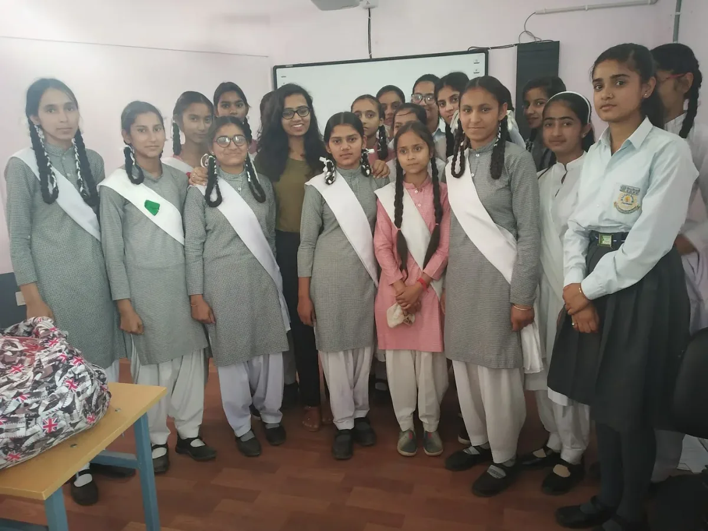
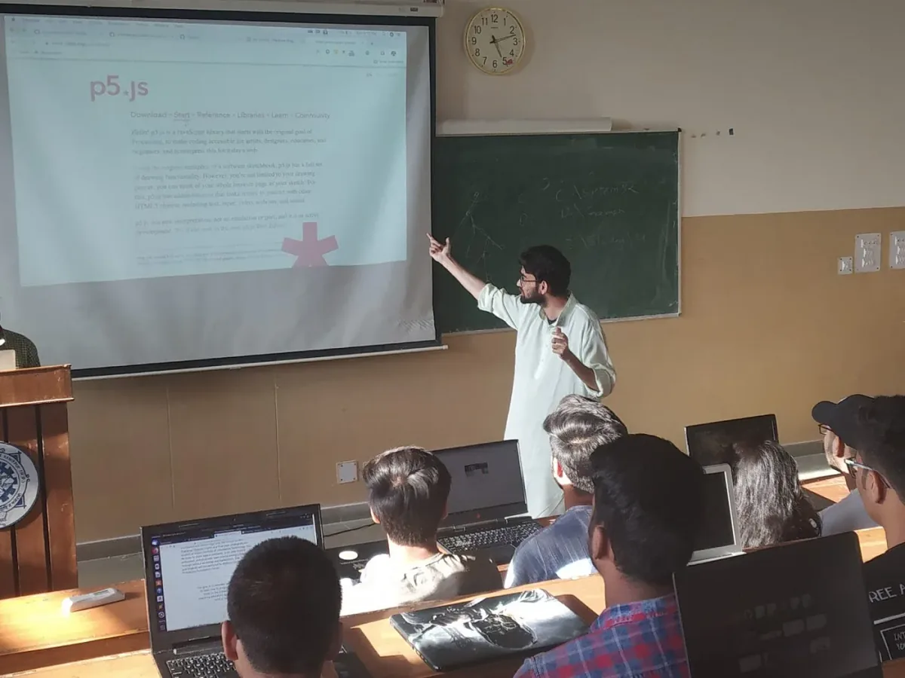

### Teaching p5.js in Hindi

---

The 2019 Processing Foundation Fellowships sponsored nine projects from around the world that expanded the p5.js and Processing softwares and nurtured their communities. Fellows are paid a stipend for 100 hours of work, and offered mentorship from within the community. This year’s Fellows developed work ranging from Hindi translation of the p5.js website, to workshops for trans and gender nonconforming youth who live in New York City homeless shelters to learn basic programming and design. During the coming weeks, we’ll post interviews with the fellows, in conversation with Director of Advocacy Johanna Hedva, that showcase the vital and innovative work by this year’s cohort.

---

*Nancy Chauhan reached out to girls from several schools and conducted a workshop emphasizing the importance of creative coding in schools, which used p5.js at Government Girls’ High School. \[image description: A group photo of 19 young women in school uniforms, standing in a classroom.\]*

[इस लेख का हिंदी अनुवाद पढ़ने के लिए, यहाँ क्लिक करें](https://medium.com/processing-foundation/2019-%E0%A4%AB%E0%A5%87%E0%A4%B2%E0%A5%8B-%E0%A4%AE%E0%A4%A8%E0%A4%B8%E0%A5%8D%E0%A4%B5%E0%A4%BF%E0%A4%A8%E0%A5%80-%E0%A4%A6%E0%A4%BE%E0%A4%B8-%E0%A4%A8%E0%A5%88%E0%A4%82%E0%A4%B8%E0%A5%80-%E0%A4%9A%E0%A5%8C%E0%A4%B9%E0%A4%BE%E0%A4%A8-%E0%A4%94%E0%A4%B0-%E0%A4%B6%E0%A4%B9%E0%A4%B0%E0%A4%AF%E0%A4%BE%E0%A4%B0-%E0%A4%B6%E0%A4%AE%E0%A4%B6%E0%A5%80-%E0%A4%95%E0%A5%87-%E0%A4%B8%E0%A4%BE%E0%A4%A5-%E0%A4%B8%E0%A4%BE%E0%A4%95%E0%A5%8D%E0%A4%B7%E0%A4%BE%E0%A4%A4%E0%A5%8D%E0%A4%95%E0%A4%BE%E0%A4%B0-284c176b0c69).

**JH**: Hi Manaswini, Nancy, and Shaharyar! Let’s start with a brief description of your fellowship project. What did you set out to do and what did you accomplish?

**MD, NC & SS**: Our fellowship project had the aim of making Processing tools accessible to the Indian community. We mainly focussed on p5.js. We had the following objectives in mind when we started off:

1.  Translate the p5.js website and documentation to Hindi
2.  Provide the [p5 YouTube tutorials](https://www.youtube.com/watch?v=HerCR8bw_GE&list=PLRqwX-V7Uu6Zy51Q-x9tMWIv9cueOFTFA) in Hindi
3.  Reach out to non-governmental organizations and/or schools to promote software literacy

We started working the second week of March and accomplished all of the above by the end of May. The website was translated by Shaharyar, taking into account escape sequences and grammar. Despite all being full-time graduate students, we managed to conduct four workshops for students in Himachal Pradesh and Bhubaneswar. We promoted p5.js in schools and colleges, including National Institute of Technology Hamirpur, Indian Institute of Information Technology Una, College of Engineering and Technology, Bhubaneswar, and Government Girls’ High School. We also managed to translate 11 Coding Train video tutorials to Hindi.

**JH**: Translating p5.js into languages other than English is something the Processing Foundation has been eager to support (past fellowships and contributions have translated p5.js into [Spanish](https://medium.com/processing-foundation/p5-js-is-now-available-in-spanish-3d1eab9dffa0) and [Chinese](https://medium.com/processing-foundation/chinese-translation-for-p5-js-and-preparing-a-future-of-more-translations-b56843ea096e)). Can you talk about the importance of making p5.js available in Hindi? How will your work impact the community of Hindi speakers who will use p5.js?

**MD, NC & SS**: Software literacy has been a matter of concern in India ever since its inception. The Indian population is estimated at 1.35 billion, based on the most recent UN data, and 80 percent of that population reads or understands Hindi. It is the preferred language, and is especially helpful for studying complex concepts in mathematics and programming.

As per the recent stats, 50 percent of India’s population is under 25 years of age, or is in their learning phase. Students in earlier generations were introduced to computer programming while in undergraduate school, but the flourishing IT industry has compelled education policy to introduce computer courses to younger students. However, major hurdles to that policy include:

1.  Lack of properly trained educators and mentors: This makes computer science boring and difficult to learn for the students. As a consequence, they consider it only as a tool to help them get employed after their graduation, which keeps them from falling in love with computer programming.
2.  More than 85 percent of India’s population is in the middle or lower income group, and they don’t have the resources to afford extra classes in computer programming, even if they want to.

India’s growing IT sector demands more well-educated and trained developers. This demand can only be fulfilled by targeting students belonging to middle or lower income group, and making computer programming interesting and affordable to them.

*Shaharyar Shamshi conducted a workshop on p5.js for undergraduate students at the National Institute of Technology Hamirpur. \[image description: A teacher points to a projection of the p5.js website at the front of a classroom. Rows of students with open laptops look on.\]*

**JH**: What were some of the challenges that arose in your work? What did they teach you, and how did you respond?

**MD, NC & SS**: We faced a lot of challenges reaching out to schools and convincing them to let us host workshops, but our mentor, Mathura Govindarajan (who was a [Processing Foundation Fellow in 2018](https://medium.com/processing-foundation/working-on-the-p5-accessibility-project-58a781575400)) connected us with Aditi Kumar from [FAT (Feminist Approach to Technology)](https://www.fat-net.org/) to help us prepare to tackle questions about the importance of such workshops. We created a proposal that we sent to the schools, which helped us a lot in setting our priorities.

As far as website translation is concerned, we changed the YML files corresponding to individual web pages and committed our changes. In order to make our work cleaner, we squashed the commits and created a pull request. Unfortunately, when we tried to run the project, it crashed.

This was the first blow that we faced. We tried to figure out the solution to this issue but all of our efforts were in vain. We had other goals to focus on, but couldn’t begin without solving this problem first. Shaharyar was quick to figure out that the pitfall lied with escape sequences. Our translation didn’t work due to the improper placement of escape sequences.

All thanks to Daniel Shiffman, we didn’t face any problems with YouTube video translation.

*Manaswini Das conducted a workshop on p5.js for undergraduate students at the College of Engineering and Technology, Bhubaneswar. \[image description: Eight students are gathered around a table, while the teacher is at the center of the classroom, delivering a lecture.\]*

**JH**: What is there still left to do with your project?

**MD, NC & SS**: As far as our objectives are concerned, apart from the website translation, we tried to host workshops in as many schools and colleges, and translate as many videos as possible within the 100 hours of the fellowship. We intend to spread the reach of Processing tools to more schools and colleges, so that learning to code can be a bit easier for the students here, now that they can access all the resources in Hindi. We also look forward to managing the Hindi translation of the p5.js website. We look forward to spreading creative coding!

**JH**: What’s next for all of you, and how has the fellowship informed your goals?

**MD, NC & SS**: We are extremely grateful to the Processing Foundation for giving us the opportunity to work on this project, and to our mentor Mathura Govindarajan for her constant support and guidance. We look forward to being involved more with the Foundation. We are advancing our careers by probing deeper into computer software.

The fellowship has made us realize the need for programming in schools, as well as our passion for teaching. We were really happy to do our part to bridge the gap between the need for programming in schools and the availability of tools that aid the same. We intend to carry this legacy forward in whatever way we can and keep contributing to the Processing Foundation.

Also, a part of the website translation is still left. We are soliciting help from contributors for the Hindi translation. Feel free to head over to [this repository](https://github.com/processing/p5.js-website/) if you want to contribute.

*Nancy Chauhan with students from different schools in Hamirpur. \[image description: A smiling woman with glasses takes a selfie in front of a classroom. Twenty-eight students sit in rows of desks behind her, all smiling for the camera.\]*
