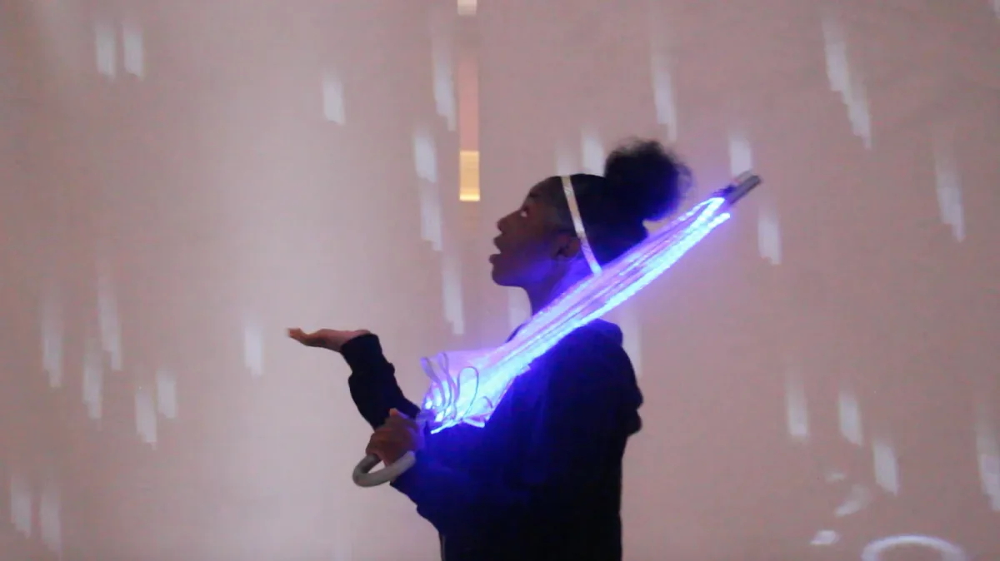
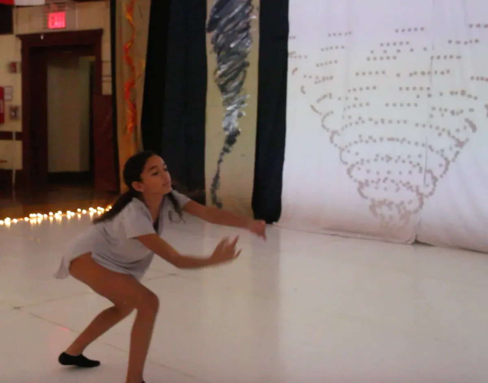

### Teaching Digital Dance: Coding, Graphic Design, Animation, Dance, and Robotics

#### Interview with Emily Fields, 2019 Teaching Fellow

---

*The 2019 Processing Foundation Fellowships sponsored nine projects from around the world that expanded the p5.js and Processing softwares and nurtured their communities. This year, we collaborated with the New York City Department of Education’s CS4All Initiative, to support two Teaching Fellows, who are Computer Science teachers in the Software Engineering Program of New York City Public Schools. Here is the second interview with Teaching Fellow Emily Fields, in conversation with Director of Advocacy Johanna Hedva.*

---

  <iframe src="https://player.vimeo.com/video/355164332?app_id=122963" frameborder="0" scrolling="no"></iframe>

**JH: Hi Emily! You were one of two teaching fellowships the Processing Foundation sponsored this year. Can you tell me about this collaboration, and the project you led?**

**EF**: Hi! Yes, I am a computer science teacher at The Young Women’s Leadership School of Astoria; and we’re so lucky to be a part of the NYC DOE’s CS4All joint initiative with the Processing Foundation!

My fellowship project came out of something I’ve been working on for the past four years. Each year, I work with 50–75 students to create a Digital Dance — a project that blends coding, graphic design, animation, filmmaking, dance, and robotics into an integrated performance art piece. Every year we try to learn from our mistakes and successes, and challenge ourselves to find innovative ways of incorporating new technology.

It has been a dream of mine, for a few years now, to incorporate some sort of interactive projection behind the dancers. For our Fellowship Project, my students and I experimented with motion detection to track dancer movements using Processing. This year’s Digital Dance theme was the Elements — earth, wind, fire, and water — and we set out with the goal of creating effects that would appear as if dancers were able to:

· manipulate falling rain (water)

· throw fire balls (fire)

· dance inside a tornado (wind)

· jump between moving boulders (earth)

As an educator it is always my intention to create experiences for my students that allow them to be creative, pursue their passions, and be challenged in an authentic way. This project provided them with all those opportunities and then some! It’s heartening to work with a community of young students, middle and high schoolers, who are experimenting with the intersection of the arts and code, in a fashion that is truly on the edge of what is currently possible. It’s my hope that by participating in these types of experiences, my students will continue to feel comfortable challenging themselves and the world around them as they pursue new innovative opportunities long after they graduate.

*Rain dancer experimenting with the umbrella’s impact on the Kinects.*

**JH: What were some of the things you accomplished with this project?**

**EF**: For me the biggest accomplishment is always seeing the final product. Because it’s a live performance, and especially because it incorporates so much technology, everything does not always work perfectly. We spend so much time working on all the different elements, and we’re never sure if they’re going to work together, so it’s really beautiful and rewarding when they do! One of my students took a video of our first run-through, and we’re all jumping around cheering with such pure joy — that moment every year is the most rewarding!

Regarding the motion-capture work specifically: we set out with an initially challenging task, and while we weren’t able to accomplish everything we had hoped, we were able to create backgrounds for two of the elements, rain and wind, that responded to the dancer’s movements. In the past we had our graphic designers animate all of our backgrounds, so this year I was really proud that two of our four backgrounds had been coded!

In our rain section, we were able to use Kinects to identify the highest point (a dancer holding an umbrella), and the rain fell around the space where that dancer was standing. In our wind section, we used Kinects to locate the dancer, again using the highest point, and created a tornado that moved with the dancer across the projection.

**JH: Can you talk a little about some of the challenges that arose? What did they teach you, and how did you respond?**

**EF**: We had success initially setting up our Kinect and using its data to track a dancer, however we quickly discovered that using only one Kinect severely limited the space a dancer was able to use. After posing some questions on the Processing community forum, we learned that there was a way to connect two Kinects together so that our dancers could move in a larger space. Dan Schiffman had some great sample code we were able to use, which we then had to adapt to fit into the code we had already created. This proved to be the most challenging part.

Another challenge was the physical space. Our final performance was in our school’s gym, but we practiced in our dance studio. As a result, we weren’t able to test our final product until we began setting up two days before our performance. Knowing that Kinects can be a little temperamental to work with live, we created two different versions of our code, one that used the Kinects and responded to the dancer’s movement and one that didn’t.

In the end there were too many dancers onstage during our rain section for the Kinects to effectively pick up their movement and locate the tallest data point. We ended up only using our responsive code for the wind section, and in the rain section it just rained over all the dancers instead. Not ideal, but a good fix in the moment, that was still effective for our final performance. Next year we’re looking forward to experimenting with PoseNet running on Tensorflow.js to try to create a better and more consistent final product.

I had an incredible eighth grader, Nicole Rodriguez, who took over this project and worked on it independently in my class for four months. This was truly her project from start to finish, and she did an unbelievable job. As a teacher, I often found it challenging to support her when she got stuck during class. Because the problems she was trying to solve were so high level, I couldn’t just look over her code and quickly identify a solution. As a result, we found time after class and during lunch to meet together and pair program. This time working together was not only the most productive, but also the most fun! I’m really looking forward to continuing this work next year!

*Wind dancer making some last minute adjustments during a tech rehearsal.*

**JH: How do you see this work continuing in the future? What will you be able to build on, and what’s next for you?**

**EF**: We’re already beginning to plan for Digital Dance 5.0 and are in the process of brainstorming a theme. Once we have a theme, all of our creative tech ideas seem to begin to flow out of that. As I already mentioned, we’re also looking forward to experimenting with PoseNet and Tensorflow.js to try to create projections that respond more precisely to dancer movement. There are also some professionals and other schools that are experimenting with similar work, and I’d love to find more ways to collaborate with them on this work!
