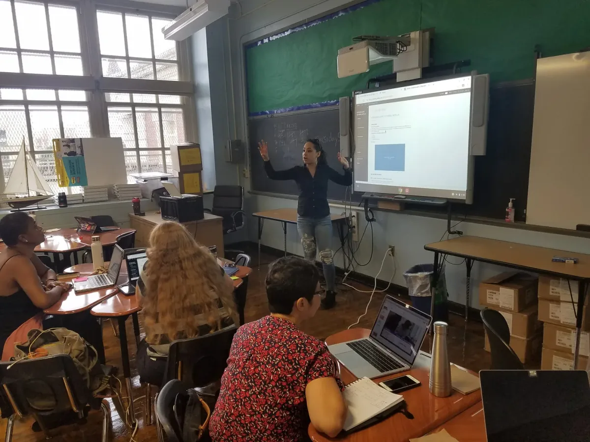
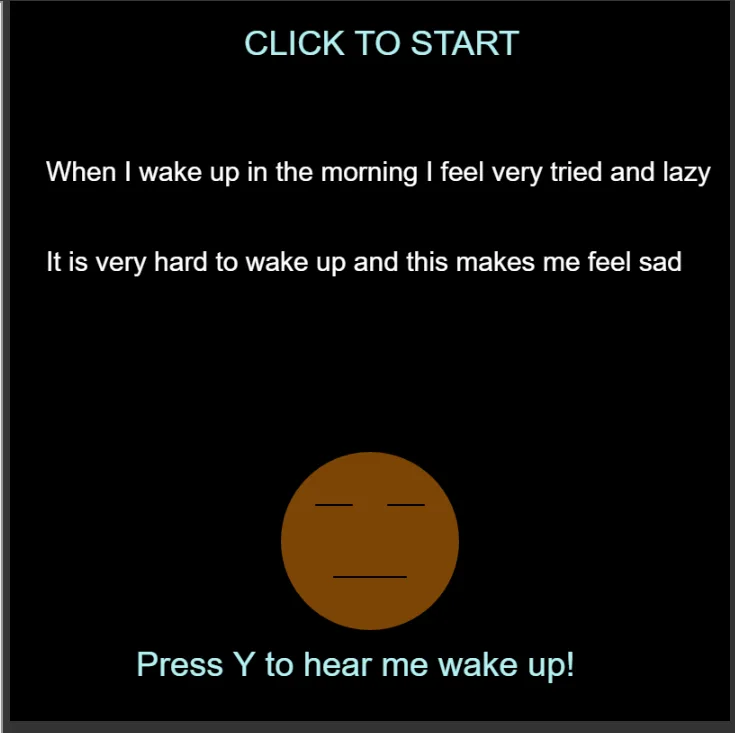
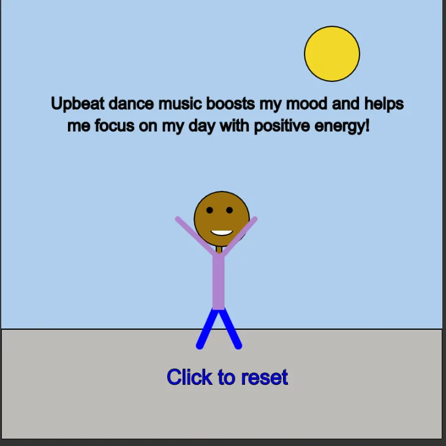
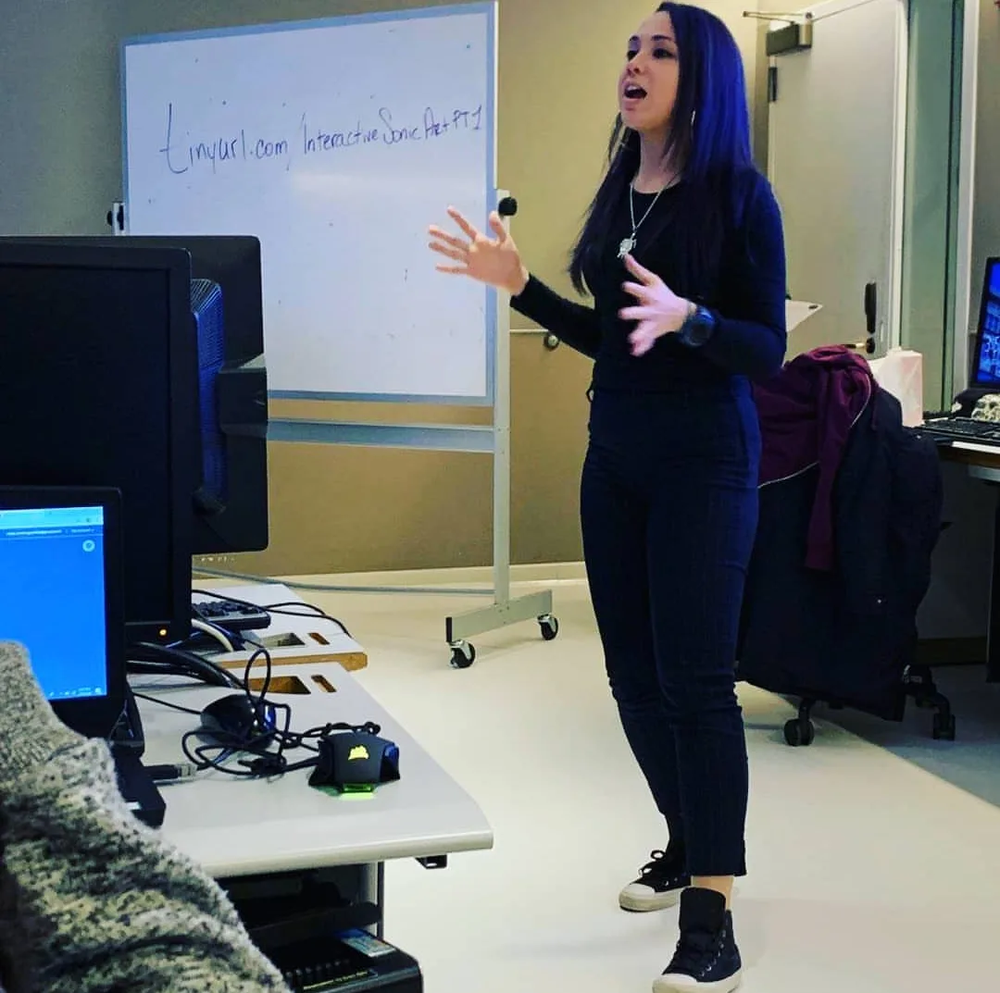

### Coding with Sound and Art for Middle-School Students

#### Interview with Layla Quinones, 2019 Teaching Fellow

---

The 2019 Processing Foundation Fellowships sponsored nine projects from around the world that expanded the p5.js and Processing softwares and nurtured their communities. This year, we collaborated with the New York City Department of Education’s CS4All Initiative, to support two Teaching Fellows, who are Computer Science teachers in the Software Engineering Program of New York City Public Schools. Here is the first interview with Teaching Fellow Layla Quinones, in conversation with Director of Advocacy Johanna Hedva.

---

*At the CS4ALL Computer Science Institute in NYC, Layla Quinones trained middle-school teachers to teach the Creative Web course, which uses p5.js to teach computational thinking to students. In this picture Layla is using Peblio to demonstrate how teachers can provide students with notes and tutorials for their p5.js projects.*

**JH: Hi Layla! You and Emily Fields are our 2019 Teaching Fellows. Both of you are Computer Science teachers in the Software Engineering Program of New York City Public Schools, and your fellowships are a collaboration with the New York City Department of Education’s CS4All Initiative.**

**Tell me what your fellowship set out to do, and how it involved working within the New York City public school system.**

**LQ**: Over the course of my fellowship I set out to write a curriculum, called “Interactive Sonic Art,” that teaches middle-school students how to create interactive web pages that combine art and sound. I wanted to provide teachers with the content to guide students through the process of learning [p5.js](https://p5js.org/), and to make this content accessible to teachers with limited computer science experience. More importantly, I wanted to give teachers the tools to help students create projects that could promote positive change in their communities. The tasks and activities in the curriculum are specifically geared towards inner-city students who have little to no access to creative coding.

In my experience with teaching computer science to middle-school students in New York City, I’ve learned that implementation requires an enormous amount of time and effort. This is in part due to the lack of resources, assessments, and content that is relevant to students from urban communities. There are an overwhelming number of teachers who have not been formally trained in computer science, but are brave enough to take on the daunting task of “learning as they go.” These teachers have to dedicate the time to teach themselves content, develop lessons around their understanding, and incorporate effective ways to assess students. While this work is admirable, these teachers are at a high risk of confusing their students with misconceptions, or allowing implicit bias to adversely affect classroom culture. When teachers lack the time and resources to develop a deeper understanding of computer science, their students suffer.

Teaching computer science takes more courage and dedication than other traditional STEM subjects because teachers are paving the way for the future of CS education. My goal was to provide teachers with the resources they need to take on this ambitious task, foster a deep understanding of CS, and an appreciation for using p5.js as a creative tool for personal expression as well as social change.

*A screenshot from the p5.js project students will be expected to complete for the mid-unit project in the Interactive Sonic Art curriculum.*

**JH: What did you accomplish during your fellowship?**

**LQ**: So far I have written over 10 hours of middle-school curricula, in which students develop interactive p5 projects that combine sound and visuals. This unit is aligned to the New York City Department of Education CS4ALL Blueprint concepts, perspectives, practices, and outcomes. Students begin by learning to load sounds into a p5.js sketch and control visuals on a canvas that depend on different sound states. Then students iterate their work using the engineering design process. Lastly, students are able to use their newfound programming knowledge to promote emotional wellness and develop positive coping strategies through sound and music.

In addition to the content, I’ve also provided scaffolds for teachers to use with middle-school students that meet the needs of diverse learning communities. This includes tools to visualize code, planning tools and protocols, worksheets to help drive discussion and deep thinking, and reference sheets and best practices. Embedded in each lesson are checkpoints that teachers can use to track student progress and target students who may need small group instruction or other interventions to grasp specific coding concepts.

I hope to expand on this curriculum by developing new activities for students to create digital art that responds to sound characteristics, like frequency and intensity. The curriculum will continue to reflect the Culturally Responsive Education framework (for more information [click here](http://www.nysed.gov/common/nysed/files/programs/crs/culturally-responsive-sustaining-education-framework.pdf)) by connecting with students’ interests and backgrounds, to help them create artifacts that address important issues within their communities, and develop prototypes to find solutions for social change.

*A screenshot from the p5.js project in the Interactive Sonic Art curriculum.*

**JH: What were some of the challenges that arose? How did you respond to them, and what did they teach you?**

**LQ**: Teaching middle-school students who have no experience with computer science is incredibly challenging. It’s particularly difficult to create a safe and judgement-free space for students to feel confident in taking risks and trying something outside their comfort zones. I approached this challenge by designing learning experiences that are relevant to students’ everyday lives. Most students struggle to find healthy ways to communicate and share their emotions, but by using classroom norms that acknowledge mental health, students feel emboldened to express both struggle and joy in the work they create. My experience has taught me that students thrive when they have a personal connection to the projects they make, and especially when they can bring awareness to issues they are passionate about. This is why I place personal experience and creative expression at the forefront of each lesson.

Another challenge I faced was creating scaffolds for differentiation in the classroom. As part of the resources included with this curriculum, I provided tools that teachers can use to reach a variety of learners (visual, aural, kinesthetic, etc.). I created opportunities for collaboration in every lesson so students can benefit from the perspective of their peers. Collaboration is essential so that the technology we create truly reflects the different types of people who use it.

**JH: Can you talk a little about the importance of innovative curriculum for computer science? Why is it necessary? What kind of impact will it have on students?**

**LQ**: Students from underrepresented populations have historically had minimal access to computer science education. This has tremendous implications for the future of the tech industry, and the development of technology that is ethical, inclusive and equitable. Having diverse voices and perspectives in the technology sector is critical to the future of our society. By providing students from underrepresented communities with a culturally responsive computer-science education, they will have the knowledge and agency to contribute to our technological landscape. Most curricula is not written with the inner-city student in mind: projects are not relevant to their lives and don’t draw from their life experiences, making it difficult for students to see the real-world applications of what they learn.

In addition, much CS curricula carries with it the implicit bias of the people who write it — people who are very different from the students we are trying to teach. This often leads to impostor syndrome in students, and we end up depriving the world of amazing programmers who quit the field because they feel like they don’t belong.

Providing students with CS instruction that addresses culturally relevant topics and socio-emotional wellness in their lives can have a lasting impact on the future of technology. Students can use programming as a tool to elevate their voices, tell their stories, and reach a global audience. This curriculum is an important step towards creating a more equitable world. We must foster a future where all experiences are valued and all people are considered valuable.

*Layla’s workshop at Processing Day in NYC introduced the community to the Interactive Sonic Art Curriculum, which is the curriculum she is currently completing this summer.*
