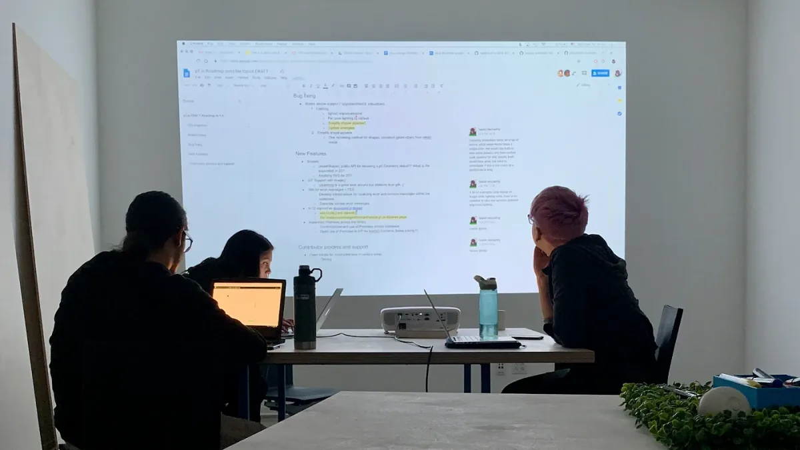
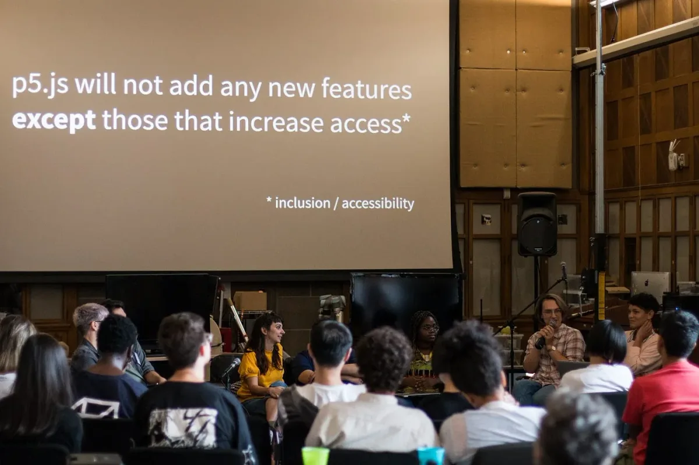
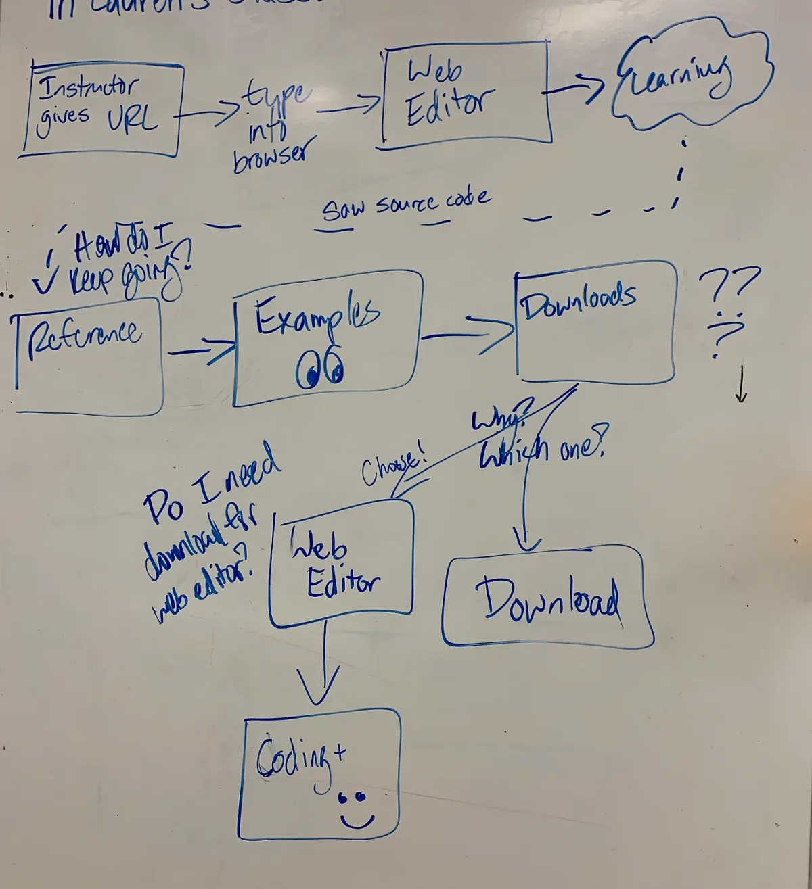

Alongside the larger community of p5.js contributors, they worked toward the 1.0 release of p5.js, which is happening this Saturday, February 29, 2020. The Processing Foundation p5.js Fellows were supported in part by a grant from the Mozilla Open Source Support program.

*Carlos Garcia, Kate Hollenbach, and Lauren McCarthy discussing potential work for the 1.0 release.*

**Johanna Hedva: Hello Evelyn! For 2019, you and Stalgia Grigg were our first-ever p5.js Fellows. You’ve been involved in p5.js for a while now, contributing to many different areas. Can you start us off with talking about what your Fellowship to-do list was? How did this grow out of the work you’d been involved with before? What did you set out to do, and what did you accomplish?**

**Evelyn Masso**: Hey Johanna! I’m so grateful to have been one of the p5.js Fellows for 2019. I knew Stalgia Grigg had already worked with the graphics part of the library, so I looked for technical changes I could make to the rest of p5.js’s structure and tooling that would make it easier to contribute to. I had some areas in mind, like the build process for p5.js, the documentation contribution workflow, and adding more internationalization tooling. I was also pretty excited to help out with the [ES6 transition](https://github.com/processing/p5.js/issues/3758) that the community had been talking about for some time. And there were some ideas I had for the automated testing that’s part of the p5.js project. I guess I had a lot of ideas, maybe too many.

Many of these came from my past experience teaching workshops with p5.js. In fact, my first experiences with p5.js were leading workshops about contributing to open source, where I helped participants make their first contribution to it.

Some of the ideas came from past conversations with other p5.js contributors. In the fall of 2018, a few contributors (Stalgia and myself included) got together with Lauren McCarthy to collect some ideas for what the 1.0 release of p5.js should include. Afterwards, our draft was [added to the p5.js GitHub page](https://github.com/processing/p5.js/issues/3418) for comment and revision from others. This draft included things like updating error messages around [new browser video autoplay policies](https://github.com/processing/p5.js/issues/3368), creating more documentation, and building infrastructure to support more [internationalization](https://github.com/processing/p5.js/issues/3390) within p5.js.

There’re a few things I accomplished that I’m particularly proud of. One was moving [p5.dom.js into the main p5.js library](https://github.com/processing/p5.js/pull/3922). Up until this year, it’s been an add-on that you have to include separately from the p5.js library itself. Originally p5.dom.js was experimental, but it’s fairly stable now, and I think most p5.js users don’t think of it as a separate entity. Moving it into p5.js “proper” simplifies the setup process for a p5 sketch and removes one more thing that could confuse a newcomer to p5.js. (Doing this also required some documentation revisions for the p5js.org websitte, which Lauren and Kenneth Lim also helped make.)

*Discussing a proposal from Evelyn Masso at the p5.js Contributor’s Conference.*

**JH: Last fall, you wrote a blog post called “[Aligning with Intention in Open Source](https://www.twilio.com/blog/aligning-intention-open-source),” that discusses how important intentions are to open-source projects. I found your insights so clarifying for thinking about how open-source projects arrive at different outcomes, and how, because of their intentions, they produce certain communities as much as products. Can you talk about this, and how it informed your Fellowship?**

**EM**: I think it’s important to start by saying I would not have written that blog post without my experience with p5.js and especially the [p5.js Contributors Conference](https://p5js.org/community/contributors-conference-2019.html) (which we’ll talk more about later). I would likely not even have been involved with p5.js in the first place if not for the [values behind the project](https://p5js.org/community/).

Reading back over the post, I think it’s really about the different values that the maintainers and contributors bring to their projects. Their values, what they prioritize in their work (and what they don’t), affect so much about how an open-source project operates and who contributes.

This informed how I approached working with other p5.js contributors on GitHub. Replying to bug reports and feature requests, reviewing code, and soliciting feedback are all parts of working on software, especially when it’s open source. The [GitHub Desktop](https://desktop.github.com) team (which I’ve been on for the last year and a half) has talked about this a lot. The difference between replying to a bug report with a couple diagnostic questions compared to replying by acknowledging the reporter’s experience, asking how it affected them or their work, and *then* asking a couple diagnostic questions. The second takes longer to write but it feels a lot less transactional and a lot more human, something I think the p5.js community values.

It also meant I asked myself what it would look like if I were to make p5.js more approachable? What are the biggest barriers to contributing to p5.js? What are the biggest barriers to making your first project with p5.js? While these questions might seem straightforward, they aren’t. What’s difficult for me is often different than what’s difficult for potential contributors to p5.js, because we usually have different relationships and past experiences with software.

*A flow diagram of one student’s experience starting a p5.js project. \[Image description: Flow diagram shows the following steps in sequence: 1, Instructor Gives URL; 2, Types into browser; 3, Web Editor; 4, Learning; 5, Saw source code; 6, How do I keep going? 7, Reference; 8, Look at examples; 9, Downloads; 10, Which one? Do I need to download for the web editor; 11, After this, there are two options: web editor and coding, or just download.\]*

**JH: You participated in the 2019 p5.js Contributors Conference and ran the** [p5.js Approachability Lab at UCLA](https://docs.google.com/document/d/1DRsCeqEY1ZM6BADtln8Rc71KMOtr_icQD_dW4w4Fj6Y)**. Can you talk about how important IRL meetings and building personal networks are in open source work?**

**EM**: My favorite parts of this fellowship were the things I did IRL. Many of the Approachability Lab participants told me they wouldn’t have gotten involved in open source (or contributing to p5.js, for that matter) without a personal connection to someone already working on the project. This was true for me, too. I first got involved in p5.js largely because I had met people in other parts of the Processing community who also worked on or with p5.js. It takes time to build new working relationships, but being in person (even just occasionally) usually builds rapport more quickly than only communicating online.

At the p5.js Contributors Conference in Pittsburgh last year, I met many people IRL for the first time after seeing their work online for months (or years!). I found it much easier to get a feel for their personalities and attitudes which led to many new conversations. In the p5.js Approachability Lab, I felt better able to grasp others’ workflows and fill in gaps in documentation after working with the participants in person. There was so much learning for myself and the participants that wouldn’t have happened otherwise.

Working in open source is just another way to work with other people. Although arranging IRL meetups takes more effort (and usually some more funding), it creates valuable opportunities for relationship building and communication. Those opportunities can speed up the work, but they can also transform it in ways we can’t see until afterwards.
