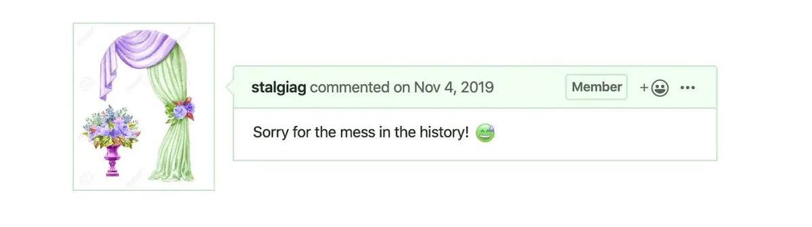
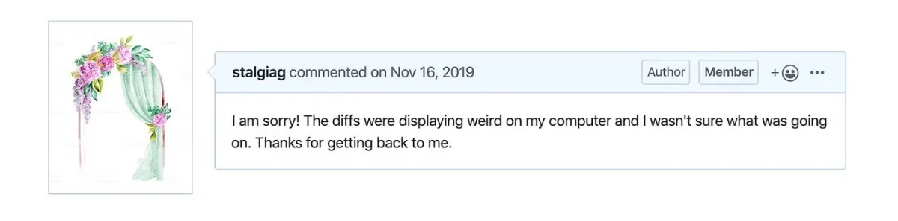
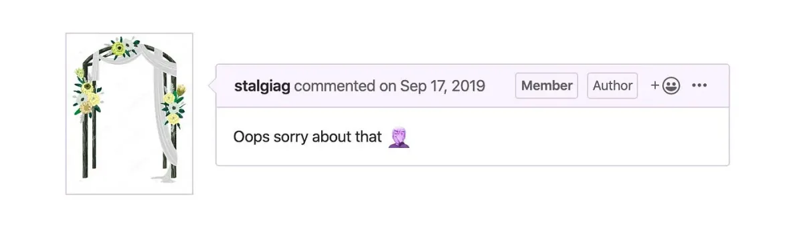
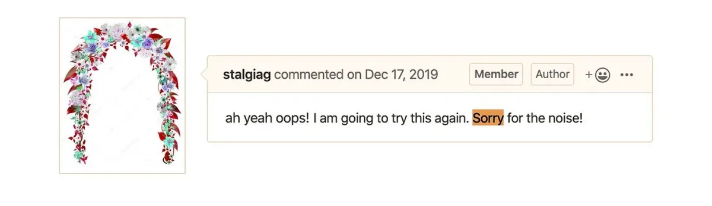

*Alongside the larger community of p5.js contributors, they worked toward the 1.0 release of p5.js, which is happening this Saturday, February 29, 2020. The Processing Foundation p5.js Fellows were supported in part by a grant from the Mozilla Open Source Support program.*

*A screenshot of an apology for a mistake. I had merged a pull request incorrectly and needed to revert the changes. This puts a confusing stutter step in the commit history.*

**Johanna Hedva**: **Hello Stalgia! In 2019, you and Evelyn Masso were our first-ever p5.js Fellows. You’ve been involved in the p5.js community for a while now, and your Fellowship was focused on WebGL stability improvements, expanding developer documentation, and creating new channels of communication for contributors. Can you tell us a little about where your Fellowship work began? What did you set out to do?**

**Stalgia Grigg**: The Fellowship began with a bunch of fundamental questions about leadership, maintenance, and open source. Lauren, Evelyn, and I spent a lot of time discussing the experience of contributing to the library. This brought up a bunch of really interesting questions about how open-source communities are formed and how they change over time. I spent a lot of time thinking about who feels welcomed as a contributor, and who feels empowered to make important decisions about the future of the library.

To answer these questions, I started the Fellowship with research into existing models for governance and maintenance in open source. For me, this was a way to set the stage, to foreground and emphasize the more abstract goals. This process allowed me to gain some clarity about guiding principles, and to sketch a fuzzy, irresolute end-goal. This became crucial to the whole experience because, in many ways, my daily activities as a maintainer and Fellow were much the same as any contributor. I would suggest new features, investigate bug reports, encourage new contributors, seek out help from others, but I was always working with these longterm goals in mind.

*A screenshot of an apology for accidentally merging a pull request without understanding the changes that were made. I then made the mistake of thinking the merge request was from a bot when it wasn’t. \*smh\**

**JH: Now that the Fellowship has been completed, can you tell us what you accomplished?**

**SG**: Well, first and foremost, I learned a lot and I did so publicly (see images 1–4). Along the way, I got to develop a bunch of exciting new features for the 1.0 release, including animated GIF support, expanded device support and improved performance for WEBGL mode, erasing features, new blend mode options, and methods for working with local storage. I also had the opportunity to host a live contributor discussion. The conversation during that led me to rethink how the “contributor docs” could be displayed, which opened up the opportunity for others to translate these documents that are often the first point of reference for new contributors.

*A screenshot for an apology for when I mistyped the name of another contributor and tagged a stranger instead.*

**JH: I’m interested to know your thoughts on open-source contribution, in general. What’s it like to operate as a maintainer of a project?**

**SG**: There is a term in biology, “autopoiesis,” which describes a system that reproduces the conditions of its own reproduction, a kind of self-regulating, generative, sustainable system. Free, libre, open-source (F.L.O.S.S) projects often hold this up as an ideal — that the project maintains and regulates itself. These are conditions that F.L.O.S.S. has a lot of success in creating; autopoiesis can be useful as a way of orienting desires for a project, of determining where to focus attention. However, the reality is that a project often needs a less organic and more directed form of stewardship to achieve and sustain this self-propelled state. This is where maintainers are vital.

I have interacted with p5 from many different angles, as a user of the library, as a nervous first-time commenter on an issue, as an empowered bug fixer, as a maintainer, and now as a collaborative project leader. This has taught me that each of these roles has a different set of conditions for success and sustainability.

Maintainers are responsible for many things, and experimenting with the community culture and contributor experience might be the most important. My approach to this was to investigate the division between investment styles among contributors and try to make the boundaries between roles and responsibilities more fluid. This meant asking why someone might feel comfortable reporting a bug but may feel less comfortable taking a shot at fixing it.

Even more importantly, how do we get more of the community of contributors to feel empowered to offer their opinion on the bigger questions about the design and development of the project? Lead maintainers often need to have in mind more distant ambitions for a project, something that other kinds of contributors can feel is outside the reach of their influence. As a maintainer, I felt personally invested in shifting this, so I worked to make the decision-making and governance processes as transparent as possible for the repo.

I am really excited about the future of the p5.js project, [with Lauren McCarthy stepping down as lead](https://medium.com/processing-foundation/making-space-for-the-future-of-p5-js-d3c6bd3da9ac) as of this month. I think that one really big part of this excitement is the push towards expanding the number of users that feel a sense of ownership over the project. I am excited by the promise of a future in which everyone who interacts with p5 becomes a contributor of sorts. I am excited by the prospect of p5 offering learning opportunities at every stage. I believe that the ecosystem of learning support that p5 provides can extend to aspiring maintainers as much as it does new coders.

*A screenshot for an apology for when I added an automated behavior on the repository that was behaving incorrectly and spamming all of the issues with incorrect labels.*

**JH: What groundwork did you lay with your Fellowship that can now be built upon? What’s still left to do?**

**SG**: Evelyn and I began to sketch out the role of rotating project leads by operating as just that. This will matter a lot moving forward as the project continues to develop a sense of shared leadership. Hopefully, others will see that one of the best ways to care for the project is to voice their opinions and build up a supportive culture that encourages others to do the same. It would be amazing if more support systems for voting on project development were built.

I think that the best possible outcome of my experience as a Fellow, and collaborative project lead, would be a sense that there are meaningful pathways between different roles and responsibilities within a FLOSS project, and that the accessibility and visibility of these pathways should be cultivated and tended to. I like to think of these pathways as omnidirectional, between the roles of user, lurker, contributor, maintainer, teacher, student, coder, and artist. Of course, I hope that others will work to render the boundaries between these roles more fluid for themselves.
