The Processing Foundation Fellowship Program began informally in 2013, by supporting community members in self-initiated exploratory projects. 2018 marks the Fellowship Program’s third year of being open to the public, and this year we received 138 applications from 27 different countries on six continents. Fellowships support artists, coders, and collectives in visionary projects that conceive a new direction for what Processing as a software and a community can do, and are an integral part of the Foundation’s work toward developing tools of empowerment and access at the convergence of art and technology. This year we are grateful for the support of [Tom Carden](https://twitter.com/@randometc) and [Christi Weindorf](https://twitter.com/@cweindorf), who generously donated to the Fellowship Program.

*We are excited to introduce the eight fellowship projects that comprise our 2018 cohort!*

---

#### [Vijith Assar](https://www.vijithassar.com/)

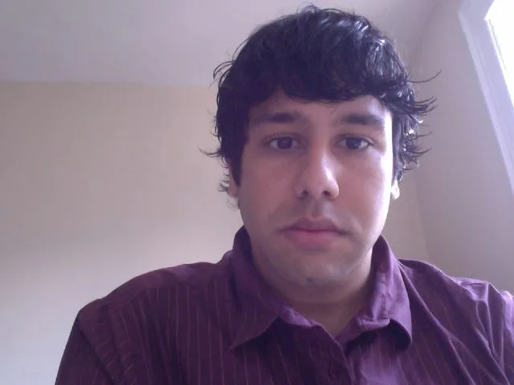

*[Vijith Assar](https://www.vijithassar.com) is a software engineer and writer. He is interested in the structures and processes that shape graphics, music, code, and words, and often tries to find ways to connect those fields.*

Vijith will treat the [p5.js](https://p5js.org/) code repository as an editorial project, working on internal developer-facing documentation of the architecture and guiding principles in order to help future open source contributors.

The p5.js reference manual is thorough, but it is also primarily aimed at users, which still leaves a barrier to entry for developers interested in contributing to the p5.js core. To help with the latter, Vijith will work on a set of complementary developer-facing documentation materials covering the architecture and guiding principles of p5.js, spread across a combination of the repository, wiki, code comments, and other sources. Developing clearer explanatory materials should make it easier for interested developers to understand the software and subsequently start contributing. This can help speed up the pace of development and invite a more diverse base of contributors.

*It’s difficult for one image to capture the concept of software documentation. Architectural blueprints are a start. \[Image description: Closeup of an architectural blueprint.\]*

Vijith will be mentored by [Lauren McCarthy](http://lauren-mccarthy.com/).

[Lauren McCarthy](http://lauren-mccarthy.com/) is an artist based in Los Angeles whose work explores social and technological systems for being a person and interacting with other people. She makes software, performances, videos, and other things on the internet, and is the creator of p5.js. She is an Assistant Professor at UCLA Design Media Arts. She is a Sundance Institute Fellow and was previously a resident at CMU STUDIO for Creative Inquiry, Eyebeam, Autodesk, NYU ITP, and Ars Electronica / QUT TRANSMIT³.

### [George Boateng](https://www.linkedin.com/in/georgegboateng/)

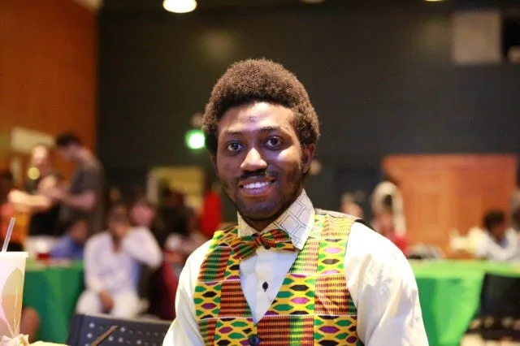

*[George Boateng](https://www.linkedin.com/in/georgegboateng/) is a scientist, engineer, and educator from Ghana. He is an incoming PhD student at ETH Zurich, Switzerland, and currently works as a Research Scientist at Dartmouth’s Computer Science department. George is a cofounder and president of [Nsesa Foundation](https://nsesafoundation.org/), an educational nonprofit whose vision is to spur an “innovation revolution” in Africa. He has a B.A. in Computer Science, and an M.S. in Computer Engineering from Dartmouth College.*

George’s project is a pilot of [Nsesa Foundation](https://nsesafoundation.org/)’s ambitious program SuaCode, an online course to teach millions across Africa how to code via smartphones. This project aims to take advantage of the proliferation of smartphones to address Africa’s digital gap by introducing high school and college students in Ghana to programming using the Processing language.

In this project, George plans to develop a coding curriculum based on the Processing programming language, and then deliver it through a pilot program to 30 high school and college students, who have no programming experience, living in different parts of Ghana. The programming course will introduce students to core programming concepts in a visual and fun way through game development. Curriculum will be delivered as an online course primarily through smartphones and also computers via the free learning management system, Google Classroom. Students can code up the assignments using the Processing desktop app (for students using computers) and various mobile-based Processing apps such as APDE (for Android) and Processing iCompiler (for iOS). Students will submit assignments for grading and feedback as they go through the course. The course duration will be about 10–14 hours total. At the end of the course, students will have developed core programming skills and built a game in the process.

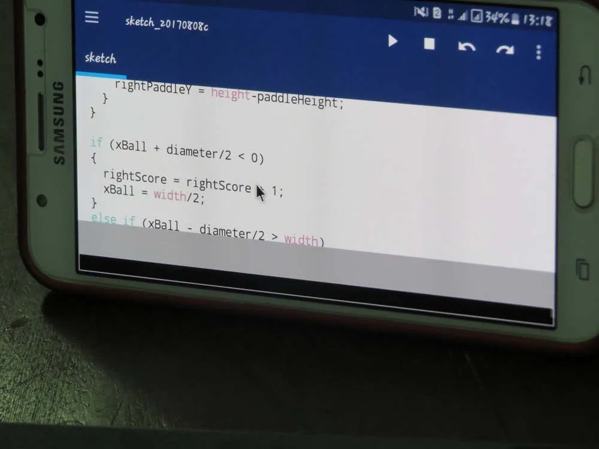

*Curriculum for learning to code on smartphones addresses a specific audience and aims to meet their needs. \[Image description: Closeup of code being written on a Samsung smartphone.\]*

George will be mentored by [Niklas Peters](http://www.niklaspeters.com/), and advised by [Daniel Shiffman](http://shiffman.net/).

[Niklas Peters](http://www.niklaspeters.com/) is a visual artist and educator based in Johannesburg, South Africa. He is currently developing and managing a year-long coding program at Umuzi, a nonprofit that prepares young South Africans for careers in the creative industry. For [his 2017 Processing Fellowship](https://medium.com/processing-foundation/anyone-can-code-a-creative-coding-curriculum-for-students-with-low-computer-literacy-69e121149abc), he piloted a creative coding curriculum for students with low computer literacy.

[Daniel Shiffman](http://shiffman.net/) is an Associate Arts Professor at the Interactive Telecommunications Program at NYU’s Tisch School of the Arts. He is a director of The Processing Foundation and develops tutorials, examples, and libraries for Processing and p5.js. He is the author of *Learning Processing: A Beginner’s Guide to Programming Images, Animation, and Interaction* and *The Nature of Code* (self-published via Kickstarter), an open source book about simulating natural phenomenon in Processing. He can be found talking [incessantly in online coding videos](http://youtube.com/thecodingtrain/).

#### [Mathura Govindarajan](http://mathuramg.com) **and** [Luis Morales-Navarro](http://lm-n.com)

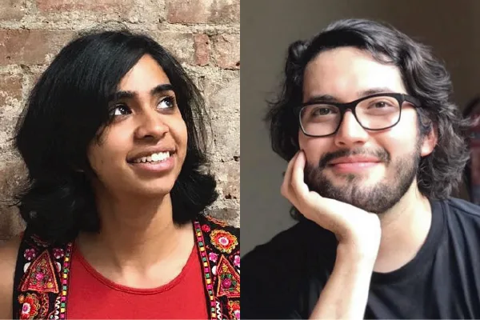

*[Mathura Govindarajan](https://mathuramg.com/) (left) is a software engineer and creative technologist. She is a graduate and currently a research resident of the Interactive Telecommunications Program at NYU. Her current work involves combining storytelling and technology to create educational experiences and tools for children and adults. [Luis Morales-Navarro](https://lm-n.com/) (right) is interested in the intersection of learning, natural languages, programming languages, physical computing, and literature. He is passionate about making learning programming languages more accessible and thinking through the relationship between writing and coding. Luis is a fellow in Interactive Media Arts at NYU Shanghai.*

p5-accessibility aims to make p5 and its community more accessible to people who are blind and visually impaired through the adaptation, development, and implementation of tutorials, documentation, and learning resources; maintenance of the accessibility features of [editor.p5js.org](http://editor.p5js.org/); and the development of a p5 accessibility library.

For the past year and a half Mathura and Luis have added features to the p5.js web editor that has made it inclusive to people with visual impairments. This resulted in the creation of the libraries, [p5-accessibility](https://github.com/mathuramg/p5-accessibility) and [colornamer](https://www.npmjs.com/package/colornamer). During the next few months the fellows will fully incorporate these libraries to the p5.js widget and p5.js web editor to increase their accessibility. At the same time they will work on developing accessible learning materials and ensuring that the p5.js documentation is fully accessible.

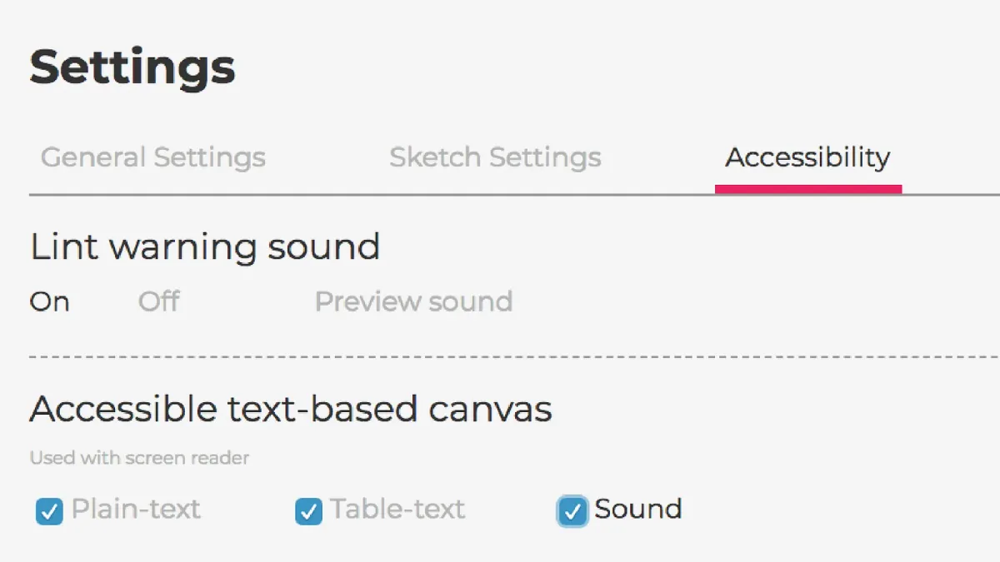

*Screenshot of the accessibility settings of the p5.js web editor. These settings include lint warning sounds, text, and table-text outputs for screen readers, and sound output.*

This fellowship continues the Processing Accessibility Project started by [Claire Kearney-Volpe](http://www.takinglifeseriously.com/index.html) during her 2016 Processing Foundation Fellowship. Mathura and Luis will be mentored by Claire, and advised by [Johanna Hedva](http://johannahedva.com/).

[Claire Kearney-Volpe](http://www.takinglifeseriously.com/index.html) is an art therapist, designer, and researcher interested in human factors in programming curricula, and inclusive design. She is a graduate of NYU’s Interactive Telecommunications Program, the manager of the NYU Ability Project, and a doctoral candidate in NYU’s Rehab Sciences Program.

[Johanna Hedva](http://johannahedva.com/) is the Director of Advocacy of the Processing Foundation, and the author of the novel, [On Hell](http://onhell.website/). Their ongoing project on ableism, [This Earth, Our Hospital](http://johannahedva.com/hospital.html)*,* includes the essays [Sick Woman Theory](http://www.maskmagazine.com/not-again/struggle/sick-woman-theory), [In Defense of De-persons](http://gutsmagazine.ca/in/), and [Letter to a Young Doctor](https://www.canopycanopycanopy.com/contents/letter-to-a-young-doctor/#title-page).

#### [Saber Khan](https://medium.com/@ed_saber)

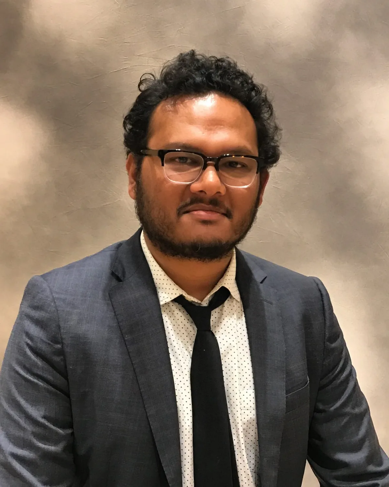

*[Saber Khan](https://medium.com/@ed_saber) is a veteran K12 educator with fifteen years of teaching experience in public, private, and charter schools. He organizes the Creative Coding Festival, [CC Fest](https://ccfest.rocks/), a free and inclusive creative coding event for K12 students and teachers. And he leads the #ethicalCS project, a collaborative project to build ethically minded Computer Science educational resources.*

Saber’s fellowship project is to develop an Education Outreach Manager Role at Processing Foundation. The goal of the role is to support Processing Foundation’s engagement with K12 educators. Saber will create an online community for teachers, publish curriculum on Processing Foundation website, and manage relationships with K12 educators, and bring CC Fest to more students and teachers.

With the growth of CSforAll, there is a large demand for tools and curricula that students and teachers can use. Currently, most of the available curricula are offered either from for-profit ed-tech startups or nonprofits backed by the technology sector. This has led the development of a CSforAll movement that has inherited the biases of the industry, while it tries to solve challenges around equity, access, and power. Processing Foundation and the community of educators around it are well poised to help build an independent K12 CS community and movement that takes seriously questions of ethics, identity, and creativity. The community has a large group of committed educators, a commitment to diversity and inclusion, and a critical perspective on biases and its impact on the marginalized. An Education Outreach Manager can help coordinate this effort to build better CS education for K12 students and teachers.

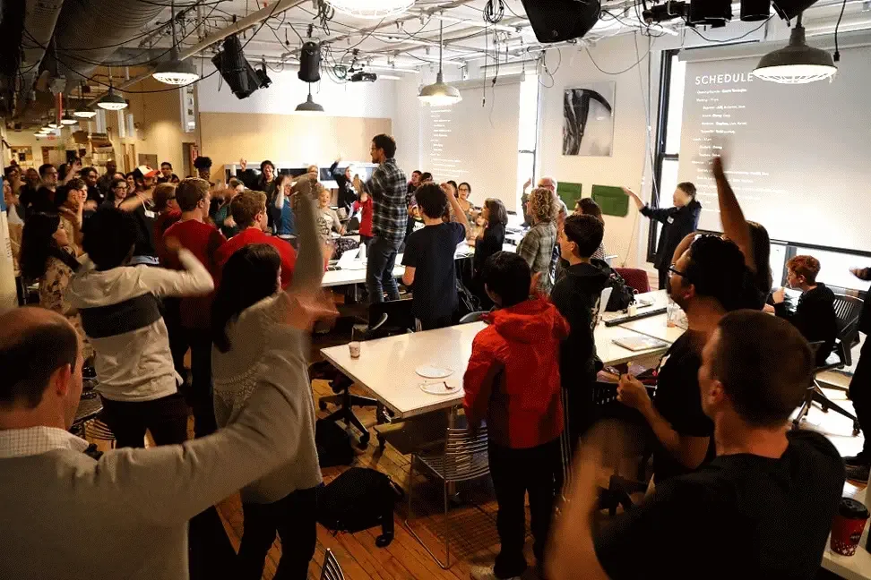

*A stretching game at CC Fest at NYU ITP on November 12, 2017. \[Image description: A GIF of a classroom of people raising their arms and moving their legs.\]*

Saber will begin by sharing existing p5.js and Processing curriculum on the Processing Foundation website, create an online community for educators on Twitter and elsewhere, organize in-person events like CC Fests, and manage relationships with K12 educators.

Saber will be mentored by [Daniel Shiffman](http://shiffman.net/).

#### [Kenneth Lim](https://designerken.be/designing)

*[Kenneth Lim](https://designerken.be/designing) is an interaction designer from Malaysia. He is interested in language, culture, and human/machine interactions. His work often touches on the nonsensical and looks into how things can or cannot be translated between languages and mediums. He likes to play video games but often can’t find the time.*

Kenneth’s fellowship project aims to provide a translation of the p5.js website and documentation into Chinese, breaking down the language barrier to learning to code, and providing a starting point to maintain said translation.

Rather than trying to include people while expecting them to know English, an inclusive and diverse community should speak multiple languages. It’s a bit of a stretch to expect people to understand many languages but it is entirely possible to have softwares speak multiple languages, once the effort is put in to make it so. The hope is that this project will eventually lead to many more translation efforts.

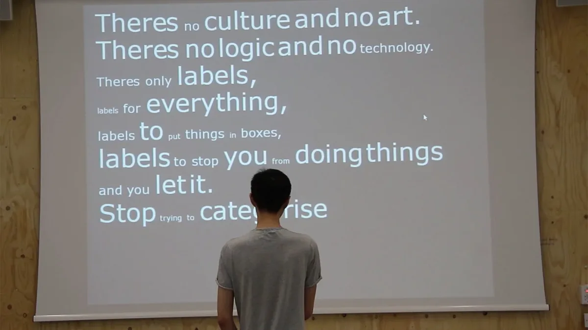

*A reading of “Cultural Computing Manifesto,” a piece by Kenneth Lim, a manifesto about not being limited by labels you or others put on you and be what you want to be. \[Image description: A person faces a projection of white text on black background. The text reads: “Theres no culture and no art. Theres no logic and no technology. Theres only labels, labels for everything, labels to put things in boxes, labels to stop you from doing things and you let it. Stop trying to categorise.”\]*

Kenneth will be mentored by [Xin-Xin](https://xin-xin.info/), and advised by [Lauren McCarthy](http://lauren-mccarthy.com/).

[Xin Xin](https://xin-xin.info/) is an interdisciplinary artist and educator working at the intersection of technology, labor, and identity. Xin co-founded The School of Otherness, which seeks to empower marginalized identities through storytelling, forums, and workshops that process experiences of the other. They initiated voidLab, an intersectional feminist collective exploring art, technology, and society. Their work has been exhibited at Ars Electronica, the Hammer Museum, Gene Siskel Film Center, and Machine Project. Xin holds an MFA from UCLA Design Media Arts. They have given numerous talks at universities and currently teach new media art at Loyola Marymount University.

#### [Ari Melenciano](https://www.ariciano.com/)

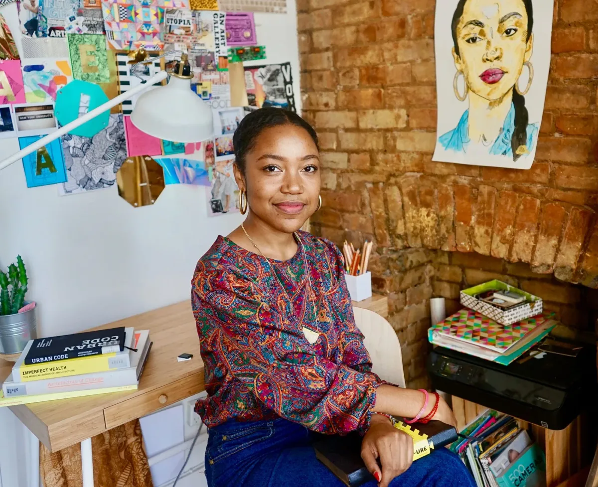

*[Ari Melenciano](https://www.ariciano.com/) is a Brooklyn-based artist, designer, creative technologist, and [DJ](http://gvo.fm). She is currently a graduate student at NYU’s Interactive Telecommunications program, using her thesis to build an experimental neo-retro camera company called [Ojo Oro](http://www.ariciano.com/ojooro). She is also the founder and producer of [Afrotectopia](http://www.afrotectopia.com/), a new media arts, culture, and technology festival.*

Justice Factory is an interactive data visualization tool that highlights social justice issues and human rights violations, with the intention to serve as a tool to advance the fights of activists.

Ari has always believed that data visualizations are a language of the oppressed: she recognizes the power of data, particularly the transformation of data being turned into easily digestible forms of information and its potential to reflect the truth. Through interaction with data visualizations, the arguments of activists are advanced, the awareness of the general public is increased, and the oppressed are able to more easily identify that the injustices they are facing have a name, commonly experienced by others, and are part of a system, not just coincidental. Justice Factory is a library of design-centric, engaging, and interactive data visualization templates built with Processing.

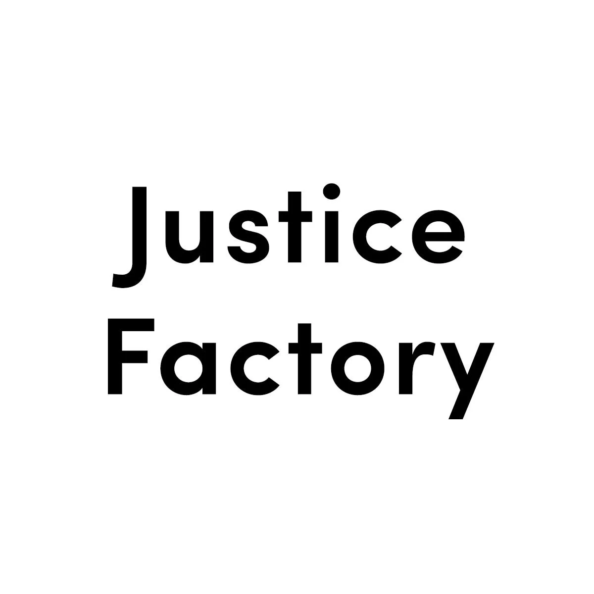

*\[Image description: Black text on white background. The text reads, “Justice Factory.”\]*

Ari will be mentored by Jen Kagan, and advised by [Daniel Shiffman](http://shiffman.net/).

Jen Kagan is a programmer, writer, and teacher. As a tech fellow at Coworker.org, she’s helping build infrastructure for a 21st-century labor movement. She’s also a research resident at NYU ITP. Outside of work, Jen is studying up on racial capitalism and interviewing open source contributors about what “open source” even means.

#### **Kaitlyn M. O’Bryan, Kate Lockwood, and Thomas J. Reinartz, Jr.**

*Kaitie O’Bryan (left) has degrees in mathematics, studio art, and mathematics education. She is a Knowles Science Fellow and co-facilitates workshops for Computer Science Principles teachers with Code.org. As a classroom teacher, Kaitie is dedicated to increasing opportunities for students to engage in collaborative and creative problem solving. Kate Lockwood (center) is the director of computer science and engineering at St. Paul Academy and Summit School, and an independent K-12 school. She teaches a variety of high school computer science courses and coaches FTC robotics. After earning a French degree in college, Tom Reinartz (right) led cross-country adventure camping trips throughout North America for French tourists. Today, he has a PhD in Instructional Technology from the University of Minnesota, and has been teaching for 23 years at Rosemount High School including courses in computer science and English.*

Kaitlyn, Kate, and Thomas are creating four chapters of an open-source, project-based textbook using Processing to deliver Advanced Placement-Computer Science A (APCS-A) material.

The APCS-A course covers a subset of the Java programming language, which can be difficult for students to engage with. Processing can support a wider range of students in understanding the content, allowing teachers to address the same course objectives. This project will create four chapters of an open-source, project-based textbook in Processing that is aligned with the APCS-A outcomes. This textbook will be released on GitHub with the end goal to create a community-supported APCS-A curriculum in Processing that is perhaps more accessible and engaging to a wider variety of students.

Each chapter will center around an open-ended project in Processing that aligns with APCS-A objectives. Along with the projects, we will provide high-level teacher lesson plans that provide: outcomes for the lesson, alignment with APCS-A objectives, project rubrics, and links to additional resources.

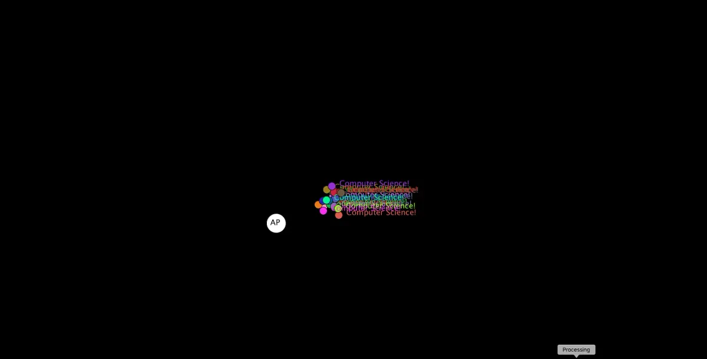

*Toward project-based learning: building bridges between “AP” and computer science with Processing. \[Image description: black background with multi-colored text, clustered in a group in the center of the image.\]*

Kaitlyn, Kate, and Thomas will be mentored by [Casey Reas](http://caesuras.net/).

[Casey Reas](http://caesuras.net/) is an artist and educator who lives in Los Angeles. His software, prints, and installations have been featured in numerous solo and group exhibitions at museums and galleries in the United States, Europe, and Asia. His work varies from small works on paper to building-scale software installations and he balances solo work in the studio with collaborations with architects and musicians. Reas is a professor at the University of California, Los Angeles. He holds a masters degree from the Massachusetts Institute of Technology in Media Arts and Sciences as well as a bachelors degree from the College of Design, Architecture, Art, and Planning at the University of Cincinnati. With Ben Fry, Reas initiated Processing in 2001.

#### [Kirit Tanna](http://kirittanna.com/)

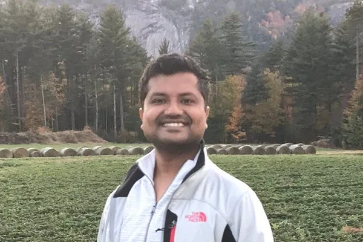

*Namaste! [I’m a creative coder](http://kirittanna.com) and have been involved in crafting digital experiences that blend art and technology. I’ve worked with digital agencies across the globe building web experiences, adver-games, interactive exhibits, and mobile apps. In my free time, I enjoy tinkering with new technology, developing tiny experiments to explore ideas that amuse me. Besides this, I love to swim, hike, tour, read, and listen to various discourses about science and spirituality.*

Kirit’s fellowship project is to upgrade and enhance the overall user-experience on the [processing.org](http://processing.org/) website and its offshoots to be consistent, responsive, accessible, and forward-looking. This will enable users to explore the wealth of information on these websites. In addition, the website will accept contributions from the community to support its growth as a platform and serve as a source of inspiration to its users.

Planned upgrades will affect: blog, news, and social integration; reference and examples; support forums; exhibition; publications; and the shop. Design elements will focus on responsive design so as to access the site via mobile devices, thus improving overall accessibility; improving content visibility, social/community features, and overall loading time; and developing a style guide and listing UI components required across the site.

*Updating processing.org will allow for better functionality on multiple devices. \[Image description: Rendering of the Processing logo on a desktop, laptop, tablet, and phone.\]*

Kirit will be mentored by [Scott Murray](http://alignedleft.com/), with [Casey Reas](http://caesuras.net/) as Advisor.

[Scott Murray](http://alignedleft.com/) is a designer who writes software to create data visualizations and other interactive phenomena. His work incorporates elements of interaction design, systems design, and generative art. Scott is in the Learning Group at O’Reilly Media, is author of the O’Reilly title *Interactive Data Visualization for the Web* (now in its second edition), and has taught data visualization and interaction design.

---

*We look forward to sharing with you what the 2018 Fellows are working on and what they will accomplish with their fellowship projects.*
