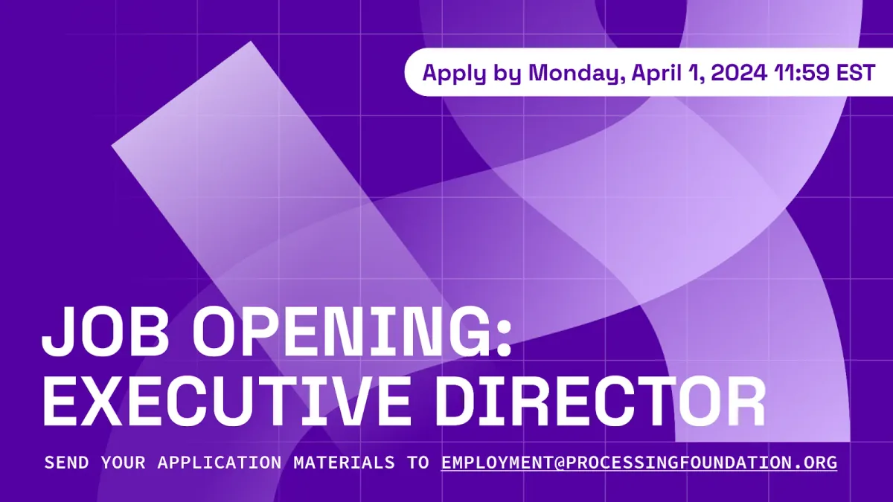

*Processing Foundation Executive Director Job Opening Banner*

We are looking for a leader who will help us envision the next chapter of the organization as we imagine new levels of support for our core software projects (p5.js and Processing Java) and public programming, including our annual fellowship program. The Executive Director will shape our strategic vision, lead financial management and fundraising initiatives, and represent our community. They are supported by four staff, including the Senior Director of Outreach and Partnerships, Program Manager, Finance Manager, and the Program and Communications Coordinator, as well as three project leads for Processing, p5.js, and the p5.js web editor.

The Processing Foundation is a non-profit organization founded in 2014, [a 501(c)(3) public charity](https://projects.propublica.org/nonprofits/organizations/460830259), that supports the development and dissemination of software tools to facilitate programming education and creative coding, supported by a vibrant ecosystem of contributors, users, educators, and enthusiasts. The Foundation grew from the Processing project, which started in 2001. In 2021, the Foundation received [unprecedented support from its community](https://medium.com/processing-foundation/processing-foundation-funding-update-94cddb25a3d9), marking the beginning of an exciting new chapter for the organization.

**You can find the** [full job description here, on our website](https://processingfoundation.org/employment)**.** Learn more about the organization’s work on our [Processing Foundation website](https://processingfoundation.org) and our impact on our [Impact Report](https://processingfoundation.report). If you have any questions regarding the application, please send them to [employment@processingfoundation.org](mailto:employment@processingfoundation.org).
