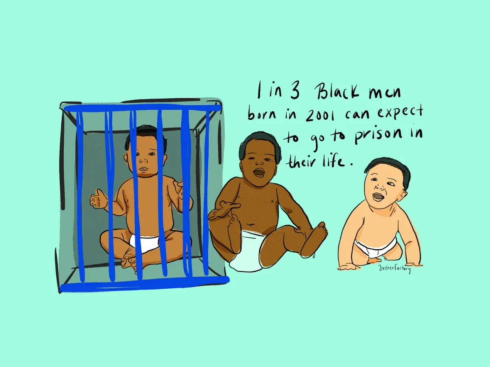
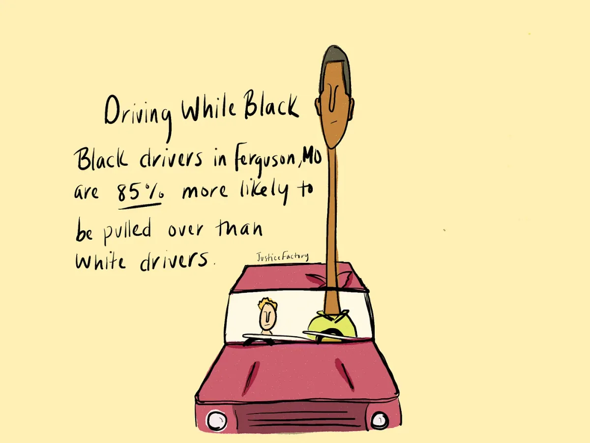
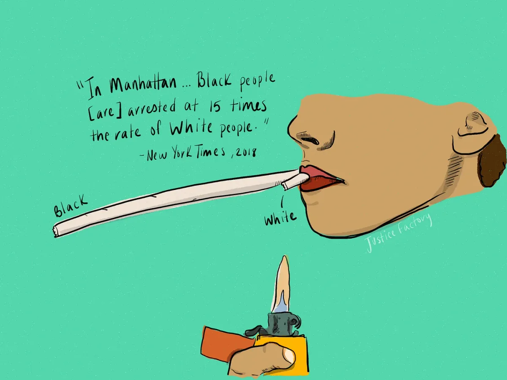

2018 Processing Foundation Fellow

---

*The 2018 Processing Foundation Fellowships sponsored* [*eight projects*](https://medium.com/processing-foundation/introducing-the-2018-processing-foundation-fellows-a16ae4e87f80) *from around the world that expanded the p5.js and Processing softwares and their communities. Fellows developed work ranging from Chinese translation of the p5.js website, to workshops that teach smartphone coding in Ghana. During the coming weeks, we’ll post articles written by the fellows and interviews with them, in conversation with Director of Advocacy Johanna Hedva, that showcase and document the great work by this year’s cohort.*

---

*One in three Black men born in 2001 can expect to go to prison in their lifetime, according to the Sentencing Project. This statistic raises a huge concern in the welfare of Black people as they grow older, and the racial disparities that are plaguing the criminal justice system. \[image description: An illustration of three Black babies and one is within a jail cell — representing how one in three Black men born in 2001 can expect to go to prison in their life, according to the Sentencing Project.\]*

**Johanna Hedva**: Let’s begin with a description of your fellowship project. What did you set out to do, and what did you accomplish during your working period?

**Ari Melenciano**: For my Processing Foundation Fellowship, I proposed Justice Factory, a project that I’d already been developing for a few months. Justice Factory was meant to be a data visualization platform that highlighted human rights violations and social justice issues. I began by wanting to develop a library for building data visualizations using p5.js. This library would function as a tool for activists to build their own visualizations. This would allow more activists to back their arguments with statistics translated to visuals that could be easily understood. I wanted to use p5.js as a platform because it has a much smaller learning curve.

During my research process, however, my goal in how to approach data visualizations changed multiple times. Though creating data visualizations to disseminate social justice issues remained a priority the entire time, I often questioned who I wanted the audience to be, and what purpose the visualizations would serve for those viewing them.

I then transitioned to exploring how to build empathy with data visualizations; at the time, I felt that the opportunity to educate people on social justice issues to make them better understand the marginalizations of different communities would be most vital in developing systemic change. Discovering how to possibly build empathy within data visualizations took a few weeks of practice and research, and I never felt that I was able to successfully design visualizations that evoked empathy. Or at least from my visceral metric, I didn’t feel like the visuals were telling a big enough story, in a gravitative way. It’s hard to describe, but it didn’t feel as successful as I would have liked.

As I continued researching different social justice issues, I realized it wasn’t a matter of building empathy or making the issues more known to the general public, because the data is already out there and very easy to find. So, I pivoted and began to focus on how to infuse culture into these visualizations — how to use aspects of Black culture as the visualization’s icons and metric units, and how to make them reach people exactly where they already are, whether they’re online or specific social media platforms. That’s where I am currently. My visualizations are illustrations that represent a highlighted issue by using aspects of culture as measuring tools. For example, I have one about pedestrian traffic, so I used specific shoes as the metric guide — the longer the shoe, the higher the number. They also incorporate interactivity to allow more information to be revealed through mouse placement.

**JH**: I’m very interested in what you say about trying to build or evoke empathy with data visualizations, and it makes me think of how empathy can work as a tool, but also as a challenge. On the one hand, it’s an approach that directly addresses the psychology of how oppression operates in individuals on a day-to-day level, and countless studies, as I’m sure you know, have proven how, for example, white people are less inclined to listen to people of color talking about issues of racism than they are to other white people, which is a question of empathy.

However, empathy can also be problematic because it requires an individual to imagine themselves in the place of another. Saidiya Hartman has discussed the limits of this (in her book [*Scenes of Subjection*](https://www.amazon.com/Scenes-Subjection-Self-Making-Nineteenth-Century-American/dp/0195089847/ref=sr_1_1?s=books&ie=UTF8&qid=1535376076&sr=1-1&keywords=scenes+of+subjection+hartman)), that in order to extend their empathy, a person must superimpose themselves over another, imagining themselves in the other’s shoes, as it were, which effectively erases the other’s subjectivity. Can you tell us a little more about how you tried to evoke empathy through data viz, and what the challenges were?

**AM**: These are great points, and I can see what Saidiya Hartman means when explaining a process of attempting to experience empathy. My approach to creating visualizations that evoke empathy began with exploring ways to bring a human element into visualizations. Typically, data visualizations are collections of shapes rendered through computer graphic programs. Though they can be designed in fun ways, usually they’re showcasing a dense amount of data, making it complicated to read. When reading these data visualizations, the fact that they’re describing situations of human lives can often get lost in the translation or not regarded in empathetic ways.

I knew I wanted to explore different ways I could explicitly implement human aspects to the designs. I felt that if my audience was able to associate a face or human element with designs that portray a social justice issue, the numerical facts would then be associated with an actual human life, and not just serve as a statistic.

Exploring how to implement human elements took time: I had to figure out how to be personal but not too personal, how to appropriately portray information in a way that made sense. My mentor Jen Kagan and I spent a lot of time discussing the ways they could be better or approached differently, which was very helpful. I’ve finally been able to find a way to merge culture, Blackness, illustration, and human elements into these visualizations, and I’m excited to continue growing them.

*Black drivers in Ferguson, Missouri, are 85 percent more likely to be pulled over than white drivers. There’s a common joke within the Black community of “Driving While Black” being similar to “Driving While Intoxicated,” in that both seem (DUI, definitely) to be criminal offenses. \[image description: An illustration of a white male and Black male driving a car. The metric unit is the length of each driver’s neck, representing the disparity between races when being pulled over by police. The Black male’s neck is figuratively 85 percent longer that the white male’s neck.\]*

**JH**: Give us a sense of why your fellowship work is important now and in a larger historical context. It’s felt to me to be responsive to both the current political moment of burgeoning mainstream awareness around police brutality, as well as the long history of institutional injustice and racial disparity within the criminal justice system.

**AM**: I’m passionate about how I can use different approaches of technology and design to empower and uplift the Black community. I am fond of data visualizations because they make it easier to identify a disparity and oppressive tactic in everyday life. They highlight how the design of institutional systems aim to marginalize certain communities, especially Black and other communities of color.

Before understanding the political structure of our communities, it’s easy for many to see their conditions as a coincidence or a result of their own individual error. Data visualizations are excellent at revealing that it’s a system that is creating these oppressive and uncivil conditions for specific groups of people in numerous parts of the country and world.

When thinking of a place where I could combine design, art, and technology for social impact, data visualizations quickly came to mind. My work is aligned with a lot of the movements that are currently some of the most popular, like #BlackLivesMatter, but it’s not so much a direct response to the current political moment, as these same oppressive tactics have been practiced for generations.

**JH**: What kind of references and frameworks informed this project, both theoretically and from a technical standpoint? What were you using as inspiration?

**AM**: Inspiration for me was a variety of different things, including: social media (e.g., Instagram and Twitter), for attempting to reach people where they are and create easily digestible pieces of information; the [artistic data visualizations of W. E. B. Du Bois](https://hyperallergic.com/306559/w-e-b-du-boiss-modernist-data-visualizations-of-black-life/) and [Mona Chalabi](https://eagereyes.org/link/mona-chalabis-data-sketches-on-instagram); pop culture; political/editorial cartoons; racial disparities; systemic racism; and more.

In using this project as my fellowship, the possibilities and limitations of using p5.js became a huge framework to work within. Exploring how to make the visuals interactive was a major challenge because I wanted the ways in which I did so to be very intentional. Typical data visualizations that explore a wide variety of data pieces which are then rendered in one complicated and cold visual (as in rendered with shapes via computer graphic visualizations) was something I tried to avoid. Instead I attempted to focus on smaller bits of information while translating them through hand-drawn illustrations. Overall, the goal was to build approachable visualizations through illustration, which engaged a storytelling element and painted a holistic, multidimensionally revealing portrait of societal disparities.

*According to the New York Times in 2018, in Manhattan, Black people are arrested at 15 times the rate of white people for marijuana possession, however, it is statistically proven that white and Black communities smoke weed at the same rate. Such a drastic disparity between which communities are being over-policed and those which are barely being policed, reveals racist police practices. \[image description: An illustration of a person smoking two blunts. The size of the blunts serve as the metric to represent the disparity between Black and white civilians, and how often each community gets disciplined by police for marijuana possession. One blunt, representing the Black civilians being disciplined by police, is exponentially longer than the other blunt, which represents white civilians.\]*

**JH**: What’s next for your project?

**AM**: Through the fellowship, I’ve been able to establish a foundation I can build upon, a foundation that sets a signature style and way of communicating information. It took an incredibly long time to get here, but now that I’m here I’m excited to build a lot more on top of it. For one, the interactivity of the visualizations is very limited. I’d like to explore more ways to impose interactivity in intentional ways. I’d also like to animate the visualizations. Having spent some time with Dan Shiffman exploring ways this could be done, I’m excited about the possibilities.

And in general, I would like to continue creating more of these. I have a lot of different topics that I’d like to explore and translate through this style. I’m also working on how and where to publish them online. Versions of them are available on Instagram at [@JusticeFactory](https://www.instagram.com/justicefactory/) and a couple interactive versions are available on [my website](http://ariciano.com/justicefactory), and I’d like to continue exploring different ways that I can release them for general view.
