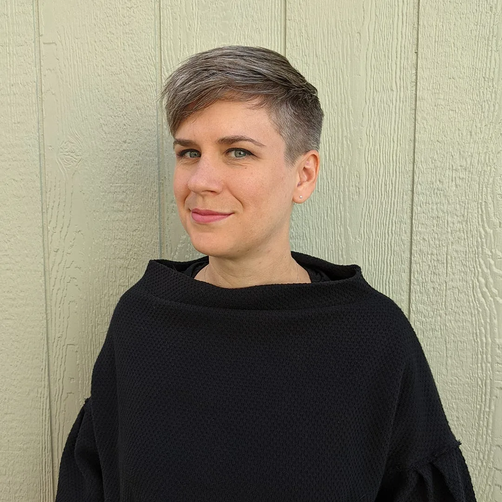

*Kate Hollenbach has been working with Processing since 2004. \[**Image description**: Kate is wearing a black sweater, standing in front of some light green paneling. She has pale skin and short, cropped gray hair. She looks at the camera with a shy smile.\]*

The first step in this direction, which will unfold over the next year, begins with Kate Hollenbach joining the Board of Directors, to specifically support the stewardship of the p5.js Editor.

Kate has been an active member of the Processing community since 2004, where her first programming job was building data visualizations with the Processing software. She began working on p5.js in 2015 at the first [p5.js Contributor’s Conference](https://processingfoundation.org/advocacy/p5-js-contributors-conference-2015), at Frank-Ratchye STUDIO for Creative Inquiry, Carnegie Mellon University.

[Kate Hollenbach](http://www.katehollenbach.com/) (she/they) is an artist, programmer, and educator. She creates video and interactive works examining human habits shaped by technology, with a recent focus on cellphone cameras, data collection, and surveillance. Kate’s art practice is informed by years of experience as an interface designer and product developer. She has presented and shown her work in venues including SFMOMA, Young Projects, Stamps Gallery, INST-INT, and SIGGRAPH. Kate holds an MFA from UCLA Design Media Arts and is currently an Assistant Professor of [Emergent Digital Practices at University of Denver](https://liberalarts.du.edu/emergent-digital-practices).

Welcome, Kate!
