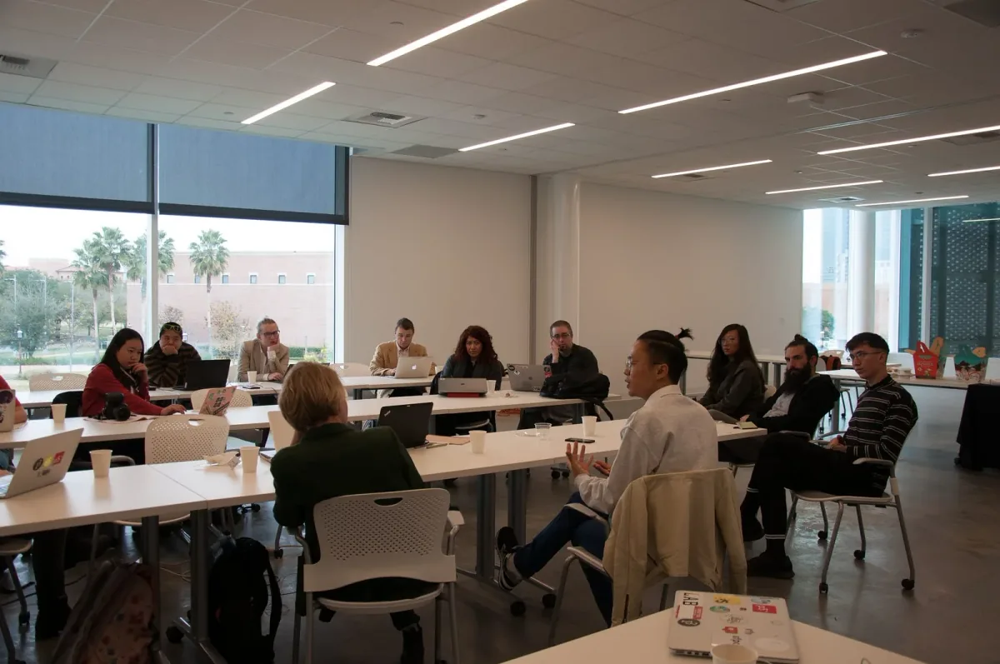
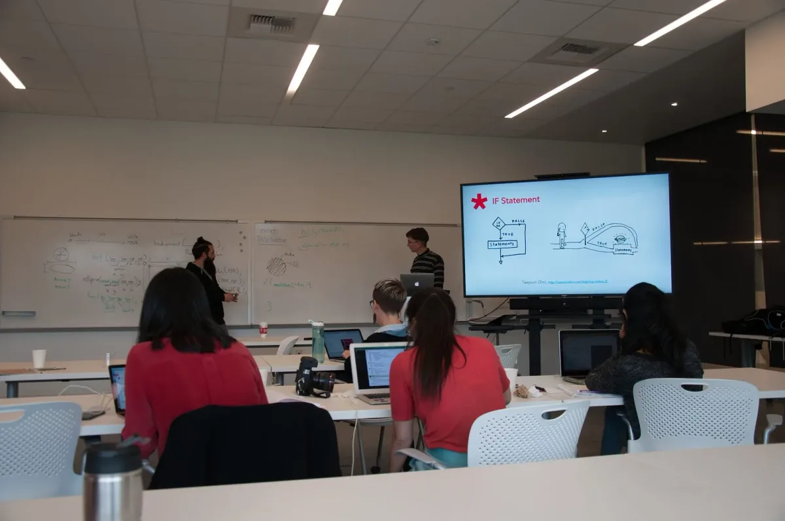

[*Learning to Teach, Teaching to Learn*](https://processingfoundation.org/advocacy/learning-to-teach-teaching-to-learn) *is an advocacy initiative begun in 2016 that includes an annual conference and satellite events, for educators who teach computer programming in creative and artistic contexts. Co-hosted with the* [*School for Poetic Computation*](http://sfpc.io/) *and directed by* [*Tega Brain*](http://tegabrain.com/) *and* [*Taeyoon Choi*](http://taeyoonchoi.com/)*.*

*Learning to Teach Houston at Rice University (image description: L2T organizers Tega and Taeyoon, and participants gather in a circle for discussion)*

Last December, the Day for Night festival hosted a *Learning to Teach* workshop for Texas-based educators and its weekend visitors. In addition to arranging an exciting musical lineup, the festival supported a vibrant exhibition of digital arts as well as a series of public events in the Houston area. The Processing Foundation, and directors Taeyoon Choi and Tega Brain collaborated with graduate students from the [UCLA Design Media Arts](http://dma.ucla.edu) program to develop and host a workshop, composed of a teaching demonstration of an introductory p5.js class and a discussion session focused on pedagogy and classroom teaching strategies.

Included among the *Learning to Teach* participants were a mix of educators working at high schools, colleges, and graduate-level courses, teaching computational arts and poetic computation. Educators working in makerspaces and STEM initiatives in the Houston area also joined the workshop. The program was divided into three sections, an “Introduction to Learning to Teach” by Taeyoon and Tega, a coding workshop by UCLA DMA graduate students [Stalgia Grigg](http://stalgiagrigg.name/), [Eric Fanghanel](http://ericfanghanel.com/), [Alice Mira Chung](http://cargocollective.com/almchng), and Hye Min Cho, and a group discussion on learning and teaching. In this final session, the conversation was shaped by three prompting questions:

1.  Who was your most memorable teacher and why?
2.  Share a conflict or moment of difficulty that has happened in your classroom.
3.  What do you want to teach and how?

In this blog post, we’ve asked two students from the UCLA DMA program to answer the same questions.

### Alice Mira Chung

**Q**: Who was your most memorable teacher and why?

**A**: My dad, even though I’ve never actually been his student. He teaches college-level engineering classes and is devoted to finding ways to make abstract concepts accessible to students. I remember that he came up with at least three metaphors for each core concept, and always included in-classroom demo experiments. In order to check if his language was easy enough for everyone in class to comprehend, he would go over his lecture notes with me (I was an elementary kid at the time). He always made sure that communication in the class was clear enough that even a child could understand the main concepts at the end of his lecture.

**Q**: Share a conflict or moment of difficulty that has happened in your classroom.

**A**: There is always a divide between students who are keen on the structure of the educational system/institute and those who aren’t. When I recall my past classrooms, a lot of labor of the educators was allocated to providing clerical, “customer service” to the former group, while the students from the latter group only received divided attention from their educators. This seemed especially problematic when students from disadvantaged or underrepresented backgrounds fell into the latter group.

**Q**: What do you want to teach and how?

**A**: I want to try designing a no-shortcut-style, hardcore “tech” class for artists. (The inverse of this idea, an intense hardcore “art” class for techies would be very interesting too.) To be more precise, I’m imagining an art class that uses a particular cutting-edge technology, such as machine vision or gene editing, but focuses on introducing the technology’s underlining concepts rather than on ready-to-use application tricks. I think this kind of exercise would be useful for two reasons: (1) for giving artists a way to access the theory behind a technology, and (2) for revealing the language and pedagogical structure used in engineering and science training.

### Hye Min Cho

**Q**: Who was your most memorable teacher and why?

**A**: The most memorable teacher was my middle school teacher Jin Hong Li. Growing up in China and being part of the rigid Chinese school system made it difficult for students like me who had a wide range of interests to be fully engaged with school. Knowing we would benefit from studying outside of the curriculum set by the school, and knowing we could speed through the usual material in first two days, Mrs. Li gave us the freedom to design our own course material for three out of five weekdays. She even let us use the empty classroom next door and take turns teaching the curriculum we came up with. Thanks to her and her trust in us to take the reins of our own learning, I stumbled upon many of my interests that I later integrated into my own work.

**Q**: What do you want to teach and how?

**A**: There is something I would like to teach myself and then integrate into my teaching later, through related subjects. I would like to learn how to see coding outside of the value system that is so ingrained in software engineering culture. When we look at the themes of computer science terms, many are gruesome, like “master,” “slave,” and “kill.” This is not very surprising considering early computers were used as tools for war. It may be that they are only words, but I think it says something about computer science and coding and how they are talked about today. I’d like to learn what it means to code outside of that context — for example, in the context of art — and provide that alternative when I teach.

*p5.js workshop led by Eric Fanghanel and Stalgia Grigg (image description: Eric and Stalgia use whiteboard and monitor to teach if statements)*
