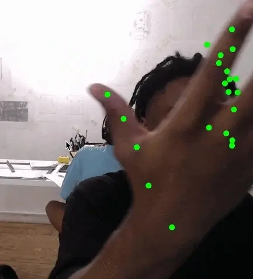
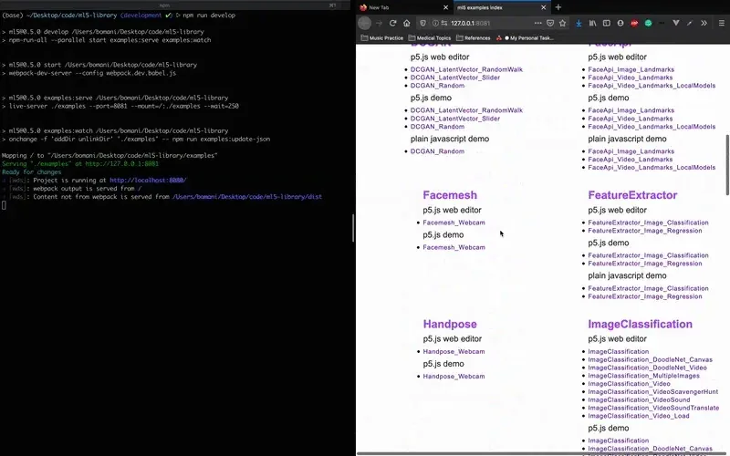

The 2020 Processing Foundation Fellowships sponsored six projects from around the world that expanded the p5.js and Processing softwares and nurtured their communities. In collaboration with NYU’s [Interactive Telecommunications Program](https://tisch.nyu.edu/itp), we also sponsored four Fellows to work on [ml5.js](https://ml5js.org/). Because of COVID-19, many of the Fellows had to reconfigure their projects, and this year’s cohort, both individually and as a whole, sought to address issues of accessibility and inclusion in their projects. Over the next couple months, we’ll be publishing our annual wrap-up articles on how the Fellowship projects went, some written by the Fellows in their own words, and some in conversation with Director of Advocacy Johanna Hedva. You can read about our past Fellows [here](https://medium.com/processing-foundation/https-medium-com-tag-pf-fellowships-la/home).

---

*Automatic facial occlusion using the ml5.js Facemesh model and p5.js. Original base photo by Edrick Chu. [Bomani Oseni McClendon](https://bomani.xyz/) is an engineer living in Brooklyn. Bomani builds software to support artists, and teaches students grades 2–5 about electronic circuitry through craft activities. Through his creative practice, he studies the ways that Black health outcomes are influenced by a history of scientific racism. Bomani’s Github is [here](https://github.com/bomanimc/). Bomani was mentored by [Joey K. Lee](https://jk-lee.com/).*

**Johanna Hedva: Hi Bomani! This year, the Processing Foundation partnered with NYU’s** [Interactive Telecommunications Program](https://tisch.nyu.edu/itp) **to support four** [ml5.js](https://ml5js.org/) **Fellowship projects. Machine learning feels vital and exciting these days, with interest in it growing both as a tool for creativity and data visualization, and as a platform to engage in topical discussions on the societal effect of computational algorithms. Can you tell me about your ml5.js Fellowship project? What were your intentions and goals, and what did you accomplish?**

**Bomani Oseni McClendon**: Hi Johanna! For this ml5.js Fellowship, my goal was to contribute a variety of improvements to the ml5.js core library that are focused on improving stability and addressing community needs. I believe that these changes help to make ml5.js more accessible to a wider variety of contributors and creators.

My first priority during the Fellowship was to simplify the release process for the library so that contributors can more easily release new versions of ml5.js. My first step was to study the existing state of the ml5.js release process, list all of the issues, and brainstorm multiple alternative solutions for each issue. This analysis culminated in a five-page document that served as the seed for many of my initial ideas. I reached out to my mentor, [Joey K. Lee](https://jk-lee.com/), to review my plans, then turned each of my most promising solution alternatives into detailed issues on GitHub and started implementation.

The process of simplifying the ml5.js release led me to all of my primary accomplishments during the Fellowship.

#### Releasing v0.5.0 of ml5.js

I gained my own firsthand experience with the ml5.js release process by coordinating the v0.5.0 release of ml5.js. This release contains a variety of updates from our amazing community of contributors and maintainer, such as a reimplementation of the Neural Network class, a refactoring of the Object Detector class, the inclusion of the ml5.js Community Statement in a console.log, and many small bug fixes and documentation updates. I also updated our build process to include an unminified version of the library in the distribution for this release.

#### Centralizing the version release process into single-repo changes

At the start of my Fellowship, the ml5.js project’s public-facing resources were a confluence of a few different sub-projects that each address a different focus within the overall usability of the library. During library version releases, this meant that four different repositories — ml5-library, ml5-examples, ml5-website, ml5-boilerplate — would need to be updated.

As a result of the work I did during the Fellowship, making a release of the library now only requires changes to a single repository: ml5-library. We decided to archive ml5-boilerplate, and I used a [version badge](https://github.com/ml5js/ml5-website/pull/149) on the ml5.js website so that we don’t need to make manual changes during release. Lastly, I merged the contents of the ml5-examples repository into ml5-library, which I’ll discuss further below.

#### Merge examples from ml5-example into the core ml5-library repo

Prior to the start of my Fellowship, core library code and the code for our [ml5.js examples](https://examples.ml5js.org/) were split into two separate repositories — ml5-library and ml5-examples, respectively. As I started looking for ways to simplify the ml5.js release process, I realized that this separation caused a few challenges. In this separated structure, the release of examples and features had to be coordinated manually. For example, if I added a new GAN model to the core library, I’d need to have it launch in a new release of the core library and then subsequently update the ml5-examples repo to publish the associated example. Additionally, there was an unclear separation of issues between the repositories. Many of the issues that were submitted to the ml5-examples repo were actually related to bugs within the core library code in ml5-library.

To address these issues, we decided to merge the contents of the ml5-examples repository into ml5-library so that they’d exist as one consolidated monorepo. This was the largest change that I made during my Fellowship and it was a great learning experience. There have been a few benefits associated with this change:

-   Consolidating the ml5-library repo and the ml5-examples repo removed an additional repo to handle in our library release process. This means that releases to the core ml5.js library and our ml5.js examples can be coordinated with changes to a single repo.
-   Features for the core library can be developed, tested, and submitted alongside a working example showing their use case. Not only does this make it easier to keep our examples in sync with the core library, it also means that contributors don’t need to context-switch between two separate libraries. Additionally, our examples can be used as manual tests during development to double-check that our changes to the library aren’t breaking examples or causing perceptible regressions.

The ml5-examples repo is now archived, and all library contributions, examples, and issues can be added to ml5-library. I’ve written about these changes in more detail on [ml5-library issue #809](https://github.com/ml5js/ml5-library/issues/809)!

*Testing handpose detection using the ml5.js Handpose model.*

#### Preparing for the next release

I also made a variety of other changes while I was working on the aforementioned projects. These changes will be available in the next release of ml5.js:

-   Facemesh Model: The next release of ml5.js will include the new [Tensorflow Facemesh](https://github.com/tensorflow/tfjs-models/tree/master/facemesh) model used to predict 386 3D facial landmarks on the human face.
-   Handpose Model: We’re also adding the new [Tensorflow Handpose](https://github.com/tensorflow/tfjs-models/tree/master/handpose) model used to predict 21 3D hand keypoints.

**JH: This was your first time contributing significantly to an open-source project. What did you learn about open source, both in terms of the community and technically?**

**BOM**: That’s right! In the past, I’ve made small contributions to open-source projects or received some contributions on small libraries that I’ve published, but I have never focused on an open-source project as I have with ml5.js.

Through this Fellowship, I’ve learned viscerally that open source is a durational practice rather than a momentary one. Strong open-source communities and the technologies that enable them are products of commitment and responsibility. Every contribution that ml5.js has received is an instance of someone taking the responsibility to share their time and energy with the broader community. As maintainers, I believe we have a responsibility to honor those contributions through our commitments to the future of the library and, most importantly, to the people who comprise our open-source community. In practice, I believe that this looks like writing clear documentation for our tools and ideas, seeing our changes through to the end, asking for lots of help from the community, and supporting all types of contributions. These behaviors, which have been exemplified by my amazing mentor Joey K. Lee, are what I aspire towards as I continue to engage with ml5.js and other open-source projects.

**JH: Would you like to keep contributing to ml5.js? What are some of the ways you hope to contribute to the project in the future?**

**BOM**: I absolutely plan to continue contributing to ml5.js! Over the course of this Fellowship, I’ve developed a close relationship with the ml5.js library. I’m excited to see a few concepts that I explored during the Fellowship through to completion, and I’d like to continue to explore more ways of improving the library and contributing to the community.

There are a wide variety of things that I’m interested in working on within ml5.js, but I believe that improving our workflows for maintaining documentation is one of our most important priorities. Currently, the way that we add documentation to updates to the sites creates some challenging branch management issues during library version releases. Furthermore, we don’t currently have a way to maintain documentation for previous versions of the library. Changes to make this process clearer and simpler will make it much easier for contributors to improve our documentation and for library maintainers with varying levels of Git familiarity to coordinate releases of the library.

In addition, I’d like to deepen my engagement with the work that ml5.js is doing to strengthen its community license and spend more time responding to issues that are opened on the ml5.js repository. I believe that both areas of work are critically important to maintaining a health ml5.js community.

*Demonstration of the new “npm run develop” command. This command boots the local development workflow with Webpack file watching and live reloading for the examples index. \[image description: On the left side of the screen, the command “npm run develop” is typed into a black terminal window. A few lines of output are listed in the terminal output before the ml5 Examples Index website appears on the right side of the screen.\]*
