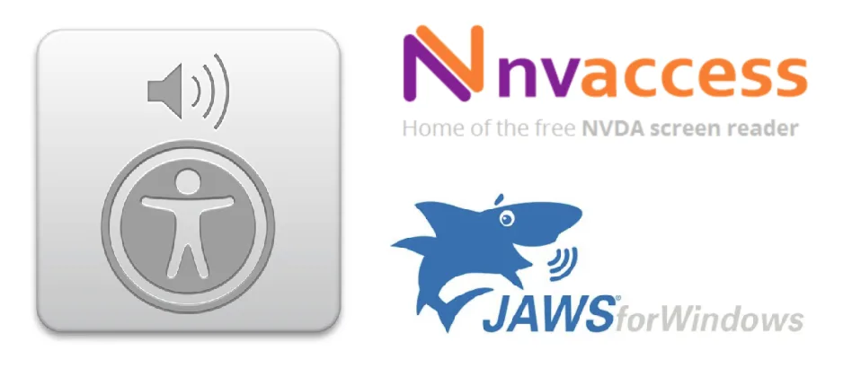

[2018 Processing Foundation Fellows](https://processingfoundation.org/fellowships)

---

When we started working on the p5.js accessibility project the premise had been set: we were going to make the p5.js web editor accessible to people with visual impairments. [Claire Kearney-Volpe](http://www.takinglifeseriously.com/index.html)’s 2016 Processing Fellowship project began a conversation about the role the Processing Foundation should play in making its resources and learning tools accessible. What we mean by accessible is making the editor and p5.js resources usable with screen readers, and also making sure that the canvas is available in the form of text and sound. You can read more about how this project began [here](https://medium.com/processing-foundation/p5-accessibility-115d84535fa8). Although we joined the project in late 2016, and are now working on it as a 2018 Fellowship project (with Claire as our mentor), we think of it as something that goes beyond Claire’s and our fellowships, and ideally will be sustained as an integral part of the development of p5.js.

Together with Claire, 2017 PF Fellow [Cassie Tarakajian](https://github.com/catarak), and in collaboration with community members, we have been working on the implementation of a high-contrast theme for the editor, text and table outputs for screen readers, and a sound output that visualizes movement. These developments led to the creation of [p5.accessibility.js](https://github.com/processing/p5.accessibility): a library that makes the p5.js canvas accessible to screen readers. As we make the library more robust and focus on creating accessible-for-all learning resources, it is a good time to reflect on what we have learned so far from the p5.accessibility.js project, what we plan to do in the future, and why making p5 accessible is important.

### Why is it important to make p5 accessible?

**Image containing logo of p5. \[Image description: White text that reads “p5\*” on a hot pink, square background.\]**

When we talk about “coding for all” and “coding literacy,” people who are visually impaired are most of the time left out \[1\]. Tools for programming have limited accessibility features and are generally directed toward computer science curricula. Accessible learning resources are also limited, with examples being displayed through screenshots or videos that are not screen-reader friendly. Similarly, in code editors most of the feedback is visual and cannot be understood through screen readers.

Because almost all of our communications are now mediated through computers, understanding computational media and computational thinking is essential, and the concept of coding literacy is more important and popular than ever before. Coding literacy is a gateway for thinking about the role code and computing play in our everyday lives and how code shapes the way we communicate \[2\]. Processing, the mother of p5, was created with the dual aims of demystifying programming and of approaching coding as a creative and exploratory process that should be accessible to all; p5.js continues these intentions.

Although this approach makes computational thinking accessible to more people, the visual nature of p5.js reduces its accessibility. Learners with visual impairments can express themselves visually and should be able to use p5 to engage with computational thinking. p5 makes text-based programming easier for beginners by allowing them to code in and for the browser; as Daniel Shiffman says, p5 “is great for actually doing stuff, but for learning, it’s terrific” \[3\]. We think of p5 as a learning platform, which is why the development of p5.accessibility.js focuses on p5 for beginners.

Because of the lack of accessible learning resources, programming for learners who are visually impaired relies heavily on “self-taught” efforts \[4\], which forces them to seek support in online communities. Such communities, of the kind that Processing and p5 both nurture, are important because they provide support for learners in the form of online resources, forums, and tutorials, and challenge them to continue experimenting with their code \[5\]. As Andrea A. DiSessa writes in *Changing Minds: Computers, Learning, and Literacy*, “The more a community knows about something, the easier it is for each member to learn” \[6\]. Making our communities accessible can provide new learners who are visually impaired and “self-taught” learners with a vast network of resources, experiences, and access to the knowledge of others.

### p5-accessibility.js

In August of last year we realized that making only the p5.js editor accessible was not enough, since everyone should have the ability to access p5.js sketches outside the editor. This became even more important when thinking about current learning resources available among the p5.js community. We attempted to adapt the interceptor created for the editor so that it could be used in the p5.js widget. Through this process we realized that the best approach was to create a library that could bring the accessibility features of the editor to any p5.js canvas.

The accessibility library takes an “ability-based design approach” \[7\], which considers how systems can be designed to fit the abilities of whoever uses them, by providing different ways of exploring the canvas. It is not about providing a one-size-fits-all solution but about having an array of options that makes p5.js more usable for everyone, including but not limited to people with visual impairments and older users. Adding the library is easy and simple without requiring knowledge of object-oriented programming and allows users to choose which outputs they want to make available.

### Challenges

### Canvas

Trying to make the p5.js web editor and p5.js sketches accessible came with its own set of challenges, the main one being that the canvas is probably the single, most inaccessible element in HTML. While it’s possible for a screen reader to recognize the element, it cannot identify all of the elements on it. The reason for this is simple: the canvas behaves just like a physical canvas, once you put paint on it, it covers up what’s behind it. It’s easy to see the color of each pixel but not understand how the pixels comprise shapes and elements. This poses a problem when you are trying to describe the elements on the canvas through code.

To help solve this problem, Atul Varma introduced us to the concept of [monkey patching](https://en.wikipedia.org/wiki/Monkey_patch). Monkey patching is essentially a way to piggyback existing code and add additional “features” to it. We added some code to the editor to make it work along with the library. When a p5 function is called, this code runs before the actual p5 function and makes a local copy of the parameters that the user passed into the function and the function itself. This, paired with the p5 function documentation, gave us a vast amount of information. For example, when a user types **ellipse(50,50,20,20)**, the monkey-patch code will first look at this function and understand that the user is calling the *function ellipse* with the *arguments 50,50,20,20*. It will then look up this function in the [documentation](https://github.com/processing/p5.js/blob/master/src/core/2d_primitives.js#L141) of p5.js to extrapolate that the user wants to draw an *ellipse* at *coordinates(50,50)* of *height 20* and *width 20.* This information is stored locally and displayed on the web editor in an [accessible fashion](https://medium.com/processing-foundation/p5-accessibility-115d84535fa8#96ea), meaning that the visual canvas is broken down into text or sound and these descriptions can be made available to the user. This basic concept of monkey patching has slowly extended to include more details about the canvas such as: What color is an ellipse? Which corner of the canvas is it closer to? What percentage of the canvas does it occupy?

### Screen readers

**Image containing the logos of various screen readers (Voiceover, NVDA and JAWS). \[Image description: on the left, a gray square with an image of a speaker emitting sound is above the symbol of a person. On the top right, orange and purple text reads, “nvaccess, home of the free NVDA screen reader.” On the bottom right, a blue shark cartoon is shown to be speaking, above text that reads, “JAWS for Windows.”\]**

Once we had a substantial structure set up on the editor to be able to provide accessible outputs, the main issue was making sure that screen readers were compatible with the code editor. The most widely used screen readers today are VoiceOver (free with MacOS), JAWS (paid software for Windows), and NVDA (open source software for Windows). While they all strive to be the best possible available software, due to the speed of software development cycles, they fail to keep up with the latest updates of web browsers. This means that we found ourselves in a place where we had to choose the “most compatible” code editor for all screen readers. After exploring the options with help from Cassie, we settled on using [codeMirror](http://codemirror.net/). We still had the issue that certain features are not supported in some screen readers and browser combinations. (At the time Edge had just been released, and they had openly announced that they did not support screen readers.) To avoid further confusion, we conducted a series of tests and settled on supporting the following browser + OS + screen reader combinations:

-   Safari + VoiceOver in OSX
-   NVDA + Firefox in Windows
-   JAWS + Chrome in Windows

### Colors

Out of all the issues we faced, the one that gave us the most laughs was colors. From the monkey-patch code, we’d get hex values or RGB values of colors and have to convert these values to names. While there are ample javascript libraries across the internet that do this, most of them include color names like “lazarin crimson,” “bermuda gray,” or “tickle-me pink.” These names are entertaining, but not very helpful. A text output should not only be readable but also understandable \[8\]. We were looking for a library that gave us easy-to-understand color names — names like those of crayon colors we used growing up. We didn’t find one so we decided to make it ourselves. We developed [colornamer](https://www.npmjs.com/package/colornamer), a simple NPM module/javascript library that, when given a hex or RGB value, returns color names that are accessible to people who are blind and visually impaired.

Earlier this year, Claire and Scott Fitzgerald used the library in their programming classes with high school students who, are blind at the Oysters and Pearls Tech Camp, a learning center that integrates technology and science in schools that are inclusive to people who are blind. The results were promising. One student, who is able to see colors at a short distance, could not stop laughing when the color names the screen reader gave matched the colors he was able to see. For example, when combining red, green, and blue color values for the first time, he created and enjoyed the color “salmon pink.”

### What’s next?

This project began with a collaboration between Claire Kearney-Volpe and Chancey Fleet, Assistive Technology Coordinator and Educator at New York Public Library. Chancey, who is blind, wanted to create an accessible spatialized diagram to plan a banquet for work. There were no known accessible ways to create, save, and share spatial representations and diagrams, so Claire and Chancey turned to the Processing Foundation for support.

From its inception, the role of the community has been crucial in our decisions and in the design and refining of the tools. We continue to talk to community members, and blind and visually impaired experts who work with programming, to better understand the challenges we face and arrive at solutions together.

We are currently entering a phase of heavy testing to make sure that p5.accessibility.js is robust and fully integrated into the web editor. We are also working on making existing p5 learning resources accessible in order to make the Processing and p5 communities more inclusive. Our aim is to create a comprehensive collection of learning resources that users who have visual impairments can engage with.

We are grateful to assistive technology experts Chancey Fleet, Sina Bahram, and Josh Miele for their support, and to Cassie Tarakajian for the development of the p5.js web editor and working with us to make it more accessible. We are thankful to Atul Varma, Daniel Shiffman, Luisa Pereira-Hors, Scott Fitzgerald, and Johanna Hedva for their input. This project was born out of an initiative at the [NYU Ability Project](http://ability.nyu.edu/) and is supported by a 2018 Processing Foundation Fellowship.

If you have any questions or wish to contribute to the project, please email us at [mathura.mg@nyu.edu](mailto:mathura.mg@nyu.edu), [luis.morales@nyu.edu](mailto:luis.morales@nyu.edu) or [ability@nyu.edu](mailto:ability@nyu.edu).

### Notes

1\. Richard E. Ladner and Maya Israel, “For all in Computer Science for All,” *Commun.ACM* 59, no. 9 (aug, 2016), 26–28. doi:10.1145/2971329. [http://doi.acm.org/10.1145/2971329.](http://doi.acm.org/10.1145/2971329.)

2\. Annette Vee, *Coding Literacy: How Computer Programming is Changing Writing* (Cambridge, Massachusetts: The MIT Press, 2017).

3\. Daniel Shiffman, *Learning Processing: A Beginner’s Guide to Programming Images, Animation, and Interaction*, Second ed. (Amsterdam: Morgan Kaufmann, 2015).

4\. Andreas M. Stefik, Christopher Hundhausen and Derrick Smith, “On the Design of an Educational Infrastructure for the Blind and Visually Impaired in Computer Science” (Dallas, TX, USA, ACM, 2011). doi:10.1145/1953163.1953323. [http://doi.acm.org/10.1145/1953163.1953323.](http://doi.acm.org/10.1145/1953163.1953323.)

5\. Vee, *Coding Literacy* (2017).

6\. Andrea A. DiSessa, *Changing Minds: Computers, Learning, and Literacy* (Cambridge, Mass.: MIT Press, 2000), 271.

7\. Richard E. Ladner, “Design for User Empowerment,” *Interactions* 22, no. 2 (feb, 2015), 24–29. doi:10.1145/2723869. [http://doi.acm.org/10.1145/2723869.](http://doi.acm.org/10.1145/2723869.)

8\. World Wide Web Consortium, “Web Content Accessibility Guidelines (WCAG) 2.0, Guideline 3.1” [https://www.w3.org/TR/WCAG20/#understandable](https://www.w3.org/TR/WCAG20/#understandable)
