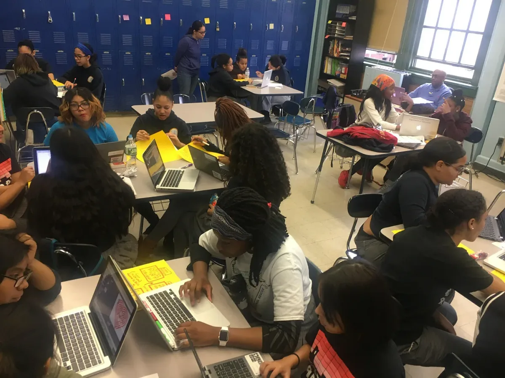
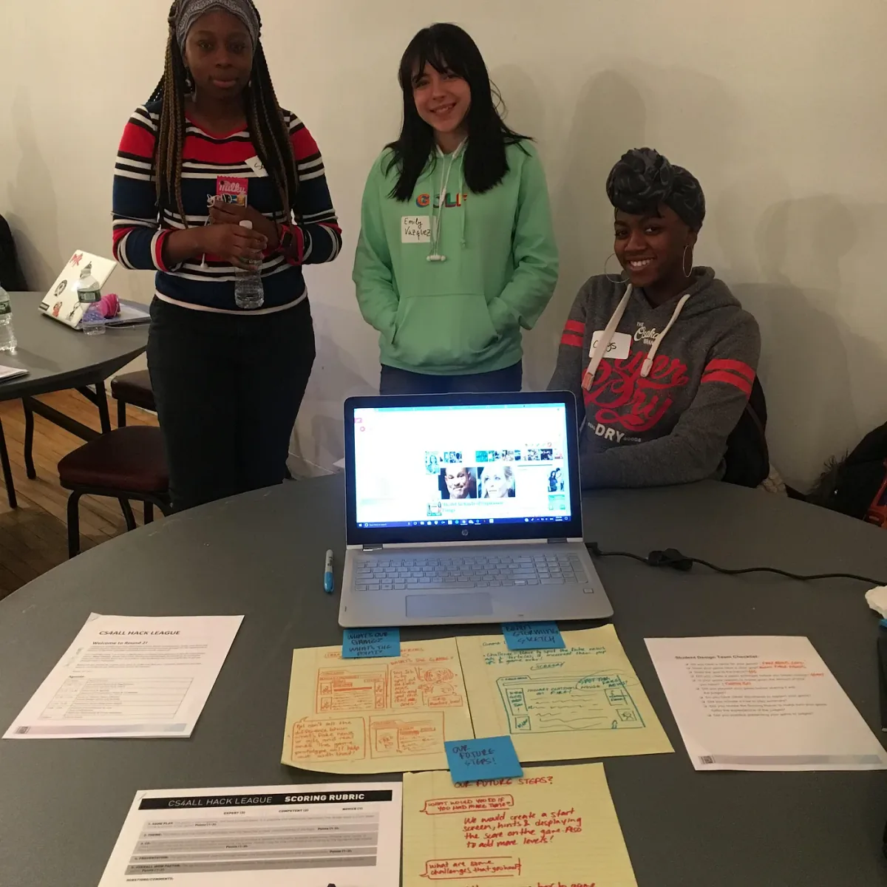
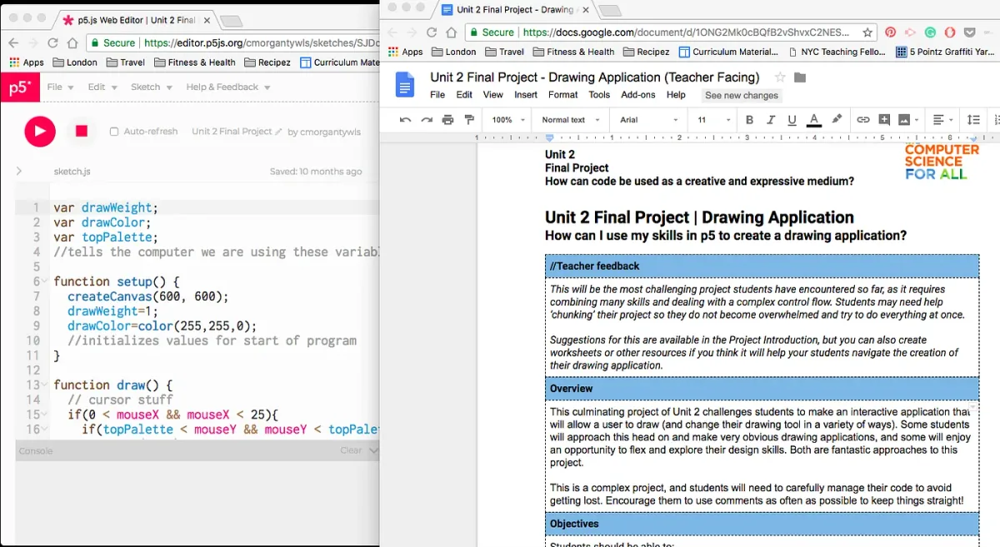
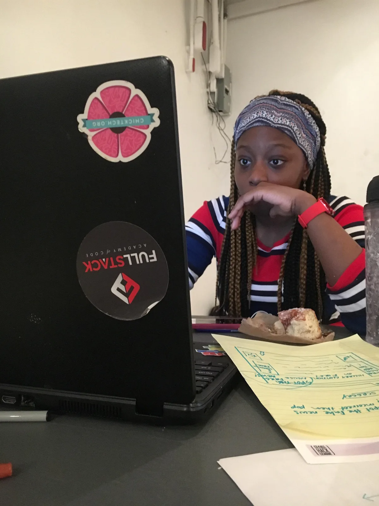
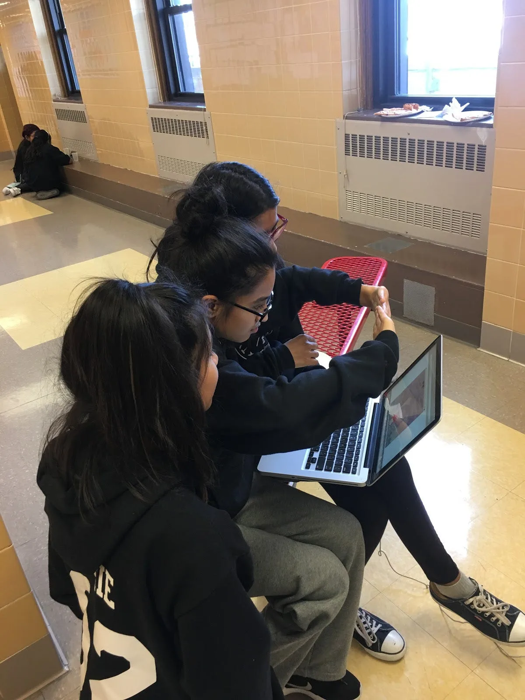
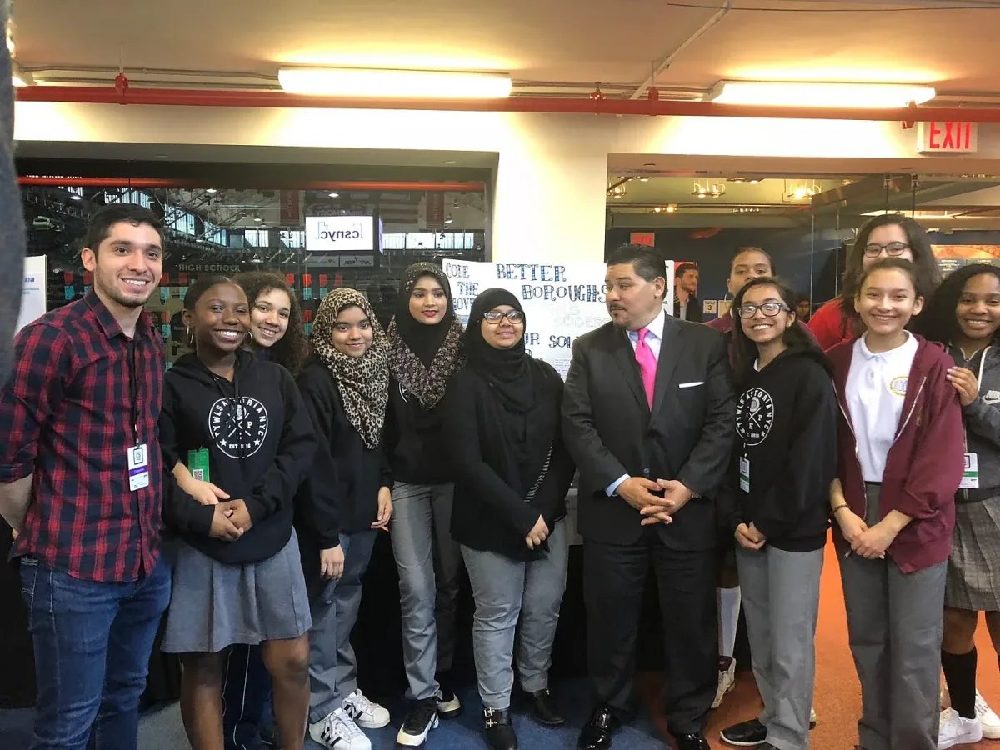

2018 Processing Foundation Teaching Fellows

---

*This year, the Processing Foundation Fellowship Program included two teaching fellowships that were sponsored by the New York City Department of Education (DOE). Jose Orea and Courtney Morgan were advised by 2018 Foundation Fellow Saber Khan. Director of Advocacy Johanna Hedva interviewed both about their work.*

---

*Students work on projects during a school-wide Hackathon at TYWLS Bronx. \[image description: About two dozen people, mostly students with some teachers, work on laptops in a classroom.\]*

**Johanna Hedva: Can you give us an introduction to how this fellowship came about? It took a different path than our other Fellowships because of its being sponsored by the NYC DOE.**

**Courtney Morgan and Jose Orea**: We are both fulltime DOE teachers: Jose teaches at The Young Women’s Leadership School of Astoria, and Courtney teaches at The Young Women’s Leadership School of the Bronx. In April of 2018, we were approached by Jose Olivares of [CS4All](https://blueprint.cs4all.nyc/) about assisting with curriculum edits to what was then the course Software Engineering 2, and what is now Introduction to Computational Media (ICM). Olivares had learned that people outside of the DOE had been engaging with curriculum, so it seemed important to make sure our work could be useful to those outside of NYC public schools.

Working with the Processing Foundation and [2018 Fellow Saber Khan](https://medium.com/processing-foundation/building-inclusive-learning-spaces-for-students-and-teachers-60a8ea0b0a27) supported us with resources, expertise, and perspective. Since implementing the ICM course the previous year, Olivares asked us to incorporate a more formal lesson plan, with activities and teacher feedback. Because the Processing curriculum will be used by many teachers in NYC, Olivares thought teachers would need more of pedagogical resource for teaching Processing.

*Students present a p5.js project on fake news during the Borough Wide Hackathon. \[image description: Three female students smile from behind a table that displays an open laptop and several pieces of paper.\]*

**JH: What was your project’s scope of work? What did you accomplish and what do you still have to do?**

**CM/JO:** Primarily, we are working on adjusting the existing to curriculum to better fit the needs of teachers. We’re also working to better prepare students for future CS courses, such as AP Computer Science Principles. We are rearranging and adding to the lesson sequence, redesigning projects, and trying to ensure that the course builds important vocabulary and concepts for students. The spirit of the ICM course is creativity and creation through code, and we’re working to make the lessons reflect that. We’re also pushing out notes for teachers on what we view as exemplary lessons — full of student-led exploration — to assist teachers who are new to CS in their pedagogy.

We spent a long time trying to decide how these new additions and revisions could be most useful, and we are currently overhauling each unit one at a time. Right now, teachers are working with materials that we’ve only just made, as we continue to move through the curriculum over the 2018/2019 school year. One of our ultimate goals is to make ICM into an AP CSP course.

*Curriculum Planning with CS4All. \[image description: Screenshot of two browser windows. On the left is a browser open to the p5.js Web Editor, with code for a drawing application; on the right is a browser open to a Google doc showing a lesson plan for coding a drawing application in p5.\]*

**JH: Can you talk a little about why it’s so important to incorporate the notion of creative coding into computer science curriculum?**

**CM/JO:** From a real-world perspective, many problems in our future will be solved through computing and computer science. For students to have the chance to explore their own creative problem-solving skills using a programming language as a tool is a really powerful experience; they can start to see computer science and programming as a normal way to complete a task or solve a problem. This can open a lot of possibilities for them, since code becomes a natural lens through which they can process their world.

From a classroom perspective, this course has a lot of freedom because it doesn’t have a final exam, it won’t be on the SATs, and it’s not a graduation requirement. It gives a beautiful opportunity for students to have room to explore and learn for the sake of learning, and it gives a break from classes that have a big scary exam looming at the end. It lets them be free for a bit while still learning a valuable skill. They can make things that interest them while still internalizing some big computational concepts.

ICM also offers students the opportunity to incorporate artistic elements into their programs. It’s important that students see different applications for script-based coding, and not only the data and application side. We noticed that the creative freedom actually helped students strengthen their knowledge of all CS concepts while still making their projects.

*A student works on a p5 project during the Borough Wide Games for Change Hackathon. \[image description: A close up image of a female student working on a laptop. We can see her face, and the back of the laptop.\]*

**JH: Can you share some of your practical goals with this work, in terms of deliverables you set out to achieve this year?**

**CM/JO:** Our work has been twofold. First, we’ve been rearranging/adding on to the content in the existing ICM curriculum. Having taught the course before, these decisions are driven by our experience in our own classrooms. We’ve also been keeping the AP Computer Science Principles course in mind as a next step after this class — and if not AP CSP, a comparable higher-level course — so we’ve been adjusting the content accordingly.

The biggest new deliverable we’ve focused on is a set of teacher notes for each learning activity. This breaks down the content into what we view as exemplary lessons, and it includes ways to launch new content in a way that is interesting and meaningful to students, structures for engagement, reflection questions, assessment ideas, suggestions on where students should learn through exploration versus where teacher lectures work best, etc. This is geared toward teachers who may not have taught a CS course before and may be unsure of how to deliver the content. Lots of programs looking to recruit teachers into teaching CS do a great job of teaching content, but don’t necessarily teach pedagogy, which is ultimately a loss for students.

Another deliverable is to update and create a p5.js curriculum website in which both students and teacher can follow in order to learn P5.js. This will be the front-facing page while keeping the teacher notes separate.

*Students working on their projects during a hackathon. \[image description: Three female students sit in chairs and share one laptop.\]*

**JH: Can you explain how it worked to be advised by Saber Khan, a 2018 Foundation Fellow, and how that collaboration worked?**

**CM/JO:** Saber is a great resource as an outside-of-DOE teacher perspective. He has a ton of CS experience, and our opinions are really aligned for how students learn best. He engaged with all of our documents (dealing with our sometimes strange organizational systems), leaving comments and feedback, which has been fantastic. Saber often pushed our thinking by having us incorporate different student activities and scaffolding.

**JH: What’s next? How do you see this project’s impact in the next two years, five years?**

**CM:** We are still in the process of building out curriculum and making each learning activity and lesson as engaging and easy for teachers to execute as possible. We hope that in two years we have a version that feels final, and we hope in five that its reach has extended beyond NYC schools.

*Students, and the chancellor, presenting their winning project at the Computer Science Fair in 2017. \[image description: Ten students in a row smiling at the camera. The chancellor stands in the middle and 2018 Teaching Fellow Jose Orea stands at left.\]*
