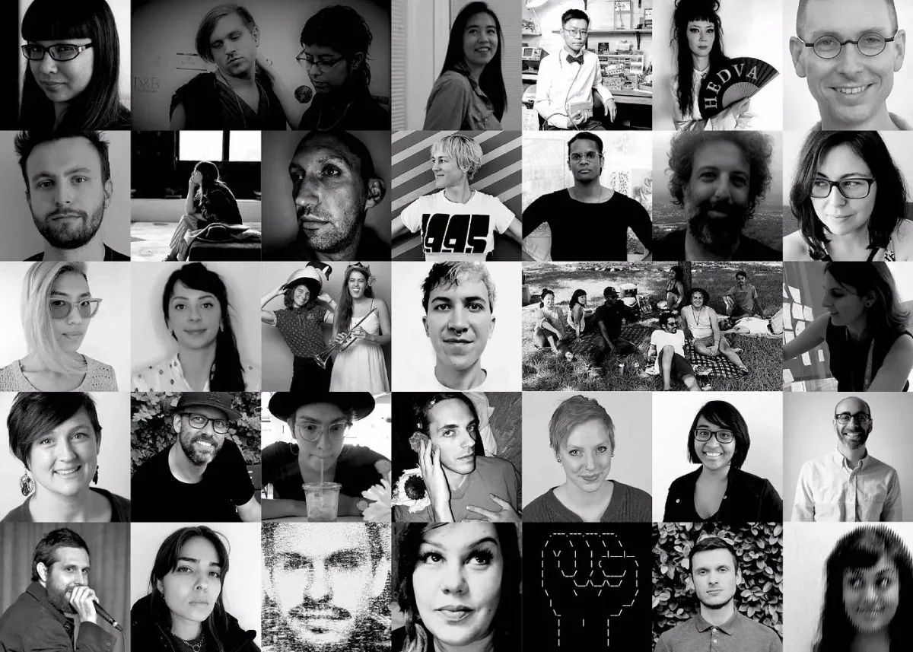
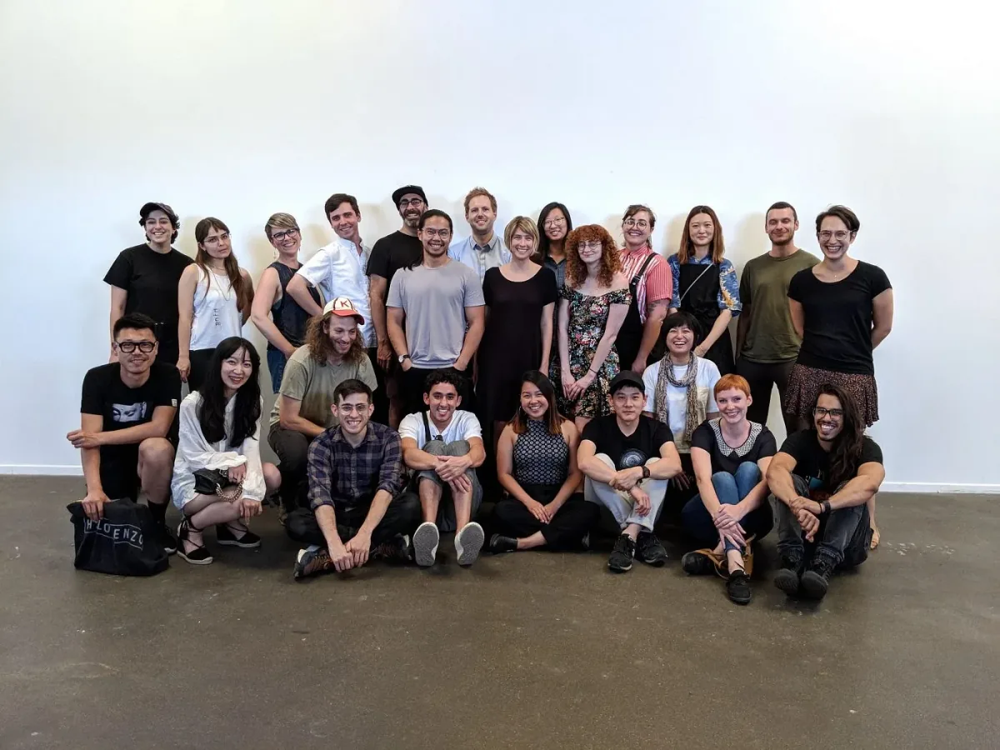

[Click here for more information](https://day.processing.org/pcd-la.html).

*Processing Community Day Los Angeles lightning talk speakers and session organizers. \[image description: Thirty-three black and white portraits of the Processing Community Day Los Angeles speakers and organizers in a 7x5 grid.\]*

Processing Community Day Los Angeles is an all-day event that brings together people of all ages to celebrate and explore art, code, and activism. Featuring four different themed-tracks — **Accessibility, Disability, and Care**; **Radical Pedagogy**; **Under the Silicon, the Beach!** and **Epic Play!** — the conference will host a total of 19 lightning talks and 13 sessions (the full schedule is below). The four themed tracks will run simultaneously throughout the day, which means that *it’s not possible to go to every single lightning talk and attend every single session*. This article serves as a practical guide to help attendees make roadmaps to get the most out of the day.

### Planned Activities v.s. Self-Organized Activities

The day will be divided into long periods of planned activities with opportunities to organize your own activities during the breaks. If you have ideas or projects to share with the community we would love to see you organize an activity. Below is an outline of the different types of activities we are offering.

#### Planned Activities

-   **Lightning Talks (all day)**: attending lightning talks is a great way to learn about a general topic of interest, meet speakers, and learn more about their work.
-   **Sessions (all day)**: attend sessions to work on a hands-on project, engage in dialogue, and/or collaborate in small groups.
-   **Open Hour (12:30pm~1:30 pm)**: the [UCLA Arts Conditional Studio](https://twitter.com/uclaconditional) will be hosting lunchtime office hours, inviting participants to bring their food and work on code in a relaxed, friendly environment.

#### Self-Organized Activities

We have created three platforms for self-organized activities throughout the conference. Make sure to put your name down on the sign-up sheets at the conference if you’d like to participate .

-   **Community Open Mic (4:30–5:15pm)**: give a 5~7 minute lightning talk on just about anything you’d like to share with the community.
-   **Processing Community Cafe (all day)**: this is a discussion platform that takes place on the lawn. Write a question or a topic of your interest on a sign and form a discussion group with people during coffee breaks and lunch. Signs will be provided.
-   **Show & Tell Stations (all day)**: bring your project and show it to the community during coffee breaks and lunch break. We will provide monitors for screen-based work.

### Tips & Reminders

-   **Draw a Plan:** study the [schedule and program description](https://day.processing.org/pcd-la-tracks.html) and take notes on the activities you’re planning to attend, including self-organized activities to which you might want to contribute.
-   **Self-Organize**: would you like to present a topic or a project? Is there a topic that’s important for the Processing Community but hasn’t been covered by this year’s program? Make some plans before you visit the conference so that the activity you organize can be more intentional.
-   **Prepare Questions:** this is a special day where members of the Processing Community come together to share ideas and thoughts. If you’ve ever had questions about any of the Processing Foundation’s projects but have never had the chance to ask, this is a great time and place to do so.

*Group photo from PCD @ LA Planning Meet-Up. \[image description: a group of 24 people happily smiling at the camera. The front row sits on the cement floor and the back row stands against a white wall.\]*

### **Full Schedule**

9:30am Registration

10:30am Welcome!

10:45am “State of the Union,” presentation by the Processing Foundation Board

11:15am Coffee Break

**11:25am Lightning Talks and Sessions I**

**Under the Silicon, the Beach Lightning Talks, Location: EDA**

“The Resistance of Everyday Objects: Encoding Black Ritual Practice as Social Technology” with Ron Morrison (Elegant Collisions)

“The Voice in the Machine” with Cynthia X. Hua

“Incantation in Code” with Lark VCR

“Limitation as Poetry” with Stalgia Grigg

“Simulating Surveillance: Deconstructing the Designs of Algorithmic Surveillance Systems” with Peter Polack

**Accessibility, Disability, and Care Session I, Location: ROOM 4250**

“Neither Her nor HAL: Considering Access and Representation in the Next Generation of Speech Technology” with Emily Saltz  
   
**Radical Pedagogy Session I, Location: ROOM 4240**

“Flower Eater (Understanding Software through Drawing)” with Jeffrey Alan Scudder  
   
**Epic Play Session I, Location: ROOM 4230**

“Games For All! — Flatgames with p5.Play” with Lee Tusman (all ages)

12:10pm Lunch

12:30pm **Intro to Open-Source: How to Contribute as Coders / Non-Coders with Evelyn Masso and Chandler McWilliams, Location: ROOM 4220**

Why open-source? How can coders / non-coders contribute? Bring your lunch to Room 4220 to meet people and learn the basics of Github and documentation.

12:30pm **Open Hour with the UCLA Arts Conditional Studio, Location: ROOM 4240**

Interested in working on code or need help troubleshooting? Bring your lunch to Room 4230 to meet people and work on something together.

**1:30pm Lighting Talks and Sessions II**

**Accessibility, Disability, and Care Lightning Talks, Location: EDA**

Track intro with Taeyoon Choi and Johanna Hedva

“Accessibility in an Open-Source Community” with Claire Kearney-Volpe and Luis Morales-Navarro

“Sharpness With Blurred Edges: How We Try To Represent Being In Pain” with Luke Fischbeck

“Eyeballs to the Wall” with Rachel Simanjuntak  
   
**Under the Silicon, the Beach! Session I, Location: ROOM 4220**

“LocalNet Adventure!!” with Alden Rivendale Jones  
   
**Radical Pedagogy Session II, Location: ROOM 4240**

“Manifestos for Radical Inclusion” with Linda Ravenswood  
   
**Epic Play Session II, Location: ROOM 4230**

“My Face is My Own!: Helping Kids Beat Facial Recognition Software” with README (all ages)

2:15pm Coffee Break

2:30pm **Radical Pedagogy Lightning Talks, Location: EDA**

“EDA Business as Usual, CANCELED” with Color Coded

“A Cohort, Not a Curriculum” with Molly Morin

“Defense Against the Dark Arts” with An Xiao Mina

“Bias in Natural Language Processing: To Create or Reflect Society” with Echo Theohar  
 **  
Under the Silicon, the Beach! Session II, Location: ROOM 4220**

“Processing Peers” with Jon-Kyle Mohr  
   
**Accessibility, Disability, and Care Session II, Location: ROOM 4250**

“ALIEN BODIES” with The Best Friends Learning Gang and Johanna Hedva  
   
**Epic Play Session III, Location: ROOM 4230**

“Feminist Futures World Building Lab” with Paisley Smith and Caitlin Conlen

3:15pm Coffee Break

**3:30pm Lighting Talks and Sessions III**

**Epic Play! Lightning Talks, Location: EDA**

“Play Every Day” with Saskia Freeke

“Party Games: Speculative Play Through Form” with Kristin McWharter

“A Cloud Machine in the Desert” with Adelle Lin

“Interworveld” with Patrick Michael Ballard

“The Deinstrumentalization of Games” with Eddo Stern  
   
**Under the Silicon, the Beach! Session III, Location: ROOM 4220**

“Toward a Reflexive Data Culture” with roopa vasudevan  
   
**Accessibility, Disability, and Care Session III, Location: ROOM 4250**

“Disability, Design and the Development of Accessible Creative Tools” with Claire Kearney-Volpe and Luis Morales-Navarro  
   
**Radical Pedagogy Session III, Location: ROOM 4240**

“Monsters, Synths, and Future Gods” by Angela “Mictlanxochitl” Anderson Guerrero and Jason Wyman

4:15pm Coffee Break

4:30pm Community Open Mic

5:15pm See you next year!

5:30pm Reception. Featuring artworks by Kate Hollenbach, Raven Kwok, and John Carpenter.

6:30–9pm After Party (location TBA)

### See You Soon

We look forward to meeting you on January 19! Please feel free to contact day@processing.org if any questions come up.
