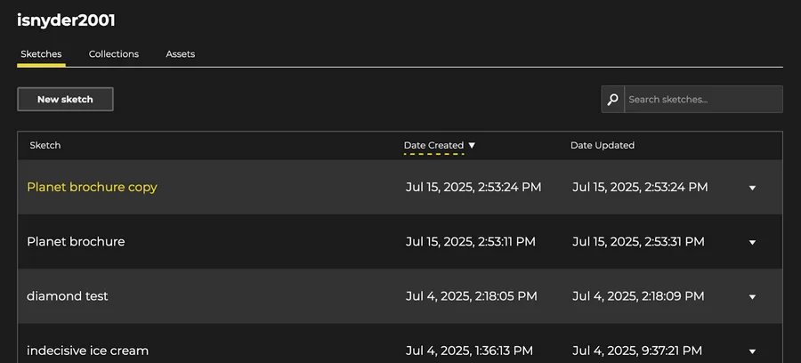
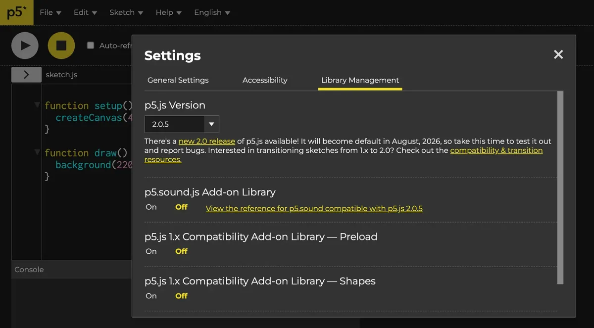

My name is [Izzy Snyder](https://www.linkedin.com/in/izzy-snyder-4a0346207/), and I spent this summer as an Open Source Software Intern. I graduated from Oberlin College in 2023 with a degree in computer science, then took a two-year detour into elementary school teaching. By last winter, I knew I was ready for a new direction. Having been a near-decade-long user of Processing and p5.js, I was thrilled when I saw that the Processing Foundation had an internship opportunity for the summer.

During the first few weeks of my internship, I focused on learning. I read through the contributor docs, watched tutorials on how to use Github, and completed small tutorials covering everything from the [MERN stack](https://www.mongodb.com/resources/languages/mern-stack) to [HTML](https://developer.mozilla.org/en-US/docs/Learn_web_development/Core/Structuring_content), [CSS](https://developer.mozilla.org/en-US/docs/Learn_web_development/Core/Styling_basics), and [React](https://react.dev/learn). I also opened an issue and completed [my very first pull request](https://github.com/processing/p5.js-web-editor/pull/3539) (with plenty of guidance from p5.js Editor Lead [Rachel Lim](https://github.com/raclim)) to fix a small typo in one of the contributor docs.

Afterwards, Rachel and I discussed potential projects, and we settled on improving color accessibility for links on the editor site. I dove into web accessibility research and took screenshots of all links across the different color themes to compile into [my first substantial issue](https://github.com/processing/p5.js-web-editor/issues/3550). I discovered that many links were indicated solely by color differences, and some styling only appeared on hover, making them difficult for all users to see.

*Links change color on hover in all color themes, but not underlined*

> Based on what I had learned about web accessibility, I decided that underlining links would be a good solution, since it doesn’t rely on users’ ability to perceive color differences.

I also spent some of this time learning about [SASS](https://sass-lang.com/), the CSS extension language used by the p5.js Editor, so I could address the issues I had identified. I located the problem links in the codebase and began updating and testing the new styles.

> Now, links are underlined and use a different color from the surrounding text by default, with the underline becoming slightly thicker on hover.

*With the update, links are now underlined and use a different color from the surrounding text by default*

This maintains the unique hover-only behavior while making links easily distinguishable by default. These updates are now live on the [p5.js Editor](https://editor.p5js.org) on the sketches page, settings window, and about page!

After completing these changes, I went on a “side quest” to build a color palette contrast analysis tool. The first version is a Python script that reads a file with color palette variables and outputs a p5 sketch showing which colors work on different backgrounds, as well as which colors are legible as text on those backgrounds.

I am working on streamlining it so that others can use it too, and I may add the images and lists of appropriate colors to the [p5 wiki](https://github.com/processing/p5.js-web-editor/wiki). Through this, I learned a lot about how hex and RGB values translate to one another and how [luminance](https://en.wikipedia.org/wiki/Relative_luminance) and [contrast](https://www.w3.org/TR/WCAG22/#dfn-contrast-ratio) are calculated. It makes me much more appreciative of the very user-friendly [color contrast checker tool](https://www.tpgi.com/color-contrast-checker/) that I have been using!

One of the last projects I worked on was [an update](https://github.com/processing/p5.js-web-editor/pull/3573) to both the accessibility contributor docs with more information on color accessibility and to the pull request template to add a check box for checking contributions with the accessibility guidelines. I also tackled [another issue](https://github.com/processing/p5.js-web-editor/issues/3579) related to p5.js Editor contrast, though I didn’t have time to fully resolve it during the internship.

I am extremely grateful for the care and time that went into designing this experience, and for all the ways that Amy Woodman and Rachel Lim welcomed me, made me feel appreciated and capable, and helped me work through all the issues that came up along the way.

> I feel much more confident and knowledgeable, and I am excited to continue contributing to this platform that I use for my own creative process with the new (and growing) skills that this internship has given me.

---

Our software gets to stay **free and open-source** thanks to generous donors like you. If p5.js has brightened your day in any way, [**will you consider making a monthly donation**](https://donorbox.org/back-to-school-805292)?

**100% of your donations will go towards p5.js software development, and recurring donations help us plan.** Thanks to the recurring donations we’ve received in 2024, we were able to support p5.js contributors like Izzy.
