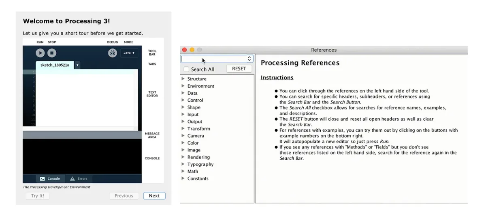
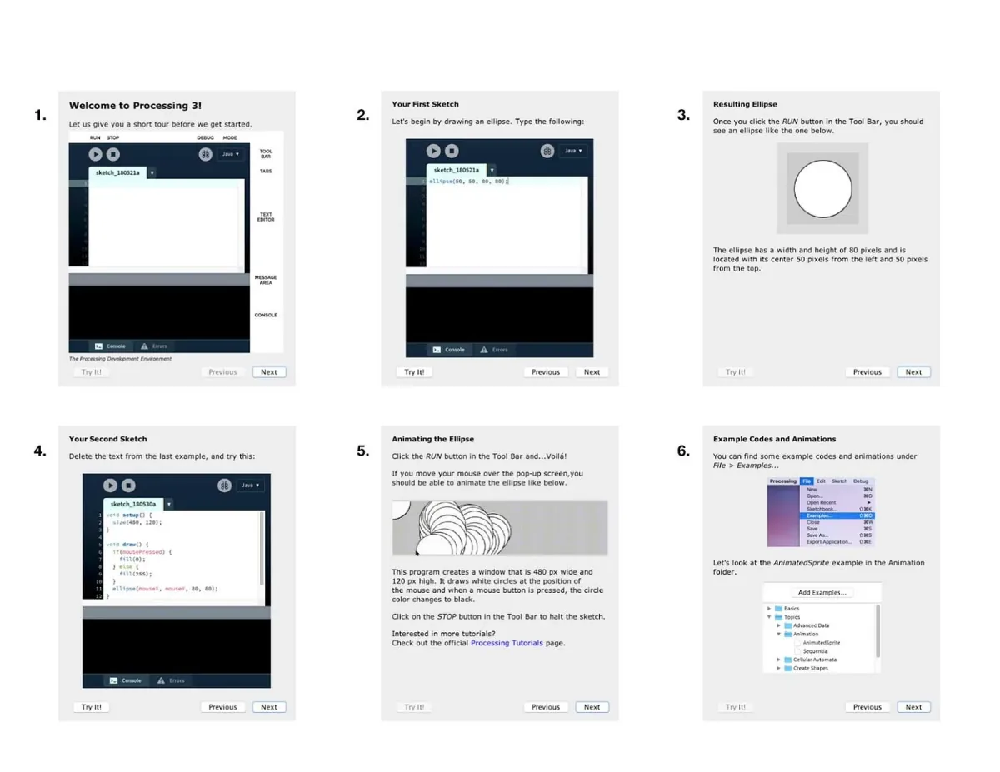
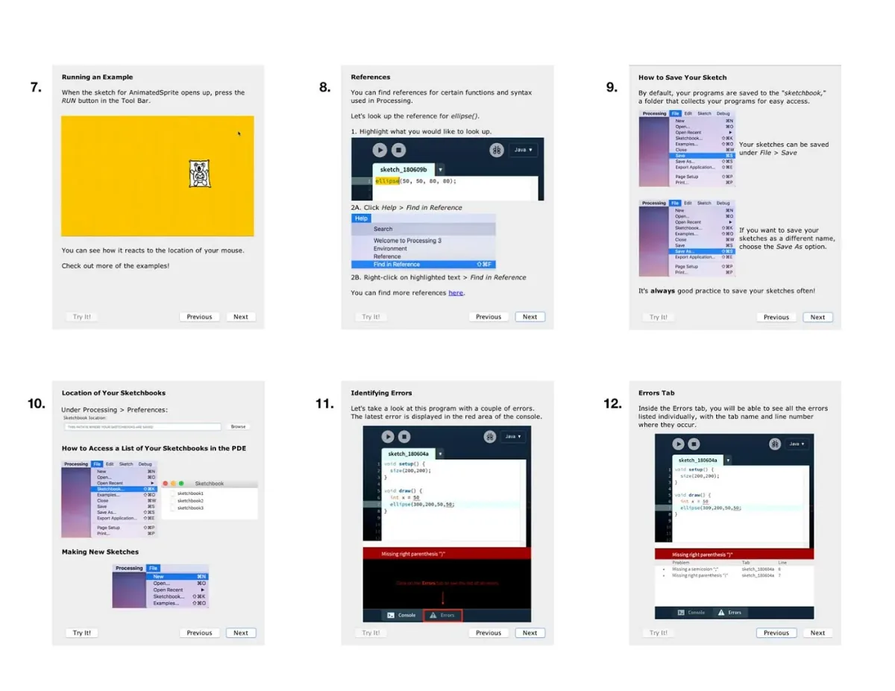
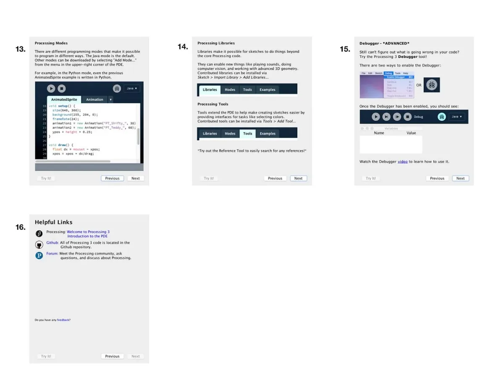
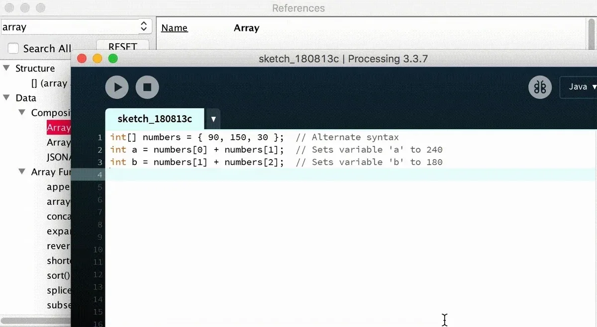

Google Summer of Code 2018

Mentored by [Elie Zananiri](http://prisonerjohn.com/)

---

*This summer was the Processing Foundation’s seventh year participating in Google Summer of Code. We received 112 applications, a significant increase from previous years, and were able to offer 16 positions. Over the next few weeks, we’ll be posting articles written by some of the GSoC students, explaining their projects in detail. The series will conclude with a wrap-up post of all the work done by this year’s cohort.*

---

*Two contributed tools developed for the project: The Getting Started tool and a new Reference tool. \[image description: Two screenshots. The one on the left shows a frame within the Processing Development Environment that reads, “Welcome to Processing 3! Let us give you a short tour before we get started.” On the right is a window titled References, with a set of instructions for how to use the Reference tool.\]*

As a biology and international studies major turned computer science student, one of the most intimidating things about programming was not knowing where or how to start on a project. Writing in a language that I had just started learning was one thing, but I also had to learn how to navigate around an IDE. This problem motivated me to propose a project to build contributed tools that would improve beginner user experience for the Processing Development Environment (PDE). I wanted beginner users not to feel overwhelmed when first trying out the PDE, and I focused on changes that would increase overall user retention.

*The Getting Started Tool*

Processing has great documentation for the PDE online, including Getting Started and Environment. However, the current splash page that appears when opening the PDE only contains links for where the user can find the changes from Processing 2 to Processing 3. It doesn’t provide any introduction to the PDE on how to get started on a project. I thought the Getting Started page could a great resource, and that beginner users would benefit from something more visual and interactive.

The tool that I built consists of several frames that give new users a short tour of the PDE. I summarized the Getting Started and Environment pages and included graphics (screenshots and gifs) that I thought users might find helpful. Users can click through the frames as well as try out the tutorial codes themselves via the “Try It” button. The button will populate the same code in the frame of a new editor. On the last frame, there are links to the above pages, as well as the Processing Github repository and the Processing forum. For future improvements, I would like to enhance the quality of the images and make the tool more interactive and user-friendly.

*Getting Started Tool frames 1–6. \[image description: Six screenshots of the frames in the new Getting Started Tool tour. Each frame shows an image with text about a specific feature in Processing 3. The first six, shown above, include: Welcome to Processing 3!, Your First Sketch, Resulting Ellipse (which shows the resulting program from the previous frame), Your Second Sketch, Animating the Ellipse, and Example Code and Animations).\]*

*The next six frames from the new Getting Started Tool. \[image description: Six screenshots of the frames in the new Getting Started Tool tour, depicting frames 7–12. Each frame shows an image with text about a specific feature in Processing 3. The frames shown above, include: Running an Example, References, How to Save Your Sketch, Location of Your Sketchbooks, Identifying Errors, and Errors Tab.\]*

*The final four frames from the new Getting Started Tool. \[image description: Four screenshots of the frames in the new Getting Started Tool tour, depicting frames 13–16. Each frame shows an image with text about a specific feature in Processing 3. The frames shown above, include: Processing Modes, Processing Libraries, Debugger \*Advanced\*, and Helpful Links.\]*

*The Reference Tool*

The current method of referencing from the main app opens an HTML file in a browser window. The reference tool I built, which still contains the necessary information, eliminates the need to switch to a different application every time a user looks up a reference. Users are able to click on the references listed on the left and see the result on the right. The search bar allows searches for matching reference titles, and the Search All function also finds other references which may contain that text in their examples and descriptions.

*The new reference tool doesn’t open up a new window in a browser, but shows the results of the search in the PDE itself. \[image description: An animated gif, showing the search function in the new reference tool. The word “array” is typed into the search bar, and on the right, the results are shown, in the same window.\]*

In the image above, you can watch as I search for the reference “array.” The tool allows the user to try out different example codes in a new editor by pressing on the corresponding number buttons at the bottom of the frame. If needed, the user can utilize the Search All function, to look for other references that may contain “array” in their examples and descriptions, such as “comma.”

One of the most crucial time-saving methods was utilizing regular expressions, or “regex.” Regular expressions are patterns that can be used to match certain sentences in a string. With my mentor Elie’s help, I was able to get the necessary information from the main app’s HTML files to generate the tool’s own HTML documents (reference files), instead of doing all of them manually. Using regex will be particularly useful for any future main app reference updates because it will allow most of the tool to auto-generate.

In the future, I wish the tool could completely auto-generate itself, but in order to do so, it would have to be able to figure out how to structure the references from an existing source. To my current knowledge, I don’t think such source exists offline yet. I had also wanted to implement syntax highlighting for the example codes but I believe it was too complicated of a task for the time that I had.

*What I Learned*

When I started, one of the most surprisingly difficult things was visualizing the layout of the tool to be user friendly. It was difficult to make what I had in mind come to life, and I knew very little of Java Graphical User (Swing) Interface. Now, with a bit of confidence, I can say that I may not know everything about Java GUI but I can still build something that works! During the summer, I have not only improved in programming in Java but also learned other invaluable lessons along the way. Case in point, there were times when I felt doubtful about my abilities to move forward or fix a bug, but I now know that if there’s a will, there’s a way! A combination of sleep, taking breaks, and persistence is key. Thank you to GSoC, Processing, and Elie for giving me the opportunity to build up my confidence as a developer!
