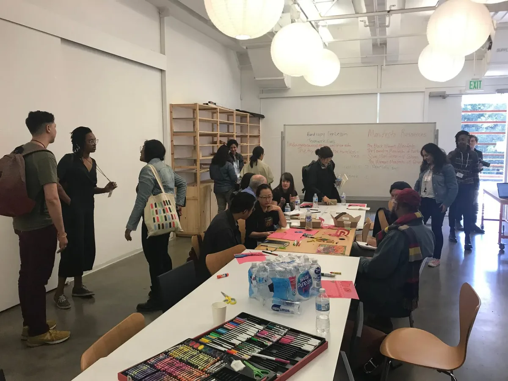
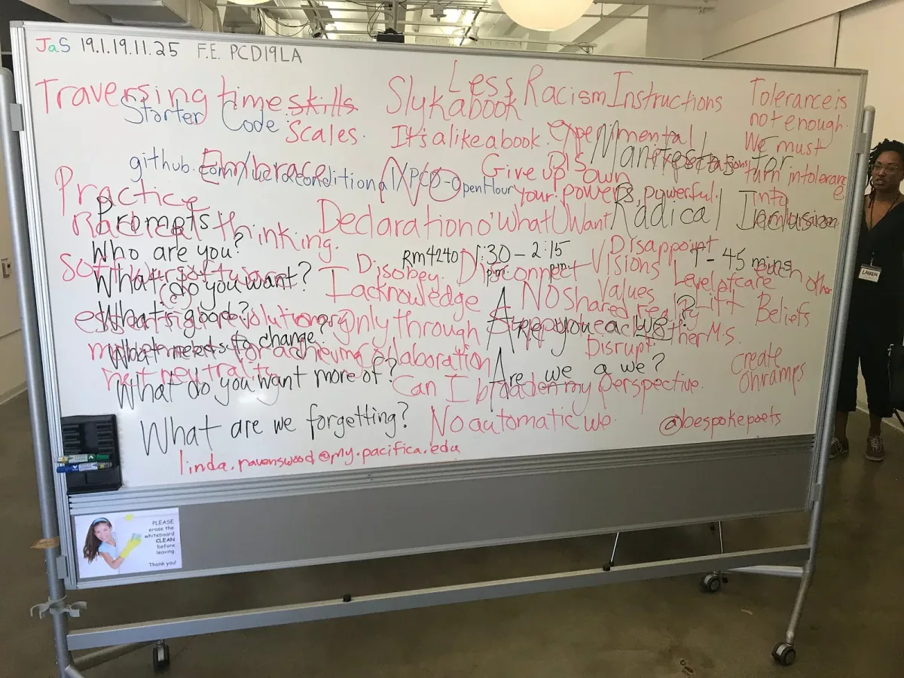
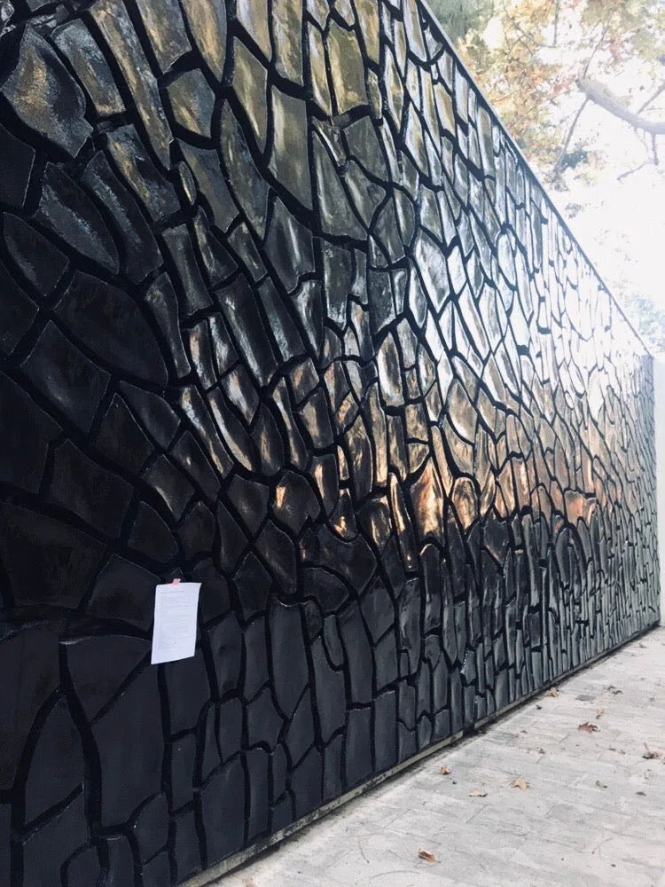
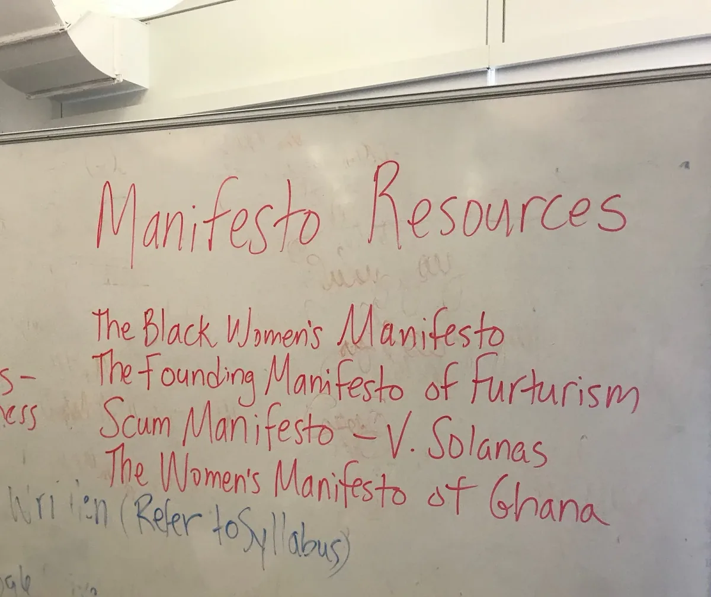

---

[Processing Community Day @ Los Angeles](https://day.processing.org/pcd-la-tracks.html) *— a day to celebrate art, code, and diversity — took place on January 19, 2019, at UCLA. This week we’ll be posting a series of reflections and interviews with the day’s participants and contributors.*

*Participants of the “Manifestos for Radical Inclusion” workshop, led by Linda Ravenswood. \[image description: Seventeen people sit and stand in a classroom. Some work at tables, with markers and colored paper, and some stand in small groups talking. There is a whiteboard at the head of the class with writing on it, some of which reads, “Manifesto Resources.”\]*

*The text below was collaboratively written by participants in the workshop “Manifestos for Radical Inclusion,” which was led by Linda Ravenswood, and was part of the Radical Pedagogy track.*

*Participants were asked to respond to the following prompts: Who are you? What do you want? What’s good? What needs to change? What do you want more of? What are we forgetting? Are you a we? Are we a we?*

---

I hate homophobia.

I want spaces that can support growth and jobs for the people who want to be involved.

I am excited about organizations that make space for other people to exist.

Take a scary problem and address it with urgency.

I focus on what first-generation college students need.

I want more of us (teachers) to help students use their own familial knowledge as first-hand knowledge.

I want everyone to consider that their only job is to feel things.

Our job is to hold ourselves accountable and that empathy is not necessarily innate — it is a skill to be practiced.

*Brainstorming! \[image description: A whiteboard covered with writing in different color inks, most of which is overlapping each other. The prompts for the workshop are in black ink and the responses are on top of it in red ink. Most of the phrases in red are included in the finished manifesto.\]*

More first-hand knowledge.

Students to be teachers.

Our only job is to feel.

Empathy is a skill that can be practiced.

Tolerance is not enough. We need to turn intolerance into acceptance and embrace.

I acknowledge that my singular frame of reference cannot intersect with the whole world and it is only in collaboration that I can broaden my perspective.

Traversing timescales, transcending boundaries, open your eyes.

*Copies of the manifesto were posted throughout the space at UCLA during Processing Community Day. \[image description: A letter-sized piece of paper with the text for Manifestos is taped to the large black wall of an outdoor sculpture at UCLA.\]*

Soft war, software. Softwar(e) is an essential revolutionary movement for achieving net neutrality.

Are we a we? No. I don’t have a shared understanding of anyone else’s reality. There is no automatic we, it is something that we have to work for.

Anti-racism. It requires someone in the room (usually white) giving something up. Not necessarily in an individualized way but also in a collective, role-based, and systemic way.

Deference and care about people other than ourselves.

Without recognizing that we all come from different places and have access to different platforms, we cannot have organizations with flat hierarchies. We need to create on-ramps in order for people to have access.

Dis-reversing. disown disobey disappoint disrupt disconnect.

I want to let go of the need (desire) to assimilate.

We need to support one another, we need to use our privilege to lift each other, embracing each other, accepting each other.

*Some inspiration for the workshop. \[image description: A close-up of the whiteboard. There are pieces of letters and words around the edge. In red ink, someone has written: “Manifesto Resources: The Black Women’s Manifesto, The Founding Manifesto of Futurism, Scum Manifesto — V. Solanas, The WOmen’s Manifesto of Ghana.”\]*

I want a culture that shares knowledge, not hoards it.

Responses over reactions. Understanding before reacting.

Lack of experience is not lack of potential.

I want more magic, irrationality, happiness, rest. Mischief.

---

[Linda Ravenswood](https://twitter.com/lindrave) *is a poet and performance artist from Los Angeles, California. She is Founder and EIC of The Los Angeles Press, and a fellow at The Women’s Centre for Creative Work. An educator, lecturer, and dramaturge, Linda is writer in residence for the California Writers Project / Yefe Nof Award 2018–2019. She was shortlisted for poet laureate of Los Angeles in 2017.*
