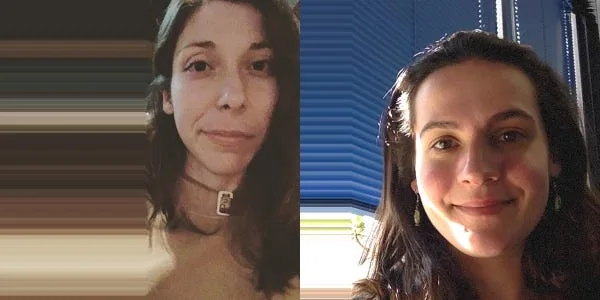
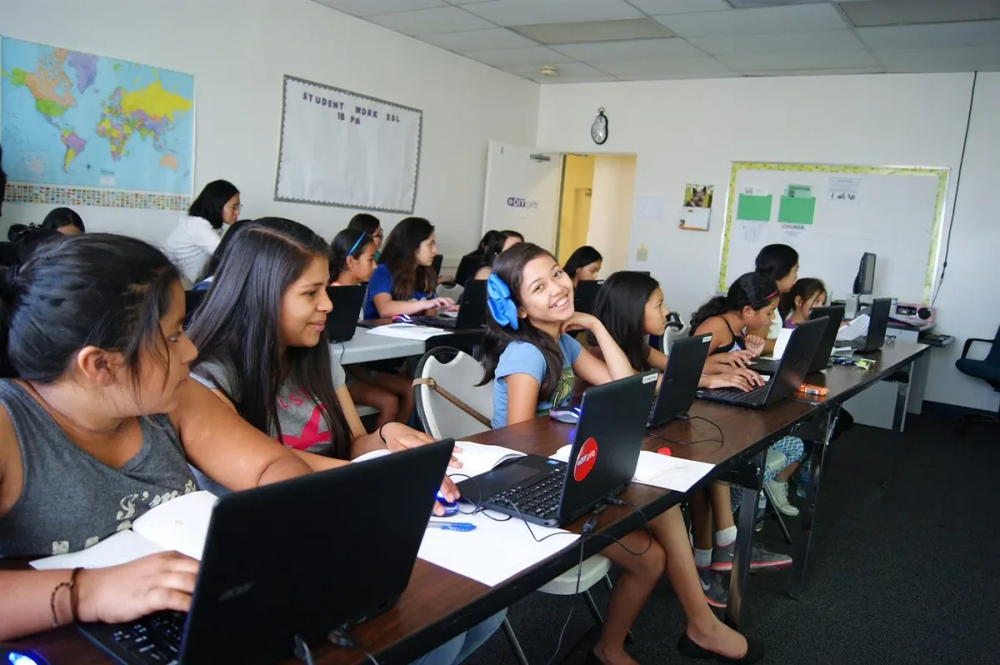
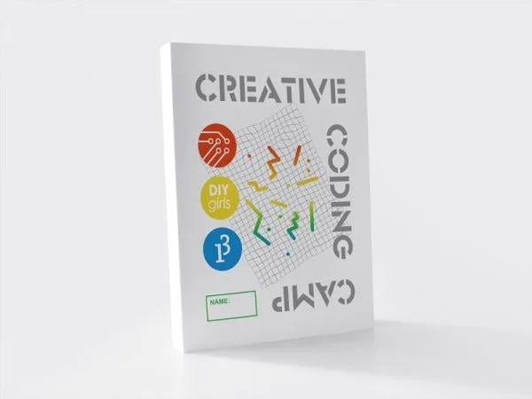
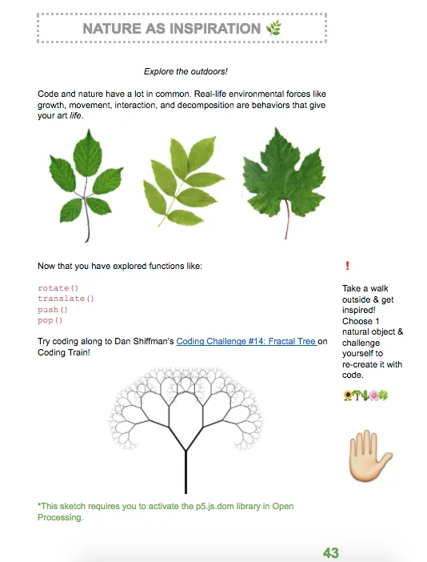
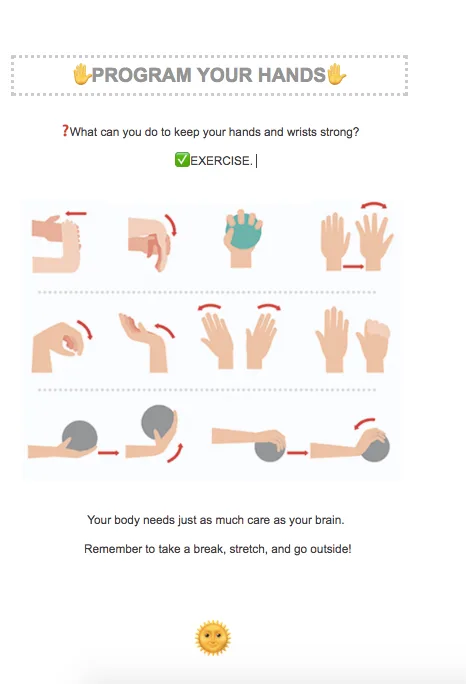
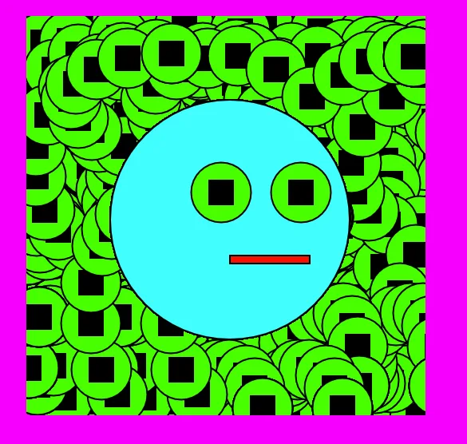

The 2017 Processing Foundation Fellowships supported an unprecedented seven research projects that expanded the p5.js and Processing softwares and their communities. Fellows developed work ranging from bilingual zines, to accessible coding curriculum to be taught in prisons, to workshops aimed at teaching code to women, non-binary, and femme-identifying folks. Throughout the summer we’ll be posting a series of articles — some written by the fellows, some in conversation with Director of Advocacy, Johanna Hedva — that showcase and document the great work by this year’s cohort.

---

*[DIY Girls](http://www.diygirls.org/) seeks to increase girl’s interest and success in STEAM through new educational experiences and mentor relationships. Sylvia Aguiñaga is the director of curriculum at DIY Girls and a digital media artist with [Y\_NIS](http://y-nis.com). Vanessa Landes is a program leader at DIY Girls and a Biomedical engineering PhD student at USC. They were mentored by [Jesse Cahn-Thompson](https://jessecahnthompson.com/) and [Lauren McCarthy](http://lauren-mccarthy.com/).*

[DIY Girls](http://www.diygirls.org/) seeks to increase girls’ interest and success in STEAM through new educational experiences and mentor relationships. For their fellowship, Sylvia and Vanessa of DIY Girls worked with their mentors to revamp the DIY Girls’ Processing curriculum, adding new projects, emphasizing programming in p5.js, and broadening accessibility by offering [English](https://drive.google.com/drive/folders/0B5F1OEnhrgInVG1uQ2lzRUtSbk0) and [Spanish](https://drive.google.com/drive/folders/0B5F1OEnhrgInN0I5TENJcWpKTlU) zines. The curriculum now has expanded introductory information that focuses on motivation for student learning, methods for ensuring that students can leave each class with a solid understanding of core concepts, and advanced challenges that help develop comprehension with fun, creative activities. The curriculum is now fully available in p5.js, and the zine is accessible both publicly online and in multiple languages. Shout out to translator and cultural consultant, [Gabriela Hussong](http://www.hussongtranslations.com/), for being a critical partner in this effort.

**DIY Girls Creative Coding Summer Camp 2016.**

In addition to translating the zine from Processing to p5.js, and from English to Spanish, DIY Girls’ Processing curriculum now includes several new [sections](https://drive.google.com/open?id=0B5F1OEnhrgInVm5waEtRTlNDWTA). The first is a “Career Connections” section, which demonstrates ways that skills learned with this curriculum can be used in fun, rewarding careers in the future, such as digital media artists, behavioral scientists, communications engineers, and fashion designers.

To help students develop a concrete understanding of abstract concepts, the p5.js vocabulary section was revamped to include real-world analogies for important vocabulary. For example, variables and operators relate to vending machines and the buttons on vending machines. Vending machines store things, like variables. Buttons on vending machines change the contents of the inside of a vending machine, like operators change the contents of a variable.

**Zine cover design by Nisa Karnsomport.**

A debugging section was also added to the p5.js zine. Debugging can be difficult and frustrating, especially for new programmers. The zine lays out a systematic approach for programmers to follow, including staying calm, comparing broken code with desired code, documentation of how to use code, and consulting with a peer or tutor for help. The zine also reminds programmers to celebrate the debugging process by hand-decorating an illustration of their first “bug,” describing their first bug, and explaining how they fixed it. Debugged code is an accomplishment worth celebrating!

*Inside the zine.*

After these beginning sections, the zine is broken up into nine sessions, where each is organized for a 1.5-hour class. The curriculum was revamped to support independent learning, following the [Five E’s structure of teaching](http://www.wisd.org/users/0001/docs/GVC/5E%20Model.pdf): Engage, Explore, Explain, Elaborate, Evaluate. Each session begins with an attention-grabbing example to motivate students to learn about a particular topic. Then, students have time to explore the topic on their own before a more formal explanation is given in a group setting with the teacher present. To elaborate and help solidify what they’ve learned, students then work on a project either on their own or in small groups. This time is designed to be the bulk of the class, so that students can maximize their amount of hands-on, DIY time. Finally, time for self-evaluation is done at the end of each session. “Exit tickets,” or questions that must be answered before leaving, making sure that girls understand core concepts, are created online using [Socrative](https://www.socrative.com). Instructors can view and use results to determine how the next session is organized.

*Inside the zine.*

Alongside the curriculum restructuring, material was developed to include a variety of linked, colorful, and creative examples, so that students will now have access to working code of their examples on the Processing website. Bonus challenges were added to each lesson for students who desire more activities beyond the basics, to develop an advanced understanding of each programming concept. Examples included making a “goofy face” in session one and creating a function to draw your favorite food in session five.

**DIY Girls Coding Challenges from the zine.**

We thank the Processing Foundation for providing DIY Girls with the opportunity to make this revision happen, and believe this opportunity will create new opportunities for young girls who learn from this curriculum.

Going forward after this fellowship, we’ll continue to spark coding fires in educators and kids where we can. Our next opportunity will be presenting in Puerto Rico for the [REFORMA National Conference](http://www.rnc6.com/) in September. *¡Manos a la obra! Empecemos.*

---

The DIY Girls Creative Coding zine is available: in [English](https://drive.google.com/drive/folders/0B5F1OEnhrgInVG1uQ2lzRUtSbk0) and [Spanish](https://drive.google.com/drive/folders/0B5F1OEnhrgInN0I5TENJcWpKTlU).
