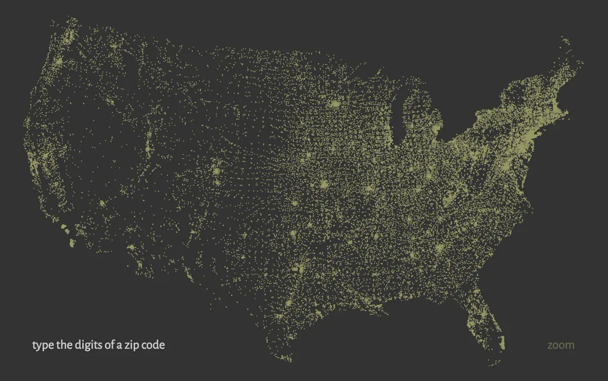
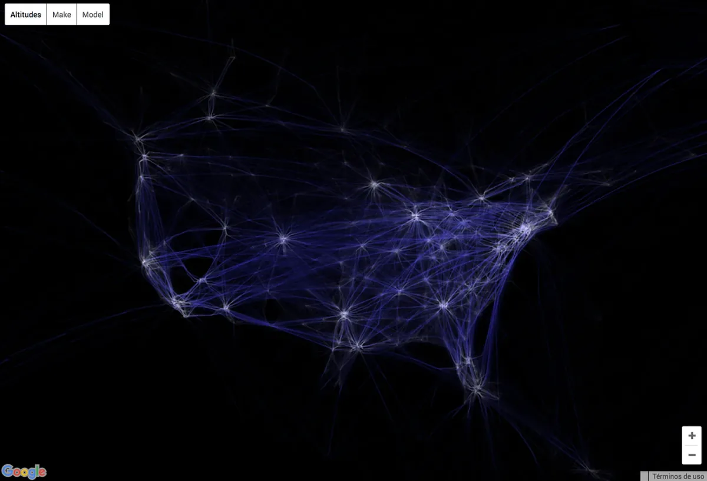
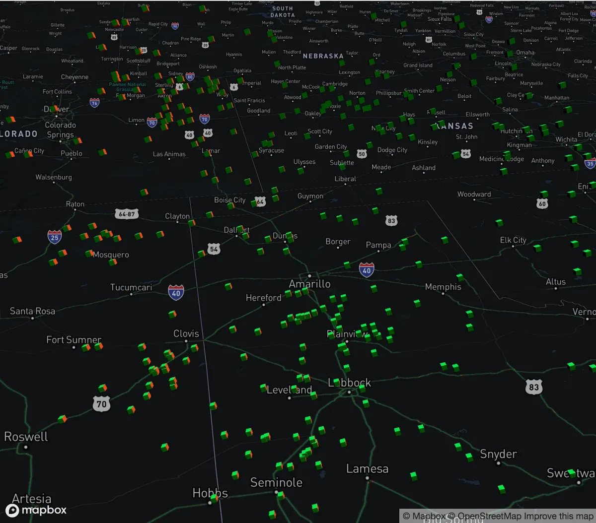
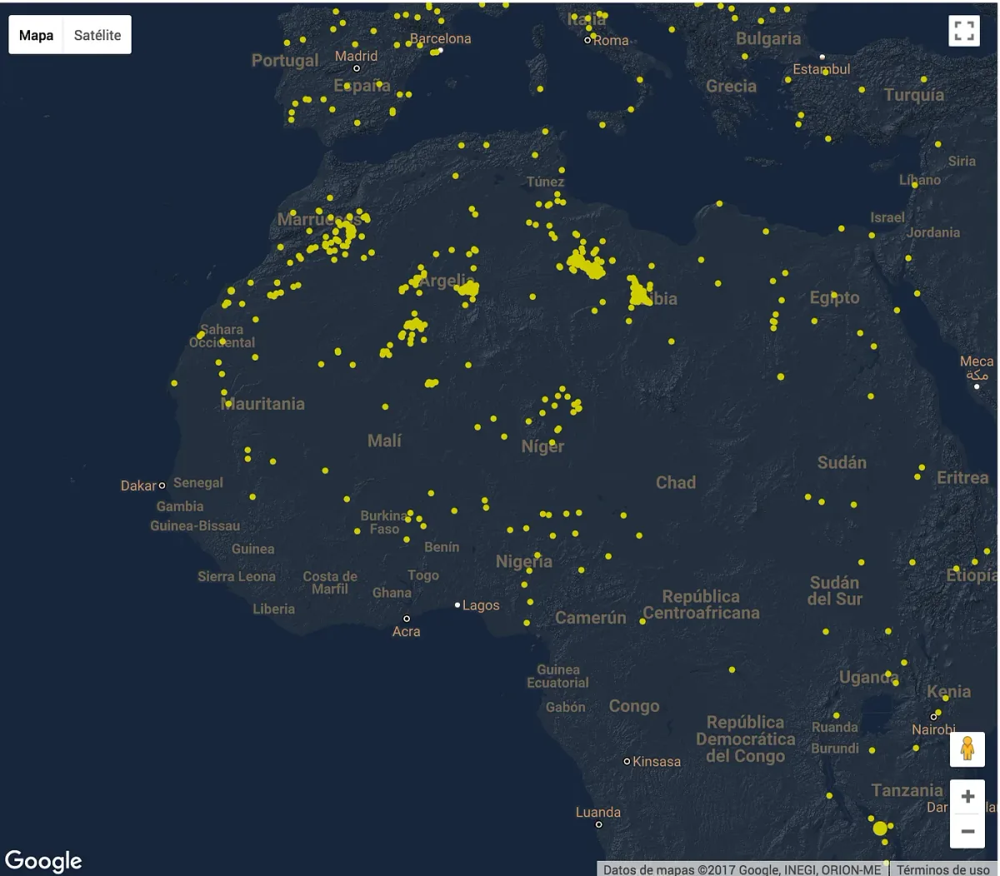

2017 marks the Processing Foundation’s sixth year participating in [Google Summer of Code](https://summerofcode.withgoogle.com/). We were able to offer sixteen positions to students. Now that the summer is wrapping up, we’ll be posting a few articles by students describing their projects.

By [Cristobal Valenzuela](http://cvalenzuelab.com/)  
mentored by [Daniel Shiffman](http://shiffman.net/)

My first experience with programming was through Mata, the language Stata uses for data and statistical analysis. I was doing econometric analysis as a senior student in Chile and programming was for me an abstract concept, where the output was always bounded to tables, rows, and dry numbers. Fortunately, in 2013 I learned about Processing and discovered projects like [“Flight Patterns” by Aaron Koblin](http://www.aaronkoblin.com/work/flightpatterns/), [“Zipdecode” by Ben Fry](http://benfry.com/zipdecode/), and “[Wind Map” by Fernanda Viégas and Martin Wattenberg](http://hint.fm/projects/wind/). Those visualizations made me realize the power of programming as a visual tool for creative endeavors. But inadvertently also, most of the projects I was curious about were built using some kind of map and so, I got interested in maps too.

*Zipdecode by Ben Fry.*

*Flight Patterns by Aaron Koblin.*

It wasn’t until I came to NYU’s [ITP](https://tisch.nyu.edu/itp), almost a year ago, and took a [wonderful class](https://github.com/MimiOnuoha/Data-and-digital-mapping-ITP2017) by Mimi Onohua, that I started using JavaScript to do mapping projects, using maps to represent data and visualizations. Yet most of the time I found myself wanting to add more interaction to my projects using p5.js, but realizing that resources were scarce and hard to grasp as first. Although D3 is the defacto library for this kind of work, the learning curve makes it daunting for less experienced people. So with summer on its way, I applied and got accepted to Google Summer of Code with the idea of developing a mapping add-on for p5.js.

I wanted to build something that would be simple to use and compatible with as many other mapping libraries as possible without taking away the full potential of them. The main concept is to facilitate work between p5 with existing map libraries and APIs by providing a layer between these two. Right now the add-on supports working with static maps (map images), use Google, Mapbox, or Mapzen APIs. It also allows the use of p5 over tile base maps with Google Maps, Mapbox, Mapbox-GL, Mapzen, Tangram, and Leaflet with any set of tiles and works with p5 in WEBGL mode too.

*A map made with MapboxGL with p5 in WEBGL.*

*p5 overlay over Google Maps.*

