We are also happy to receive support for two Teaching Fellows and two p5.js Fellows. This year’s Teaching Fellows are Computer Science teachers in the Software Engineering Program of New York City Public Schools, and their fellowships are a collaboration with the New York City Department of Education’s CS4All Initiative. The p5.js fellows will be taking on a leadership role in the p5.js project and working over the whole year to help guide the project to a 1.0 release. This work is supported in part by a grant from the Mozilla Open Source Support program.

The Processing Foundation Fellowships support artists, coders, and collectives in visionary projects that conceive a new direction for what our software and a community can do. Fellowships are an integral part of the Processing Foundation’s work developing empowering and accessible tools at the convergence of the arts and technology. Each Fellowship is supported through a stipend and mentorship from The Processing Foundation. For an archive of our past fellows, [click here](https://processingfoundation.org/fellowships), and to read our series of articles on the fellowships, [click here](https://medium.com/processing-foundation/https-medium-com-tag-pf-fellowships-la/home).

---

### Teaching Fellows

#### Layla Quinones

*Interactive Sonic Art*

mentored by Saber Khan, Processing Foundation Education Community Director

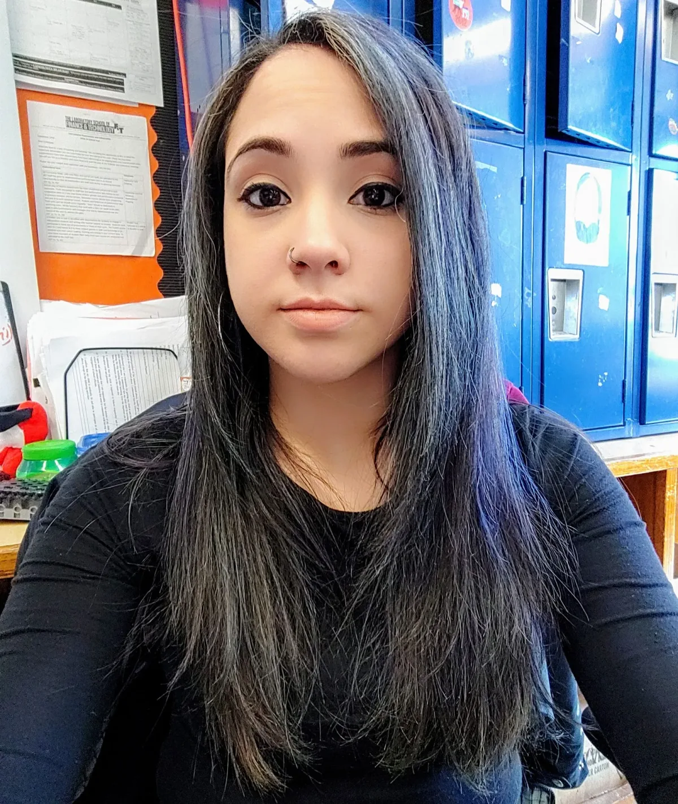

*[Layla Quinones](https://github.com/MsQCompSci/InteractiveSonicArtProject) teaches Computer Science & Math at MS/HS 223 in the Bronx. After receiving her BS and MA from NYU in Physics Education, she’s focused on spreading CS to communities throughout NYC. She is passionate about integrating CS across the curriculum and identifying entry points for CS in other subjects. \[image description: A closeup photo of a person with long dark hair, wearing a dark long-sleeved shirt.\]*

This project consists of developing curriculum that teaches students how to integrate sound, animation, and interactivity into a creative computational artifact in p5.js. The curriculum developed in this project will focus on reaching inner city and urban school communities who have little to no access to creative coding experiences. Emphasis is placed on developing tools in p5.js for teachers who have little experience teaching topics in CS.

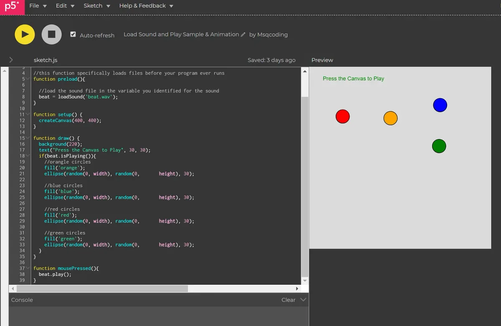

*\[image description: A screenshot of a program in p5.js, which shows the code on the left and displays four colored circles on the right as the program’s output.\]*

This will include a unit plan aligned to Common Core Learning Standards, Next Generation Science Standards; suggested pacing of topics leading to a Project Based Assessment Task; assessment tools to help drive instruction (trackers, summative assessments, and project based assessment tasks); protocol toolkit to facilitate lesson planning (discussion, group work, and feedback); and examples of highly effective lesson plans that include tiered activities for differentiated instruction. Expected results from this project include: meaningful contribution to CS4ALL curriculum in NYC; accessible tools teachers need to be successful in teaching CS through p5.js; bringing more relevant CS content to students that appeal to their interests and which foster a culture of creativity in CS; and inspiring ways students can expand their creativity by offering students exposure to a unique mode of expression.

---

#### Emily Fields

*Digital Dance*

mentored by Saber Khan

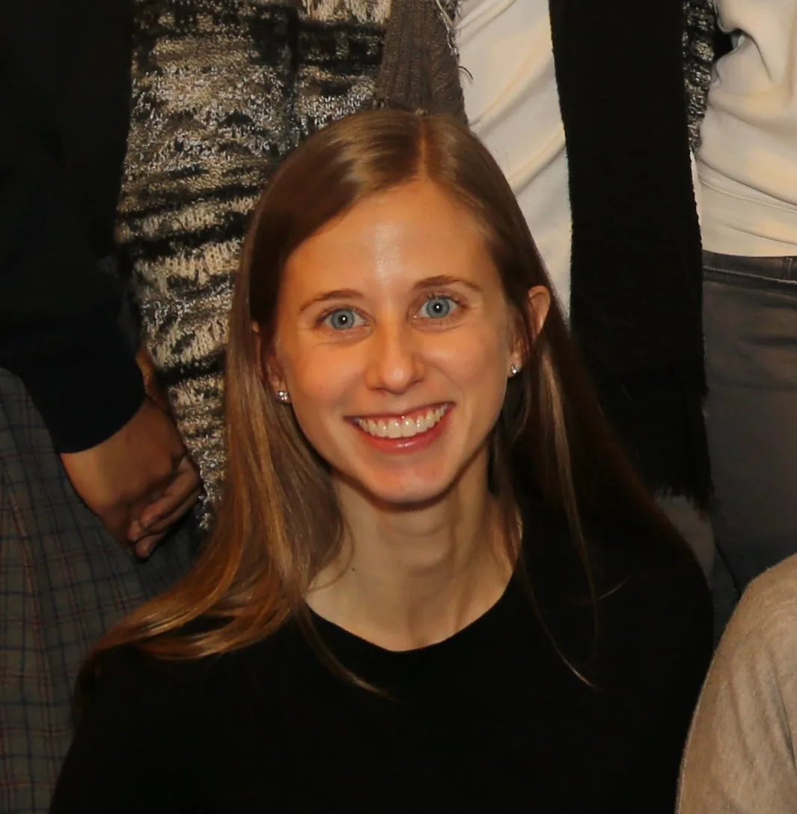

*[Emily Fields](https://www.youtube.com/watch?v=Z_Ac4gRJZbI) is a graduate of New York University. She is proud to be a math teacher and the STEM Director at The Young Women’s Leadership School of Astoria. She gains constant inspiration from her students and is passionate about supporting them as they pursue their dreams. \[image description: A closeup photo of a smiling person with blonde hair, wearing a black top.\]*

For this project, Emily and her students (middle and high schoolers at The Young Women’s Leadership School of Astoria) will experiment with edge and motion detection to track movements that will allow dancers to interact with graphics. They will create an interactive projection that dancers will use in their school’s annual Digital Dance production — a performance art piece that integrates coding, graphic design, animation, filmmaking, dance, and robotics. Together they will create effects that appear as if dancers are able to manipulate falling rain, throw fireballs from one side of the stage to the other, dance inside a tornado, and jump between moving boulders. Emily will also create a small unit of study incorporating her findings for the NYC Department of Education to share publicly with other computer science teachers this fall.

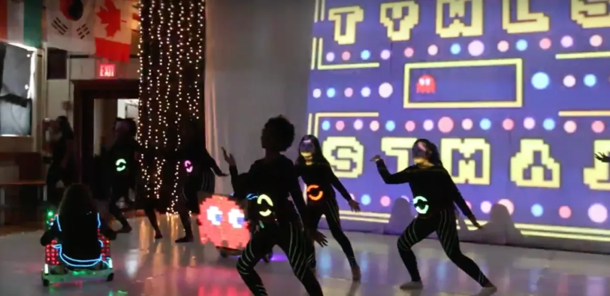

*\[image description: Seven people in black dance in front of a large projection. Behind them on a wall is a colorful display of letters, dots, and lines, that looks like the video game Space Invaders.\]*

---

### p5.js Fellows

#### **Stalgia Grigg and Evelyn Masso**

*p5.js 1.0*

mentored by Lauren McCarthy, Processing Foundation Board of Directors

*[Stalgia Grigg](http://stalgiagrigg.name/) is an artist and activist based in LA. He builds generative systems in an attempt to understand how revolutionary impulses move through culture. He first learned to code with Processing and has maintained an investment in the foundation ever since. Stalgia holds a BSVA from Purchase College and a MFA from UCLA Design Media Arts. \[image description: A black and white head shot of a smiling person with a septum piercing, wearing a white shirt.\]*

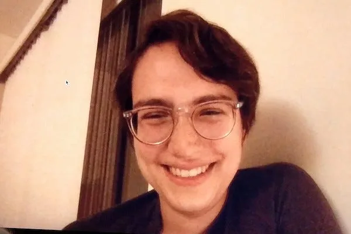

*Evelyn Masso is a person (all the time), a developer+designer (on weekdays), and a poet (on weekends). She currently works on GitHub Desktop and contributes to p5js. You can see her work at [github.com/outofambit](http://github.com/outofambit) and [outofambit.com](http://outofambit.com/). \[image description: A closeup photo of a smiling person wearing glasses, with short dark hair.\]*

Evelyn Masso and Stalgia Grigg will be working alongside the larger community of open source contributors to realize a 1.0 release of p5.js. The features, changes, and fixes that make up a 1.0 release are still in flux, and we are happy to hear from the community. Feel free to contribute to the discussion [here](https://github.com/processing/p5.js/issues/3418).

Stalgia will kick off the fellowship with a focus on WebGL stability improvements, expanding developer documentation, and creating new channels of communication for contributors.

Evelyn will also be focusing on various tooling in the p5.js repository to improve the p5.js contributor experience.

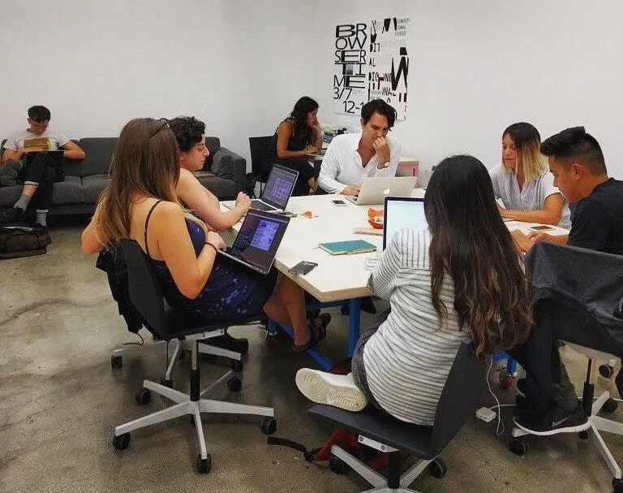

*\[image description: Stalgia Grigg, Evelyn Masso, and Lauren McCarthy work with five others on laptops at desks and tables in a white room.\]*

---

### Processing Foundation Fellows

#### Prince Steven Annor

*SuaCode*

mentored by George Boateng, 2018 Processing Foundation Fellow

*Prince Steven Annor is a multimedia engineer/hobbyist, developer, and educator from Ghana. He is a Computer Engineering junior at New York University Abu Dhabi and the Lead of SuaCode at [Nsesa Foundation](https://nsesafoundation.org/), an educational nonprofit whose vision is to spur an innovation revolution in Africa. Prince is also an IEEE published undergraduate researcher, and he organizes, teaches, and mentors at coding workshops in the UAE and in Ghana. \[image description: A medium shot of a person wearing a dark blue top and sunglasses. He is crossing his arms in front of his chest and making fists.\]*

Last year [2018 Processing Foundation Fellow George Boateng](https://medium.com/@ProcessingOrg/suacode-breaking-the-coding-barrier-in-africa-with-smartphones-f41a3e432199) piloted SuaCode, a smartphone-based coding course with 30 high school and college students in Ghana. Having assisted George on the project as a member of his team, my proposed project seeks to build upon that work and scale it to more people. In this project, I plan to develop an automatic grading system, recruit mentors, and deliver the smartphone-based online coding course to introduce programming using Processing to 100 high school and college students in different parts of the African continent. Students can access the course lesson notes on Google Classroom, a free learning management system, and then program their assignments using the Android Processing Development Environment (APDE) app. The programming course will introduce students to fundamental programming concepts in a visual and fun way through the development of a pong game. A GitHub repository that contains sample Processing sketches which illustrate concepts in the course will be provided to students for cloning their APDE app. Students will submit assignments for grading and receive feedback as they go through the course. At the end of the course, students will have developed fundamental programming skills and built a pong game using Processing.

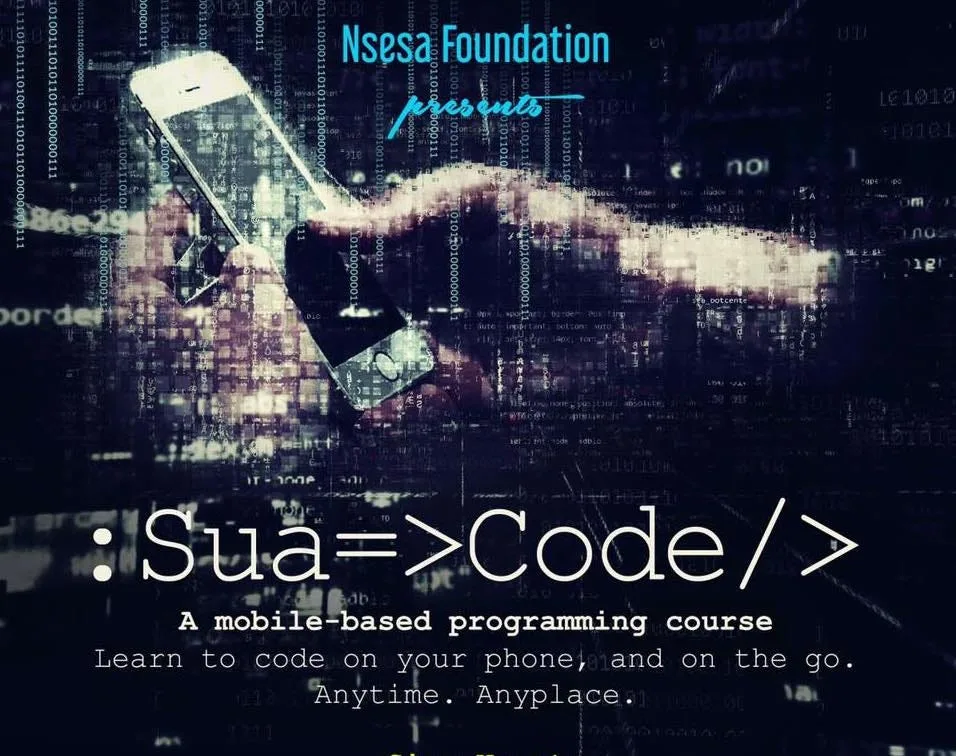

*\[image description: An illustration of two hands holding a phone against a black background. Their are graphics of code throughout the image. The text on the image reads: “Nsesa Foundation presents :Sua=>Code/> A mobile-based programming course. Learn to code on your phone, and on the go. Anytime. Anyplace.”\]*

George Boateng is an educator, computer scientist, and engineer from Ghana, and a 2018 Processing Foundation Fellow. He is a PhD Candidate and Doctoral Researcher at ETH Zurich, Switzerland, where he is developing a smartwatch-based algorithm for multimodal emotion recognition among romantic couples for diabetes management. He is a Cofounder and President of Nsesa Foundation, an educational nonprofit whose vision is to spur an innovation revolution in Africa — a movement in which young Africans are building innovative solutions to problems in their communities using STEM. George has a BA in Computer Science, and an MS in Computer Engineering from Dartmouth College.

#### Manaswini Das, Nancy Chauhan, and Shaharyar Shamshi

*Making Processing Tools Accessible to the Indian Community*

mentored by [Mathura Govindarajan](http://mathuramg.com/)

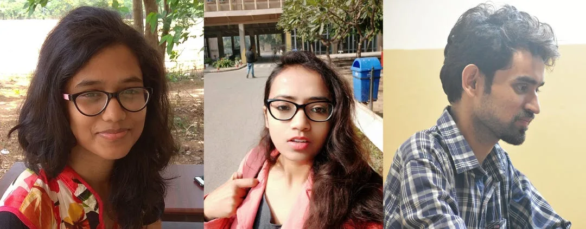

*Manaswini Das (left) is a computer science undergraduate from College of Engineering and Technology, Bhubaneswar, India. She actively contributes to open source software and is an Outreachy alumna from Open Humans Foundation. She aspires to be part of technologies that touch people’s lives. Her hobbies include poetry, blogging, and basketball. [Nancy Chauhan](https://nancy-chauhan.github.io/) (center) loves to learn and explore. She is an electronics hobbyist and artist, and an open source software and hardware contributor from Noida, India. She is currently pursuing a Bachelor of Technology in Electronics and Communication Engineering from the Indian Institute of Information and Technology, Una. Her Github is [here](https://github.com/Nancy-Chauhan). [Shaharyar Shamshi](https://github.com/shaharyar-shamshi) (right) is a final-year undergraduate student at Indian Institute of lnformation Technology, Una. He loves to solve logical problems, is an open source enthusiast, and promotes open source among college friends through various workshop and hackathons. \[image description: A triptych of images. On the left is a closeup of a person with long dark hair, glasses, and a floral print shirt. In the center is a closeup of a person with long dark hair, glasses, and a pink jacket. On the right is a photo of a person in profile, wearing a plaid collared shirt.\]*

Based on the most recent UN data, the population of India is estimated at 1.35 billion and 80 percent reads or understands Hindi. Approximately more than 85 percent of India’s population lives in the lower or middle income bracket, which often does not have the resources to afford classes for computer programming. We intend to use Processing to serve the Indian community, by translating the p5.js website and documentation to Hindi; providing p5.js YouTube tutorials in Hindi; and reaching out to non-governmental organizations that emphasize and impart software literacy among underprivileged students.

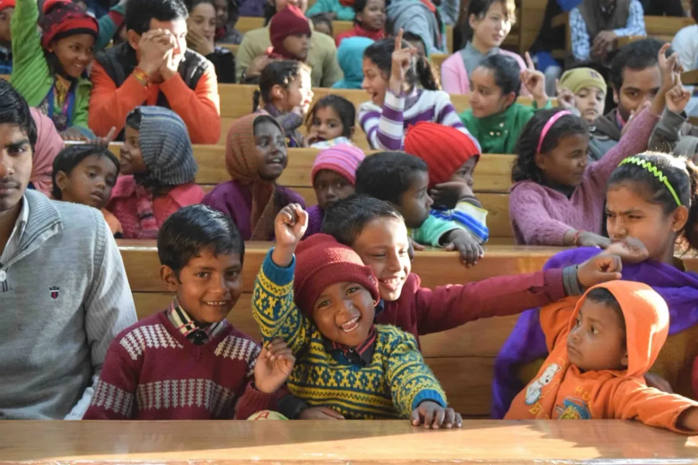

*\[image description: A photo of about 30 children and a couple adults. Several of the kids are smiling with their arms raised and looking into the camera.\]*

[Mathura Govindarajan](http://mathuramg.com/) is a software engineer and creative technologist from Bangalore, India. She holds a Bachelors in Electronics Engineering and completed her Masters and Fellowship at New York University’s Interactive Telecommunications program. She was a Processing Fellow in 2018 and [was part of a team that worked on making p5.js more accessible to users with low vision and blindness](https://medium.com/processing-foundation/working-on-the-p5-accessibility-project-58a781575400). Currently working on two education-based startups in New York and Bangalore, she enjoys making educational experiences and tools for children and adults alike.

---

#### Doeke Wartena

*An Immediate Graphic User Interface Library for Processing*

mentored by Casey Reas

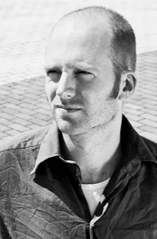

*Doeke Wartena is a graphic and interaction designer working across the fields of creative code, typography, and data visualization. Besides that he runs a hard software lab at ArtEZ University of the Arts, in Arnhem, the Netherlands. When it comes to software, both performance as well as an easy-to-use API, are important goals for him. \[image description: A black and white head shot of a person wearing a dark collared shirt.\]*

During my fellowship I will be working on a library for creating a Graphical User Interface (GUI). Instead of the traditionally retained mode GUI system, this library is using an immediate mode (IMGUI) where the whole UI is created each frame. The IMGUI was an idea of Casey Muratori back in 2002 and is slowly getting more momentum.

This immediate mode avoids a per UI element initialization and the need of registering callbacks. It allows for elements to be created on the fly, which allows for more dynamic interfaces. To give a concrete example “if (on(CLICK, button())) println(“!”)” would create a button and when clicking it would print “!” in the console. My goals are to make people more productive by implementing graphical user interfaces instead of making them less productive by implementing graphical user interfaces. Along with this, making custom styles should be easy and understandable without the need of reading a lot of documentation. I’m hoping to address issues where the web world took a wrong turn.

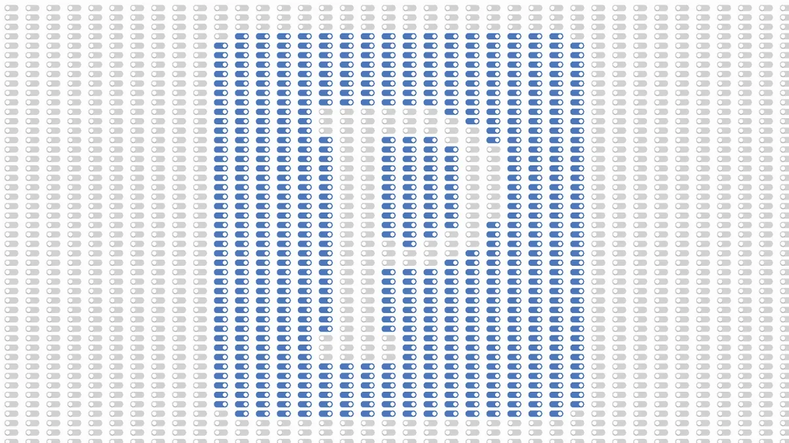

*\[image description: A graphic in gray, white, and blue, that shows the capital letter P drawn inside a blue square, inside a gray rectangle. The image’s pixels are made up of a graphic of a rectangular ellipse, with a circle inside of it on either the left or right end.\]*

---

#### Matilda Wysocki

*Pride Peers Programming Prosperous Protection, aka P5*

mentored by Dan Shiffman

*Matilda is a trans organizer, programmer, and artist with an interest in building tech infrastructure for organizing within and across boundaries, problematizing our catastrophic notion of community, and contributing to systems to uproot unjust socioeconomic systems. \[image description: A person with long curly hair smiles and looks to the right. They are wearing a blue jacket.\]*

I will be spending time teaching trans and gender nonconforming youth basic programming and design in a queer, privacy and digital literacy context. There will be support and resources for those who wish to deepen their skills as developers afterward, to have a tool for self expression and community building, or to just understand the forces shaping our world a little better. This project will almost certainly be six-hour classes on weekends, but ultimately depends on the schedule of the space and students. The space will most likely be the [Ali Forney Center](https://www.aliforneycenter.org/), where I stay. To supplement the programming and art experience, I hope to include guest speakers to discuss AI and its impact on society, personal digital security, online harassment, mass surveillance, automation, and work. The class projects have been adapted to fit the class’s interests and to help facilitate discussions around the above ideas. I was originally asked to teach programming as part of a budding multimedia training initiative for TGNC youth, and my hope is that this will be the first of many classes as a part of such a program.

*\[image description: Many circles drawn within each other overlap throughout the image. Their rings follow a color pattern, with purple at the center, then blue, green, yellow, orange, and red.\]*

---

#### Qianqian Ye

*Expand and Diversify P5.js in China*

mentored by Dorothy Santos

*[Qianqian Ye](http://www.qianqian-ye.com/) is a Chinese born and raised artist/designer based in San Francisco. Emerging from an architecture background, she explores the complexities of human interaction [in various media](https://www.instagram.com/44ian/) including installation, performance, and ink. Her GitHub is [here](https://github.com/Qianqianye). \[image description: A person with short black hair and red lipstick looks into the camera with her arms crossed in front of her. She is wearing a black top. There are rows of white windows behind her.\]*

My project aims to make p5.js more accessible in China, especially within underrepresented women and non-male identified groups. After having the p5.js website and documentation translated into Chinese in 2018 [by Foundation Fellow Kenneth Lim](https://medium.com/processing-foundation/chinese-translation-for-p5-js-and-preparing-a-future-of-more-translations-b56843ea096e), we have more work to do to activate and cultivate the young Processing and p5.js communities in China. To counter the fact that most online educational resources such as YouTube are banned in China, I will record p5.js video tutorials for beginners in Chinese and share them on Chinese video sites. I am also planning to partner with other female Chinese creative coders to host p5.js workshops for girls, women, and other non-male identified people in China, as well as post interviews with role models in the Processing and p5.js community on Chinese social media. Throughout the process, I will explore socially conscious, culturally sensitive, and non-western models of teaching creative coding. By teaching women and non-male identified people p5.js, we can promote diversity and activate marginalized communities within China in new ways. In the future, I hope this project will inspire people from other minority groups in China to participate in the creative coding community.

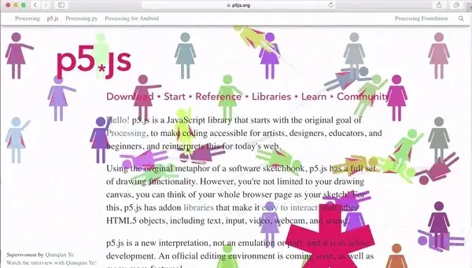

*\[image description: An animated gif that shows the p5js.org home page animated with illustrations of a the universal symbol for female. The figures are different colors, and wave and fly around the page.\]*
