The Processing Foundation Fellowships support artists, coders, and collectives in visionary projects that conceive a new direction for what our software and a community can do. Fellowships are an integral part of the Processing Foundation’s work developing empowering and accessible tools at the convergence of the arts and technology. Each Fellowship is supported through a stipend and mentorship from The Processing Foundation.

For an archive of our past fellows, [click here](https://processingfoundation.org/fellowships), and to read our series of articles on the fellowships, [click here](https://medium.com/processing-foundation/https-medium-com-tag-pf-fellowships-la/home).

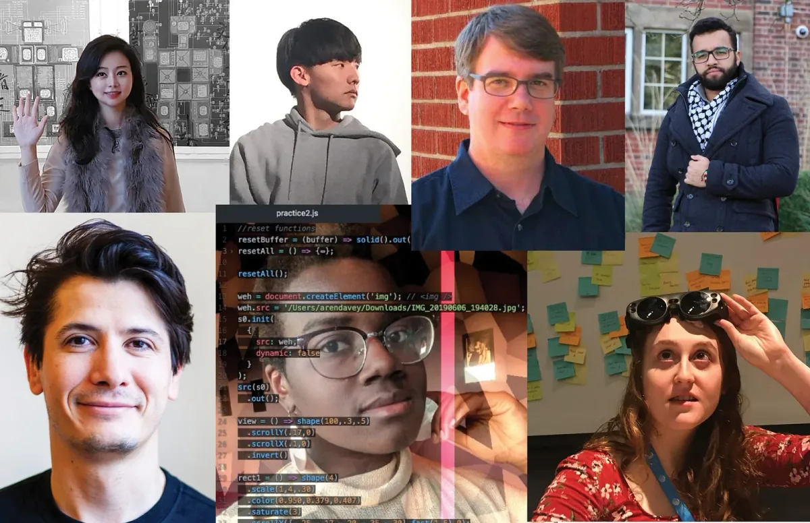

*Meet our 2020 Fellowship cohort! Top row, from left: Inhwa Yeom and Seonghyeon Kim; Michael O’Connell; and Abdellah Iraamane. Bottom row, from left: George Profenza; Aren Davey; and Kalila Shapiro.*

---

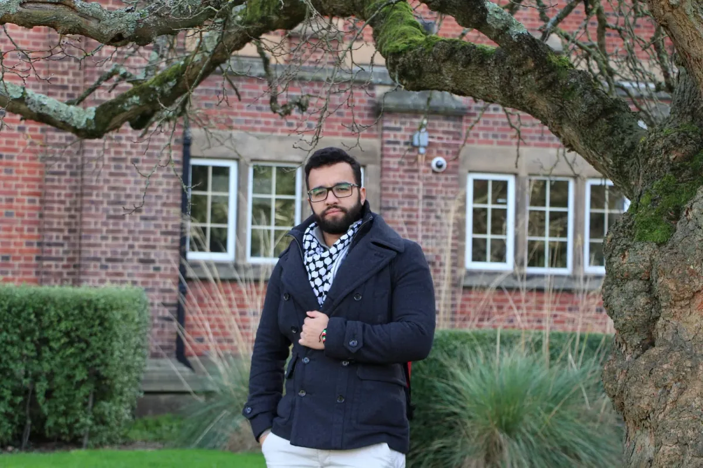

*[Abdellah Iraamane](https://www.linkedin.com/in/aairaamane/) is a Moroccan software engineer and social activist based in Dublin, Ireland. He has been working on youth development projects aiming to enhance and build the capacities of rural and suburban youth, alongside a full-time career as a developer. He likes clean code and pizza, and strives to achieve universal access to quality education.*

### Abdellah Iraamane

#### Make-IT V2: Enabling universal access to technology

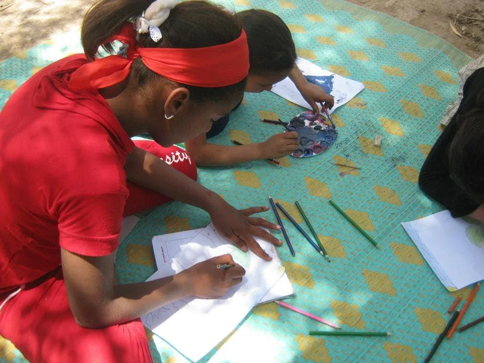

*Alt text: Two children, one of whom is wearing red, draw on white paper using paint and colored crayons.*

We will explore the advantages and challenges of learning to code for first-timers using creative coding techniques vs. the traditional “tutorial-based” model. We hypothesize that using creative techniques to teach code will result in fewer dropout rates, more engagement from communities who have not learned to code before, and more motivation for educators to be creative in their teaching ways, especially in cases where they themselves will have to learn to code before teaching children how to code.

This project will focus on a specific community landscape with very little to no knowledge of code, in remote villages in the rural southern regions of Morocco. The context there is particular: there are no educators qualified to teach code in the traditional model.The context of the project is also unique in the sense that the target community does not speak the official language of the country, and hence we will research the possibility of teaching both the language and code through Processing software simultaneously.

In the grand scheme of things, we want to achieve universal, long-lasting access to code, in contrast to the traditional solutions that eventually fade because the learning curve becomes too steep to follow.

Abdellah will be mentored by mentored by George Boateng, who was a Fellow in 2018, and served as a mentor for Prince Steven Annor, a 2019 Fellow.

[George Boateng](https://www.linkedin.com/in/georgegboateng/) is a computer scientist, engineer, and educator from Ghana. He is a PhD Candidate at ETH Zurich, Switzerland, where he is developing a smartwatch-based algorithm for multimodal emotion recognition among couples for diabetes management. He is the President and Cofounder of [Nsesa Foundation](https://nsesafoundation.org/), an educational nonprofit whose vision is to spur an “Innovation Revolution” in Africa — a movement in which young Africans are building innovative solutions to problems in their communities using STEM. George has a B.A. in Computer Science and an M.S. in Computer Engineering from Dartmouth College.

---

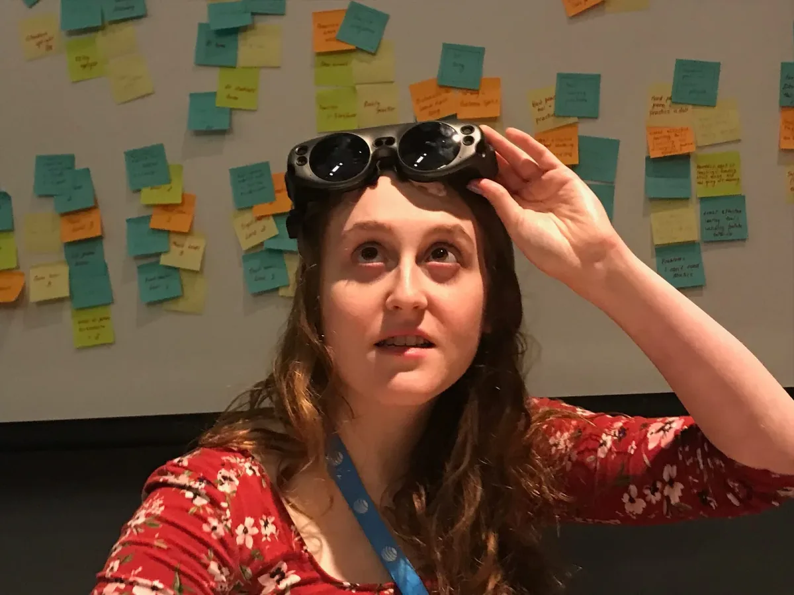

*[Kalila Shapiro](https://www.kalilashapiro.com) is a researcher, creative technologist, and human-computer interaction designer. She is writing a series of pieces on the ethics of virtual reality for All Tech Is Human, is the Social Media Lead for MedVR, and is the deputy leader of the Application Accessibility group for XR Access. Her GitHub is [here](https://github.com/kalilashapiro).*

### Kalila Shapiro

#### Know Your Rights

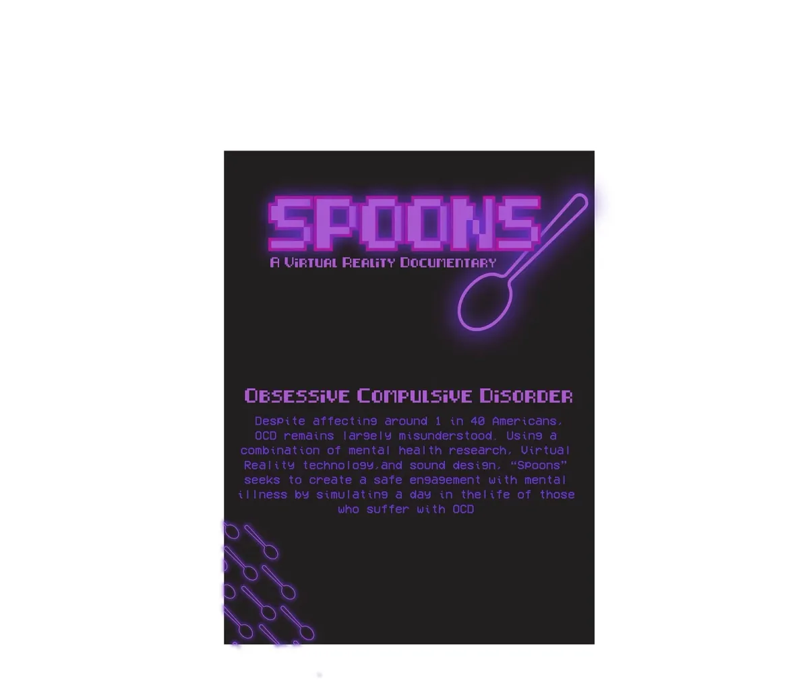

*Alt text: A poster for “Spoons,” a virtual reality documentary by Kalila Shapiro. It has a black background with neon purple text in an 8-bit, video game-esque font. At the top, it reads “Spoons” with a subtitle saying “A Virtual Reality Documentary.” To the right of (and slightly behind) those words is the outline of a spoon, also in neon purple. Halfway down the poster, it reads “Obsessive Compulsive Disorder.” Below this, in non-neon and slightly darker purple text, it reads: “Despite affecting around 1 in 40 Americans, OCD remains largely misunderstood. Using a combination of mental health research, Virtual Reality technology, and sound design, ‘Spoons’ seeks to create a safe engagement with mental illness by stimulating a day in the life of those who suffer with OCD.” In the bottom left corner, there are small neon purple spoons running diagonally in and out of the poster. They enter through the side left and exit on the bottom.*

I will use Processing (specifically the p5.js library) to develop a website called knowyourrights.com, that helps people with disabilities understand their rights in clear and simple visualizations. I will highlight the disparities in employment and quality of life between the disabled and abled communities, and make people feel comfortable standing up for themselves when the laws that protect them are being violated. Despite the fact that the Americans with Disabilities Act (the ADA) was signed into law nearly 30 years ago, only 56 perfect of disabled Americans are employed.

knowyourrights.com will be an interactive online space that clearly and concisely displays different aspects of the law in both text and visualizations — with specific focus on the sections of the ADA that protect students and Section 504 of the Rehabilitation Act of 1973. This section will be the main focus because education remains largely inaccessible for many students with disabilities. This will be a law visualization project, and would be a helpful alternative to sites like adata.org and ada.gov, which are dense with legal terms. It will also be web accessible according to W3 standards.

Kalila will be mentored by Luis Morales-Navarro, who was a 2018 Fellow, and Claire Kearney-Volpe, a 2016 Fellow and a current member of Processing Foundation’s Board of Advisors.

[Luis Morales-Navarro](http://lm-n.com) is a graduate student in the Learning Sciences and Technologies program at the University of Pennsylvania. He is interested in issues of access and inclusion within STEM, and the role communities play in creative learning and the development of computational fluency. Before coming to Penn, he was a k-9 Computer Science teacher and curriculum developer. Luis was a 2018 Processing Foundation Fellow and, from May 2016 to May 2018, a Resident Fellow in Interactive Media Arts at NYU in Shanghai.

[Claire Kearney-Volpe](https://www.clairekv.com/) is an art therapist, digital accessibility professional, designer, and researcher. She holds a Master’s Degree from New York University’s Interactive Telecommunications Program and is currently a PhD Candidate in NYU’s Rehabilitation Sciences Program, Web Accessibility Fellow at CUNY, and Research Fellow at the NYU Ability Project. Her work centers around participatory design, disability, human computer interaction, as well as the accessibility of code languages and code pedagogy.

---

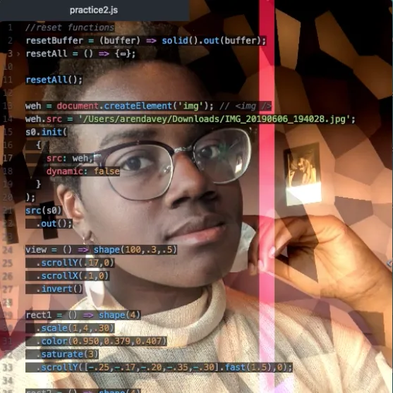

*Aren Davey is a developer, artist, and aspiring graphic designer currently based in Pittsburgh. She is currently an undergraduate student at Carnegie Mellon University, pursuing a Bachelor of Computer Science and Fine Arts. She strives to break the stereotypes of programming by showing that it can be warm, playful, and spontaneous. In her downtime, she likes to steep tea, play video games, and pay homage to hexagons. Her github is [here](https://github.com/aahdee).*

### Aren Davey

#### Cozy Coding

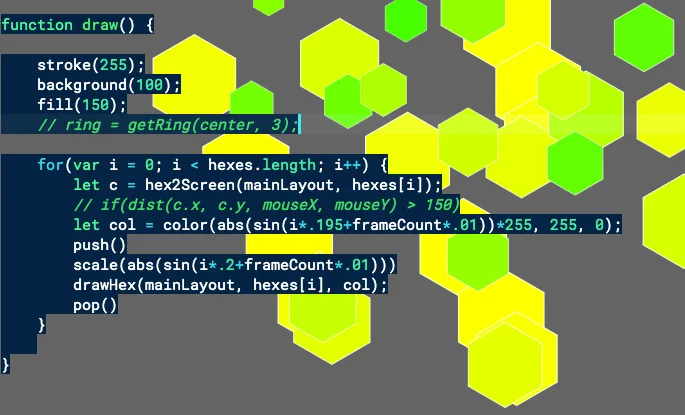

*Alt text: Many hexagons of varying shades of yellow and green are arranged over a grey background. The code that generates the image is overlaid on top in white and green text.*

Cozy Coding is a series of cozy weekly Twitch streams that hosts interactive p5.js tutorials and lessons. For each stream, there will be a chosen topic that I will research and demonstrate to viewers. Viewers can code along with me via the p5.js editor, and ask me questions in the chat and receive answers in real time. The environment of the streams will be relaxed, warm, and nonchalant — this isn’t a boring class lecture — so there is a lot of freedom for the direction of the stream. Some of the chosen streams will be collaborative live coding jam sessions, where the viewers will be able to code with me on a single project and create something interesting together.

Aren Davey will be mentored by Daniel Shiffman, who is a member of Processing Foundation’s Board of Directors.

[Daniel Shiffman](http://shiffman.net/) works as an Associate Arts Professor at the Interactive Telecommunications Program at NYU’s Tisch School of the Arts. Originally from Baltimore, Daniel received a BA in Mathematics and Philosophy from Yale University and a master’s degree from the Interactive Telecommunications Program. He is the author of *Learning Processing: A Beginner’s Guide to Programming Images, Animation, and Interaction* and *The Nature of Code* (self-published via Kickstarter), an open source book about simulating natural phenomenon in Processing.

---

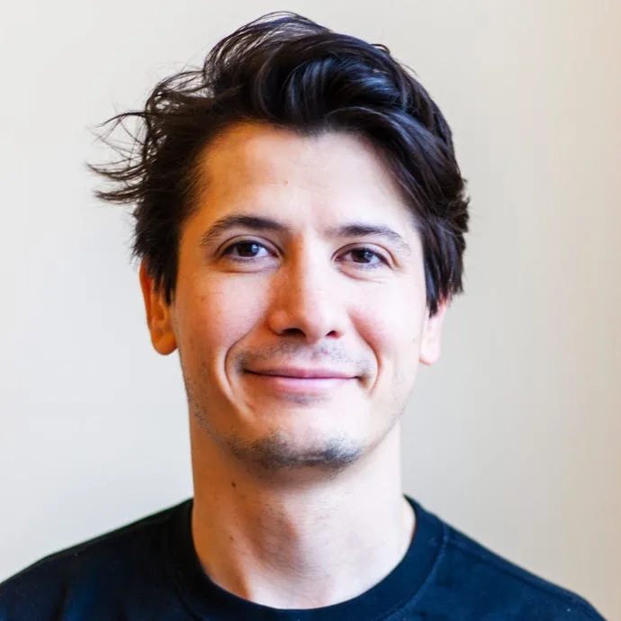

*[George Profenza](http://sensori.al/) is a London-based, Romanian-born creative technologist, most-of-the-time socially functioning nerd, all-around fix-it-code-champion, and chaser of rabbit holes. He spends his spare time bringing robots and puppets to life and finding artistic inspiration in paper folding, doodling, and complex geometry. His GitHub is [here](https://github.com/orgicus/).*

### George Profenza

#### Processing ❤️OpenCV

*Alt text: A bright circular LED panel in front of a partially visible city street with trees. The panel displays the image of a white woman laughing. Two illustrated, bright red, heart-shaped balloons cover her eyes.*

The latest version of OpenCV has a lot of extra functionalities.  
One important feature is the DNN module, which makes it easy to interface with deep neural network frozen graphs from major frameworks such as TensorFlow and Caffe, accessing networks like YOLO, OpenPose, Face Landmarks, etc.  
For interactive art installations and other creative projects, George believes access to an updated free open source library will be beneficial for the Processing community. This could be for either Processing Java mode or p5.js using OpenCV.js.

Such an update would be a good foundation for teaching workshops, covering areas such as:  
● image filters (e.g., understanding convolution/making custom kernels)  
● computer vision basics (frame differencing/bg subtraction, color tracking, blob detection, etc.)  
● advanced topics (image classification, facial landmark detection, pose estimation, etc.)

George will be mentored by Golan Levin.

[Golan Levin](http://www.flong.com/) is a Professor of Art at Carnegie Mellon University, where he also holds courtesy appointments in CMU’s schools of Architecture, Computer Science, and Design. Since 2009, Levin has also served as Director of CMU’s Frank-Ratchye STUDIO for Creative Inquiry, a laboratory for atypical and anti-disciplinary research across the arts, science, technology, and culture. As an educator, Golan’s pedagogy is concerned with reclaiming computation as a medium of personal expression. He teaches “studio art courses in computer science,” on themes like interactive art, generative form, digital fabrication, information visualization, and audiovisual performance.

---

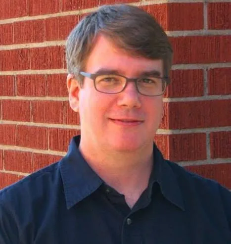

*Michael O’Connell teaches coding and computational thinking to more than 100 students in grades 2–6 each semester via coding clubs and camps. Previously, Michael focused on helping millions of developers and IT professionals as founding Editorial Director of [IBM developerWorks](https://en.wikipedia.org/wiki/IBM_developerWorks) and founding Editor in Chief of IDG’s [JavaWorld](http://www.javaworld.com).*

### Michael O’Connell

#### Creative Coding & Computational Thinking for Young Students

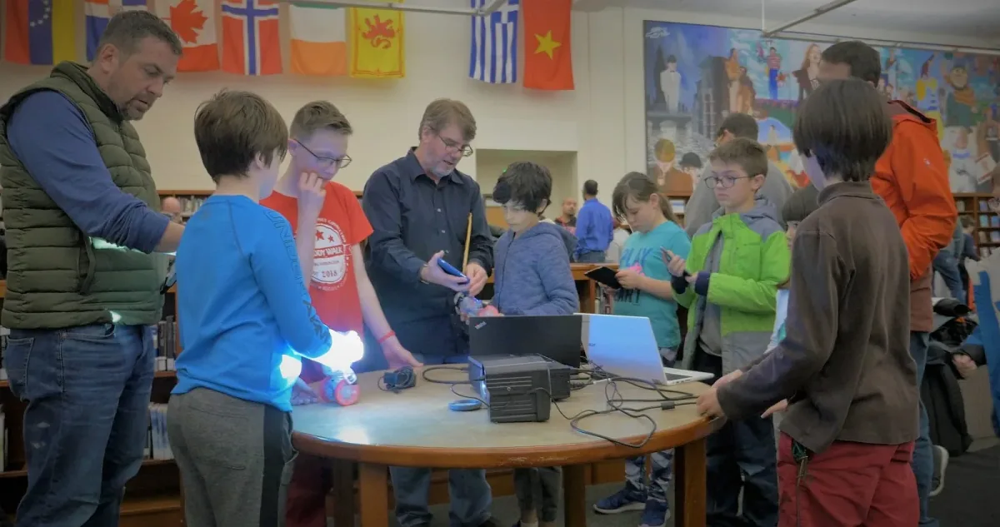

*Alt text: A photo of six children, two parents, and an instructor gathered around a tablet, with two small robots and two laptop computers listening to the instructor.*

This project strives to curate, create, and pilot p5.js activities and lessons to help children ages 8–12 more easily learn coding and computational thinking. I hope to better engage students by inspiring them to create visually, and to develop script-based coding skills, and thus go beyond Scratch and code.org. I will draw from my training and experience with p5.js and years of teaching coding to grade-school students, starting with activities like the “first sketch” exercise in the p5js.org Get Started page. I plan on referencing the work of other Processing Foundation Fellows, including Niklas Peters and Layla Quinones, and incorporating simple.js and perhaps other libraries to help make p5.js easier for new young coders before they reach middle school. I will then employ these exercises with the coding clubs I lead, allowing me to pilot, iterate, and collect feedback from 100+ students. My goal is to make coding and computational thinking more broadly accessible and to better reach younger students, for whom a more traditional script programming curriculum may not resonate, including those who are eager to learn and have unbounded ambition and seek a next step beyond the more structured code.org activities and the block-based Scratch programming environment.

Michael will be mentored by Layla Quinones, who was a Teaching Fellow in Processing Foundation’s 2019 Program.

Layla Quinones teaches Computer Science Science and Algebra Math at PS/IS 217 on Roosevelt Island. After receiving her BS and MA from NYU in Physics Education, she’s focused on spreading CS to communities throughout NYC. Layla is passionate about integrating CS across the curriculum and identifying entry points for CS in other subjects. Last year she served as a Teaching Fellow for the Processing Foundation, where she wrote curriculum for Middle School students that incorporated sound and interactivity into p5.js sketches. Currently Layla serves as a Teacher Trainer for CS4ALL’s Middle School Creative Web course, and attend CUNY School of Professional Studies as a Master Student in their Data Science Program.

---

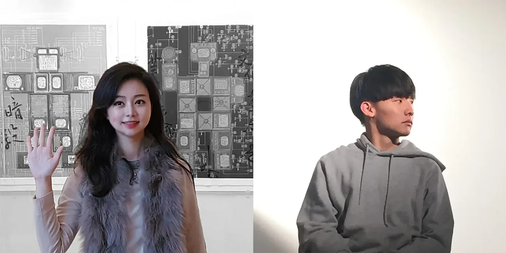

*[Inhwa Yeom](https://www.yinhwa.net/) (left) is a media artist and researcher of AR/VR technology at Korea Advanced Institute of Science and Technology (KAIST). Her research interest focuses on how “magical” experiences in the age of technological media can become more accessible in the forms of artistic praxes, including interactive videos and installations, magic and hologram performances, online platforms, workshops, and academic writings. [Seonghyeon Kim](https://github.com/okdalto/) (right) is a researcher and media artist working with graphics programming technology. Currently, he is a master’s student at KAIST, Visual Media Lab. His research interest is synthesizing facial animation of a virtual character. As an undergraduate student, he established a programming club named “Chocoding” for over 100 designers.*

### Inhwa Yeom & Seonghyeon Kim

#### p5 for 50+ (p5 for 50 and beyond)

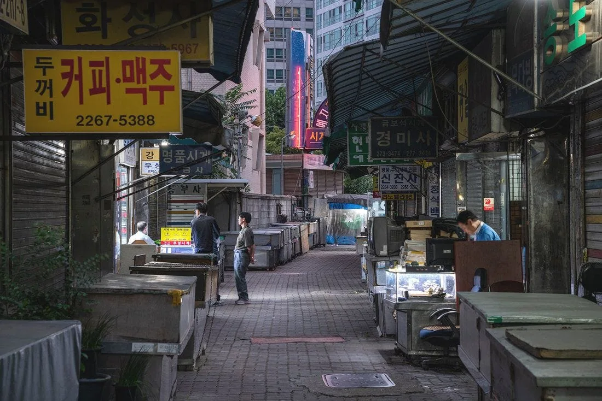

*Alt text: This is a landscape photograph of a super-aged local market area in South Korea, where makers’ spaces and stores are mostly closed due to the digitization of the society. (Photo Credit: Cheolki Hong)*

The project *p5 for 50+(50 and beyond)* aims to improve the digital literacy and rights of middle-aged and elderly creators in a non-Anglophone, super-aging, yet highly digitized and tech-centered society: South Korea. Along with the Korean translation of the p5 website, Inhwa and Seonghyeon will host a weekly workshop that specifically targets participants of the upper age group who face even greater linguistic and emotional barriers than younger generations when it comes to learning coding.

Experimenting with and designing learning methodology for people around and over 50, is the most important challenge to this project. Throughout the Fellowship, Inhwa and Seonghyeon will develop and evaluate various learning interfaces and interactions, logistics, and environment settings of their workshop, with aural, audio-visual, contextual, and interactive elements of p5. As one methodology, p5 and creative coding is to be contextualized at the workshop as a medium for addressing personal and social issues constructed from the participants’ technological surroundings. With the p5 artworks they create, the participants are expected to imagine their own online gallery, agora, asylum, archive, and marketplace where they can voice their experiences being 50+.

Inhwa and Seonghyeon will be mentored by Qianqian Ye, who was a Fellow in 2019.

[Qianqian Ye](https://www.qianqian-ye.com/) is an artist, designer, and organizer based in Los Angeles and Shanghai. Emerging from an architecture background, she explores the complexities of identity, technology and social interaction in various media including installation, performance, and ink. As one of the Processing Foundation 2019 fellows, her project was to make creative expression and coding more accessible in China, especially within the underrepresented womxn groups. Her current practice focuses on technology against misinformation, labor in language, and re-imagining gender in a non-western narrative. She holds a Master of Landscape Architecture from Cornell University and a Bachelor of Architecture from ZJUT.
