We are thrilled to announce the 2021 Processing Foundation Fellowship cohort! For the sixth year of our annual Fellowship Program, we made a few changes, in an attempt to better support the new paradigm of remote and online contexts and socially distanced communities. We asked applicants to address at least one of four Priority Areas that, to us, felt especially important for finding ways to feel more connected right now: Accessibility, Internationalization, Continuing Support, and AI Ethics and Open Source. Additionally, we sponsored four Teaching Fellows, who will develop teaching materials that will be made available for free, and are oriented toward remote learning within specific communities.

We received 126 applications this year, and were able to award six fellowships, with four teaching fellowships. We are excited to note that this is our most international cohort ever, with Fellows based in Australia, Brazil, India, Mexico, Philippines, Switzerland; and in the U.S. in California, Portland, and New York. We can’t wait to see what they make over the next few months!

For an archive of our past Fellows, [click here](https://processingfoundation.org/fellowships), and to read our series of articles on the Fellowships, [click here](https://medium.com/processing-foundation/https-medium-com-tag-pf-fellowships-la/home).

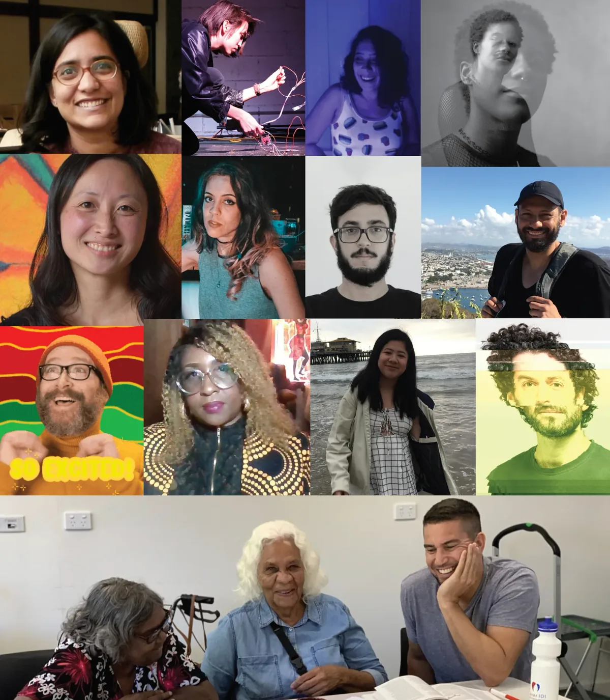

*The 2021 Processing Foundation Fellowship Cohort! Top row (from left): Ambika/Computational Mama, Marcela Mancino, Julia Brasil, and Cy X. Second row from top: Angi Chau, Katherine Finn Zander, Felipe Santos Gomes, Omar Verduga. Third row from top: Shawn Patrick Higgins, Adekemi Sijuwade-Ukadike, Chia Amisola, and Ted Davis. Bottom row: Indigemoji emoji bosses Kathleen Kemarre Wallace, Veronica Perrule Dobson, and Joel Liddle Perrule.*

Stay tuned to our [Twitter](https://twitter.com/ProcessingOrg) and [Instagram](https://www.instagram.com/processingorg/) for updates on the Fellows’ process!

---

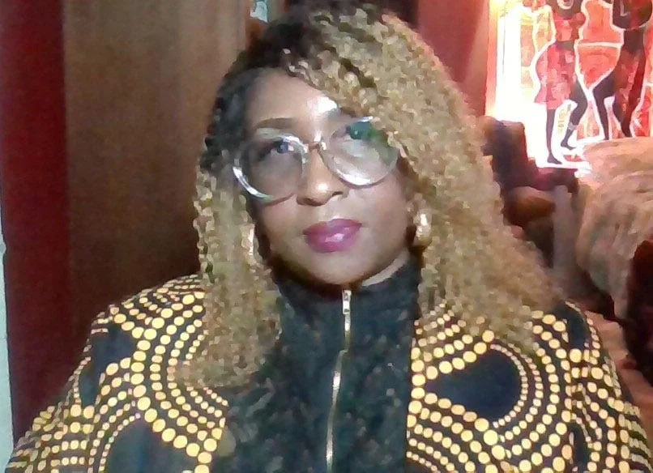

*[Kemi](https://www.linkedin.com/in/adekemisijuwade/) is presently the Project Manager for Fellowship support at Eyebeam. She also was the 2019–2020 digital accessibility fellow at Lincoln Center for the Performing Arts. She holds a MPS from NYU’s ITP program, and a BA in Journalism and Psychology from NYU.*

### Adekemi Sijuwade-Ukadike (Teaching Fellow)

#### Digital Accessibility Syllabus

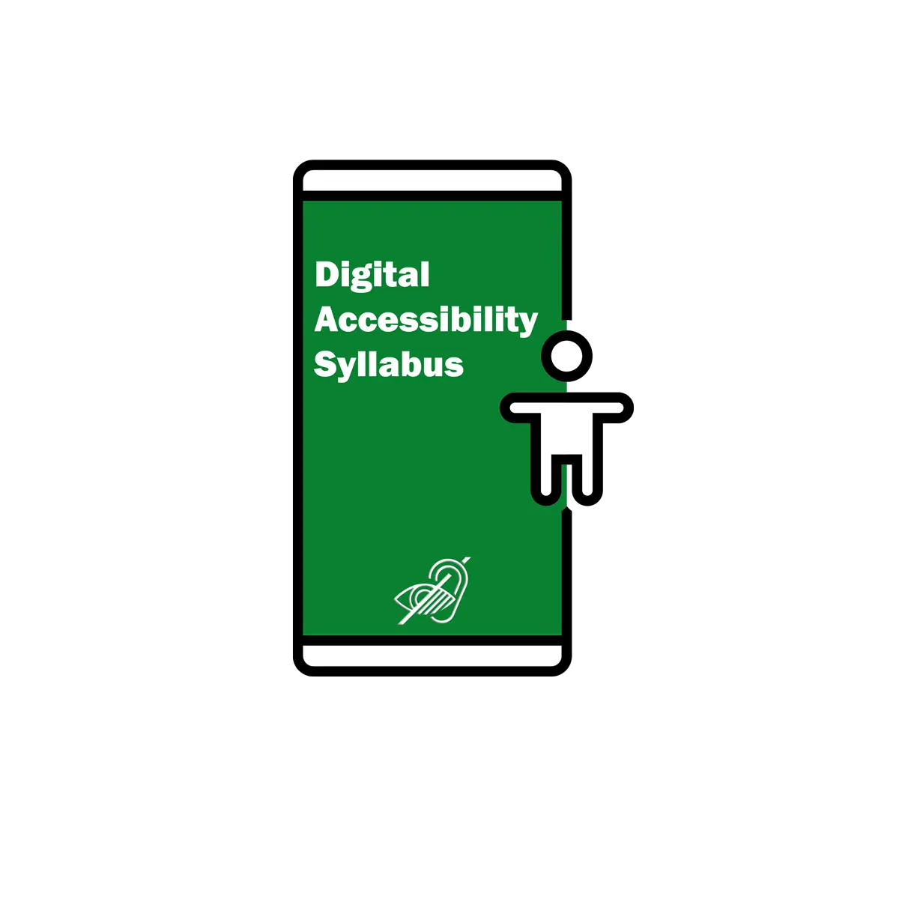

From my observation, there are initiatives on a university level to bring awareness to digital accessibility. I want to add to this by creating a university-level, open-source course model that directly speaks to why it is important, as well as how to create accessible digital content from the inception of a project, rather than as an afterthought once the project is close to completion.

The COVID-19 pandemic has shifted most of our communication into the digital realm. Now more than ever, about 61 million Americans who live with a disability are relying on digital spaces as an important means of connection and survival to health, financial, social, and job-related services and information.

I believe that if a full-semester immersion to digital accessibility is an option for those studying interactive and immersive experiences, an awareness that the DOM, as well as libraries such as p5.js’ accessibility are tools and how to use them — would be super useful to interaction designers, web developers, coders and those creating digital experiences. Perhaps we can see an influx of robust digital projects, not only to avoid litigation, but for better interactions overall.

Kemi will be mentored by Claire Kearney-Volpe, who is on the Processing Foundation Board of Advisors, and was a Fellow in 2016.

[Claire Kearney-Volpe](https://takinglifeseriously.com/index.html) holds a PhD in Rehab Sciences and HCI, and is trained in Art Therapy and Interactive Telecommunications. She is an Accessibility Specialist and Senior UX Researcher. Her research is focused on digital accessibility, STEM education, and human-centered design.

---

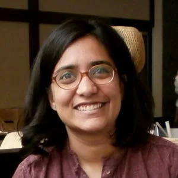

*[Ambika/Computational Mama](https://www.instagram.com/computational_mama/) has been learning, teaching, and experimenting with creative computation since 2017. She is a co-instigator of dra.ft and co-founder of Ajaibghar Cultural Services. Her work explores coding as a form of self-care and learning. She is a regular live streamer on Twitch, where she teaches the basics of creative computation.*

### Ambika/Computational Mama

#### Coding with Friends

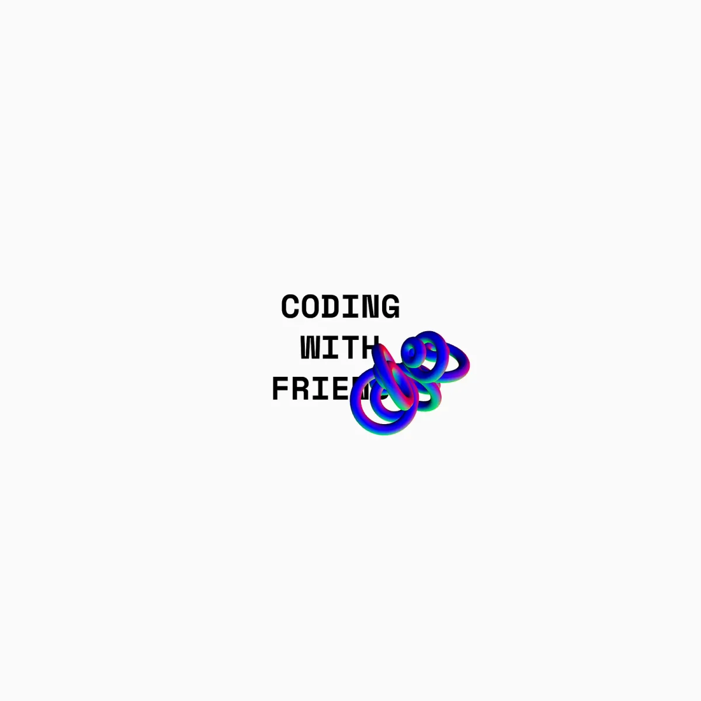

What does it mean to have a simple intimate chat over a shared activity? Does creating with code only serve its purpose towards an output? Can the act of two friends coding together mean more than a product, a production, or a performance?   
Coding with Friends is an ongoing series of live streams with womxn makers and creators. These are one-on-one sessions, where Computational Mama invites a friend to code together. A casual act of coding together can be equated to making dim sums or folding paper cranes or even playing a board game.

Coding with Friends casually and simply claims space for womxn creators. The series extends the idea of co-coding as a form of camaraderie, friendship, and self-care. Coding With Friends reinforces ideas of care, sharing, and connectedness. What could be more exciting than extending warmth and care through a positive shared experience? What could be more provocative than to build soft, understated, and rooted networks of womxn creators? What can be more powerful than relationships built in safe, creative environments?

The project gives an opportunity for womxn creator communities and practices around creative computation to move away from notional ideas of what code can produce, who can produce code, and where it can be produced.

Ambika will be mentored by [Shaharyar Shamshi](https://shaharyarshamshi.xyz/), who was a Fellow in 2019.

Shaharyar Shamshi is a software developer from India: “I love to solve logical problems, and I am an open-source enthusiast. Apart from learning different stuff of computer science, I am very much passionate about economics. If I had not been a software engineer I would have been an economist. My ultimate goal is to provide programming literacy to the youth of India, India being such a young country in terms of average population age. If we can provide the programming literacy to even 1–2 percent of the youth it would be remarkable achievement. I find p5.js to be the best tool for this, so I tried my best to increase accessibility of it in Hindi language [during my Fellowship in 2019](https://medium.com/processing-foundation/interview-with-2019-fellows-manaswini-das-nancy-chauhan-and-shaharyar-shamshi-172127c2e277). During my leisure time I interact with people and try to learn about their culture. Whenever I get the opportunity to interact with students I actively talk to them about technology and how the world can be changed with technology, and I never forget to mention p5.js.”

---

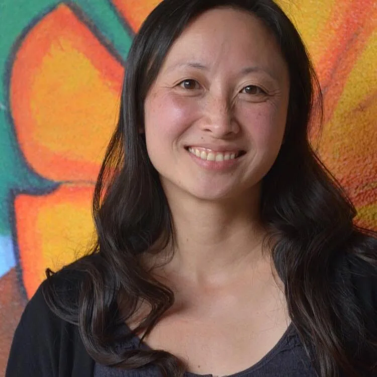

*Angi Chau is an educator, maker, engineer, and creative coder. She is constantly thinking about how to design and create learning spaces that celebrate technology, yet allow everyone, especially those who have traditionally been underrepresented in fields like engineering and CS, to feel a sense of belonging. [http://www.angichau.com/](http://www.angichau.com/)*

### Angi Chau (Teaching Fellow)

#### Starter Kit for Teaching Creative Coding with p5.js

As more CS classes are being implemented across the world (yay!), I notice that there are many teachers who are tasked with teaching CS, but who never received formal training in CS. While there are pre-made curricula that educators can use (e.g., Google CS First, Code.org), I want to investigate the space between these “plug and play” options and a total blank canvas, and explore how to offer easily adaptable modules for new teachers to build their own creative coding curriculum.

I would like to create a “starter kit” to bootstrap teachers new to CS, which will likely be some combo of online resources, videos, lesson ideas, and “poetic prompts.” I can imagine three main areas of this kit:

**Learn** — curated resources for teachers to learn/practice a CS concept themselves,

**Teach** — compilation of new and existing resources (videos, slides, lesson plans, activities) offering different ways to teach a concept in the classroom,

**Create** — open-ended prompts for students to practice this concept while still allowing for their creative voices to shine through.

Angi Chau will be mentored by Saber Khan, the Education Community Director of Processing Foundation.

---

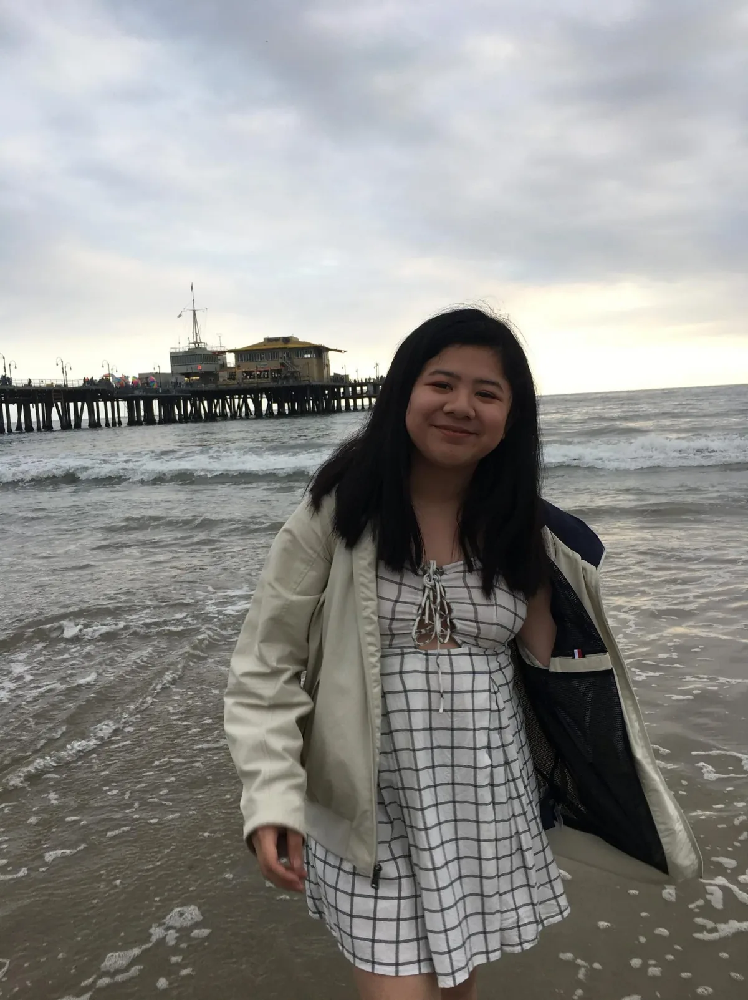

*[Chia Amisola](https://chia.dev) is a Computing and the Arts undergraduate at Yale from Manila. A designer, internet artist, and writer, they work to build radical systems for creator and communities. Chia is the Founder of Developh, a community for mission-driven technologists in the Philippines, who are educating and creating for social impact.*

### Chia Amisola

#### Developh p5.js Camp

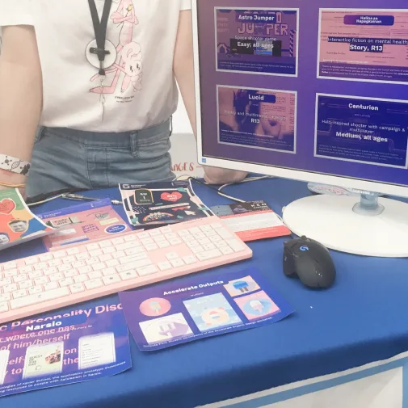

Over 50 percent of information technology graduates in the Philippines are reported to lack programming competencies, and there’s an absence of expository, pre-college technology and art programs in the Philippines. Developh Camp builds atop the work of a community not-for-profit that has been running education and innovation programs to boost the Philippine technology ecosystem since 2016. Developh Camp cultivates a lifelong community for mission-driven technologists and creators while producing collaborative projects and resources for the larger nation. With focus on peer and small slope mentorship, emphasis on teaching non-technologists code, and initiatives rooted in social impact , Developh Camp seeks to uplift both the art and creative code scenes in the Philippines.

Developh Camp will support a cohort of high school/college-aged Filipino technologists in producing socially driven, artful technology projects built with p5.js. At the end of the Camp, an online exhibit will be put up to host their work. Outputs include biweekly workshops and teaching materials open to all (in both English and Filipino), co-creating streams and events, and the framework for running replicable community events sensitive to low data spaces.

After Camp, fellows will continue to be integrated into the Developh community as they further explore technology, design, and founderhood. p5.js will be integrated into our curriculum, discussion clubs, projects, and more.

Chia will be mentored by Dorothy Santos, Executive Director of Processing Foundation.

---

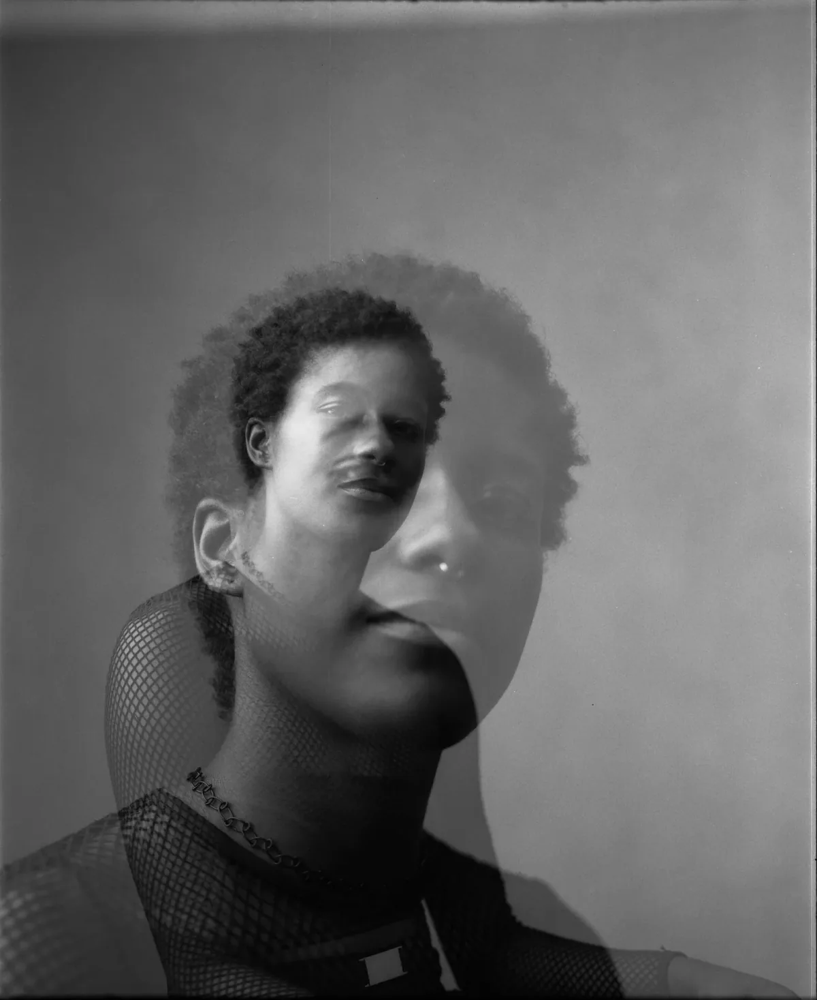

*[Cy X](https://cyberwitch666.com/) (they/we) is an energy worker, earth tender, and cyber witch working within the realms of sound, video art, performance, rituals, and care work. Fusing art and technology with the practice of witchcraft, they use spells, rituals, and alchemic practices to fundamentally alter the world around us while merging their ancestral technologies alongside emerging ones. Cy holds a Master’s Degree from New York University’s Interactive Telecommunications Program and a Bachelor’s Degree from Colorado College Film and Media Studies Program.*

### Cy X

#### PORTAL.WEB — A Cyber Witch Coven

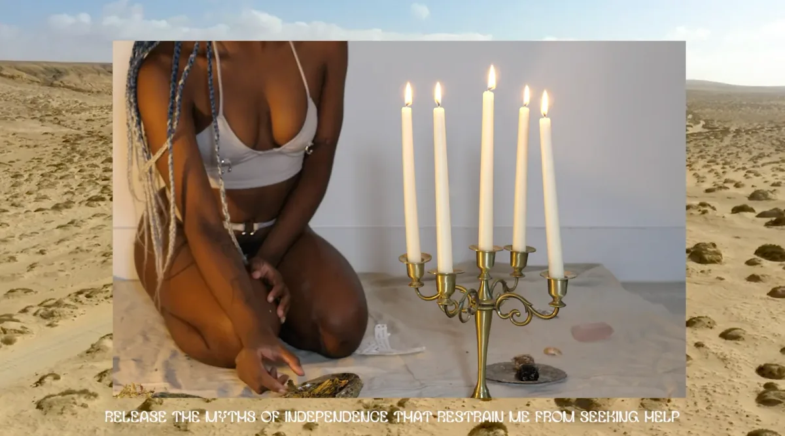

PORTAL.WEB is a cyber witch coven that reimagines our cyber powers through the use of emerging, indigenous, and ancestral technologies. We seek not to establish a hierarchy of technologies but rather to work with cyber witch practices in a way that intimately engages our own radical imagination, ancestral knowledge, and inner-knowing.

I will research cyber witch practices and theories in order to develop a year-long syllabus, cyber witch workbook, and series of workshops, performances, collaborative rituals, and ceremonies, that will invite the collective to not only interrogate what is / is not technology but also to explore new ways of learning, breaking, and hacking to create tools of our dreams, ones that could open new portals and celebrate Black, brown, queer, and trans folks.

A lot of technological education currently seems to negate knowledge from other frameworks, cultures, and ways of thinking. This project, through acknowledging “a world of many worlds,” seeks to work within the framework of the pluri-verse, while also acknowledging that those at the margins have often been negatively impacted by technology. This project acknowledges that any form of technology education needs to center healing at its core, by connecting with our inner selves, including care and love at the center, and uplifting ancestral knowledge, while imagining and creating new worlds.

Cy will be mentored by Johanna Hedva, Director of Advocacy for Processing Foundation.

---

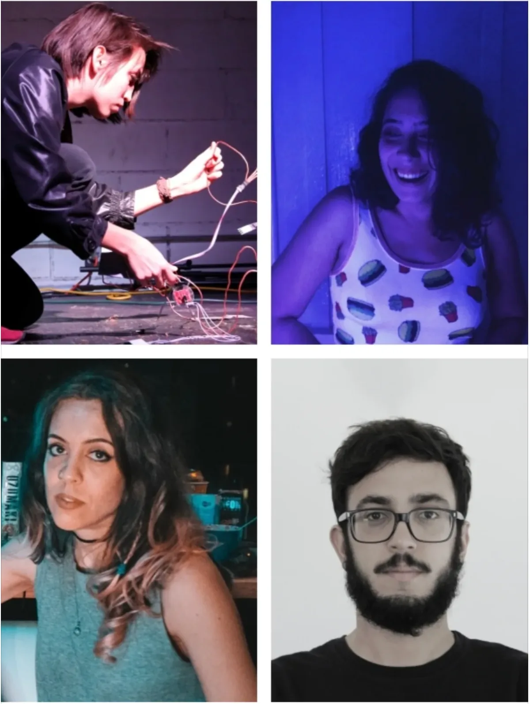

*Clockwise from top left: Marcela Mancino, Julia Brasil, Katherine Finn Zander, and Felipe Santos Gomes. Bios below.*

### Felipe Santos Gomes, Julia Brasil, Katherine Finn Zander, and Marcela Mancino

#### Pê Cinco: Internationalization and Popularization for Portuguese Speakers

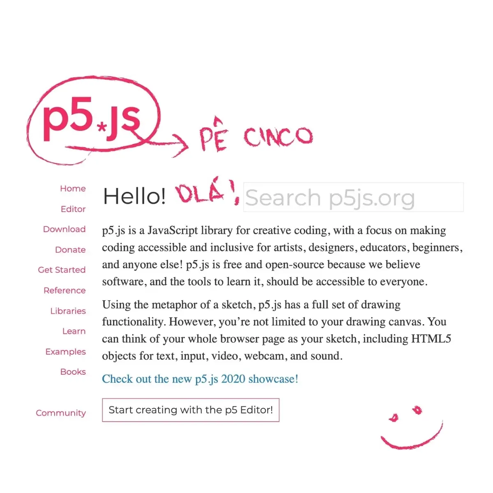

As Brazilian coders, artists, and researchers who have self-taught to code, we have experienced firsthand the difficulty in finding educational content in our native language, Portuguese. This project comes from the desire to make p5.js accessible to the Portuguese community by translating the p5.js reference. Along with the translation, we’ll produce a series of short videos presenting the project and its main features.

As we’ve seen in previous Processing Foundation Fellowship projects, translation can open up ways for more people to contribute, and in doing so expand the community, reaching new audiences that otherwise wouldn’t be able to access the tool in its full potential. We hope the effort we put in will encourage other projects to be developed, translations or educational projects in Portuguese.

[Felipe Santos Gomes](http://felipegomes.cc/) graduated in Architecture and Urbanism, with a postgraduate degree in Film Production, and a Master’s in Technology and Society (Brasil). Went to Fab Academy on node Barcelona (Spain) and currently works with digital fabrication and art installations. Has experience with open source softwares and hardwares for visual arts. [http://github.com/araucarialab](http://github.com/araucarialab)

[Julia Brasil](http://webexistindo.art.br) is not sure yet what exactly she is. Currently, she calls herself a visual artist who explores new media. She is also very interested in themes like decoloniality and cosmopolitics. She has a degree in Architecture and is now studying Visual Arts.

[Katherine Finn Zander](https://github.com/katzesoundz) is a musician, music producer, and current computer science student. She is passionate about education, psychology, politics, and the new paths where coding can take music and art.

[Marcela Mancino](https://marcela.xyz) is a Brazilian multimedia performance artist and creative technologist. She studied performing arts, hybrid arts, and interactive telecommunications. Her work spreads across several disciplines, but she is usually involved in designing and building spaces — both physical and digital. [https://github.com/mardefronteira](https://github.com/mardefronteira%29)

The group will be mentored by [Claudio Esperança](https://cesperanca.org/).

[Claudio Esperança](https://cesperanca.org/): “I am an electric engineer, graduated at Federal University of Rio de Janeiro (UFRJ) in 1980. After working for several companies in Rio de Janeiro, including UFRJ itself, I received a MSc degree in Systems Engineering at UFRJ, more specifically, at the Program of Systems Engineering and Computing (PESC). In 1995, I earned a PhD degree in Computer Science at University of Maryland. I have been a professor at PESC since 1998, where I pursue my academic interests. These include all things related to computer graphics. In 2021 I also joined UFRJ’s Graduate Program in Design as a professor.”

---

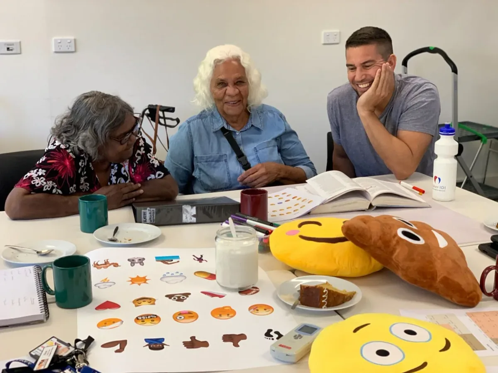

*[Indigemoji](http://www.indigemoji.com.au) is a collective of artists, linguists, and technologists who first came together in 2018 to create an Arrernte set of emoji reflecting the traditional language of Mparntwe/Tyuretye in Central Australia. They are interested in engaging young people in weaving together some of the oldest languages in the world with some of the newest. Github: [https://github.com/Indigemoji-Australia/indigemoji-app](https://github.com/Indigemoji-Australia/indigemoji-app)*

### Indigemoji

#### Akeltye-antheme awetyeke

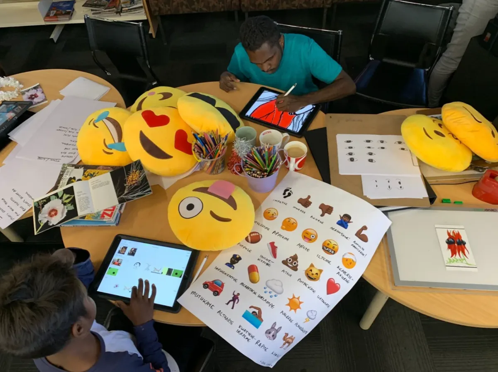

Akeltye-antheme awetyeke — “teaching to listen” — explores what it would take to teach machines to listen and understand Arrernte, a traditional Indigenous language of Central Australia. By creating a small sovereign dataset of Arrernte spoken words, we hope to create a web-based prototype in p5.js and ml5.js to encourage young people to speak their own language. In doing so, we hope to start a conversation with machines, to translate and explore concepts of machine listening, and to consider what the implications and potential of that might be.

Indigemoji will be mentored by Yining Shi, who served as a mentor for 2020 ml5.js Fellow Andreas Refsgaard.

[Yining Shi](https://1023.io/) is a creative technologist, researcher, and software developer who is interested in building tools to craft a better learning experience for people. She has built tools for those learning to code like Runway, the p5.js online editor, and an interactive programming and drawing interface, p5.playground. Yining teaches the “Machine Learning for the Web” course at NYU’s ITP, “Introduction to Synthetic Media,” a course that uses machine-learning algorithms to generate images, videos, and text, and “Machine Learning for Physical Computing,” a course that classifies and predicts sensor data from microcontrollers like Arduino.

---

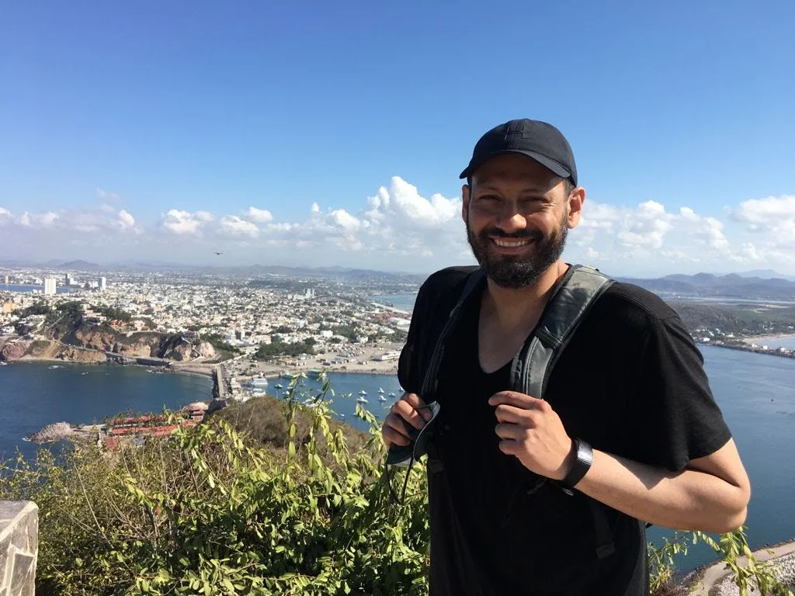

*My name is Omar Verduga, I’m Mexican, I studied computer science in Mexico and experimental psychology in England. I’m interested in artificial intelligence, interactive art, and decision making. Some of my side projects have repositories on [https://github.com/oruburos.](https://github.com/oruburos.)*

### Omar Verduga

#### Internationalization Support: Spanish localization for the Processing website

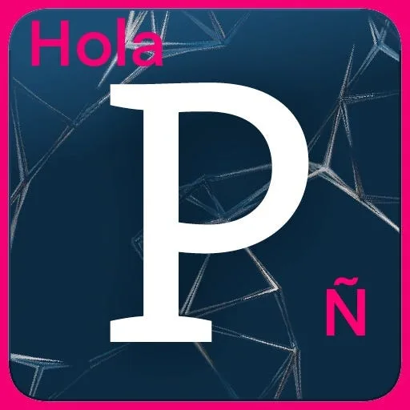

Currently, the p5.js and p5.js web editor websites support translations for different languages; however, the [Processing website](https://processing.org/) includes no translations (there is a pull request with a German version, which is indicative that some other users are aware of the opportunity). During the GSoC 2020 program under the Processing Foundation, [Omar completed an internationalization solution for the p5 web editor](https://medium.com/processing-foundation/internationalization-and-spanish-localization-for-p5-js-web-editor-6140ade3f7df), where internationalization was studied from a broader context, not only on the technical side. Inclusive and non-gendered language, and accessibility through ARIA labels were topics discussed with the community, and a localized version of the p5.js web editor was delivered in Spanish. The goal of this Fellowship project is to join the current efforts in translating the website and create guidelines for future contributing members in how to organize the translations, while delivering a Spanish localized version of the Processing website, with the idea of making it more accessible to the international community and to further promote its usage among students of Spanish (Latin American Spanish, particularly) speaking communities.

Omar will be mentored by Esteban Sandoval.

[Esteban Sandoval](https://ejsandoval.github.io/) is a developer and designer focused on UX research and user interface development with an applied ethnographic approach. Esteban has worked with data visualization for the National Innovation Council for Development and the Multidisciplinary Neuroscience Center of Universidad Católica de Chile. As a researcher, he has worked for Antenna, a leading Latin-American Art Foundation; IDE’s GoGlobal 2017; and various technology-based ventures. He currently works for Design Systems International as a design engineer focused on UX research and development.

---

*Shawn Patrick Higgins is a middle school computer science teacher, ScratchEd PDX Coordinator, and Oregon’s resident PBS Digital Innovator. He’s worked with youth in creative technology for over a decade, specializing in project-based curriculum that fuses digital art, animation, audio, social and game-making as a creative pathway to student success!*

### Shawn Patrick Higgins (Teaching Fellow)

#### Cultivating Creative Connection with Scratch and p5.js

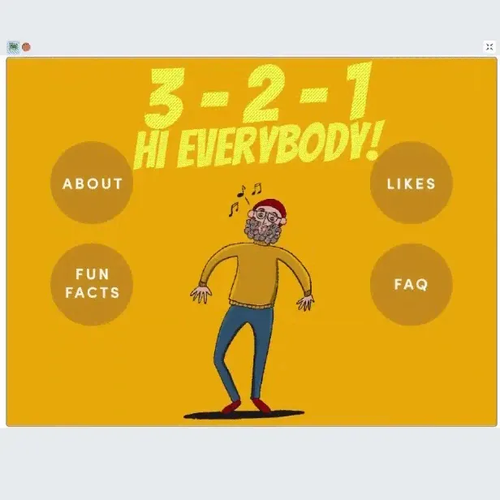

This project is all about harnessing my students’ all-time favorite Scratch experiences and creating a curated project-based pathway for students to experience the best of the best: first in Scratch, then by “upmixing” them into p5.js. Through video tutorials paralleling the recreation of classic Scratch projects like Natalie Rusk’s “Paint with Gobo” and Ipzy’s “Bio Page,” as well as my own popular motion graphics and sound board projects, students will be introduced to Scratch and p5.js through step-by-step visual instruction, with a focus on the familiar and functional reapplication of concepts.

I plan on referencing the work of other Processing Foundation Teaching Fellows — including [Michael O’Connell](https://medium.com/processing-foundation/zoom-teaching-p5-js-to-children-grades-3-6-54a0955c0ba5) and [Layla Quinones](https://medium.com/processing-foundation/interview-with-2019-teaching-fellow-layla-quinones-3039f10ae761) — on how to best enhance the onboarding process for middle school students.

By designing explicit creative parallels, my goal is to inspire both Scratch students of moderate proficiency to take the jump into p5.js, as well as appeal to inexperienced coders who may be intimidated by syntax, to begin their journey into digital making with a visual language like Scratch!

Shawn will be mentored by Saber Khan, the Education Community Director of Processing Foundation.

---

*[Ted Davis](https://teddavis.org) is a media artist / designer / educator. Since 2010 he has taught interaction design and coordinated the UIC/HGK MDes Basel program at The Basel School of Design, HGK FHNW. His open source projects (basil.js, XYscope, p5.glitch, P5LIVE) enable programming within Adobe InDesign, rendering graphics on vector displays, byte level glitching and collaborative live coding with p5.js. https://github.com/ffd8*

### Ted Davis (Teaching Fellow)

#### P5LIVE — Walkthrough

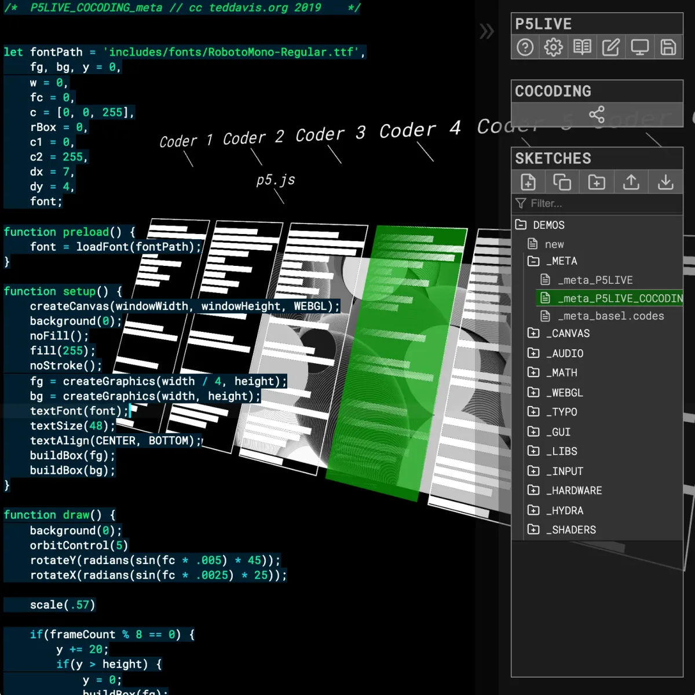

For two years I’ve been developing [P5LIVE](https://p5live.org), a p5.js coding environment designed for VJ, live coding, remote collaboration, and teaching. Initially designed for fullscreen algorave usage, COCODING (shared document editing) was added early on, opening the door for both local and remote jams. Initially a fun feature, it’s become a crucial tool for teaching introductions to creative coding in these COVID-19 distant-learning times. Throughout the pandemic, it’s supported peer collaborations, entire classrooms gatherings, coded A/V performances, and audio-reactive remote meditation sessions. Extra features geared towards learning and performance include AutoComplete of p5.js functions, SmoothCompile for additive changes to the sketch output, and SyncData enabling sharing of local data (MIDI, sensors, etc). Over the next year, additional features to support remotely teaching code, P5LIVE Classroom, will be developed through an FHNW Lehrfonds grant.

While P5LIVE’s features are documented in a README of more than 2,000 words, they have yet to be captured as video walkthroughs with example usage. Through this Fellowship, all current and upcoming Classroom features will be demonstrated and shared freely as a video tutorial series. Aimed for teachers, students, and performance artists, ideally exposure to this tool and features will help them throughout and beyond remote creative coding times.

Ted will be mentored by Saber Khan, the Education Community Director of Processing Foundation.
