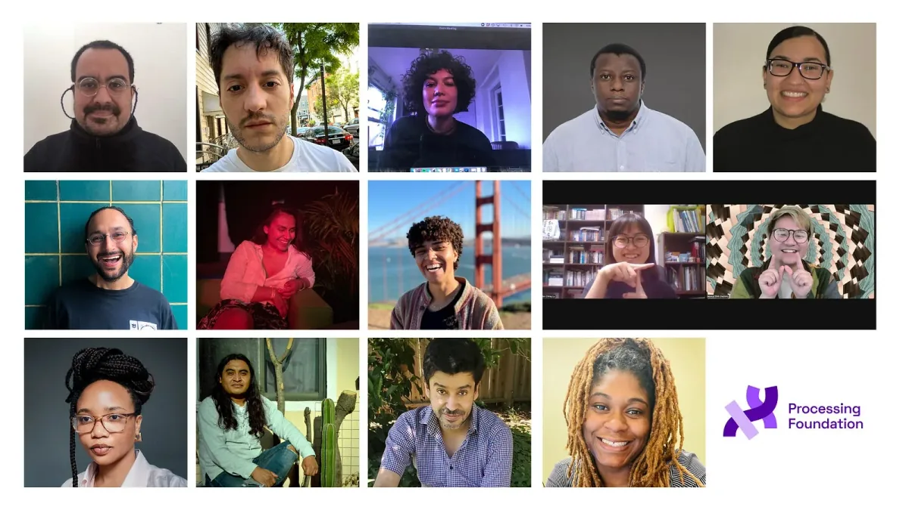

Our fellowship program is made possible by a grant from the National Endowment for the Arts.

We received 117 applications this year, and were able to award seven fellowships and five teaching fellowships. We were also able to provide financial support to seven finalist projects.

Continuing with previous years, we asked applicants to address at least one of five Priority Areas that, to us, feel especially important for technology and coding right now: Accessibility, Internationalization, Continuing Support, AI Ethics and Open Source, and Ecology and Environment.

We are supporting five Teaching Fellows, who will develop teaching materials that will be made available for free, and are oriented toward community learning.

We can’t wait to see the vital work that this amazing group makes over the next few months!

*For an archive of our past Fellows,* [click here](https://processingfoundation.org/fellowships)*, and to read our series of articles on the Fellowships,* [click here](https://medium.com/processing-foundation/https-medium-com-tag-pf-fellowships-la/home)*.*

#### Aarón Montoya-Moraga | **Refactoring and development for p5-serial**

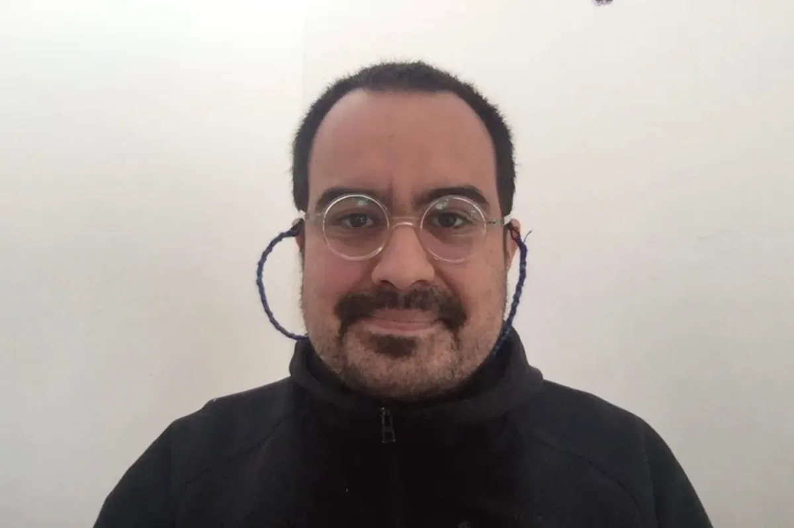

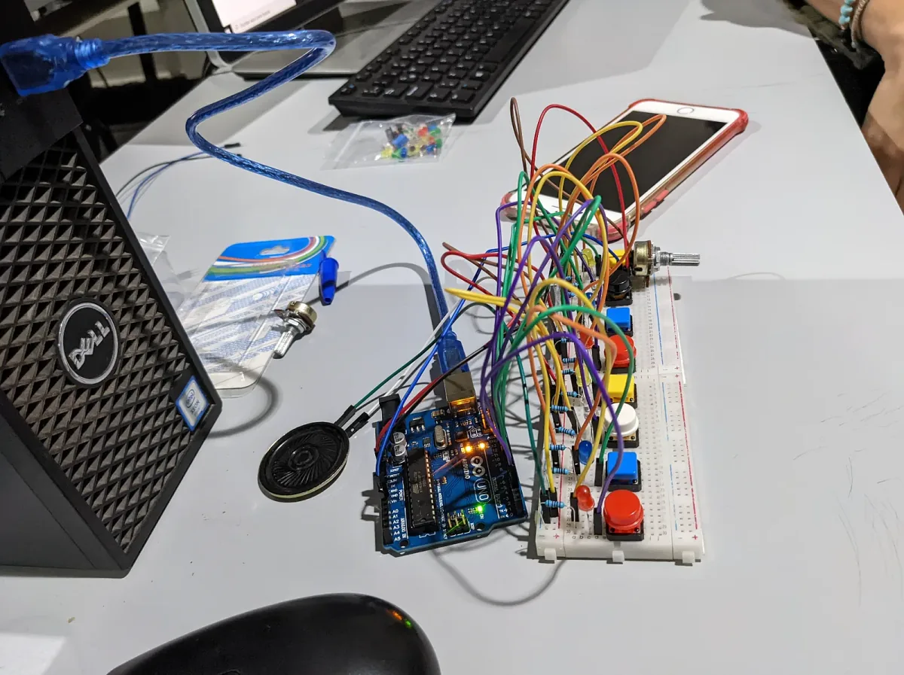

This fellowship project consists of support for the p5-serial project created by Shawn van Every, Jen Kagan, and Tom Igoe, which allows for serial communication from and to the browser with p5.js. Aarón will do repository maintenance, code refactoring, and tutorials and teaching materials writing.

During this Fellowship Aarón will focus on research and development of different alternatives to the underlying code of the project, to make the software easier to use and compatible with different desktop web browsers and mobile devices.

Since the project is currently being used for teaching at different educational institutions, Aarón hopes that their work will help expand the ease of use of p5-serial, and making it even more accessible to other educators and enthusiasts, by also writing more documentation for people who want to use this library and who want to contribute back to the project.

*Aarón Montoya-Moraga is a Chilean media artist and educator. Their work is available at* [https://montoyamoraga.io/](https://montoyamoraga.io/) *and* [https://github.com/montoyamoraga/](https://github.com/montoyamoraga/)

*Follow Aarón on* [twitter](http://twitter.com/montoyamoraga) *and* [instagram](http://instagram.com/montoyamoraga)*.*

Aarón will be mentored by [Shawn Van Every](https://tisch.nyu.edu/about/directory/itp/1838206356).

#### Atilio Barreda II | Data science whiteboard

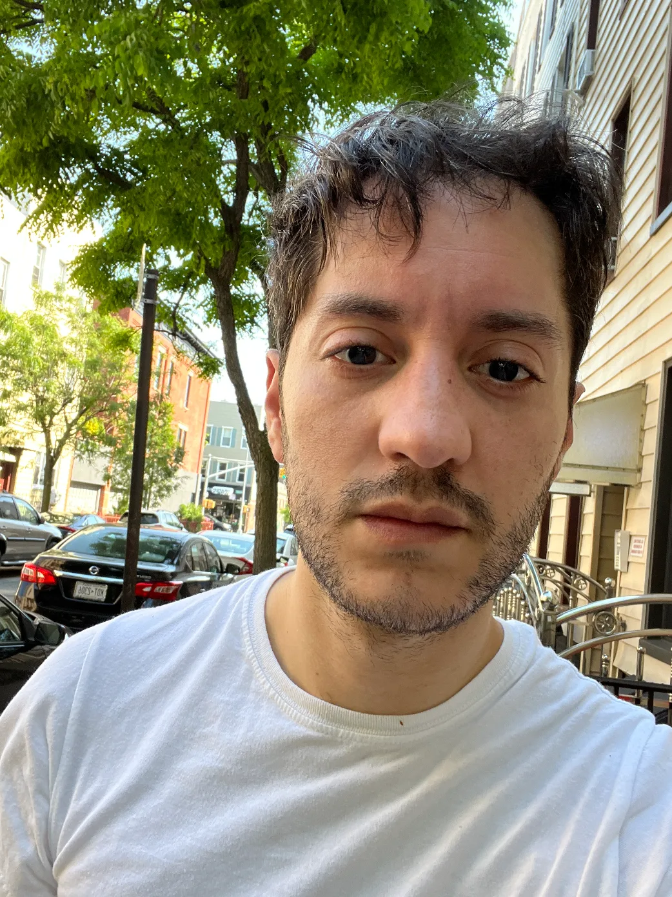

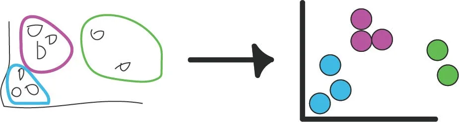

During Atilio’s fellowship, he will be working on an open-source web application in which instructors can easily visualize data science concepts and techniques, such as clustering, regression, etc. Instructors’ will have access to shortcuts and templates for common data and data transformation and analysis techniques.

*Atilio Barreda II is software engineer, adjunct lecturer at CUNY City Tech, and MS student in Data Visualization.* [http://cv.atil.io](http://cv.atil.io)*. Follow Atilio on* [twitter](http://twitter.com/Atilio_ii)*.*

Atilio will be mentored by [Abram Stern (aphid)](https://aphid.org/)

#### Bhavik Singh (Teaching Fellow) | P5 in the Park

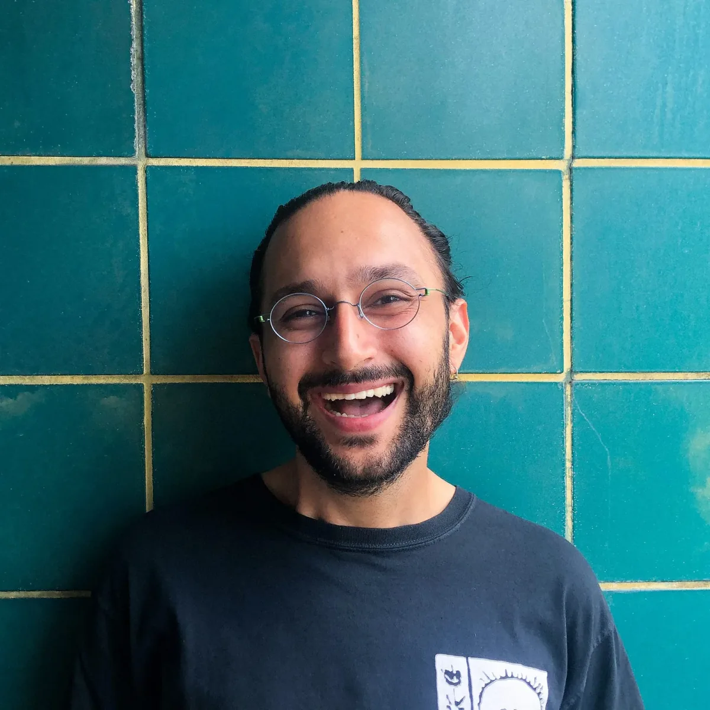

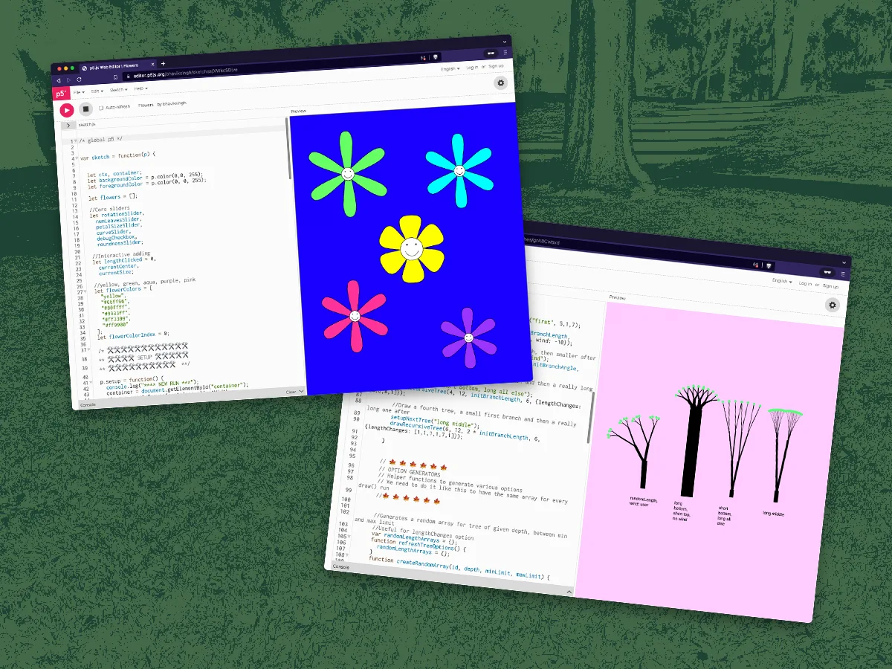

Living in digital and urban worlds separates us from Earth’s abundant life and makes it easy to forget that we are nodes in a vast interspecies network. Bhavik looks towards indigenous teachers to find a way out of this forgetting. To begin building a relationship of reciprocal love with our ecology, we first need to choose to pay close attention.

P5 in the Park is Bhavik’s teaching fellowship project. It is a syllabus of “plein air” coding exercises that explore how programming can be used to pay attention to the many lifeforms around us. In each exercise learners are encouraged to step away from their computers and spend time with a houseplant, meet neighborhood birds, or visit a local park. Students then use P5.JS to represent and reflect on what they learnt from the natural world.

These exercises will range across skill levels, from drawing shapes to morphogensis approaches like L-Systems. Bhavik’s hope is that they not only bring learners closer to nature, but also are a relaxing, delightful experience in learning to code. He would love to develop this project in collaboration with the Processing community, so if you have ideas or suggestions please reach out.

*Bhavik Singh is a Sikh artist and technologist from New Delhi, India. His work, a gentle tapestry of social software, creates space for small groups to slow down and intimately express themselves. Bhavik enjoys working with a permeable network of collaborators ranging across artists, technologists, activists and nature. He is currently working on soft networks, an exploratory design and development studio imagining alternative futures for community technology.*

*Bhavik has been a designer at Google, a member of NEW INC at the New Museum and has taught at the Cooper Union School of Art and at Hunter College, CUNY. His work is used by people all over the world every day and is featured in Art in America, Wired, the Verge and more. He often takes long walks and spends time looking closely at trees.*

*website: softnet.works ⚘ email: hello@softnet.works, github.com/soft-networks*

*Follow Bhavik on* [twitter](http://twitter.com/soft_networks) *and* [instagram](http://instagram.com/soft_networks/)*.*

Bhavik will be mentored by [Angi Chau](https://www.angichau.com/).

#### coralys carter | Chrysalis Corpus

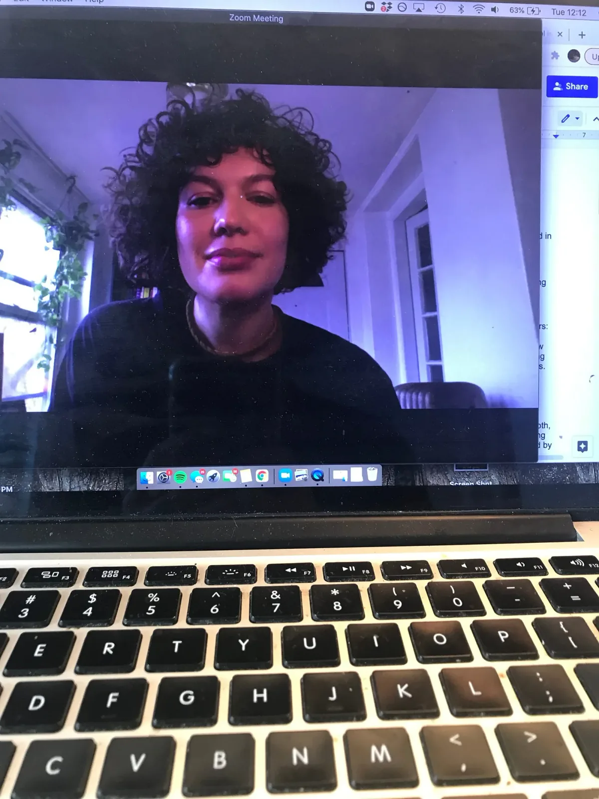

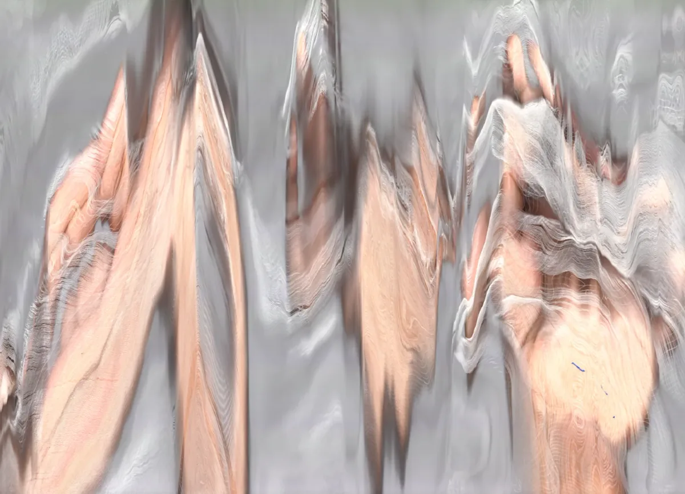

Chrysalis Corpus begins by mailing skins Coralys wove, a movement score they wrote, and a sound score created by [Cy X](https://www.instagram.com/cyberwitch666/) to friends. Each person lives with the skins for some days, moves through the scores, emails a [response](https://coralysxx.me/mailing-project) back (in any form), then mails the skins to the next person.

With Processing Foundation, Coralys will create an evolving experiential website to house responses received and responses to come. This will serve as a collective space with a launch week guided by Coralys, inviting offerings from folks with common threads of stewarding more livingness, [attention liberation](http://adriennemareebrown.net/2018/01/01/attention-liberation-a-commitment-a-year-of-practice/), and [eco-social repair](https://docs.google.com/document/d/1YfSUsCZl4eyZ07xNkqTJTZgD33aD07RQhGDZjd2UUjU/edit?usp=sharing). This series will include visual and physical ruminations, community activations, shared resources, and workshops.

Coralys’s research will draw connections between Processing as software and processing as a way to move through shared experience, time travel, coding, computers, looms, creation, birth, and life cycles fueled by curiosities including –

How do birth, death, and transition make space for intergenerational and interspecies imagination?

How are leaf venation systems related to human and nonhuman kin’s networks of care and how are these mimicked by computer networks?

Can an argument be made for computer as species? As companion? Looms as coding? Coding as creation?

[Coralys Carter](https://coralysxx.me/) *(they/lys/she) is an interdisciplinary weaver who creates sculptural skins to be worn (and shed) exploring the concept of bodies rooted in spaces and places rooted in bodies. lys’s work is a personal inquiry into their ancestral convergences and confabulatory process working within archive, heritage craft, and care work. lys uses this work as time travel to re/member themself in past and present, while ensuring futurity for them/us. Coralys is interested in embodiment, shapeshifting, and communal networks, layering processes to create vessels for introspection, reflection, and transformation.*

*Coralys is a first-year MFA candidate at University of California, San Diego and holds a Bachelor’s degree in Art Studio with an academic focus in Race, Ethnicity, and Migrations Studies from Colorado College. Since 2018, Coralys has focused on working as a full-spectrum doula as well as a working artist. Coralys is currently a Kahn | Mason Studio Immersion Project Fellow at Robert Blackburn Printmaking workshop in New York City.*

Coralys will be mentored by [Holly Meadows-Smith](http://www.irrelevantpress.com/).

#### Gregg Mudhuwiwa (Teaching Fellow) | Jakarta Design+Coding Club

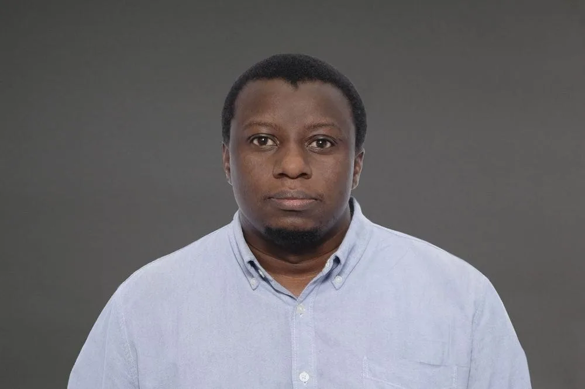

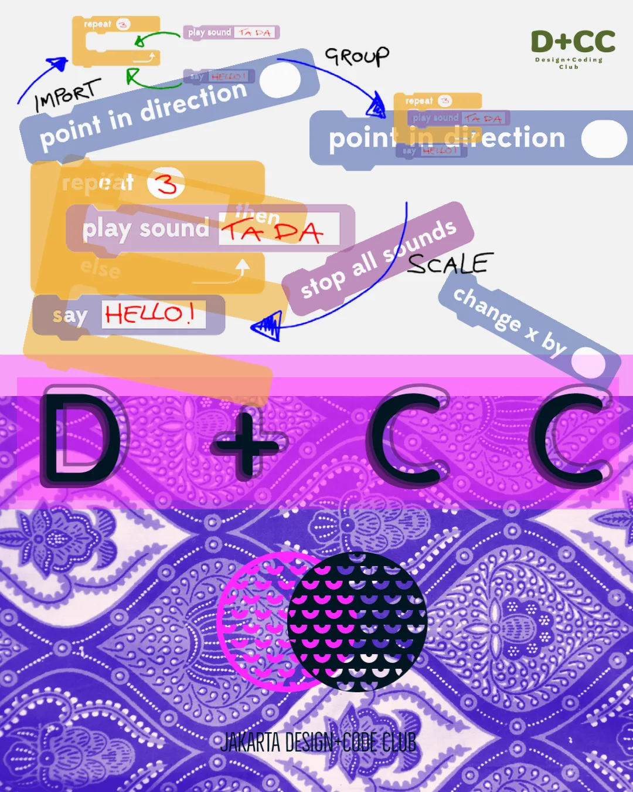

The 24-week Design+Coding Club program runs over two school terms both in-person and online. The first term is geared towards developing digital literacy and computer science skills within an open learning environment. In the second term, we place a greater emphasis on allowing students to express themselves through a creative coding, 3-D design or robotics project.

An important aspect of the project is that of making computing relevant and accessible to Jakarta’s students. Therefore, our system-agnostic approach is compatible with learning via mobile phone, tablet or laptop/PC. Furthermore, we will integrate traditional Indonesian design elements as we hypothesize that these will be more engaging to learners. For example, traditional Wayang puppetry and Batik pattern design lend themselves well to animation and geometric pattern design respectively.

Jakarta is a large metropolis with a vibrant digital economy so we will engage industry support and volunteers to participate in both the design and translation of teaching materials, and in mentoring Design+Coding Club sessions and site visits. In this way, we will provide learners with a real-world context for coding along with approachable role models.

*Gregg Tendai Mudhuwiwia is control systems engineer and entrepreneur based in Malaysia. His interest areas include STEM coordination, speculative engineering design and technology education. He is the co-founder of Orion STEAM Labs, a Shenzhen-based STEAM education design company, that works both with schools and training institutions in Asia to integrate coding, robotics and design programs into their practice. He was recently a researcher at The Terraforming urban design research program at Strelka Institute in Moscow and continues to research questions around the Anthropocene and its impacts on the future of work.* [https://github.com/gnicezw](https://github.com/gnicezw)

*Follow Gregg on* [twitter](https://twitter.com/greggTendai) *and* [instagram](https://www.instagram.com/greggtendai/)*.*

Gregg will be mentored by [Shawn Patrick Higgins](https://www.shawnpatrickhiggins.com/).

#### Joslenne Peña (Teaching Fellow) : Developing a Creative Coding Syllabus for a First-Year Liberal Arts Computing Course

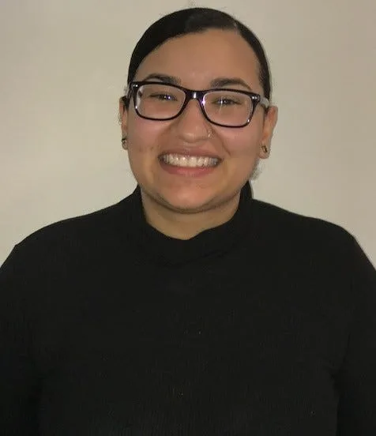

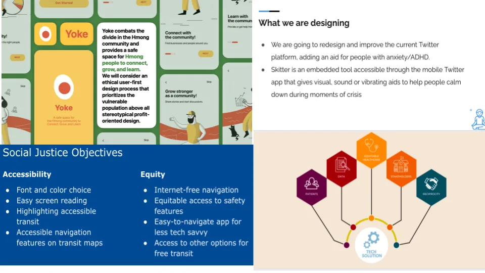

Joslenne’s project, “Developing a Creative Coding Syllabus for a First-Year Liberal Arts Computing Course” will focus on the development of a syllabus for freshman students at Macalester. Specifically, a first-year course (FYC) is a special course that allows students with various interests to explore many aspects of our school using the course as a vehicle. To take advantage of this exploration and curiosity, Joslenne will create a syllabus that centers engaging and innovative ideas from Processing while covering how technology and code may cause harm to vulnerable populations. This will be done by weaving in impactful topics on social justice, bias, and ethics. In addition, Joslenne will seek iterative feedback from colleagues at Macalester in Computing and across other disciplines in the school as well as her Processing fellows to access the most diverse voices. Overall, the goal is to create an illuminating experience for students that gives them the skills and voice to identify harm through learning basic programming foundations. As a result, Joslenne hopes this sparks a fruitful journey for students to stay in the Computing field and develop socially-responsible software and technology.

*Joslenne Peña is a faculty member in Computer Science at Macalester College, a liberal arts college in St. Paul, MN. Her research focuses on how we teach and engage underrepresented groups in computer science education through a variety of design opportunities in the classroom. She teaches a range of courses from Introductory Computer Science, Internet Computing, and Object-oriented Programming. Joslenne holds a B.A. in Multimedia Web Design & Development from the University of Hartford, an M.S. in Information Science & Technology, and a Doctorate in Informatics from Penn State.* [https://jpena831.github.io/](https://jpena831.github.io/) *Follow Joslenne on* [twitter](https://mobile.twitter.com/jpena831)*.*

Joslenne will be mentored by [Kemi Ukadike](https://www.linkedin.com/in/adekemisijuwade/).

#### Minne Atairu (Teaching Fellow) | Art Teachers’ Guide to Artificial Intelligence

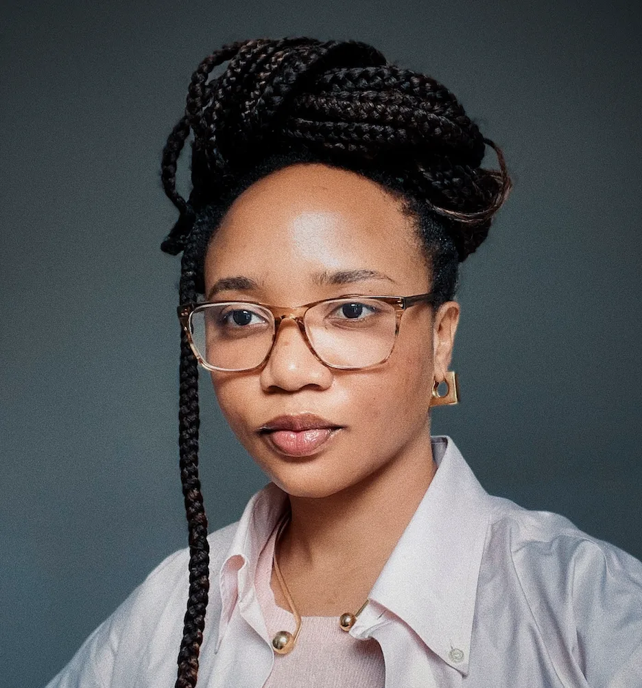

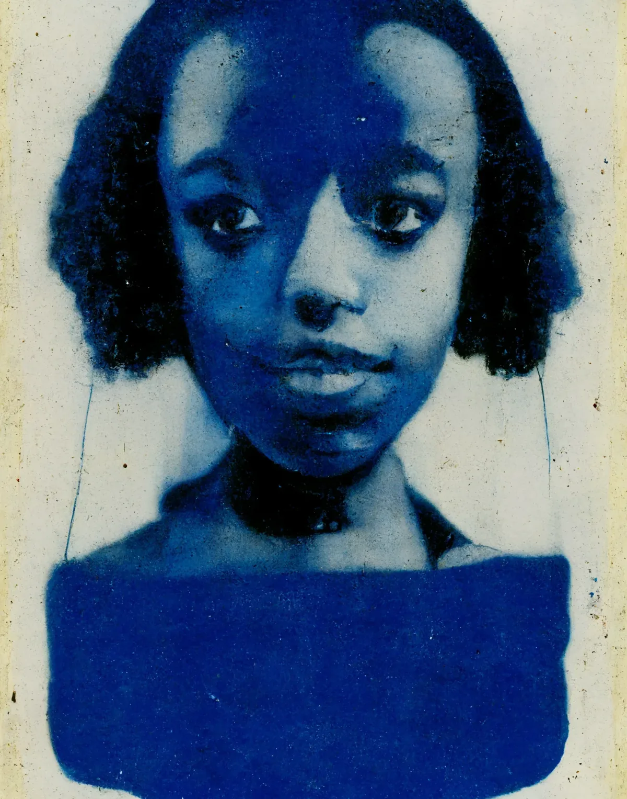

Although AI-based artistic processes, such as Generative Adversarial Networks (GANs) and text-to-image algorithms hold great promise for enhancing teaching and learning in K-12 Art Education, they can be challenging to adopt for Art Teachers with little to no AI knowledge. This challenge is compounded by the lack of entry-level educational resources that address K-12 learning contexts.

To address this challenge, The Art Teachers’ Guide to Artificial Intelligence is designed to help K-12 Art teachers understand basic AI concepts, learn useful AI terminology, explore arts-based use cases, open source tools and understand ethical implications. By providing a framework for thinking about AI in the context of K-12 art classes, this guide will help Art teachers prepare students for an increasingly AI-augmented artistic ecosystem.

*Minne Atairu is an interdisciplinary Artist, and doctoral student at Columbia University. Minne’s academic research emerges at the intersection of Machine Learning, Art Education and Hip-Hop Pedagogy. Through the use of Artificial Intelligence (StyleGAN, GPT-3), Minne recombines historical fragments, sculptures, texts, images and sounds to generate synthetic Benin Bronzes which often hinge on questions of repatriation, and post-repatriation. Minneatairu.com.*

*Follow Minne on* [twitter](http://twitter.com/minneatairu) *and* [instagram](http://instagram.com/minneatairu)*.*

Minne will be mentored by [Layla Quinones](https://twitter.com/MsQCSNYC).

#### Morgan P. Vickers | Un/Drowned: Visualizing Submerged Black Towns, New Deal Infrastructure, and American ‘Progress’

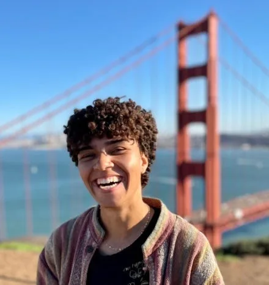

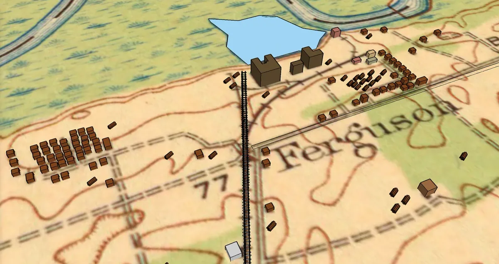

Between 1939 and 1942, the state of South Carolina dispossessed more than 2500 Black people and drowned hundreds of acres of farm and swampland through the creation of Lakes Marion and Moultrie, disappearing homes, community centers, and graves, and fragmenting lives in the process. In this project, Morgan will cartographically (re)map the houses, communities, and ecologies of these disappeared spaces in an effort to demonstrate the scale and consequences of material and social deluges. Morgan seeks to (re)map that which lies below the surface in order to honor those whose lives were destroyed a century ago. Following recent Black ecologies scholarship, Morgan’s project delves into a “wetter archive” (Bennett 2020), think through murky waters (Jue 2020), and undrown submerged Black towns (Gumbs 2020) using the Processing Foundation’s mapping technologies (p5.js) and critical fabulation (Hartman 2019). Morgan will create maps that document the transformation of space over time which will interrogate the question: progress for whom? Centering material environmental change in digital maps will allow individuals to visualize the change over time, and documenting the consequences of flood-based dispossession and government negligence will allow us to make plans as we look ahead to the impending threats of rising tides worldwide.

*Morgan P. Vickers is a writer, researcher, community historian, historic preservation storyteller, ethnographer, and Ph.D. candidate in the Department of Geography at the University of California, Berkeley. Their present work focuses on drowned towns of the Santee-Cooper Project in South Carolina, wherein 901 mostly Black families were displaced in the name of New Deal “progress.” Thematically, Morgan’s work contemplates Black geographies and placemaking, federal dam and reservoir projects, affect, community memory studies, and questions of belonging. website: morganpvickers.com*

*Follow Morgan on* [twitter](http://twitter.com/mrgnvckrs) *and* [instagram](http://instagram.com/jstor_gan)*.*

Morgan will be mentored by [Adrian Jones](https://looking-glass.space) in the summer and [Anna Garbier](https://annagarbier.com/) from [SOSO](http://sosolimited.com/), one of our fellowship sponsors in the fall.

#### Rolando Vargas | Processing in Kuna Language

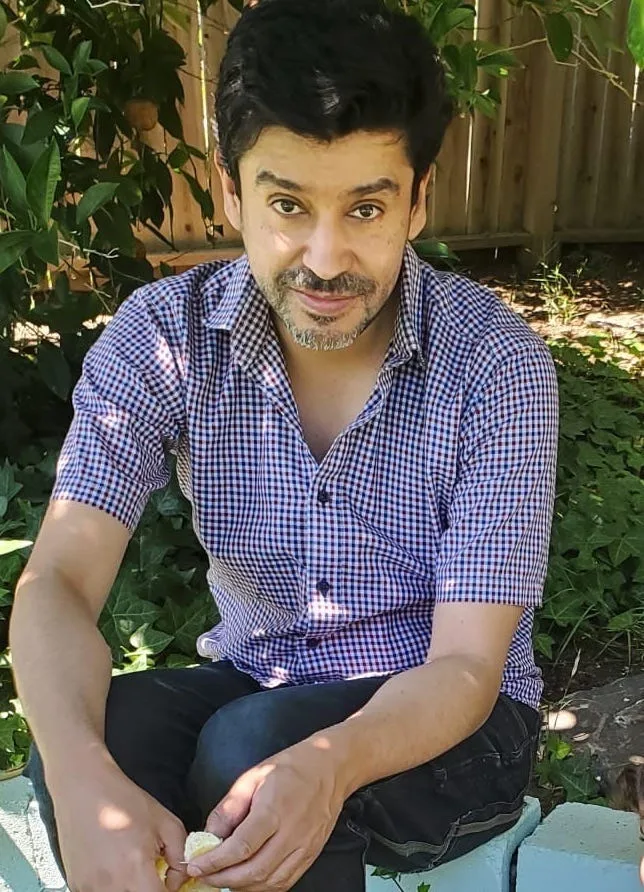

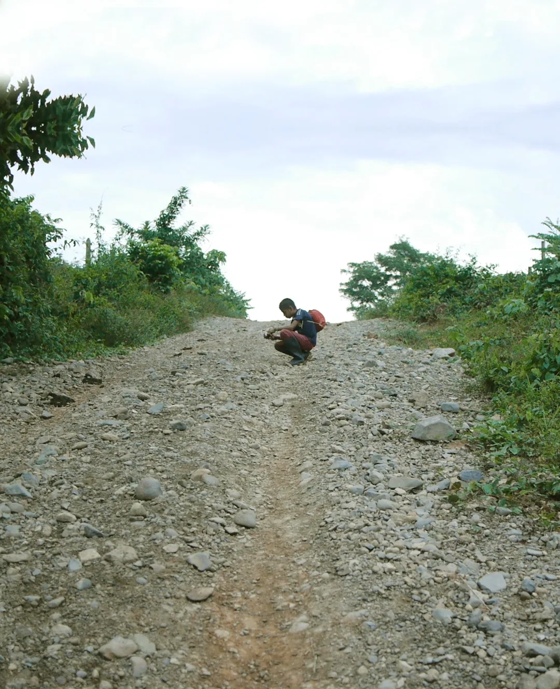

The project is an initial step for localizing P5.js references and relevant materials into the Kuna language. In the Kuna Indigenous community of Arquia, located in the Darién tropical rainforest, we want to use p5.js to build the first self-produced Kuna dictionary in a digital and visual format. This initial project would be a foundational exercise for our Digital dictionary; we envision the creation of the dictionary as a collaborative project with Kuna students and professors of the Centro Educativo Kuna using Processing tools. As the children’s first language is Kuna, and they usually learn Spanish in high school as a foreign language, it is crucial to produce educational materials in Kuna to foster digital accessibility in the educational Kuna context.

*Rolando Vargas is a media artist working with installation, and digital media. He received a Fulbright grant for his MFA in Intermedia, and Digital Arts. Rolando’s dissertation «Kuna Indigenous Media and Knowledge in the Darién Tropical Rain Forest» focused on the politics of traversal and terrain, mapping and survival, and the geographies of collective labor and will as modes of indigenous resistance. Rolando has presented his work at Transmediale, the Kassel Documentary Film Festival, SESC Videobrasil, Recontres Internationales Paris/Berlin/Madrid, Kunstverein Düsseldof, EMAF, Ficvaldivia and other international venues. Follow Rolando on* [twitter](https://twitter.com/rolando67608138)*.*

Rolando will be mentored by [Bobby Joe Smith III](https://www.bobbyjoesmith.com/).

#### Sierra Gilliam (Teaching Fellow) | Interactive resource guide for CS teachers

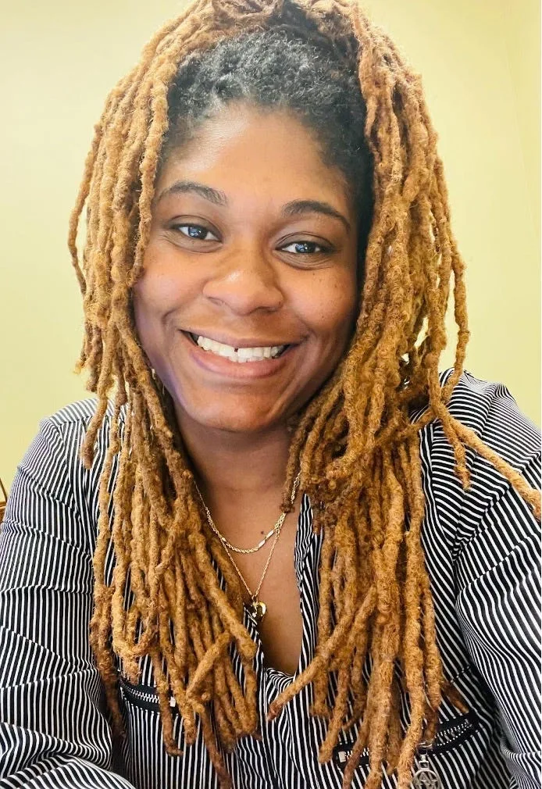

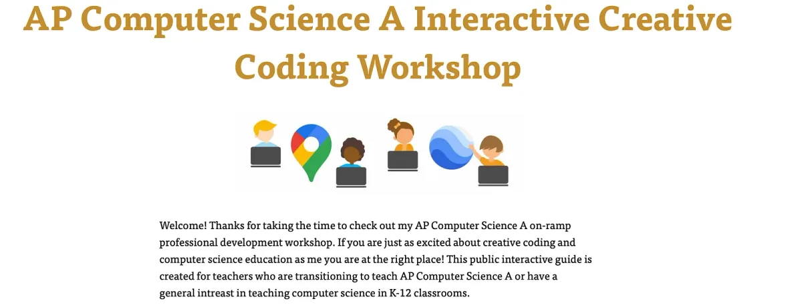

Sierra’s professional development workshops and resources are for pre-service teachers at Georgia State University who are beginning to teach or integrate computer science into their teaching. These workshops will also illustrate to teachers how to leverage personal data, particularly geospatial data, to provide more personally and culturally relevant CS experiences for students.

These workshops will use Processing as a medium to facilitate conversations about technology ethics and provide a more meaningful introduction for teachers to the widely used but challenging to learn open-source [CS Awesome curriculum for AP Computer Science A](https://runestone.academy/ns/books/published/csawesome/index.html). Sierra’s project will use a computer science course for pre-service teachers she is teaching with her advisor at Georgia State this summer to iteratively develop these workshops and resources. Project outcomes will be a set of resources and materials hosted on a website that could be used by education schools to provide a more meaningful and personally relevant introduction to computer science for teachers interested in teaching or integrating CS into their courses. Resources and materials will be organized into different workshops that can be run independently or sequentially.

Each workshop will have supporting videos, lesson guides, resources, code examples, and unplugged activities.

*Sierra Gilliam is a Ph.D. student in the department of Learning Sciences at Georgia State University. She is a mother of three amazing boys and enjoys traveling, reading, and baking treats for her sons on the weekends. She is extremely passionate about computer science education. Website:* [https://sway.office.com/QkZAaq9RIQlUg3dC?ref=Link](https://sway.office.com/QkZAaq9RIQlUg3dC?ref=Link)

*Follow Sierra on* [twitter](https://twitter.com/Si_Gilliam)*.*

Sierra will be mentored by [Saber Khan](https://www.edsaber.info/), the Education Community Director of Processing.

#### Yadira Sánchez in collectivity with David Marcelino Cayetano | Rural Technological Ecologies (rural tech-ecologies)

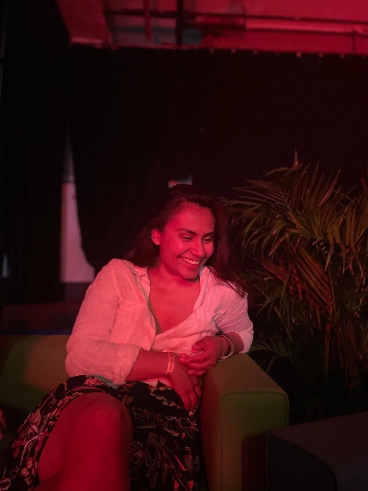

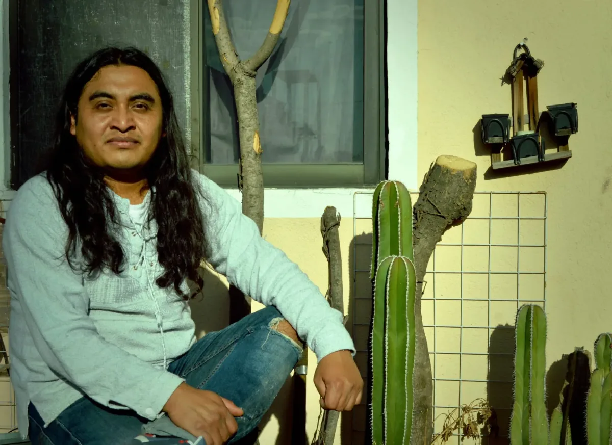

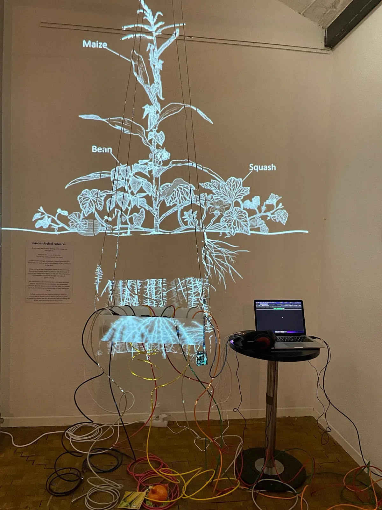

This is a portal web that imagines rural technological ecologies in Nahuatl and in Spanish. Centering kids and youth in rural and Indigenous areas in Mexico (& beyond). This web portal dreams and portrays the embodiment of the many ecologies around rural ecosystems. Taking from the definition of ecology \[as the relationships between living organisms, including humans, and their physical environment. Ecology considers organisms at the individual, population, community, ecosystem, and biosphere level.\] This isa space where we embrace these beautiful technologies that continue to be threatened but which are part of our ecosystems and are one with our rural and Indigenous cultures and communities. This project centers rural childhood and youth in the active participation at the intersection of ecology, our environment and technologies. As the portal materializes it will continually become a space of sharing knowledge and archiving our knowledge in our own ways.

As a collective and mutual project, workshops will be taking place as the portal develops — to ask for the children’s feedback, to share how the space works, where the documentation is and how it evolves so that everyone can access the material and be able to share whenever anyone wants.

*Yadira Sánchez is a creative researcher, experimenting with software and hardware and examining the role technology plays in our everyday lives and ecosystems. Engaging and actively dismantling the tech-violent pipelines reinforcing hegemonic structures. Reimagining and co-creating spaces where technologies and art are pluriversal and liberatory. During this project Yadira will be developing and co-designing the portal and the fellowship engagement.* [https://pueblerina.glitch.me/](https://pueblerina.glitch.me/) *Follow Yadira on* [twitter](http://twitter.com/yadira_sz) *and* [instagram](http://instagram.com/yadira.sz)*.*

An essential part of the project includes having the content accessible in Nahuatl. For this reason, the project collaborates with Nahuatl teacher and activist David Marcelino Cayetano.

*David Marcelino Cayetano, of Nahua–Aztec ancestral roots, has been dedicated to audio–visual art, photography, muralism, poetry, and music from the worldview of his original peoples, for more than seven years. He is a teacher of his native Nahuatl language and a promoter of traditional medicine, knowledge of which was passed on to him by his grandparents. Co-founder of “Speak Nahuatl”, a collective school of Native languages. He published a book on the legends of nature and sacred places of the Huasteca “Kamanaltlajtolmej Xilitlan / Narratives in Náhuatl de Xilitla”.*

*Throughout his career he has documented the wisdom of his ancestors such as language, dances, medicine ceremonies, traditions, customs, etc.*

*David has served as a community authority in his own community with the position of Municipal Delegate. He studied civil engineering at the Regiomontana University. During his stay in Monterrey, he was a producer and host of the TV/Radio program “Voces Originarias” on TuVoxTV. He has also made murals from his ancestral worldview and is passionate about everything related to the traditional medicine of his ancestors, which was passed on to him, as well as teaching classes of Náhuatl. He currently makes Indigenous cinema and is the co–founder of the independent film production house “Bironga Films”, which has presented his audio–visual works in the National Cinema, National Mask Museum, Institute of Anthropological Research, National School of Languages, Linguistics and Translation of UNAM, academic spaces and international film festivals. Follow David on* [instagram](https://instagram.com/tlatoanitsin)*.*

Yadira will be mentored by [Chris Cuellar](https://chris-cuellar.me/) from [Bocoup](https://bocoup.com/), one of our fellowship sponsors.

#### Yen Ching Lu and Munus Shih | **Begin Contour: A Critical, Anticolonial, and Intersectional Pedagogy to Taiwanese Creative Technology Education**

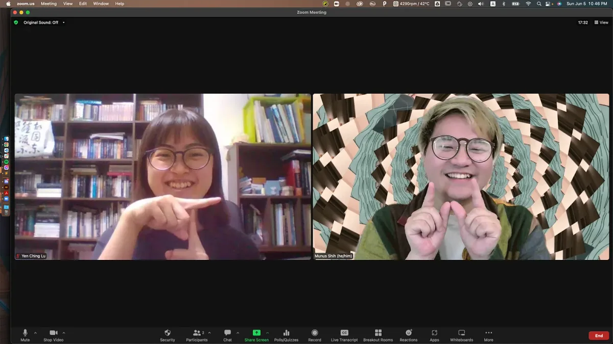

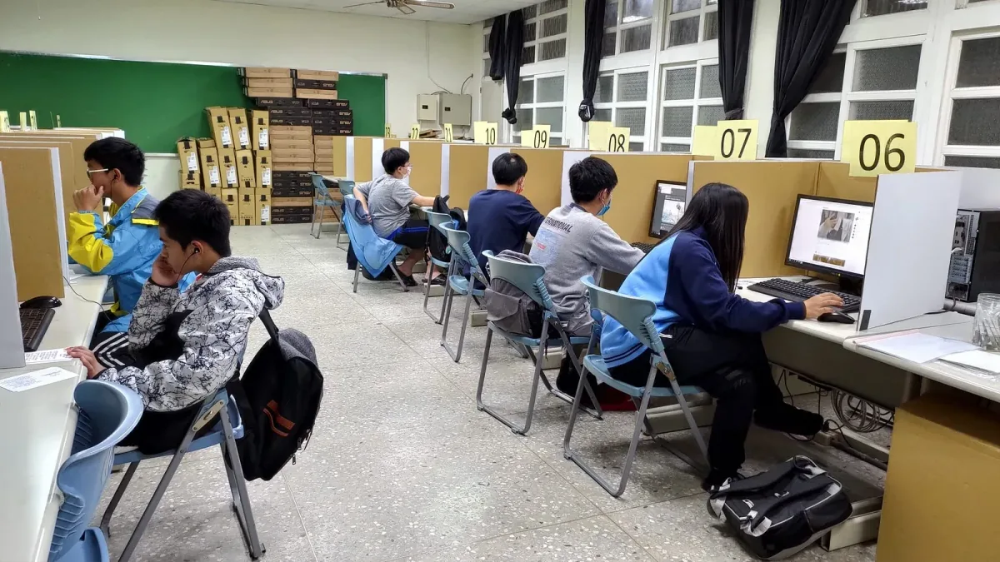

This project hopes to open up Taiwanese middle-school underprivileged and indigenous students’ imagination of creative technology through more beginner-friendly and approachable technology education. Yen Ching and Munus’s project develops a non-institutional method for teaching college students how to reimagine Taiwanese Creative Technology Education through a critical, anti-colonial, and intersectional approach, as well as ideating other alternate possibilities.

The project will be divided into three stages, each about a month long. Yen Ching and Munus will interview practitioners in Taiwanese Creative Technology education, remote technology education, and the design and technology industry to map out a landscape of the current Taiwanese Creative Technology Education. They will work with a collective group of interested undergrad and grad students at National Tsing Hua University and National Yang-Ming Chiao Tung University, introducing the students to various resources of creative technology education with critical, anti-colonial, and intersectional teaching philosophies. Yen Ching and Munus will also facilitate them in developing their own teaching tools and workshops, primarily using open-source tools like p5.js to reimagine alternate forms of knowledge sharing in a Taiwanese context.

In the last stage, Yen Ching and Munus will host an in-person practicum in Jianshi middle school and let these college students test-run their workshops for the indigenous and underprivileged students. All teaching materials and reflections will be archived to an open-source website to hopefully enrich the broader community of Taiwanese creative tech education.

*Being born and raised in Hsinchu, Taiwan, both Yenching (she/her,* [https://fb.me/yenchinglu.xyz)](https://fb.me/yenchinglu.xyz%29) *and Munus (he/him,* [https://munusshih.com](https://munusshih.com)*) have strong connections to their local art and design community and have been the past four years trying to cultivate one. In 2018, they started the first design-focused group “Tzaiwu Graphic Design” at National Tsing Hua University where they hosted various art and design workshops, gave out lectures, invited speakers, and hosted discussions about the critical aspects and politics of design in the Taiwanese contexts.*

*In 2021, they taught a class in “Tsing Hua Interdisciplinary Program” called “Future Museum: Speculative Design and Creative Coding” as a general education course to mainly first-year students with various majors. In that class, they explored the possibility of using Creative Coding to investigate the critical thinking of technology and a new paradigm of media art.*

*Currently, Yenching is pursuing her master’s degree in Applied Art at the National Yang-Ming Chiao Tung University (NYCU) in Hsinchu, Taiwan, where she focuses on studying speculative design and bio-art. She is a research assistant in the Bio-Art Database Project of NYCU, dedicated to providing artists, researchers, and interested people in the Taiwanese-Mandarin-speaking world with more ways to learn about bio-art. Since last year, she has been working at Hsinchu County Jianshi Junior High School as a teacher of the “Creative Digital Media Club” to introduce indigenous middle school students to many creative open-source tools. Follow Yenching on* [instagram](https://www.instagram.com/yenchinglu.xyz/)*.*

*With an interdisciplinary background in Graphic Design and Engineering, Munus is a rising second-year student in Design and Technology MFA at Parsons School of Design. He studies the various applications of Generative Design, Critical Code, and Data Visualization. In school, he is an active member of the community and often teaches workshops in HTML/CSS and generative design to his peer friends. He took ‘code, decolonized’ by Xin Xin, exploring a anti-colonial method of teaching and developing a library “p5.(gen)zine” with Iley Cao. They taught a workshop in Red Hook, Brooklyn using p5.(gen)zine as a tool to make the zine-making process more approachable and beginner-friendly, while addressed issues on queer identity, and digital communities in collaboration with Powrplnt and Pioneer Works. Follow Munus on* [instagram](https://www.instagram.com/munusshih/)*.*

Yen Ching and Munus will be mentored by [Yindi Pei](https://twitter.com/yindithey).
