Our fellowship program is made possible by a grant from the National Endowment for the Arts.

In addition to supporting the fellows this year financially and with mentorship, we’re thrilled to support six finalists with mini grants of $1200. This is our first year piloting mini grant support of finalists and we hope to continue this in future fellowships as well. These mini grants are a small step in reflecting our commitment towards [expanding our fellowship and capacity for broader community support](https://medium.com/processing-foundation/processing-foundation-funding-update-94cddb25a3d9).

Continuing with previous years, we asked fellowship applicants to address at least one of five Priority Areas that, to us, feel especially important for technology and coding right now: Accessibility, Internationalization, Continuing Support, AI Ethics and Open Source, and Ecology and Environment.

From classroom built weather stations in Texas, an experimental food lab, a Kumeyaay calendar, audiovisual projects, network doulas and software to visualize environmental change, we feel very fortunate at Processing Foundation to highlight the fantastic work of our community members!

#### Aiyo | experimental food lab

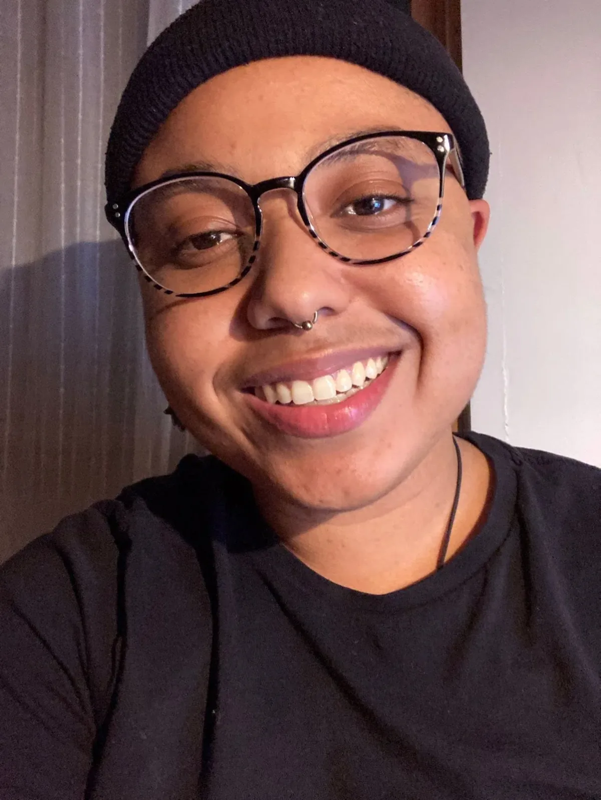

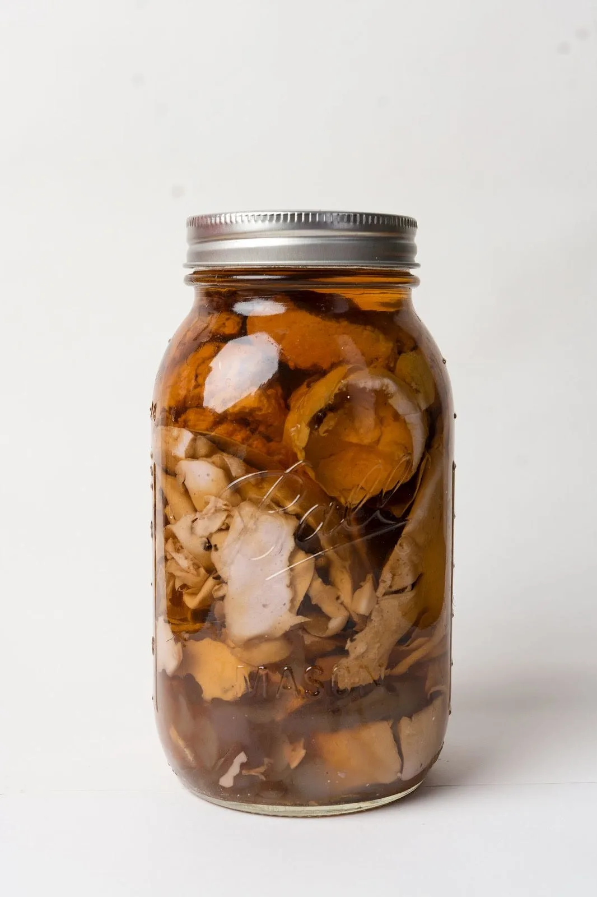

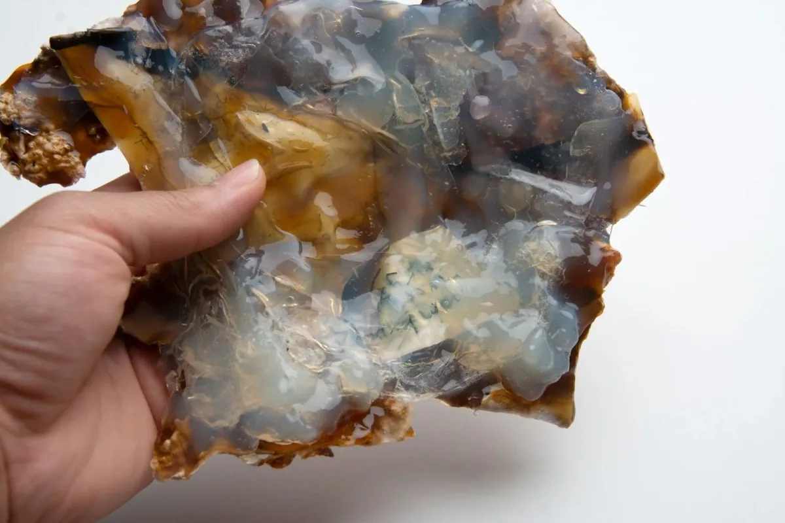

This project was born out of a desire to reconnect to food as technology through an intergenerational, multi-cultural community, asking, “is this a desired space?”

The experimental food lab is a transitory classroom activated and fueled by community knowledge and participation. Play, learning, and experimentation with food-related projects are the core ideologies of engaging the senses in this space.

**Without community, this space doesn’t exist.**

This space is for everyone to feel welcomed, with the intention of uplifting and celebrating our different identities and ways of being in the world.

We are collectively experiencing the effects of global capitalism, displacement, unstable food systems, food apartheid, climate change, and so much more. The experimental food lab believes in an abundance mindset cultivated through community gathering, experimentation, and joy.

This space is a flexible space where every Body is recognized as a learner and knowledge-sharer at all times. Participation can look like: leading a workshop (with support) if you feel called to, coming to workshops engaged and open to learning and receiving new knowledge, sharing food from workshops with your communities, and lending resources and materials to make workshops possible. There is no “fixed” way to exist in this space.

*Aiyo (they/them) is a genderqueer/trans human spirit trying to learn how to exist in a human body. They are currently in the MFA Design and Technology program at Parsons.*

*They have started to believe that technology is everything situated in the realms of multidimensional experiences. Their work exists at the intersections of food, bio-art, ritual, and speculation.*

*Their process is experimental — and they try to give breath to the flow of experiences passing through them. They value slowing down in this timeline to sit with big questions and find themself asking many. They are not in a hurry to answer any.*

*The process of experimentation and space to explore is a rediscovery of self. They are trying to lead with an open heart — while discovering how their inner states of being (mind, body, soul) connect and resonate with other entities. They desire to explore interspecies connections through bacteria, microbes, and bio-plastics/bio-composites (they also refer to them as bioskins).*

*They’ve also been dreaming of spaces for play — where there is room to be wrong, vulnerable, honest, and safe.*

*Follow Aiyo on* [instagram](https://www.instagram.com/soft_bois_do_cry/)*.*

#### Alice Yuan Zhang | Bridging the Bitsphere and Biosphere

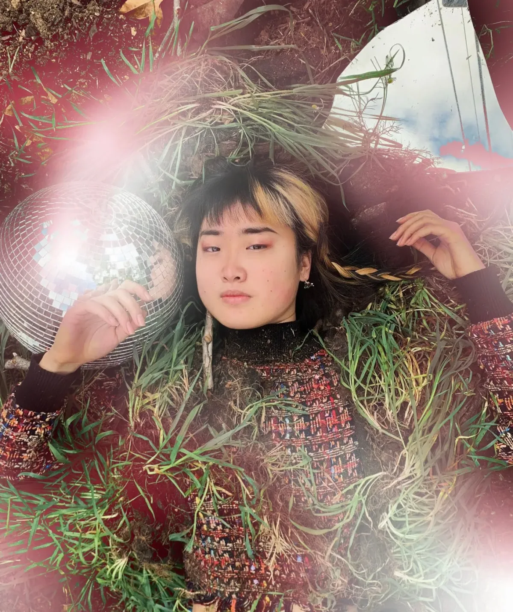

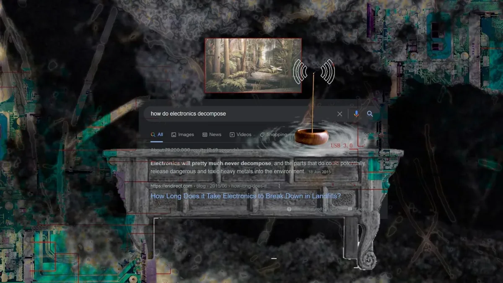

*Alt-text: A ghostly altar table floats against a dark soily background with luminescent hints of roots and computer hardware creeping in from opposite corners. A screenshot of a Google search is overlaid onto the altar, displaying the query, “how do electronics decompose”. The top article shown by the search engine is titled “How Long Does it Take Electronics to Break Down in Landfills’’ and its highlighted text reads, “Electronics will pretty much never decompose, and the parts that do could potentially release dangerous and toxic heavy metals into the environment.” (continued in alt-text)*

This experimental research project attempts to develop a “deep view” on digital infrastructure by traversing temporal, relational, and emotional scales. Public activations may take shape as poems, processes, ports, and protocols derived from care-based network cosmologies, in support of re-relating with technology as part of the ecosystemic body.

> “The struggle to understand and steer the interaction between the bitsphere and the biosphere is the struggle for community in the broadest ecological context.”

> \- Ursula M. Franklin, The Real World of Technology (1989)

There’s so much obscurity around the digital medium masking the extractive labor, energy, and material required to uphold its globalized efficiency. What can technological infrastructure feel like if it were rooted in just relations with the Earth at every layer? Would cables spring up, shape-shift, and decompose as needed? Can social networks support folks to respond like blood clots and share information like trees? Is it possible to weave connectivity at the scale of consent-ability?

This long-term project attempts to (1) stage a critical intervention / grief framework into current digital infrastructure, and (2) uplift decolonial and transfeminist imaginaries toward possibilities of praxis. An open and collaborative [Network Doula Library](https://www.are.na/alice-yuan-zhang-omhf4oxqjnk/network-doula-library-frexnywsfcu), set up as part of Zhang’s research residency with [0x Salon](https://www.instagram.com/0x.salon/) this spring, holds a loose collection of ideas and resources that will be further developed into various pedagogical and performative forms later in the year with the support of Processing Foundation.

*Alice Yuan Zhang (she/her) 张元 is a Chinese-American media artist, researcher, and educator. Her transdisciplinary practice operates on a cyclical and intergenerational time. Along the peripheries of imperialist imagination, she examines technology through the lenses of ancestral remembering, interspecies pedagogy, and networked solidarity. Currently she is devising ways to understand digital infrastructure through collective care and grief practices.*

*Alice is a co-founder of virtual care lab, Dweb fellow, research resident at 0xSalon, and past artist-in-residence at CultureHub. She has taught Media Studies for Performance at Sarah Lawrence College, facilitated a study group on Digital Matterealities at NAVEL LA, and hosted dozens of experimental learning engagements across major academic institutions as well as grassroots cultural spaces.*

*Follow Alice on* [instagram](https://www.instagram.com/aliceyuanzhang/)*,* [twitter](https://twitter.com/aliceyuanzhang)*, and* [Mastodon](https://post.lurk.org/web/@aliceyuanzhang)*.*

#### Jeffrey Yoo Warren | Cyclogram.js

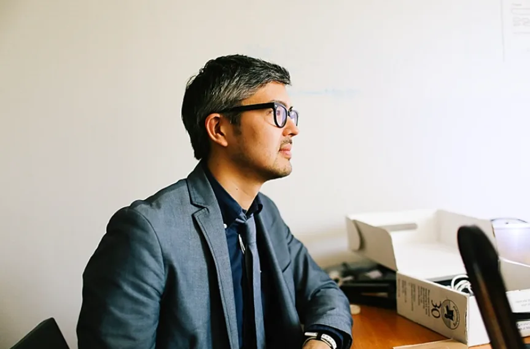

*Photo by Dakota Lenox Photography*

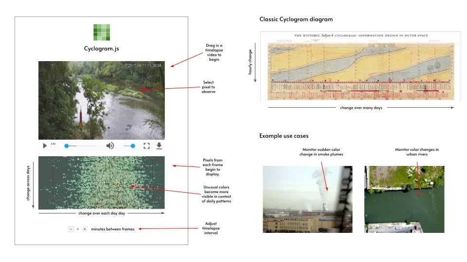

*Alt-text: A mockup of an interface on the left shows a video of a lush river with greenish brown water, where a square highlights a clear area of water. Labels say “Drag in a timelapse video to begin” and “Select pixel to observe.” Below, a pixelated image made up of colored squares is labeled “Change across days” vertically and “Change over each day” horizontally. Labels indicate “Pixels from each video frame begin to display” and “Unusual colors become more visible in the context of daily patterns,” the latter pointing at a patch of yellowish brown pixels in the middle of the pixelated image, representing a few hours when the river was a strange color. Below, buttons allow changing the timelapse interval. To the right, a “Classic cyclogram diagram” is shown from “The historic Salyut 6 cyclogram: information design in outer space” with vertical axis labeled “hourly change” and horizontal axis “Change over many days.” Swaths of color show patterns of sunlight and darkness. (continued in alt-text)*

Cyclogram.js is a p5.js-based tool to observe changes and cycles in rivers (and other environmental) colors using time lapse photography, leading to deeper understandings of environmental processes and harms. Subtle changes in the color of water, sky, or foliage can reveal patterns and irregularities and lead to deeper understandings of environmental processes, whether healthy or as the result of environmental harms. These changes, while difficult to see on first glance, emerge as legible regularities or irregularities when displayed in a cyclogram visualization, which organizes the change in color of a single pixel over 24 hours on each row of a continuously scrolling “waterfall.”

Using p5.js, Cyclogram.js will provide an easy to use, web-based interface for uploading a weeks-long timelapse video, selecting a pixel position, and generating cyclogram visualizations. The kinds of subtle change which can signal environmental change or even hazards are a vital part of local expertise and land stewardship, and are the kind of deep contextual knowledge often held by communities affected by environmental racism. The tool and its uses will be shared online for use in education and advocacy, as well as in the form of a p5.js library for working with timelapse video, so that other uses may emerge from this kind of video analysis technique.

*Jeffrey Yoo Warren (he/him) is a Korean-American artist-educator, community scientist, illustrator, and researcher in Providence, RI, who collaboratively creates community science projects which decenter dominant cultures in environmental knowledge production. He hosts participatory projects, runs workshops, and gives talks on culturally situated making, collaborative practice, and community science. Jeff is a board member of Culture2, a member of AS220 in Providence and a facilitator with Movement Education Outdoors, a youth-centered organization which teaches Black and Indigenous history of Rhode Island in the outdoors. He co-leads New Old Art collective with Aisha Jandosova, hosting art-making and storytelling with older adults. In 2010, he co-founded Public Lab, a community science network and non-profit dedicated to democratizing science to address environmental issues that affect people. After 10 years as Director of Research, he stepped down in 2020 but continues to lead and mentor Public Lab’s program for diversity, equity, and inclusion in software and technology.*

*His work is available at* [https://unterbahn.com](https://unterbahn.com)*.*

*Follow Jeffrey on* [instagram](https://www.instagram.com/unterbahn/) *and* [twitter](https://twitter.com/jywarren)*.*

#### Kumeyaay Heritage Preservation Committee (KHPC), Michael Connolly Miskwish, Oren Robinson | Matt’aam Kumeyaay: An ‘Iipay-Tiipay Sky Knowledge Calendar

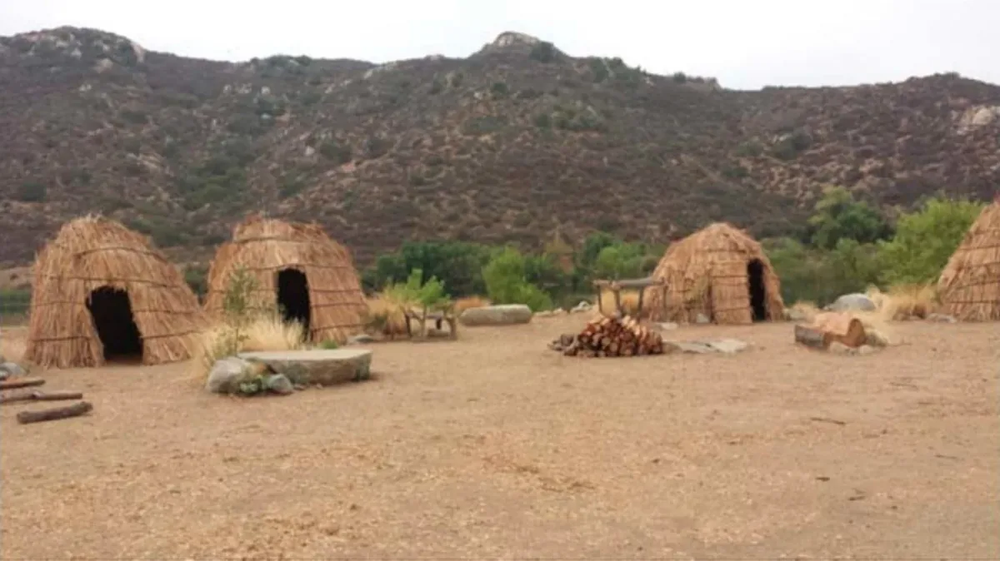

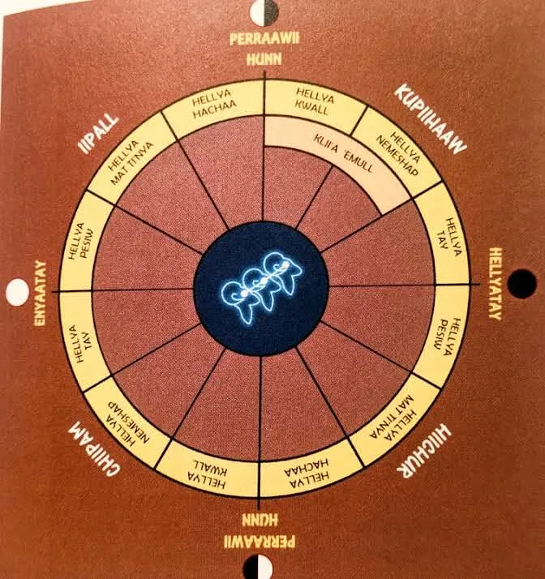

*Alt-text: A diagram of a circle representing the earth’s movement around the sun. A constellation representing three mountain sheep glows in a black circle at the center of the wheel. Twelve spokes signify 12 lunar cycles throughout the year. At the top and bottom edges of the circle are smaller circles depicting the northward and southward equinoxes with equal-sized black and white halves indicating equal daylight and nighttime. At the left and right edges are a small white and black circle, indicating the longest and shortest days of the year as a white circle and a black circle. The labels of the five seasons, the four major solar events, and the 12 months as segments of the wheel are all labeled using the Kumeyaay language.*

The Kumeyaay Nation are the first people of what is now known as San Diego. Kumeyaay territory is rich and diverse in its geography and covers a vast area from the coast to the desert, as far north as current day Oceanside, California, and further south than present day Ensenada, Baja California, Mexico, including oceans, coastal chaparral, grasslands, mountains, high desert chaparral, oak woodlands, desert and the numerous river habitats within these areas.

Since time immemorial, Kumeyaay ceremonies have marked the Earth’s movements (Matt’aam) and celestial and lunar events. These events inform traditional ethnobotanical sciences and all aspects of traditional life. In recent years, a modern adaptation of the traditional calendar has been designed by Mike Connolly Miskwish (Campo Kumeyaay Nation) based on years of research.

The purpose of the Matt’aam Kumeyaay app is to give information about the position of the sun, moon, and important constellations according to traditional knowledge, including the names of months based on research by Mike Connolly Miskwish, and indicating which constellations are prominent during each month.

To co-design and co-create a web app (also embeddable onto a mobile phone or tablet home screen) which gives information about the position of the sun, moon, and important constellations according to traditional knowledge, including the names of months based on research by Mike Connolly Miskwish.

*Kumeyaay Heritage Preservation Committee (KHPC) represents nine federally-recognized tribes of the Kumeyaay Nation and is charged with protecting Kumeyaay spirituality, cultural resources, and heritage within the aboriginal territory of the Kumeyaay people.*

*Michael Connolly Miskwish (he/him) is a citizen of the Campo Kumeyaay Nation. He has worked for over 30 years in public policy and the implementation of traditional Kumeyaay environmental practices in contemporary land and resource management.*

*He has authored papers on tribal economics, Kumeyaay history and resource management. He has three published books on Kumeyaay history and cosmology. He has curated exhibits on Kumeyaay culture and history for the National Museum of the American Indian in Washington, D.C., and the Museum of Man in San Diego, California. In 2006 he was the recipient of the John Montgomery Education Award by the Congress of History of San Diego and Imperial Counties.*

*Michael’s formal education includes a Bachelor of Science in Manufacturing Engineering and a Master of Arts in Economics.*

*He works directly with Kumeyaay education and cultural organizations. He is a policy consultant to the Southern California Tribal Chairman’s Association. He continues to write and lecture on Kumeyaay history and culture.*

*Oren (they/he) is a student of Kumeyaay Community College, a calendar enthusiast, and a volunteer organizer within the Design Justice Network.*

#### **Nick McIntyre, Nia Cultural Center, Young Gardeners Program | Community Gardening with Arduino and p5.js**

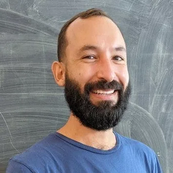

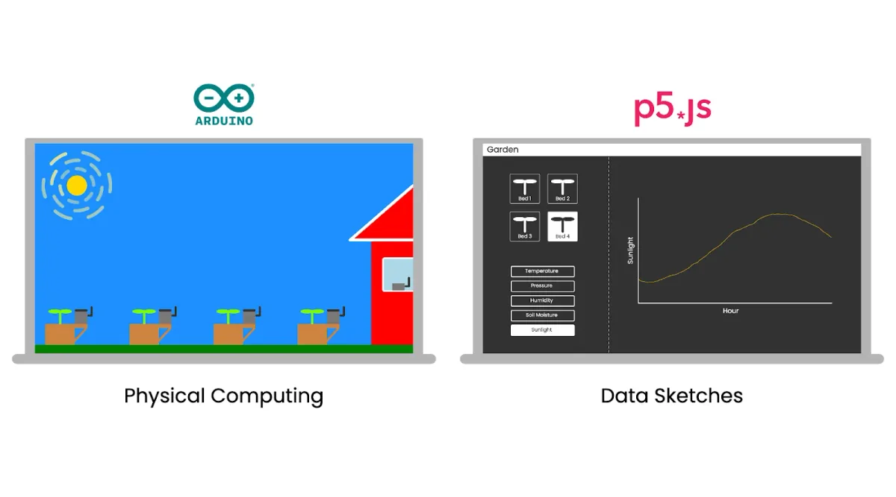

The project will produce two units of curriculum for building Arduino-based weather stations to manage school gardens. The first unit, Physical Computing, provides an introduction to electric circuits, microcontrollers, solar power, and coding. The second unit, Data Sketches, provides an introduction to creative coding, data visualization, and sustainable web design.

Freedom School, a Children’s Defense Fund summer program offered through [Nia Cultural Center](https://niacultural.org), is the home base for developing and testing the curriculum. Freedom School scholars are called to engage in social activism each summer, and this year’s focus is the climate crisis. We are partnering with the [Young Gardeners Program](https://galvestonsownfarmersmarket.com/younggardeners) to teach scholars how gardening skills enable them to promote environmental justice, sustainable agriculture, and food security in their community.

Scholars in middle school will learn how technology can help them to understand their world and steadily remake it into a better one. They will learn about topics from first principles using open-source hardware and software. In the process, they will co-create a blueprint that can be remixed freely by anyone. The curriculum websites will be hosted using GitHub Pages in the spirit of CS4All’s Introduction to Computational Media curriculum.

*Nick McIntyre (he/him) teaches STEAM subjects and helps professionals to craft visualizations and artwork. He’s taught creative coding in school and museum classrooms, developed a math curriculum alongside his high school students, partnered with nonprofits to teach sustainable design, and consulted for startups.*

*A native Texan, Nick earned a BS in Engineering with Honors and MS in Civil and Environmental Engineering from Stanford University. He loves hanging out on the beach when he isn’t tinkering with projects.*

*His work is available at* [https://mcintyre.io](https://mcintyre.io)*.*

#### So Sun Park | Audiovisual Coding with Music Students

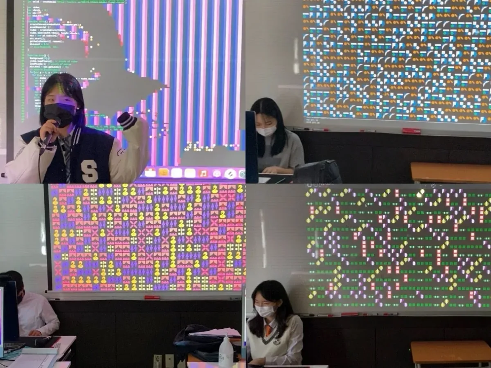

So Sun Park is currently teaching coding classes for high school music students part-time and her project aims to hold an audiovisual performance with a few of them. She will mainly use p5.js and P5LIVE to lead workshops and perform an audiovisual show. Her focus is to explore technology and music artistry with the students.

There is a Korean term called ‘Su-Po-Ja’ which refers to a person who gave up mathematics. It is commonly used among non-STEM people since middle school because Korean math education gets exponentially harder after each respective grade. Korean high school math or Korean SAT math tests are infamous for being difficult.

Many of her music students get excited watching audiovisual videos on youtube and enjoy drawing cute sketches with p5.js. Yet, they are still uncertain about musicians using programming to make something. Whenever certain codes are difficult, the students easily lose interest. As much as she understands the struggle, she wants to provide an enjoyable opportunity for them to use programming to create something related to their own arts and interests.

She hopes that she and her students will break that ‘su-po-ja’ stereotype, which lingers both within society and inside their minds. It keeps them from expanding their imagination. She hopes these young talents discover their potential and bravely confront challenges, and thus be more open to multidisciplinary collaborations in the future.

She wants to provide an opportunity to enjoy the process of mixing their music with technology/math. Hopefully, they can learn together how to endure and enjoy the struggle of experimenting.

As a part of this project, she has recently collaborated with a few student teams and made audiovisual projections for the showcase hosted by [Seoul Music High School](https://www.instagram.com/p/CiKwYgIpmIp/?igshid=NmNmNjAwNzg=) this September. Within 2–3 weeks, she and her students researched references and discussed creative directions to match the generative art visuals/motions with the music. They started from the sketches they have already learned in the classroom and built up the creative styles and technicality further. In this showcase, they worked on the following songs: *Gang Gang(강강)* by Oyeol 오열 (lead student: Ji-woo Kim), *Would you Believe* by Sam Kim (lead student: Ye-bin Lee), *Rain On Us* by John P. Kee (lead student: Young-seo Na).

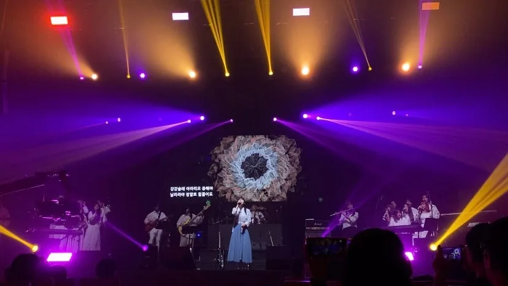

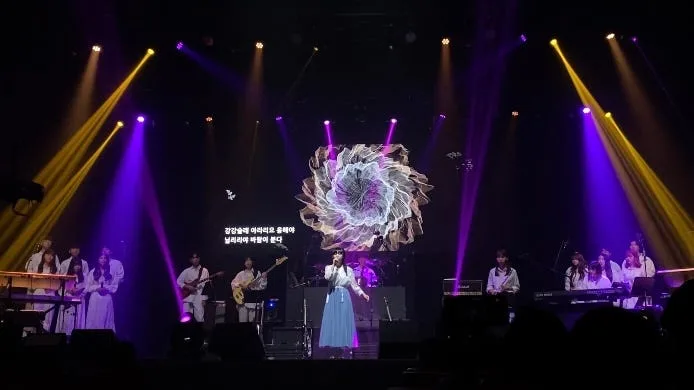

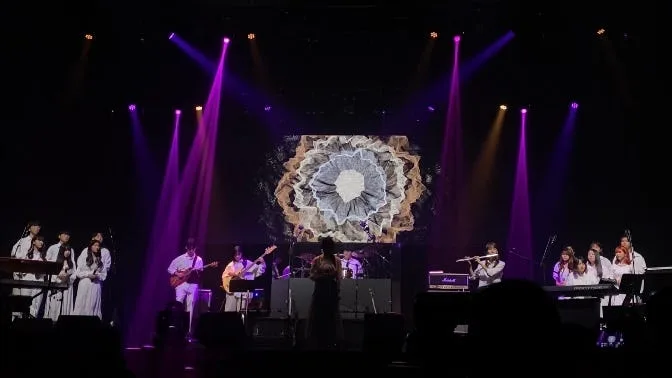

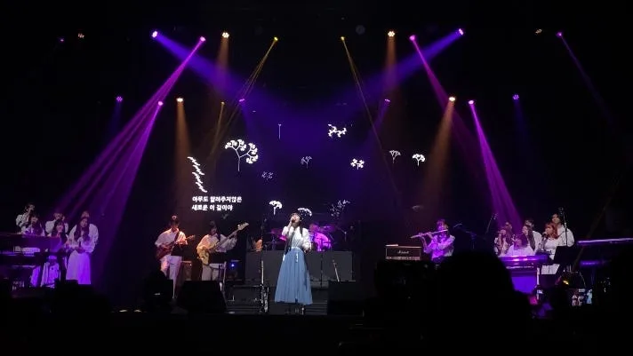

Jiwoo(vocal) and her band performed ‘Gang Gang (강강)’ by Oyeol (오열). In the earlier idea meeting, she proposed some traditional Korean nature vibe and that reminded So Sun of old Korean landscape paintings and [the related exhibition](https://www.youtube.com/watch?v=AOeAw6wGkpY) she visited a few years ago. She used recursive trees and perlin noise algorithms, and worked on a few detailed choices with Jiwoo. She also taught the basic version of these sketches in the classroom and helped the students to change the colors/numbers/variables to make their own versions. During the class, she connected the numbers of trees of branches with midi signals and the perlin noise intensity or amplitude with mic volume inputs.

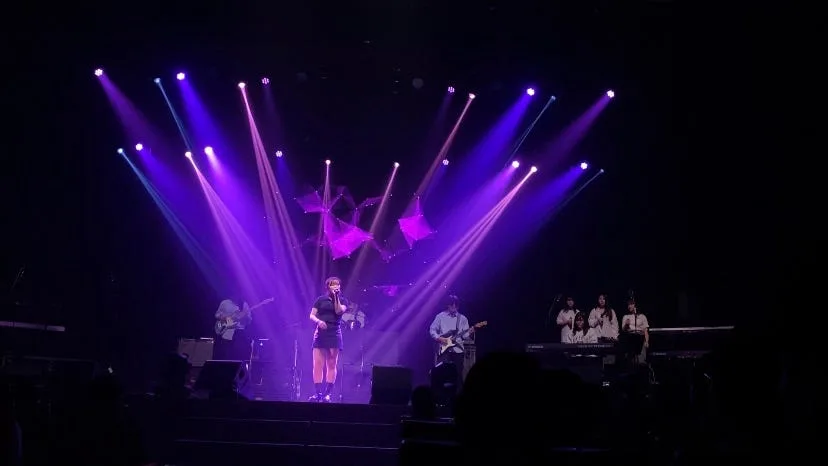

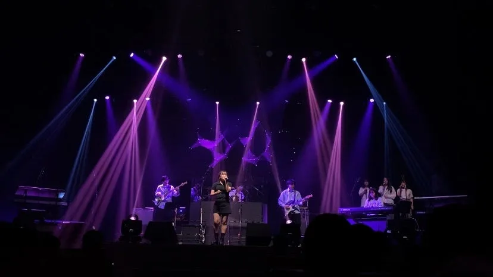

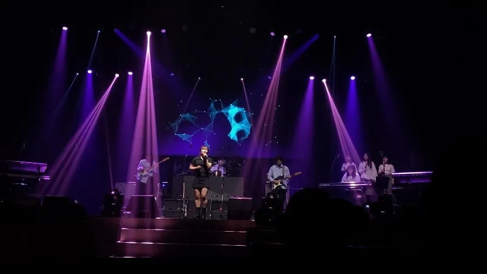

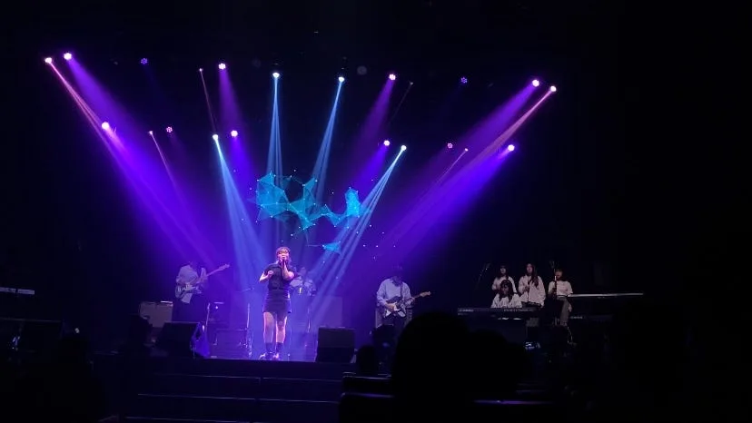

Yebin (vocal) and her band performed ‘Would you Believe’ by Sam Kim. Yebin initially brought references that are similar to aurora vibes. After some discussion, So Sun proposed to use this star-inspired coding sketch, which she also taught in the classroom. Then they modified it to match the atmosphere of this song. In the class, she connected the star particles with midi input signals so that the students can experiment as they play the midi keyboard.

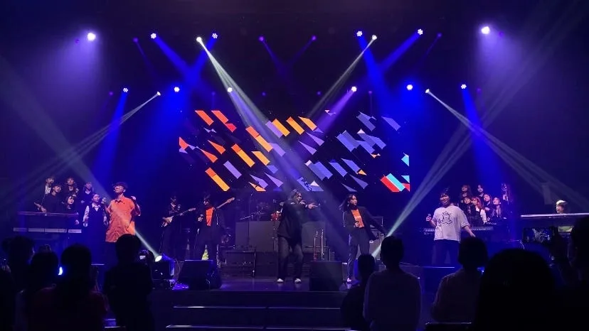

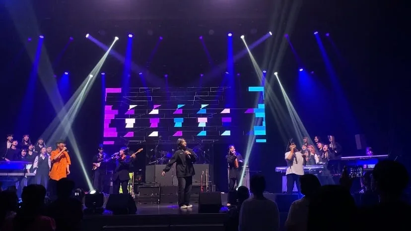

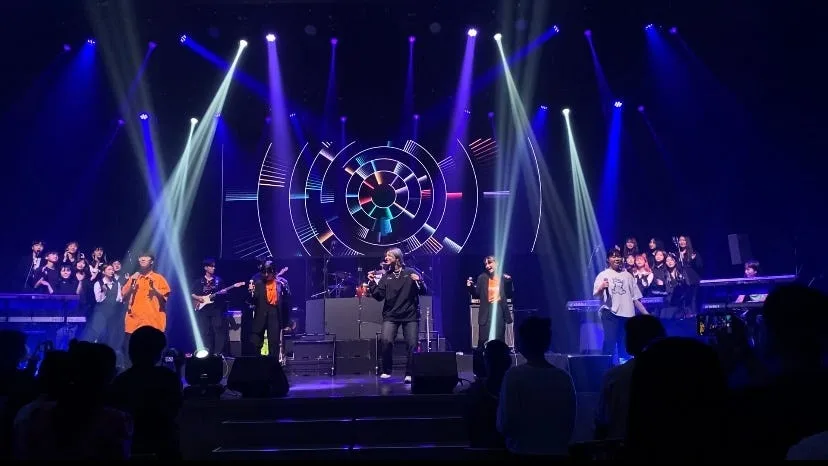

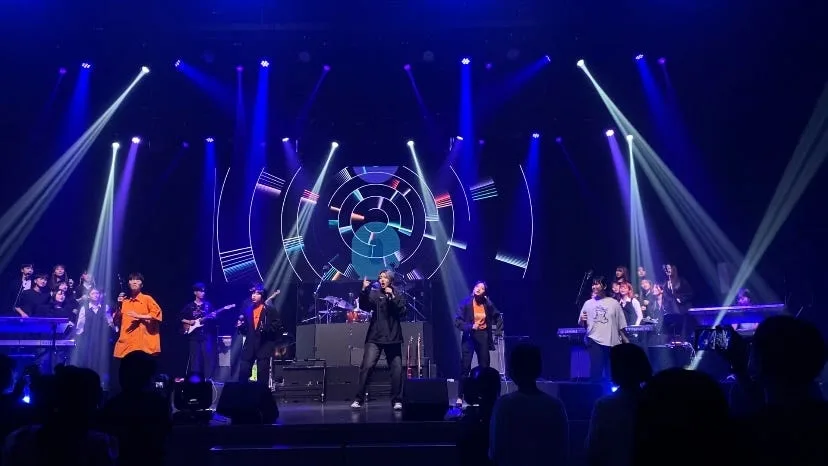

Youngseo (piano) and her team performed ‘Rain On Us’ by John P. Kee. The song was very dynamic, so they decided to go with the coding visuals that have a lot of motion and a punchy mood. They mixed 3 sketches that So Sun previously created as an experimentation of vertex shapes, trigonometry functions, and motion designs.

For other upcoming music festivals in the fall and winter, So Sun and her students are planning to perform real-time and more experimental audiovisuals with various songs. More videos, photos, and behind the scenes will be posted on her instagram or youtube.

*So Sun Park (she/her) is a creative technologist and frontend web developer who started as a theater major. So Sun has been exploring the combination of digital web/programming with storytelling and arts. These days, she enjoys working on web graphics, mainly using p5.js and threejs libraries. She co-hosted PCD 2021 Seoul with amazing fellows.*

*Her work is available at* [https://sosunnyproject.github.io/](https://sosunnyproject.github.io/)*.*

*Follow So Sun on* [instagram](https://www.instagram.com/sosunnyproject/) *and* [twitter](https://twitter.com/sosunnyproject)*.*
