This is our eighth year running the fellowship program and we are proud to receive support from the National Endowment for the Arts.

We received **a record-breaking 241 applications** this year, and were able to award five fellowships and three teaching fellowships. Special thanks to our new Program Manager, Tsige Tafesse, who made this work possible! We were also able to provide financial support in the form of a Processing Foundation Fellowship Grant to 8 finalist projects.

Continuing with previous years, we asked applicants to address at least one of five Priority Areas that, to us, feel especially important for technology and coding right now: Accessibility, Internationalization, Continuing Support, AI Ethics and Open Source, and Ecology and Environment. We are also supporting Teaching Fellows, who will develop teaching materials that will be made available for free, and are oriented toward community learning.

We can’t wait to see the vital work that this amazing group makes over the next few months!

*For an archive of our past Fellows,* [*click here*](https://processingfoundation.org/fellowships)*, and to read our series of articles on the Fellowships,* [*click here*](https://medium.com/@ProcessingOrg)*.*

**Zainab Aliyu (she/her) | freedom is a durational practice**

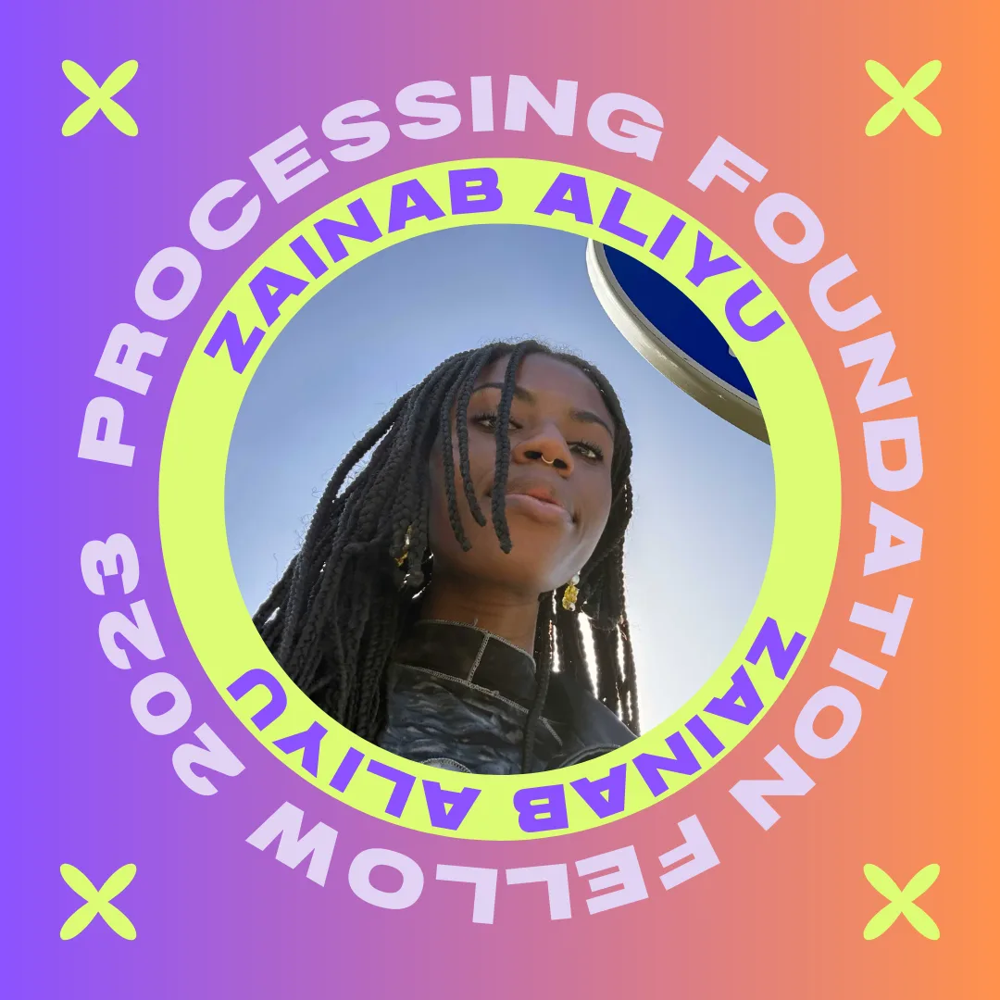

*A graphic image of our 2023 Processing Fellow, Zainab Aliyu.*

[Intro Slides](https://docs.google.com/presentation/d/1zLs18j6N2NThBplQDpNvcpxKuERi8VWys2FGhpL0P7c/edit?usp=sharing)

Drawing upon Saidiya Hartman’s notion of the chorus in *‘Wayward Lives, Beautiful Experiments*’, the piece surfaces “wayward” compositions that distort the colonial residue and remnants of empire in our ongoing struggle for collective liberation, as evidenced in the historical effigies of national freedom songs across the African diaspora, many still imbued with chauvinistic and patriarchal constructs. The piece is a computationally generated ensemble composed from 80+ anthems, protests, hymns and freedom songs from the diaspora. As a durational, non-linear, browser-based program presented in the form of an experimental film, it is infinitely playing, and resets at the beginning of every hour. The sound is composed from a living ethno-musicological archive Zai is assembling, and will continue to assemble, of afro-diasporic instruments across Africa, the Caribbean and the Americas, and she leverages a variety of computational methods to defamiliarize the patriarchal constructs of their celebratory language; to alter them just enough to render them visible again.

*Zainab “Zai’’ Aliyu is a Nigerian-American artist and cultural worker living in Lenapehoking (Brooklyn, NY). Her work contextualizes the cybernetic and temporal entanglement embedded within societal dynamics to understand how all socio-technological systems of control are interconnected, and how we are all materially implicated through time. She draws upon her body as a corporeal archive and site of ancestral memory to craft counter-narratives through built virtual environments, printed matter, video, archives, installation and community-participatory (un)learning. Zai is currently a co-director of the School for Poetic Computation, design director for the African Film Festival at Lincoln Center in NYC and was recently a fellow at NYU Tisch’s Future Imagination Collaboratory. Her work has been shown at Lincoln Center (NYC), Museum of Modern Art Library (NYC), Miller ICA (Pittsburgh), the Centre for Heritage, Arts and Textile (Hong Kong), Casa do Povo (São Paulo, Brazil), Aktuelle Architektur der Kulturimages (Murcia, Spain) among others. Her work is available at* [*https://zai.zone*](https://zai.zone)

*Follow Zai on* [*instagram*](https://www.instagram.com/beatsbyzai/)*.*

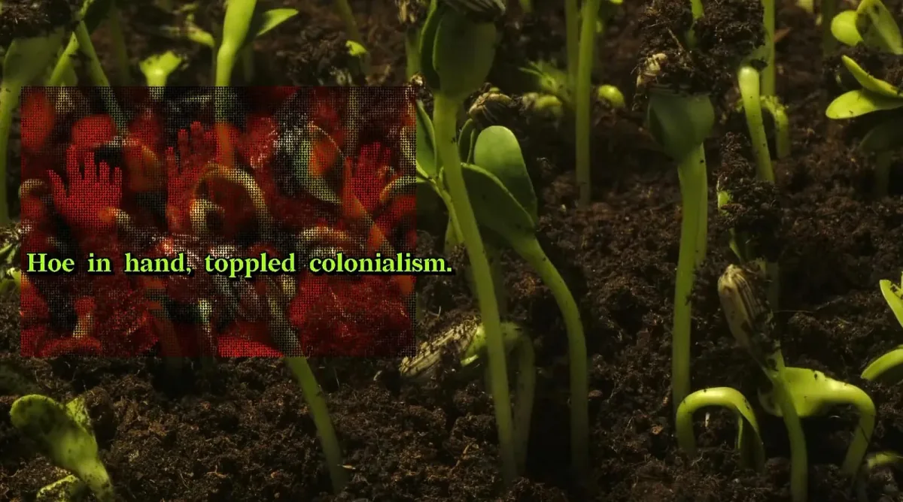

*Courtesy of Zainab Aliyu.*

**Joanne Amarisa (she/her) with Mei Leong, Septia Nurmala, Echa Amalia, Arshi Saleh, and Larissa Serafina | The Data Garden Project**

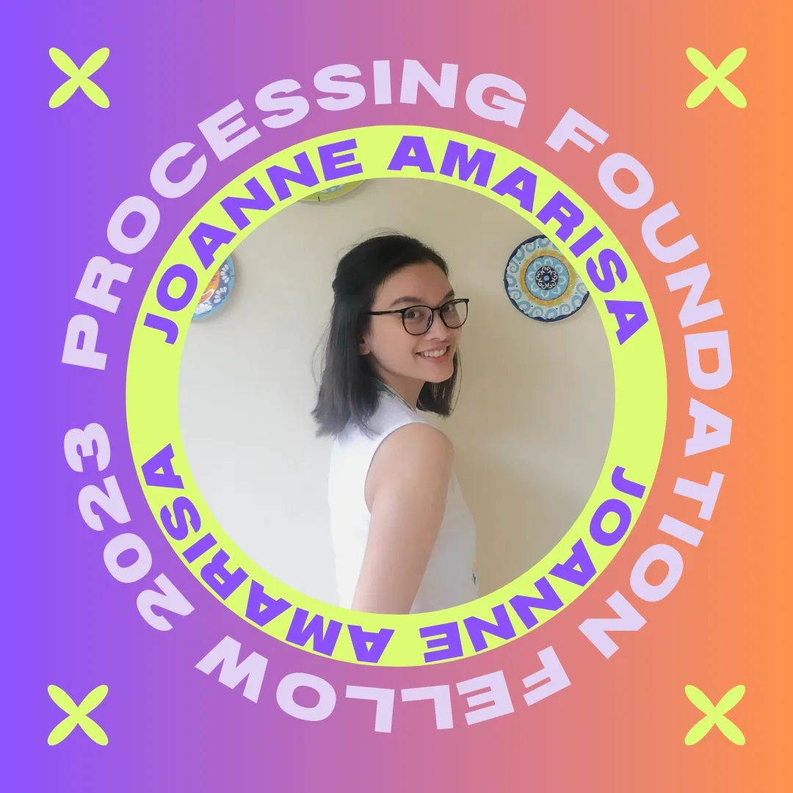

*A graphic image of our 2023 Processing Fellow, Joanne Amarisa.*

[Intro Slides](https://docs.google.com/presentation/d/1W3zd3Ce7ut5WM9gIvp2nhzKON7vdYs6hkEueeWAOkDk/edit?usp=sharing)

‘*The Data Garden Project*’ is a growing resource and learning community for young women who want to build their first data visualization artworks using Processing and p5.js.

Their mission is to build a resource for educators of diverse linguistic and cultural backgrounds to introduce creative coding and data storytelling to their classrooms and communities. By embarking on a *Data Garden Project*, a young person is invited to find and gather data from their own lives — such as the food in their pantry, Spotify playlists, text messages, interactions with friends or family — and visualize it by learning the basics of creative coding and drawing using p5.js.

As a result, a young people discover how to create compelling and interactive data stories of who they are, using Processing as their data visualization canvas and tool. Part coding class, part data “treasure hunt”, part collective journaling activity, this project invites young people (women especially) into a safe space of intimate storytelling, finding snippets of who they are and scrapbooking it into their own creative coded artworks to share with a supportive group of peers. She hopes that we may work towards a future where young women are given more opportunities to grow, not only so they can learn to code, but also that through coding, they may be equipped to rally community, to teach, to share their stories, and to lead.

*Joanne (Jo) Amarisa is a designer and writer from Indonesia, based in Melbourne, Australia. She currently works a 9-to-5 at a strategic design agency, but outside office hours, you can find her writing a newsletter, tutoring workshops at RMIT University, or leading and facilitating the Data Garden Project. She works with 8 incredible women through the DGP (Mei, Septia, Echa, Sara, Arshi, Amber, Almas, and Joelle) — with multi-disciplinary backgrounds spanning across graphic design, teaching, writing, research, and community building.*

*Her personal mission is to create safe, inclusive spaces for others through education and storytelling. In her free time, she likes to read, journal, cook, go for long walks near any bodies of water, or watch performances of spoken word poetry. Her work is available at* [https://joanneamarisa.com/](https://joanneamarisa.com/)

*Follow The Data Garden Project on* [*instagram*](https://www.instagram.com/thedatagardenproject/)*.*

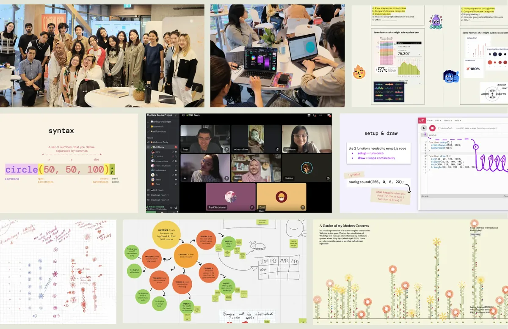

*Courtesy of Joanne Amarisa.*

**Bobby Joe Smith III (he/him) and Nat Decker (they/them) | Sketching Access**

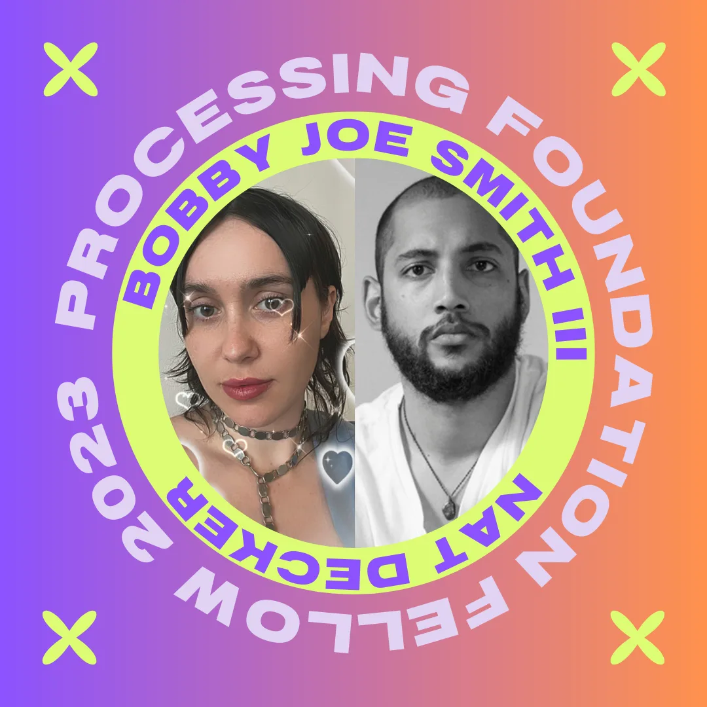

*A graphic image of our 2023 Processing Fellows, Nat Decker and Bobby Joe Smith III.*

[Intro Slides](https://docs.google.com/presentation/d/1YDWyZMjAZYeuLX3BZnOGbOD0riKGVqHPhZ6hko-a_O0/edit?usp=sharing)

This project proposes the formulation of a new ‘Access Fellowship,’ operating in tandem with other Processing fellowships but specifically aligned with the ongoing goals of promoting accessibility. Access Fellows would be responsible for proposing revisions to the Processing community access statements, contributing research, and engaging in special projects that highlight their unique perspectives and strategies of access.

Bobby Joe Smith and Nat Decker will collaboratively gather research material as a community resource and foundation for the iterative contributions of future access fellows. They propose that this repository of curated citations, syllabi, practical/technical strategies, and educational material about access be made available on the Processing and p5.js website, linked from the access statement. These resources can support ongoing organizational commitments and future revisions to the access statement.

Finally, they propose a collaboration with Qianqian Ye and others on a 2023 p5.js Access Day, using our research and community connections to inform a new iteration of speaker panels and workshops. This programming would generate space to build more access-centered community and resources, and experiment with some of the new ideas and pedagogical techniques they will develop to support the Access Fellowship. They hope to create a sustainable, robust, and deeply rooted program within the Processing Foundation capable of generating new understandings and implementations of accessibility. They wish to be informed and inspired by the diverse needs, skills, and desires of the Processing and p5.js communities. They hope to help the Processing Foundation and p5.js actualize their commitment to the liberatory practices of accessibility.

*Bobby Joe Smith III is a Black and Lakota (Hunkpapa and Oohenumpa) graphic designer and media artist. Design, computation, performance, writing, and lens-based image-making are mediums of expression and inquiry he turns to often. His creative practice is rooted in the ongoing decolonial and abolitionist movements led by Indigenous communities on Turtle Island and across the Black diaspora. His research draws from the decolonial, abolitionist, and post-apocalyptic strategies of Black and Indigenous people to construct a poetic vernacular of “unsettling grammars” — gestures, methodologies, and utterances that deviate, disrupt, and dismantle settler-colonial systems. By rearticulating these “unsettling grammars” through the disciplines of media art and design, Bobby Joe seeks to reveal vectors leading toward decolonial futures and generate work that resonates with the people and movements that comprise his community. He holds an MFA in Media Arts from UCLA, an MFA in Graphic Design from the Rhode Island School of Design (RISD), a Post-Baccalaureate degree in Graphic Design from the Maryland Institute College of Art (MICA), and a B.A. in Philosophy and Political Science from Middlebury College. His work is available at* [*www.bobbyjoesmith.com*](http://www.bobbyjoesmith.com) *and* [*http://github.com/bobbyjoesmithh*](http://github.com/bobbyjoesmithh)

*Nat Decker (they/them) is a Chicago born Los Angeles based artist interpreting the intimacies of queer and disabled lived experience as provocation toward collective care and liberation. Creating between digital and material mediums, they identify the computer as an assistive tool affording a more accessible practice. Often from bed, they use digital 3D software to trace serpentine connections between the body and technology, reimagining fantastical mobility devices as cultural celebration and agitation of conventional desirability politics. This cyclically informs their work with sculpture, creating non-functional mobility devices as aesthetic scrutiny and frictional commentary on designations of usefulness. Nat is also an access worker, consulting on accessibility for organizations such as p5.js, New Art City, Creative Growth, the LA Spoonie Collective, and for various projects at the University of California, Los Angeles. In June 2022 they graduated from UCLA with a degree in Design/Media Arts and Disability Studies. Their work is available at* [*http://natdecker.com*](http://natdecker.com)

*Follow* [*Bobby Joe*](https://www.instagram.com/bobbyjoesmithiii/) *and* [*Nat*](https://www.instagram.com/crip_fantasy/) *on instagram.*

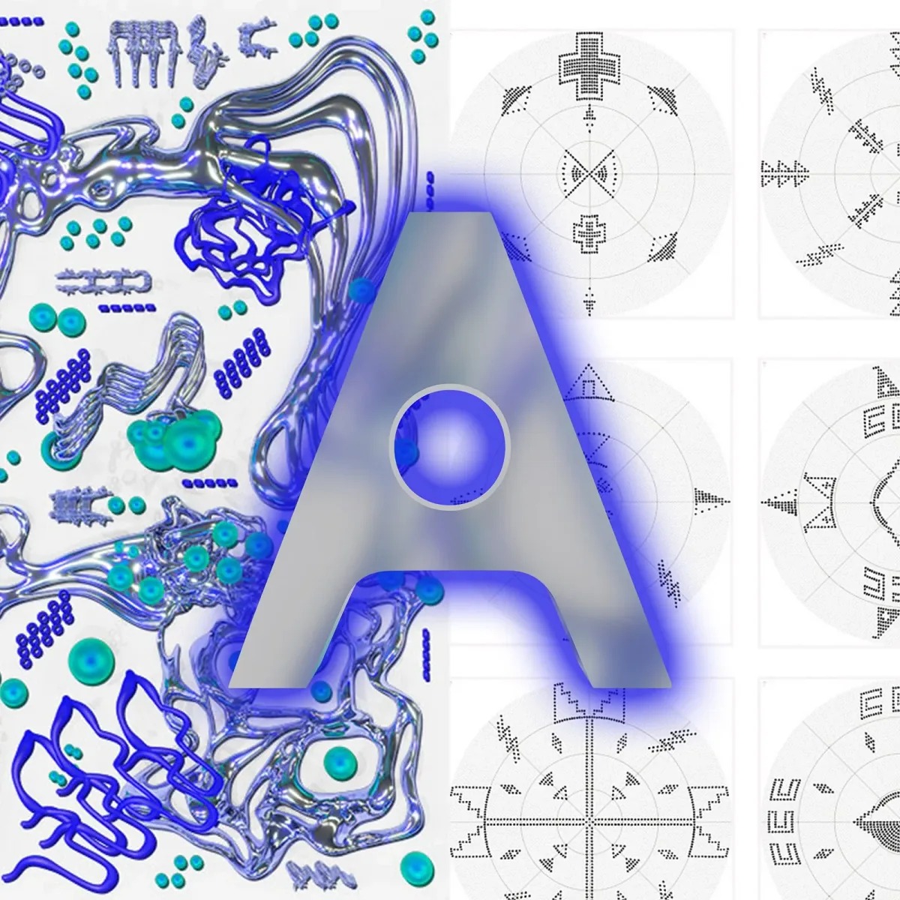

*Courtesy of Bobby Joe Smith III and Nat Decker.*

**Kendra Krueger (she/her) and Zahra Hassan (they/them) | 4LoveandScience: An inclusive STEM pedagogy toolkit**

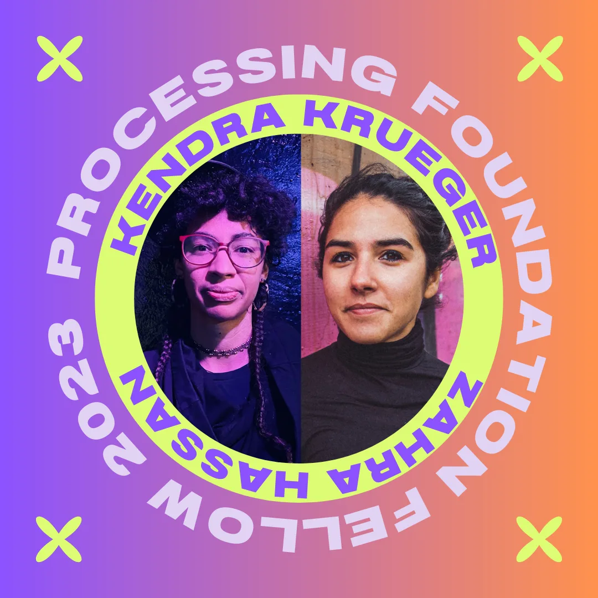

*A graphic image of our 2023 Processing Fellows, Kendra Krueger and Zahra Hassan.*

[Intro Slides](https://docs.google.com/presentation/d/1mGDvk64IO2Du2KHlCoaLANU_KcV1ULq62dnmLopuLs4/edit?usp=sharing)

Kendra Krueger and Zahra Hassan are going to address the core issues of inaccessibility in today’s dominant science practices and point to alternatives of doing science otherwise. They move environmental practice to the center of their work as an interdisciplinary endeavor to unite different fields and collaboratively find solutions for a sustainable future. By employing the arts, humanities, and embodied practices, they are going to continue building these bridges and sharing their lessons with the world. In this vein, they are committed to developing an art-informed open-source teaching module for STEM that emphasizes non-extractive technologies. Such technologies move with the natural patterns and systems of the universe instead of disturbing, interrupting, or extracting them. With an emphasis on creating new tools for research and experimentation that help STEM practitioners and communities process information, we are foregrounding practices that are based on movement, meditation, improvisation, and employing data collection and pattern recognition through the body and the senses. As part of this teaching and learning module, they will focus on ways of leading classrooms and labs to a liberatory practice that is interdisciplinary, place-based, and acknowledges many knowledges as equally important to fight for a future that sustains the ecology. At the end of this process that includes workshops, exchanges, and case studies, they will create an open-source tool kit accessible through a website that includes how to address place-based knowledge (PBK) in everyday STEM practice.

Their goal is to build an inclusive STEM tool kit, an open-source learning tool to make STEM more accessible for learners and practitioners around the world. The aim of inclusive STEM pedagogy is to engage and uplift students from underrepresented backgrounds, effectively seeing themselves as future scholars and practitioners in the field. Their philosophy is rooted in understanding science through patterns, play, and the lens of storytelling. Approaching science through the lens of story is a method to make the sciences more accessible and invite various communities into these fields. By employing artistic practice, ancestral modes of storytelling, and tools borrowed from various fields and practices such as ‘Theater of the Oppressed’, this pedagogy seeks to reach a broad variety of communities, spark curiosity and enthusiasm for STEM, and make people move closer to a multiplicity of science approaches.

*Kendra Krueger is an intersectional scientist, educator, artist, and woman of color on many edges. Raised by artists and educated as an electrical engineer (BS Rensselaer Polytechnic Institute, MS CU Boulder), she is also trained in anti-oppression facilitation, theater, mindfulness, and permaculture/social ecology. Her work and research are a convergence of these many waters. She founded 4LoveandScience in 2014 as a platform to teach transformative science throughout the country. She frequently collaborates with artists to curate and produce multi-media installations and immersive performances around themes of psyche and science. She currently works as a science educator at CUNY’s Advanced Science Research Center where she has founded The Community Sensor Lab as a space for DIY community science and advocacy. Her work is available at* [*https://centerforthehumanities.org/programming/the-community-sensor-lab*](https://centerforthehumanities.org/programming/the-community-sensor-lab)

*Zahra Hassan (they/them) is an interdisciplinary researcher, writer, activist, and educator from Vienna with roots in Iraq. ​​With a background in journalism, media, and anti-discrimination advocacy, they are dedicated to bridging disciplines with an emphasis on the intersection of environmental studies and creative practice. Throughout their Master’s at NYU’s Experimental Humanities and Social Engagement program, their work has been revolving around Iraqi orange trees and what it means to tap into their senses when conducting research. They are currently finishing a piece of speculative fiction about environmental disaster to contribute to public facing scholarship. Their work is available at* [*https://www.sarahassan.at*](https://www.sarahassan.at)

*Follow Kendra and Zahra on twitter:* [*Zahra*](https://twitter.com/sarahas_san)*; and instagram:* [*Zahra*](https://www.instagram.com/sarahas_san/)*,* [*4LoveandScience*](https://www.instagram.com/4loveandscience/)*.*

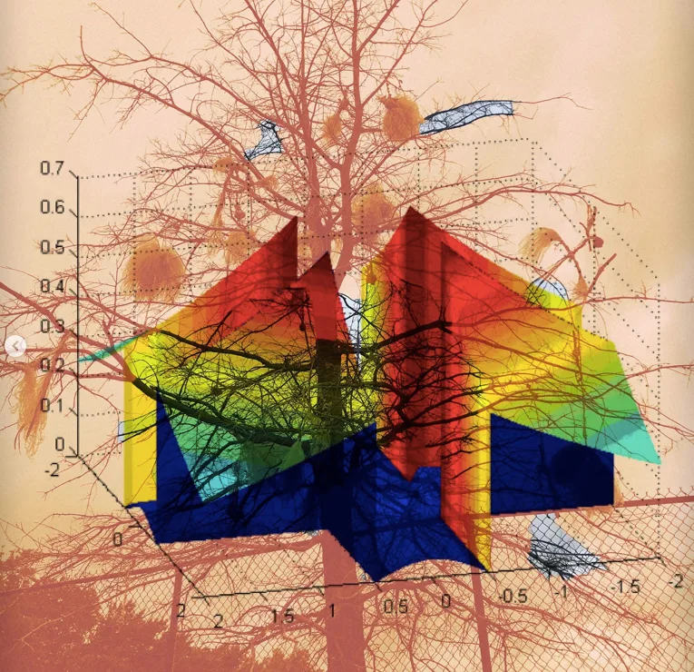

*Courtesy of Zahra Hassan and Kendra Krueger.*

**Nhan Phan (he/him) | CodeSurfing**

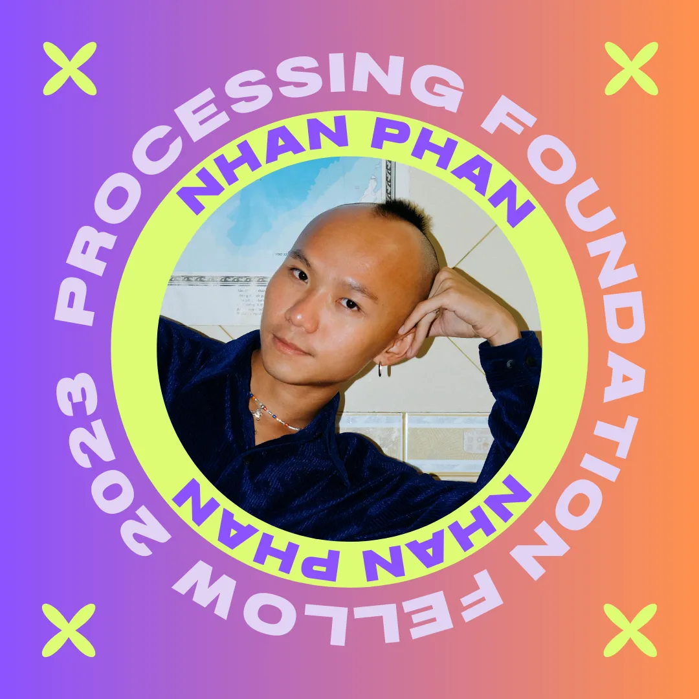

*A graphic image of our 2023 Processing Fellow, Nhan Phan.*

[Intro Slides](https://docs.google.com/presentation/d/1r5_sp7BMXfrfLjun-cZ0fVO_ge469TGZfnns7SS48DI/edit?usp=sharing)

*‘CodeSurfing (CLB Lướt Code)’* is a backyard-science club for Vietnamese to study machine learning through p5.js. The club connects Ho Chi Minh City’s creative community with local young students to make impactful designs for the coastal environment of Vietnam. ‘*CodeSurfing (CLB Lướt Code)’* is a backyard science club in Vietnam that focuses on studying machine learning through p5.js. The club aims to teach artists, designers, and engineers how to use programming for their creative pursuits, enabling them to create impactful designs for the local environment.

This is the first step toward building a p5.js community in Vietnam. In 2024, *CodeSurfing* plans to run a summer camp to connect the creative community of Ho Chi Minh City with local young students in Binh Thuan. They will teach high school students to program and together design applications to alleviate the effects of climate change in the area.

CodeSurfing hopes to make a lasting impact on the Vietnamese youth community and coastal environment through education and technology. The Earth is getting hotter and so is the creative scene in Saigon. Nhan hopes this young community can code as intense as the beat of Vinahouse, up-tempo the whole scene, break free from social norms, from the shadows of warfare, from the overwhelm of superficial visual and head to a new dynamic spectrum where their works can bridge across domains, reach beyond boundaries, and transform the community that we are living in collectively.

*Nhan Phan is an artist and educator based in Ho Chi Minh City. He views photography as a documentation of time gone by, which holds not just the visual but also the essence of the world he lives in. The obsession over archiving images later expanded with his training in machine learning. Through analysis, feature learning, and generative algorithms, Nhan’s latest work explores how the realm of bygone image archives influences the way we revisit our past, understand our present, and pivot our future.*

*After his undergraduate study in Ritsumeikan University (Japan), Nhan started his teaching journey at CoderSchool, where he designed and taught the computer vision module within a machine learning bootcamp. Since 2022, Nhan has focused on teaching for the creative community. His class introduces machine learning to Vietnamese artists, designers, writers in a more friendly, visual and application-toward way. Working with Van Lang University as well as independent collectives, Nhan aims to create a forward-thinking creative community where they make less superficial visuals and more impactful designs. He builds a collective environment where people have the freedom to flourish their unique assets while collaborating in the universal language of technology.*

*His work is available at* [*https://nhaninsummer.cargo.site/*](https://nhaninsummer.cargo.site/)

*Follow Nhan on* [*instagram*](https://www.instagram.com/nhaninsummer/)*.*

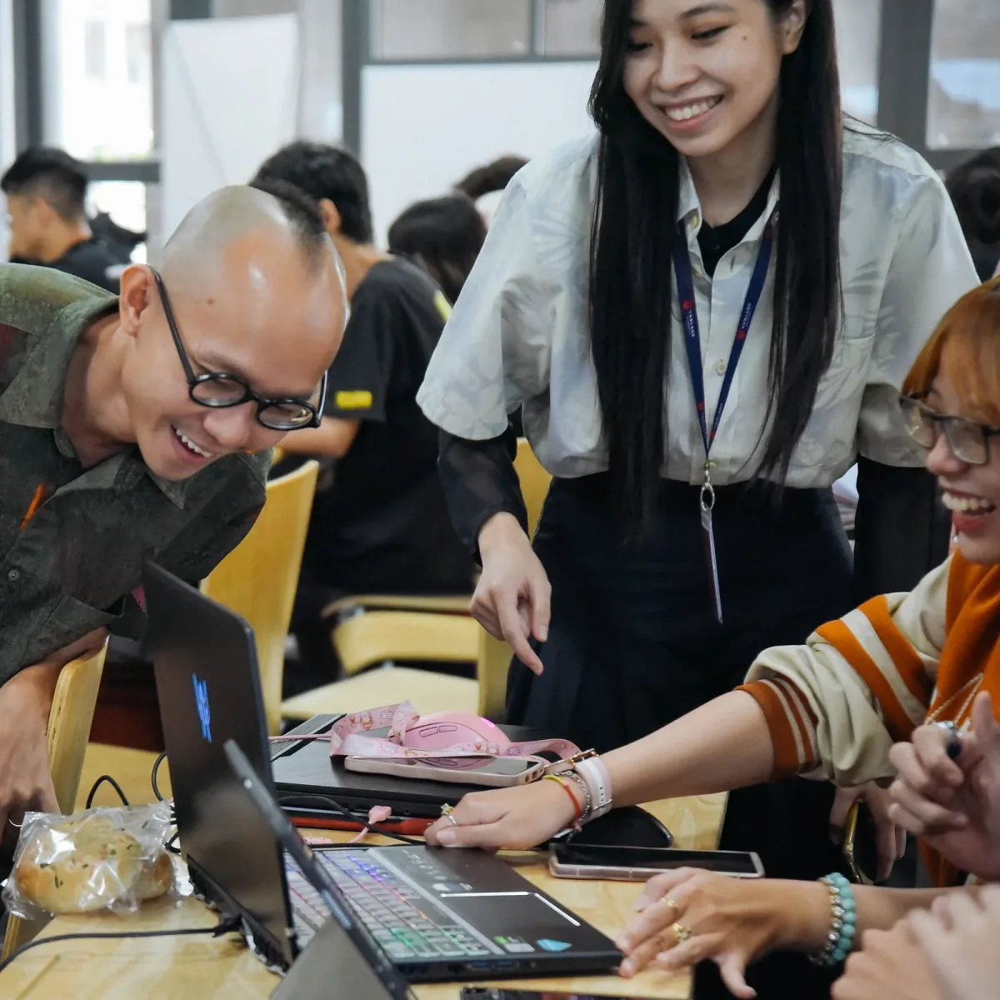

*Courtesy of Nhan Phan.*

**Kelly Chen (she/her) and Olivia McKayla Ross (she/her) | CYBERNETIC THEATER COMPANY-IN-A-BOX**

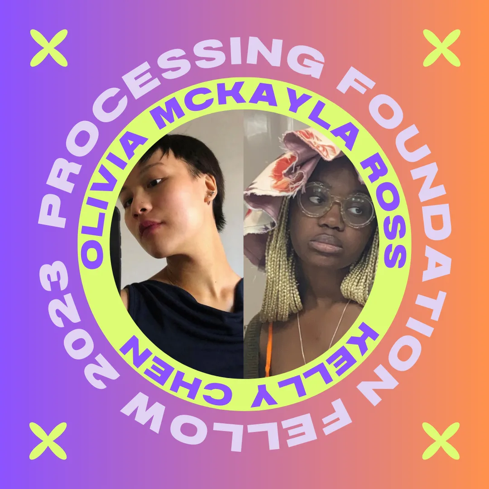

*A graphic image of our 2023 Processing Fellows, Kelly Chen and Olivia McKayla Ross.*

[Intro Slides](https://docs.google.com/presentation/d/1CaQTi1c46aDOVWAGqKkz_lad79dqxOg-QkVfmvXslK0/edit?usp=sharing)

Olivia McKayla Ross and Kelly Chen view performance as a system that can be modified, adapted, and reconfigured, creating a dialogue between the performer and the audience and blurring the boundaries between the two. For their proposal for the Processing Teaching Fellowship, they’re developing *‘CYBERNETIC THEATER COMPANY-IN-A-BOX*’, a collection of performance scores, drama games, and other curriculum materials for youth that expand what we commonly imagine when we think of “open-source software arts education.”

They are looking to combine creative coding with experimental theater, in order to challenge the notion of computer science education as the development of functions, products, and applications motivated by capital and privatization. Many AP Computer Science students can achieve perfect scores on the exam without understanding fundamental ideas in computing, like computer memory, the graphics processing pipeline, computer networks, file systems, and data representation. However, exploring the implications and significance of these concepts sheds light on the design of our networked society. How can Processing’s open source tools and drama-based learning help youth navigate these concepts for (potentially) the first time? It allows students to envision programming as a part of their daily world and as a creative tool, rather than just software and hardware that they are subject to.

They view the Cybernetic Opera Company as a “test kitchen” for critical research and connection between electronics and performance, and a gateway for new models of engagement with open source arts. They hope that their summer fellowship with the Processing Foundation can help lay the groundwork for this new curriculum. Olivia and Kelly hope that instead of pressuring to integrate the already abstracted language of computer science into the arts, they can bring out the ways in which computational concepts already exist in our everyday movements and how performing those movements can be a kind of art.

*Kelly Chen is an interdisciplinary researcher working and living in Boston, Massachusetts. In her art practice, Chen works with hardware and software to reveal the intersecting histories of computation, craft, moving image, and cartography as they relate to authority, labor, and resistance in social, political, and economic systems. Her performances utilize amplified surfaces, motors, sensors, field recordings, and live data. Her work is available at* [*http://luckystarbus.cargo.site*](http://luckystarbus.cargo.site)

*Olivia McKayla Ross is a video artist, poet-programmer, grief doula, and media conservation student from Jamaica, Queens. Her work is motivated by oceanic media theory, and a curiosity about video, faith, and power. Ross hopes her practice as a “cyber” doula will encourage the necessity of care work across transmission culture. Her work is available at* [*http://olivias.website*](http://olivias.website)*.*

*Follow* [*Olivia*](https://www.instagram.com/cyberdoula/) *and* [*Kelly*](https://www.instagram.com/luckystarbus/) *on instagram; and Olivia on* [*twitter*](https://twitter.com/cyberdoula) *and* [*mastodon*](https://mastodon.social/@cyberdoula@digipres.club)*.*

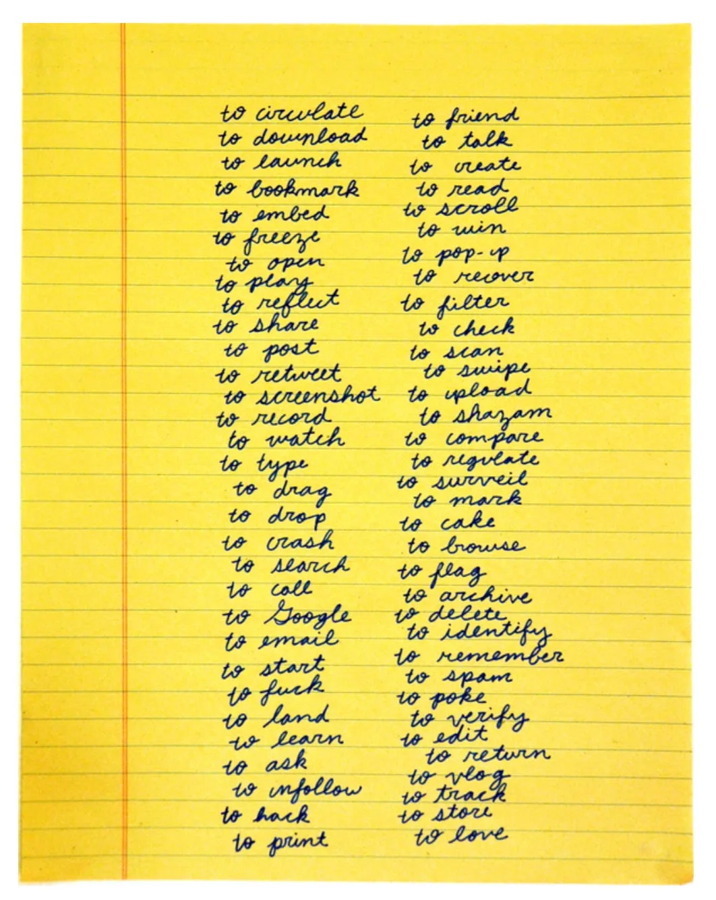

*“Verbs for Cybernetic Theater”, courtesy of Olivia McKayla Ross and Kelly Chen.*

**Liam Baum (he/him) | p5.Sound Library Curriculum Development**

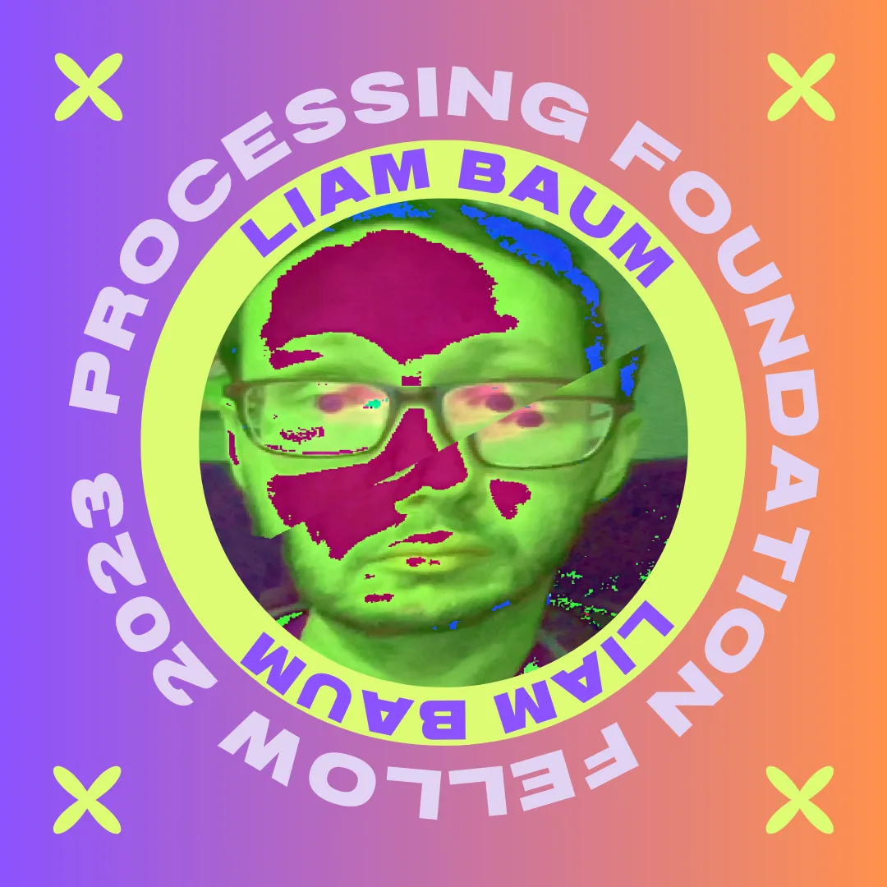

*A graphic image of our 2023 Processing Fellow, Liam Baum.*

[Intro Slides](https://docs.google.com/presentation/d/1lO4eSPajzTqJXswoiWR5CDvc35VhuOkhb6PAWCvfw9c/edit?usp=sharing)

This project is a continuation to existing p5.Sound Library curriculum developed by previous Processing Teaching Fellows, [Layla Quinones](https://medium.com/processing-foundation/interview-with-2019-teaching-fellow-layla-quinones-3039f10ae761) and [Luisa Pereira](https://medium.com/@luisa.ph/making-your-own-musical-instruments-with-p5-js-arduino-and-webmidi-2422b9596791). It will explore the possibilities beyond the p5.Soundfile object into other areas of the sound library including Oscillators, Synths and Envelopes. This curriculum aims to teach about both computer science concepts and musical characteristics, using each area as a tool to understand the other. The lessons in this curriculum will focus on creating projects which highlight user interactivity to engage students in music making experiences through coding. A range of musical reference points will be incorporated to offer a more diverse representation of sound examples. There will also be significant effort put into integrating new features and highlighting developments being made with the p5.Sound Library through the work of p5.Sound Fellow [aarón montoya-moraga](https://medium.com/@ProcessingOrg/announcing-the-2023-p5-sound-fellow-aar%C3%B3n-montoya-moraga-7613450902f6). He hopes to create more entry points to creative coding for teachers, students, and artists who work in the medium of sound.

*Liam Baum (he/him) is a musician, educator and creative coder. He is a music teacher at BELL Academy, a public middle school in Bayside, Queens. He recently got his NY State Teaching Certification in Computer Science from Hunter College. Liam is constantly exploring how technology can be used for the purpose of creative artistic expression both in his classroom and personal artistic endeavors. This has led him to collaborate with CS4All in the NYC Department of Education to assist building curriculum for creative coding with the p5.js Sound Library and to become a teacher ambassador for Makey Makey. He enjoys merging his passions for music, teaching, and coding by making video tutorials and leading workshops around the NYC area. He also occasionally performs live coded music under the name, ‘Mister Bomb’.*

*Liam is a strong believer in the importance of artistic communities as a way to foster his own creative growth and in turn, contribute to teaching and inspiring others to do the same. He has been involved with several music and technology-based groups around the NYC area and virtually including the Creative Coding Fest, Processing Foundation, LiveCode.NYC, Code/Art, Hip Hop Hacks, Monthly Music Hackathons, and Maker Music Festival. His work is available at* [*www.youtube.com/mrbombmusic*](http://www.youtube.com/mrbombmusic) *and* [*https://github.com/mrbombmusic*](https://github.com/mrbombmusic)

*Follow Liam on* [*twitter*](https://twitter.com/mrbombmusic) *and* [*instagram*](https://www.instagram.com/mrbombmusic/)*.*

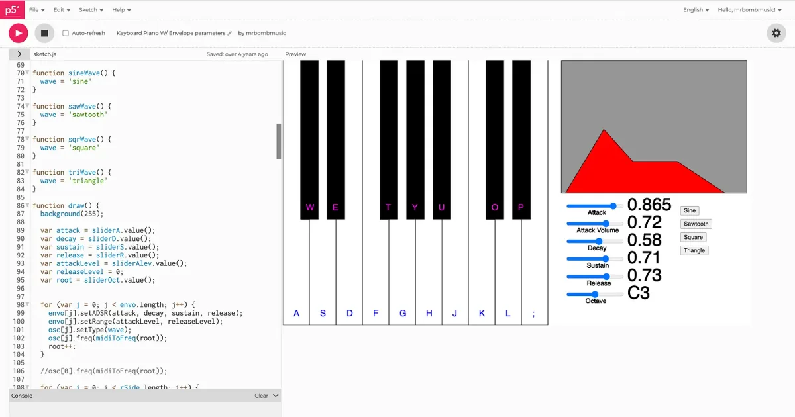

*Courtesy of Liam Baum.*

**Stephanie T. Jones (they/she) | Black Life in the Age of AI**

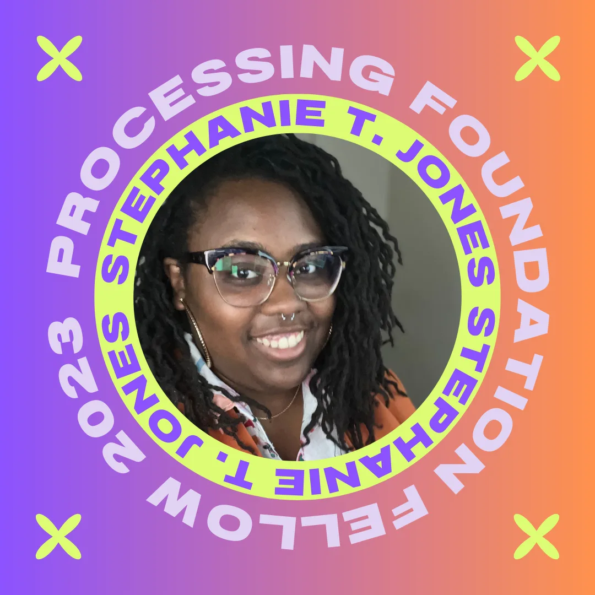

*A graphic image of our 2023 Processing Fellow, Stephanie T. Jones.*

[Intro Slides](https://docs.google.com/presentation/d/1e4lKbM8zRqIUf_hEXYA30dupUEO_QWDiYg7pjThf8Ks/edit?usp=sharing)

Stephanie T. Jones is broadly interested in thinking about the role of AI in replicating and producing Black death, and the potential use of AI in projects of Black Life. During the Processing Fellowship, they will be producing a syllabus entitled, ‘*Black Life in the Age of AI*.’ This syllabus will contain multi-media approaches, from research articles, news publications, to podcasts, art, and videos. As a part of this work, they will have an AI and Black Life Art Gallery hosted on the site. This will be filled by accepting submissions from those who partake in the syllabus and seeded by the art they produce while designing this syllabus. This site is meant to be accessible not only in designing with disabled people in mind but also in terms of free content and having a variety of ways to engage in the topic. In addition to this, they will conduct interviews with prominent Black thinkers within the AI community. These interviews entitled, ‘Meditations on AI’, will invite participants to reflect and share their thoughts. In addition to this, it is important for us to reconsider narratives around fear, towards narratives of possibility, when building these systems. They hope to build community with others interested in this work and help shift imaginaries on possibility for AI.

*Stephanie T. Jones is a Ph.D. candidate in the Computer Science and Learning Sciences program at Northwestern University. Stephanie’s interests span context and intellectual communities from Black Studies, Education, Computing, and Abolition. Her research interests include intergenerational learning opportunities and the relationships between anti-Blackness, Black Life, learning, and STEM. She is motivated by her own experiences as the only Black graduate of the 2018 class at Villanova University in both Computer and Electrical Engineering. She has been supported by the National GEM Consortium, the National Science Foundation, and the National Society of Black Engineers. Her work is available at* [*www.stephanietjones.com*](http://www.stephanietjones.com)

*Follow Stephanie on* [*twitter*](https://twitter.com/computeloop)*.*

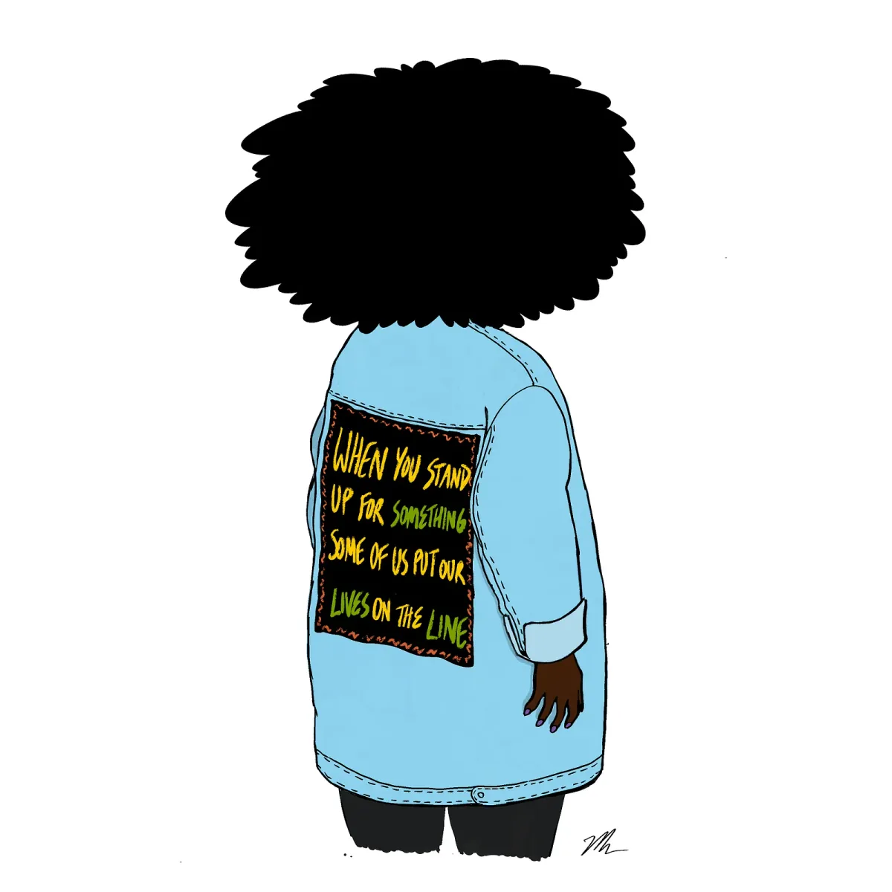

*Courtesy of Stephanie T. Jones.*

We’re so excited to see what our Processing Fellows will work on this summer! We hope to keep supporting new artists, designers, activists, educators, engineers, researchers, coders, and collectives, year after year. Want to support the Processing Foundation in this work? [Donate here](https://processingfoundation.org/donate) to support our ecosystem of open source contributions!
