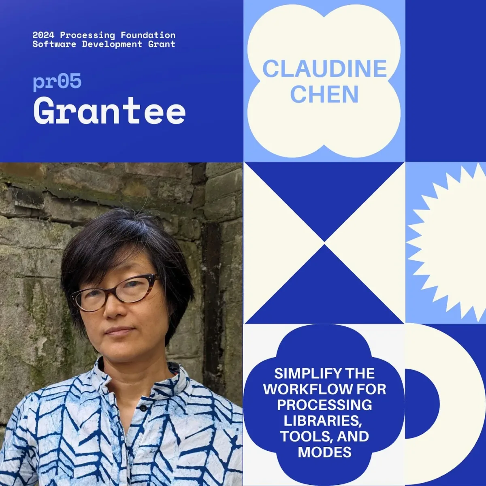
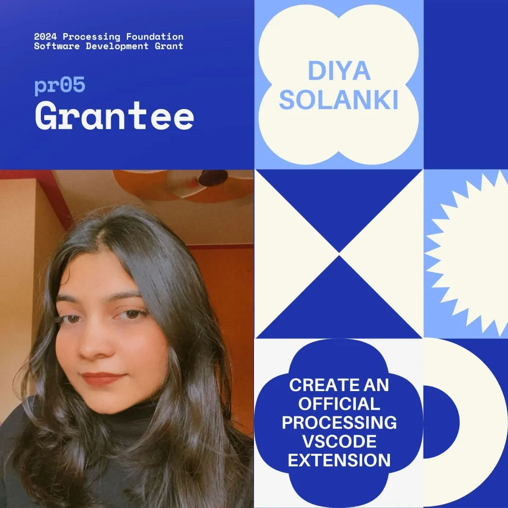
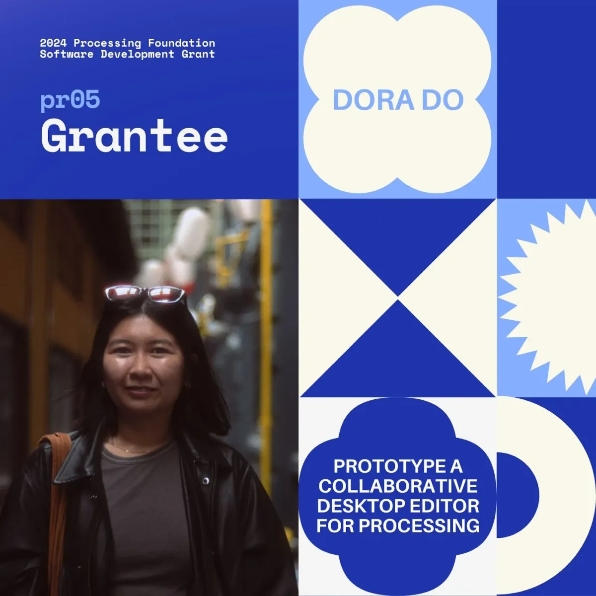
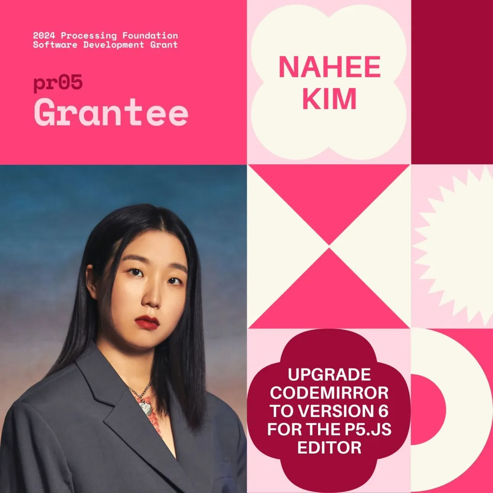
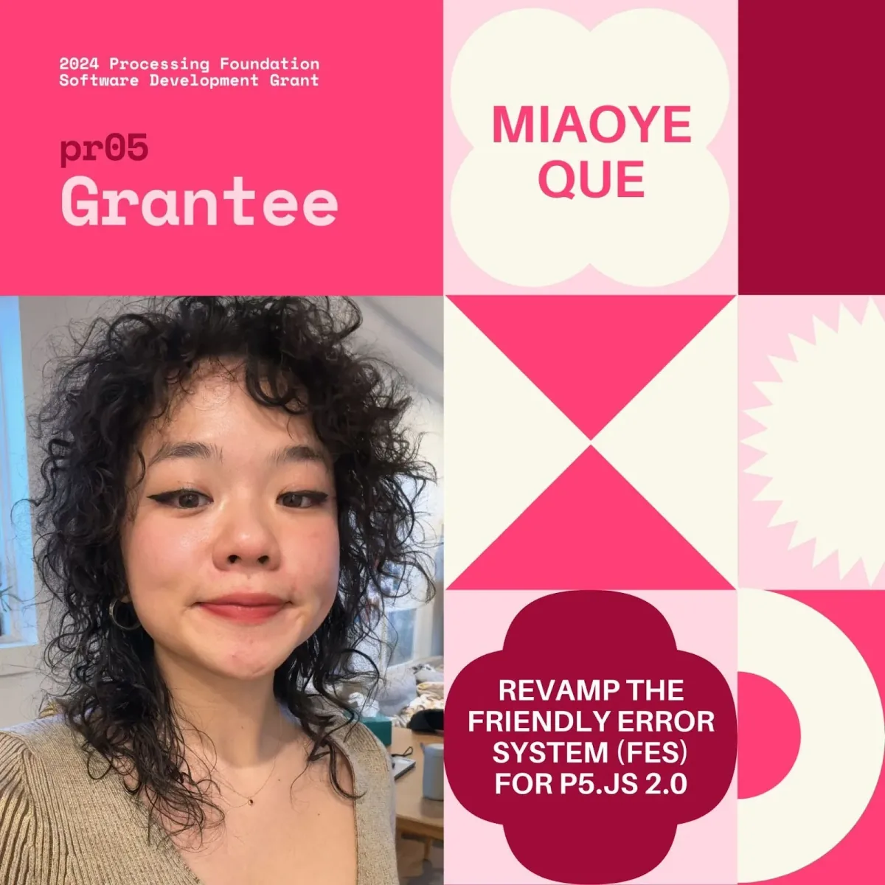

We are thrilled to announce the 2024 Processing Foundation Software Development Grant (pr05) Grantees! The topic of this year’s program is ‘New Beginnings’, focusing on supporting projects that will enhance and solidify the [Processing](https://processing.org) and [p5.js](https://p5js.org) ecosystems, and help lay strong foundations for their futures.

The pr05 grant (pronounced “pros”), is a new fully remote mentorship-driven grant by the Processing Foundation. This is a unique opportunity to grow as a developer while making a tangible impact on software projects used by millions of creatives, artists, educators, and students globally.

Participants chose from a predefined list of projects that can be completed under mentorship. In the spirit of our first program’s theme ‘New Beginnings’, we have assembled a curated list of projects selected for their potential to solidify and expand the foundations of Processing and p5.js. Each project will be mentored by a developer/contributor experienced in this specific area.

We received hundreds of incredible applications and were able to award a total of five candidates to join our 2024 cohort. Special thanks to our Processing Community Lead, Raphaël de Courville, who made this work possible!

We can’t wait to see the vital work that this amazing group makes over the next few months!

To learn more about the pr05 grant, check out our [pr05 Grant Website](https://processingfoundation.org/grants). You can also take a look at our [Project List](https://github.com/processing/pr05-grant/wiki/2024-Project-List-for-%60pr05%60-=-Processing-Foundation-Software-Development-Grant), which outlines each project’s description and outcomes.

#### Claudine Chen (she/her) | Simplify the Workflow for Processing Libraries, Tools, and Modes

*2024 pr05 Grantee: Claudine Chen*

This project aims to improve the developer experience for libraries, tools, and mode contributors. The current system for submitting contributions and updating the contributions list is cumbersome and error-prone. This work will automate the process and improve the quality of life for other developers, making Processing contributions more inviting to new contributors.

*Claudine Chen is a software engineer and artist based in Dublin and Berlin. She counts her time in academia doing scientific research, in the International Development Design Summit practicing design thinking, and as a software engineer as the three pillars of skills she has to offer. Trained as an applied physicist (PhD California Institute of Technology), she worked several years as a postdoc in a variety of environmental science domains, including a stint at the Jet Propulsion Lab using the moon to make atmospheric measurements, and time working in the climate policy realm. During her transition away from academia, she participated in the International Development Design Summit, organized out of the D-Lab at MIT as a participant and twice as a co-organizer. These experiences validated her intuition that listening to and collaborating with stakeholders can result in useful innovation. At the same time, the School of Machines, Making, and Make Believe launched her journey into art-making with technology, including Processing. Her art has taken the form of installations, video, and sculpture.*

*Follow Claudine on* [*Instagram @mingness*](https://www.instagram.com/mingness)*,* [*Linkedin (Claudine Chen)*](https://www.linkedin.com/in/claudinechen/)*, and GitHub* [*@mingness*](https://mingness.github.io/)*.*

#### Diya Solanki (she/her) | Create an Official Processing VSCode Extension

*2024 pr05 Grantee: Diya Solanki*

This project will focus on developing an official Visual Studio Code (VSCode) extension for Processing. Building on the initial Language Server Protocol (LSP) integration in releases 4.1 and 4.3 of Processing. The development of this VSCode extension serves to complement the Processing Development Environment (PDE), providing a more feature-rich alternative thanks to the built-in capabilities of VSCode.

*Diya Solanki (India), is a developer and student driven by her passion for technology and mathematics. She is currently pursuing a Bachelor of Engineering in Information Science and is a GSoC 2024 intern developing JSON schema language server extension at Postman. She also enjoys data science and was an R&D intern at HPE working with cloud backups, cost projection, and machine learning. Her work primarily focuses on backend development, including learning and implementing client-server architectures using the JSON-RPC protocol. Diya is deeply involved in mastering new technologies and actively contributes to Open Source projects, driven by her love for Free and Open Source Software (FOSS). She loves the welcoming nature of the FOSS community and is always eager to learn more each day. Her work often revolves around full-stack development, allowing her to gain comprehensive knowledge and experience in front-end and back-end technologies. Apart from coding, she enjoys working out at the gym and solving bugs in her head with a techno playlist.*

*Follow Diya on* [*Twitter/X @krantikadiya*](https://twitter.com/krantikadiya)*,* [*Instagram @diyaayay*](https://www.instagram.com/diyaayay/)*,* [*LinkedIn (Diya Solanki)*](https://www.linkedin.com/in/diyasolanki/)*, and GitHub* [*@diyaayay*](https://github.com/diyaayay).

#### Dora Do (she/her) | Prototype a Collaborative Desktop Editor for Processing

*2024 pr05 Grantee: Dora Do. Photo by Brian Ho*

This project will develop an evolutionary prototype of a desktop editor for Processing that supports collaborative editing, aimed at teaching and facilitating creative coding, focusing on simplicity and accessibility for beginners. It requires development from the ground up, presenting a unique opportunity for a developer to contribute to a tool that could significantly influence how programming is taught in creative and educational contexts.

*Dora Do is a Creative Technologist based in Brooklyn, NY, exploring the intersection of technology and art. Born and raised in Silicon Valley, Dora developed a deep passion for both fields from an early age. Starting her career in 2015, she has created software applications for major tech corporations such as Macy’s, Kodak, and Square, laying the foundation for her expertise in developing large-scale tech solutions. Since 2022, Dora has shifted her focus to crafting thoughtful and immersive digital experiences. Merging her love for analog art mediums with her extensive technical background, her work aims to understand and deepen the human connection with technology using creativity. Dora holds a B.S. in Computer Science from San Jose State University and an M.A. in Interactive Media Arts from NYU. You can explore her work at* [*www.doradocodes.com.*](http://www.doradocodes.com.)

*Follow Dora Do on* [*Instagram @doraymee*](https://www.instagram.com/doraymee/)*,* [*LinkedIn (Dora Do)*](https://www.linkedin.com/in/dorathiendo/)*, and* [*Dora’s Website*](http://www.doradocodes.com)*.*

#### Nahee Kim (she/they) | Upgrade CodeMirror to Version 6 for the p5.js Editor

*2024 pr05 Grantee: Nahee Kim*

The CodeMirror component will be upgraded in the p5.js Editor from Version 5 to Version 6, implementing many enhanced features for accessibility, mobile support, internationalization, and other editor features.

*Nahee Kim (she/they) is an artist and programmer who explores the possibility of computational representation of sexual experiences and contemporary family institutions as biopolitical technology to control human reproduction. nahee.app is Kim’s virtual persona to share their playful speculation about computer programs to organize past sexual relationships and help sexual communication enhance love and satisfaction. As nahee.app, Kim creates code poems about sex, visual documentation about speculative sex toys and networks, and web applications hosting machine-recognized sexual movements. Recently, Kim has focused on her family programming project, <Daddy Residency> to delve into the truth of normative family structure. In <Daddy Residency>, Kim will have a baby by herself with donated sperm and raise the baby with multiple Daddy residents who will be recruited from the open-call process of the project. By sharing this with the public as an art project, she tries to reveal and investigate her own and people’s discomforted feelings and responses towards the realization of the unconventional family planning project. She is based in Seoul and New York. She is a member of the South Korean artist collective eobchae, was a resident of MassMOCA, Pioneer Works, and a member of NEW INC.*

*Follow Nahee on* [*Twitter/X @AppNahee*](https://twitter.com/AppNahee) *and* [*Instagram @nahee.app*](https://www.instagram.com/nahee.app/)*.*

#### Miaoye Que (they/them) | Revamp the Friendly Error System (FES) for p5.js 2.0

*2024 pr05 Grantee: Miaoye Que*

The p5.js Friendly Error System (FES) enhances the development and debugging experience in p5.js with simplified error messages. With the upcoming p5.js 2.0 release, significant updates are required to align FES with the new system architecture. This project presents an opportunity for applicants to make a meaningful impact on a critical component of p5.js, which is particularly beneficial for new coders and enhances the experience for millions of users.

*Miaoye Que is a Chinese writer and technologist based in Brooklyn, New York. A software engineer by trade, they now weave text through the medium of the browser to invoke memory, personal perspectives, collective struggles, and perpetual longings. Their writing and net art have been published in the Are.na Annual, Triangle House Review, Taper, and Crawlspace, with forthcoming contributions in Adjacent and Mouthwash Research Center. They were a maintainer of ml5.js — a machine learning library for the web under p5.js — while at NYU’s Interactive Telecommunications Program.*

*Follow Miaoye on* [*Twitter/X @724x00945*](https://twitter.com/724x00945)*,* [*Instagram @724x00945*](https://www.instagram.com/724x00945/)*, and* [*LinkedIn (Miaoye Que)*](https://www.linkedin.com/in/miaoyeque/)*.*

We’re so excited to see the pr05 grantees’ work this summer! We hope to keep supporting new coders, developers, engineers, educators, and researchers, year after year. Want to support the Processing Foundation in this work? [Donate here](https://processingfoundation.org/donate) to support our ecosystem of open-source contributions!
