We received yet another year of a record-breaking number of applications with 346 incredible submissions and were able to award 8 fellowships. Special thanks to our Program Manager, Tsige Tafesse, who made this work possible! We are also providing financial support in the form of a Processing Foundation Fellowship Grant to a group of soon-to-be-announced finalist projects.

Continuing with previous years, we asked applicants to address at least one of four Priority Areas, describing how their project responds to the concerns of the topic. The four priority areas were:

-   **Archival Practices: Code & New Media**: Projects aimed at developing tools and platforms for archiving and preserving creative code/the digital, as well as new media archival practices.
-   **Open-Source Governance**: Initiatives focused on creating governance models that promote equitable decision-making, inclusive communities, engagement, and sustainable growth in open-source projects.
-   **Disability Justice in Creative Tech**: Tools and projects that advance access and promote disability justice within the realm of creative technology.
-   **Access & AI**: Engaging AI technologies to create accessible solutions and improve inclusivity in digital spaces.

We can’t wait to see the vital work that this amazing group makes over the next few months!

For an archive of our past Fellows, check out our [Fellowship Page](https://processingfoundation.org/fellowships) on our [Processing Foundation Website](https://processingfoundation.org).

#### **Ahnjili ZhuParris, Dan Xu, Colette Aliman, Alyssa Gersony** **| Screen-to-Soundscape**

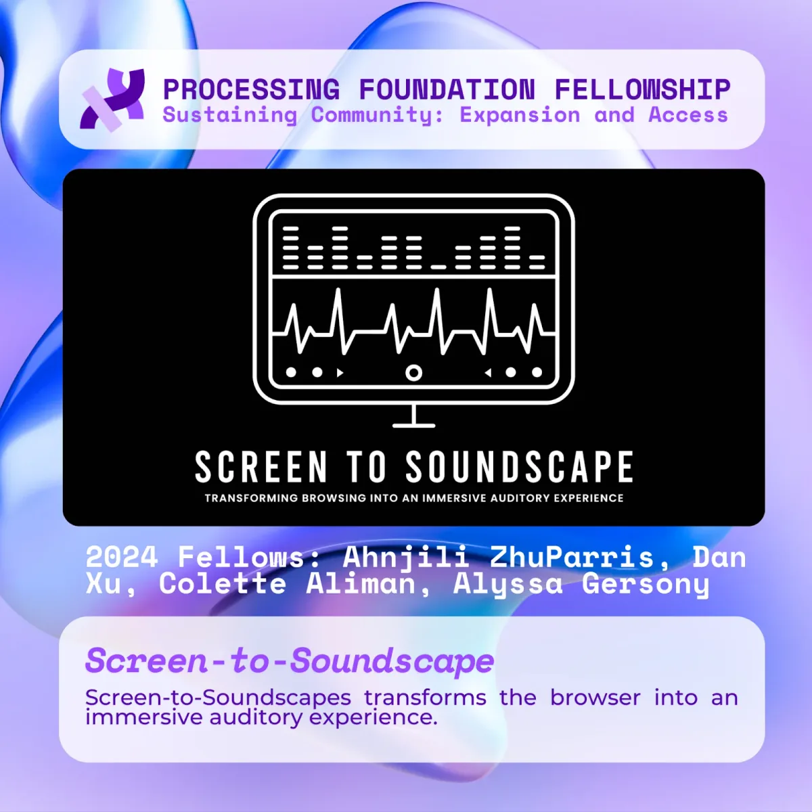

*2024 Fellow Project: Screen-to-Soundscape*

‘Screen-to-Soundscape’ adopts a creative and experimental approach to reimagining screen reader voices. The project aims to develop a speculative design prototype that transforms a browser or screen into an immersive soundscape. This prototype will feature multiple layered voices reading all readable text in unison with spatial audio, enabling users to discern the text’s location within the browser. The motivation behind this initiative is to overcome the inherent limitations of traditional screen readers by offering users with visual impairments a more intuitive and immersive way to navigate digital content. This benefits users with visual impairments and provides a richer, more engaging web experience for all users. [Constant](https://constantvzw.org/site/), a non-profit artist-run organization based in Brussels, will also support the project with content feedback, technical returns, a budget contribution, and public moments.

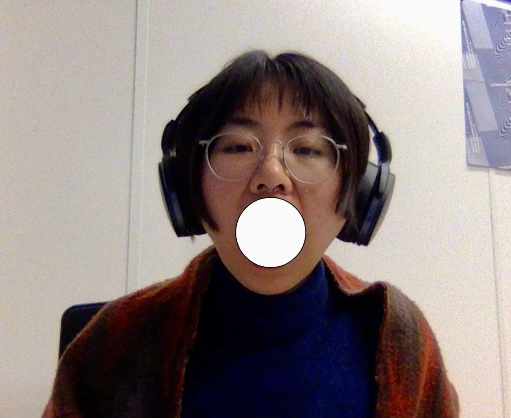

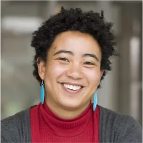

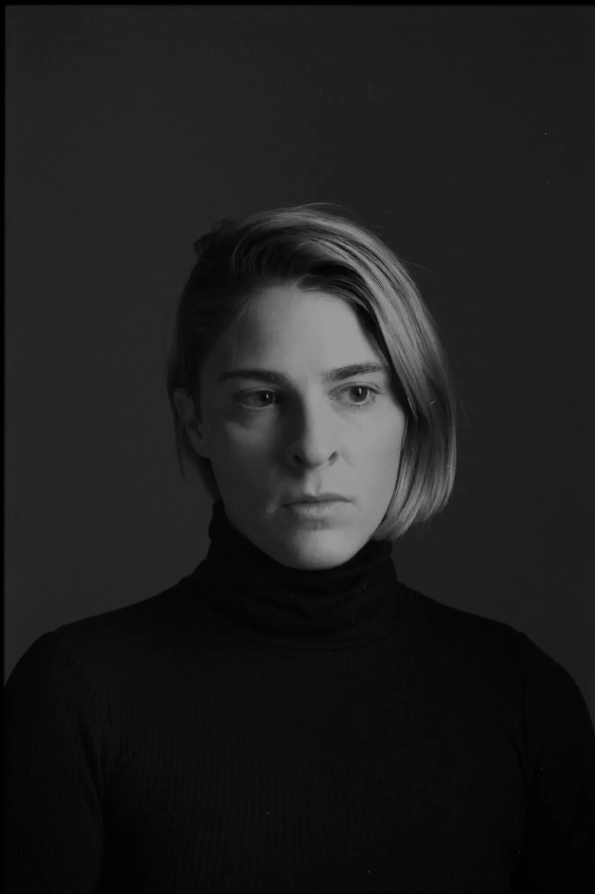

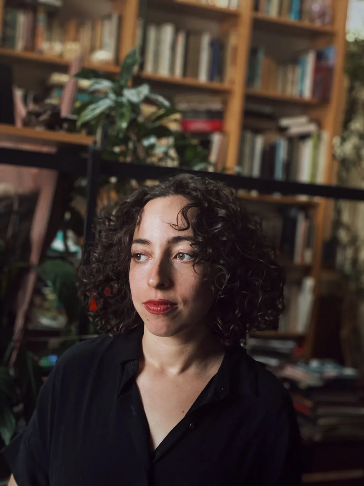

*From left to right, top to bottom: Alyssa Gerony (Photo by Leonardo Taddei), Dan Xu, Ahnjili ZhuParris, and Colette Aliman.*

*Ahnjili ZhuParris, PhD (NL, USA), is an AI engineer and AI artist, working between New York and the Netherlands. As an AI engineer, Ahnjili develops AI applications for the medical and cosmetic industry. Ahnjili’s academic research centers around developing biomarkers for monitoring mental and physical well-being using machine learning smartphones and wearable data. Ahnjili’s artistic research and science communication efforts are dedicated to raising awareness about A.I. and algorithmic violence, which encompass the violence that may arise from or be justified by automated decision-making systems. Through her work, Ahnjili aims to educate the public and promote discussions about the ethical implications of these technologies in our society. Ahnjili holds a PhD in Clinical Neuropharmacology from Leiden University, a Master’s in Cognitive Neuroscience from Radboud University, and a Bachelor’s in Neuroscience from the University of Edinburgh. She is a recipient of the Mozilla Creative Media Award. Ahnjili’s work has garnered support from the Mozilla Foundation (US), IMPAKT (NL), Constant (BE), and has showcased her work at Ars Electronica (AU), Articulating Data (UK), and the CICA Museum (KR).*

*Colette Aliman is a creative researcher working within the fields of Design and Art in Rotterdam, the Netherlands. After graduating from Design Academy Eindhoven in 2019 with a Contextual Design MA, she launched the platform Sound Office to explore the bridge between the creative sector and noise policy. Sound Office produces workshops, lecture-performances, and the online research archive* [*www.sound-office.online*](http://www.sound-office.online)*. In 2024, Colette received her Deep Listening certification from the Center For Deep Listening. Colette’s topics of interest and research include multi-species-culture(s) sonic intersections, raising awareness of a person’s choice in the sound design of our everyday objects, and speculative R&D in the future of the industrial revolution soundscapes. Colette has exhibited and performed at Z33 (BE), iMAL (BE), Triennale Milano (IT), RESET (BE), Temporary Art Center (NL), University of the Underground (NL), Institute of Contemporary Art Boston (US), Boston University (US), and has taught at BA DesignLAB Gerrit Rietveld Academy, MA Ecology Futures St. Joost School of Art & Design, MA Design and University of Antwerp.*

*Dan Xu (CN/NL) is a creative researcher and technologist working in the fields of human-computer interaction and interactive art. Currently based in The Hague, Netherlands, she is pursuing her doctoral degree at the Computer Science Institute of Leiden University. Her research focuses on exploring new ways to conceptualize interaction, aiming to enhance understanding of the dynamic exchange between interacting elements and stimulate the creation of new interactive dialogues. Besides research, she enjoys creating playful interactive prototypes and experiences with code, sound, and text. From 2018 to 2020, Dan worked as a design researcher associated with Amsterdam University of Applied Sciences. During this period, she led and collaborated on numerous digital transformation projects with industry partners such as Johan Cruijff Arena, the Ministry of Justice and Security, and ING, working alongside a diverse multidisciplinary project team. Dan has presented at various international conferences and symposiums, including the ACM Conference on Human Factors in Computing Systems (CHI) and the International Symposium on Electronic Art (ISEA). She holds a Master of Science in Media Technology from Leiden University and a Bachelor of Science in Applied Physics from Beijing Institute of Technology.*

*Follow Ahnjili ZhuParris on* [*Instagram @artificialnouveau*](https://www.instagram.com/artificialnouveau/)*,* [*LinkedIn (*](https://www.linkedin.com/in/448767120/)[*Ahnjili ZhuParris, Ph.D*](https://www.linkedin.com/in/448767120/overlay/about-this-profile/)[*)*](https://www.linkedin.com/in/448767120/)*, and* [*Ahnjili’s Website*](http://www.artificialnouveau.com)*.*

*Follow Dan Xu on Facebook, I*[*nstagram @danxx\_910*](https://www.instagram.com/danxx_910/)*,* [*LinkedIn (Dan Xu)*](https://www.linkedin.com/in/danxu-332346143/)

*Follow Colette Aliman on* [*Instagram @colettealiman*](https://www.instagram.com/colettealiman/) *&* [*@sound\_\_\_office*](https://www.instagram.com/sound___office/)*,* [*LinkedIn (Colette Aliman)*](https://www.linkedin.com/in/colette-aliman-4a19b846/)*, and* [*Colette’s Website*](http://www.colettealiman.com)

*Follow Alyssa Gersony on* [*Instagram @a\_\_gersony*](https://www.instagram.com/a__gersony/)*,* [*Facebook (Alyssa Gersony)*](https://www.facebook.com/profile.php?id=100071042705592)*,* [*Linkedin (Alyssa Gersony)*](https://www.linkedin.com/in/alyssa-gersony-96434966/)*, and* [*Alyssa’s Website*](https://www.alyssagersony.com/)

#### **Luís dos Santos Miguel (he/him) | Holografia: p5.js in Brazilian Sign Language**

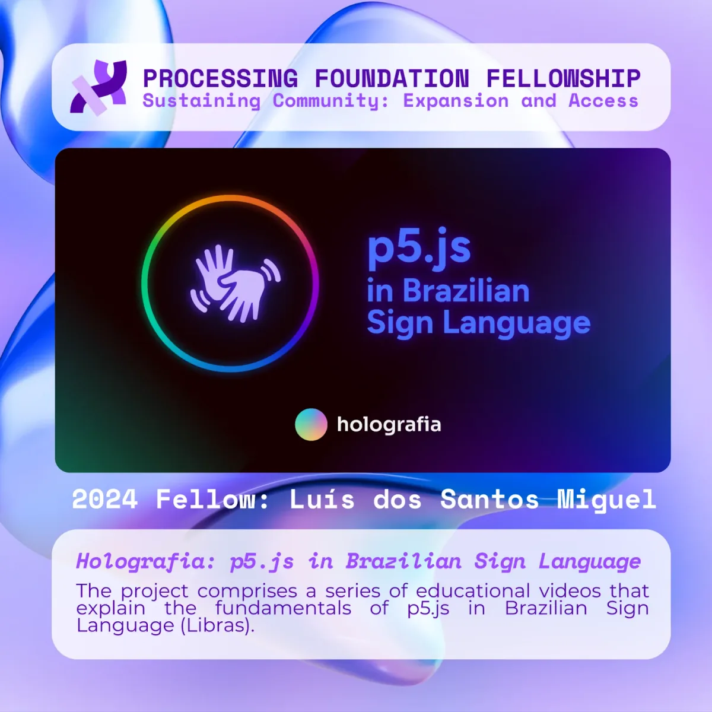

*2024 Fellow Project: Holografia | p5.js in Brazilian Sign Language*

‘Holografia’ is an initiative based on open-source principles, aimed at promoting design literacy and creative coding in Brazil, especially amongst Deaf individuals. The project ‘p5.js in Brazilian Sign Language’ comprises a series of freely accessible educational videos explaining the fundamentals of p5.js in Libras — the sign language commonly used by Deaf communities in urban areas of Brazil. These videos will feature visual resources, given the Deaf community’s reliance on visual communication, and will also include an audio track and subtitles in Portuguese to ensure accessibility for a broader audience across the country. The project will be conducted by a collective of professionals including Luís Miguel, Jaque Brenda, Paulo de Almeida Sachs, and Camila Delfino.

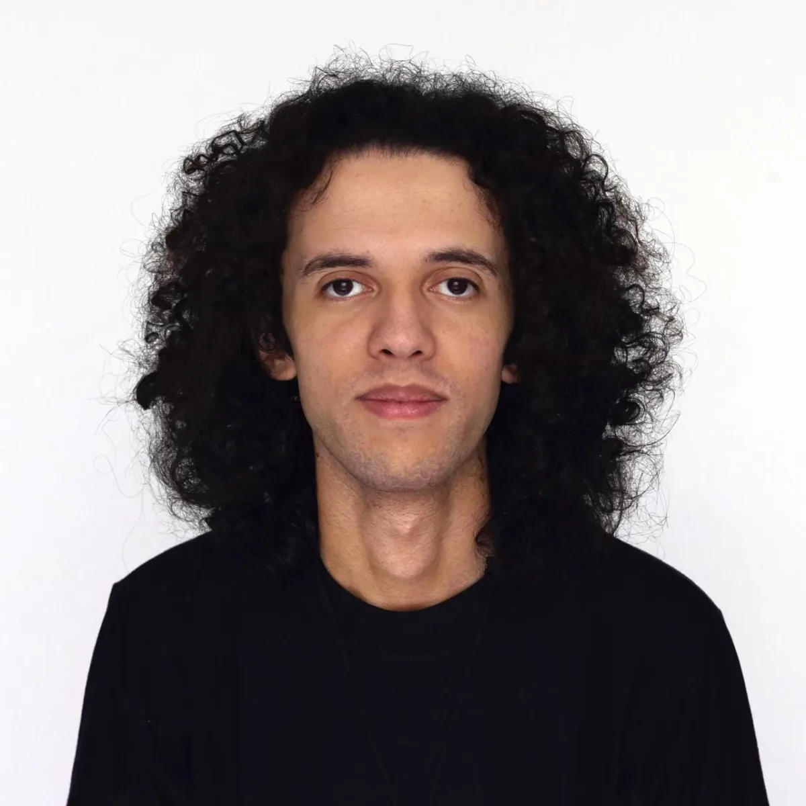

*Photo of Luís Miguel.*

*Luís dos Santos Miguel is a designer, audiovisual producer, translator, and educator based in São Paulo, Brazil. He holds a Master’s degree in Design and a Bachelor’s degree in Graphic Design, both from São Paulo State University (Unesp). He is an accessibility specialist, interested in human communication in its various forms of expression. His work focuses on audiovisual accessibility and inclusive design. His academic research also deals with digital interfaces, semiotics, multimodality, and Brazilian Sign Language (Libras). During his Master’s research, he investigated the affordances of different kinds of visual representations of sign languages. He has experience teaching design in undergraduate and postgraduate courses. Currently, he is pursuing a Bachelor’s degree in Brazilian Sign Language (Letras-Libras) at the Federal University of Santa Catarina (UFSC).*

*Follow Luis on* [*Instagram @luis.santos.miguel*](https://www.instagram.com/luis.santos.miguel)*,* [*LinkedIn (Luis Santos Miguel)*](https://www.linkedin.com/in/luissantosmiguel/)*, and* [*Luis’ Website*](https://luissantosmiguel.com)*.*

#### **Dorothy Howard (she/her) and David Isaac Hecht (he/him) | Applying Restorative Practices to Develop an Openly Licensed Conflict Resolution System for Self-Organized Communities**

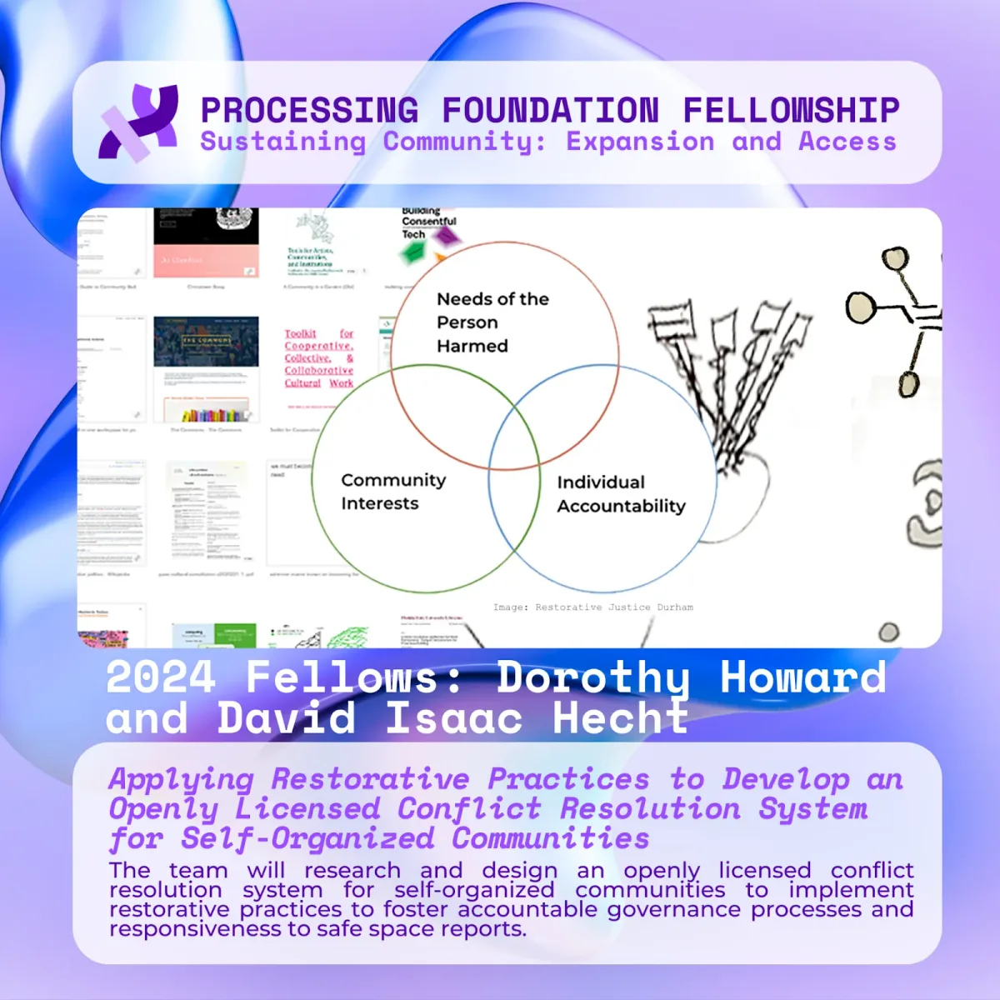

*2024 Fellow Project: Applying Restorative Practices to Develop an Openly Licensed Conflict Resolution System for Self-Organized Communities*

Debate and disagreements are natural parts of people coming together, yet many projects lack deliberative protocols to support codes of conduct. For the 2024 Processing Fellowship, Dorothy Howard and David Hecht are focusing on the design of a conflict resolution system for self-organized communities, such as open technology projects, online groups, or cooperatives. The system will be published in an open repository, so communities can modify and improve it to suit their contextual needs.

The broader aims of this project are to reduce harms that can occur because of inadequate resolution procedures, as well as to foster discussion about applying restorative practices to collaborative governance. To inform the design, the team will conduct research including a review of restorative practices and conflict resolution case studies and literature, and organize a focus group with community practitioners. They will also create a community engagement plan to identify projects that might have needs the system can help address, and a structure for feedback.

This project will build with the Processing Foundation community work to develop practices around encouraging safe spaces and communication in times of conflict, applying the ethics of care to design, and fostering dialogues about the complexities of interpersonal communication, complaint, compassion, and well-being.

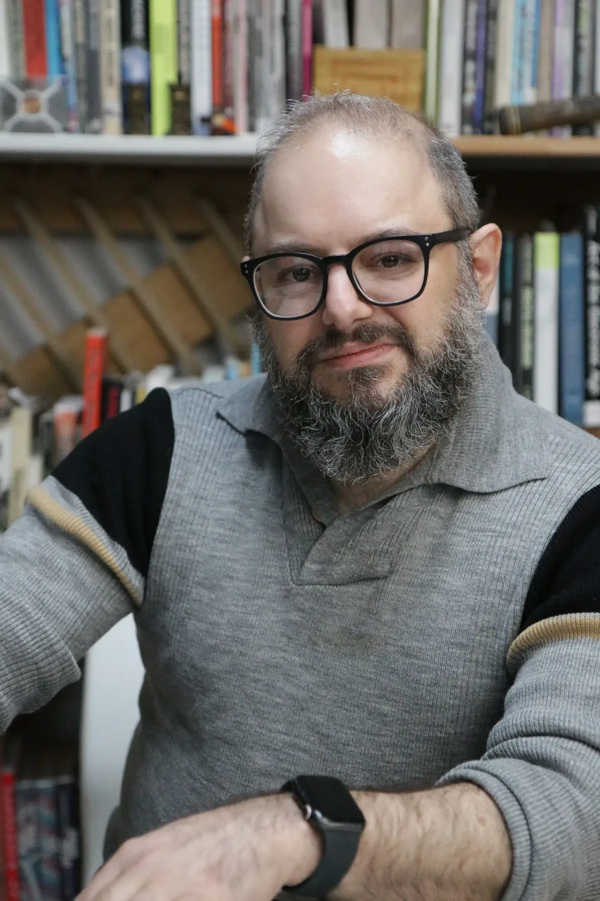

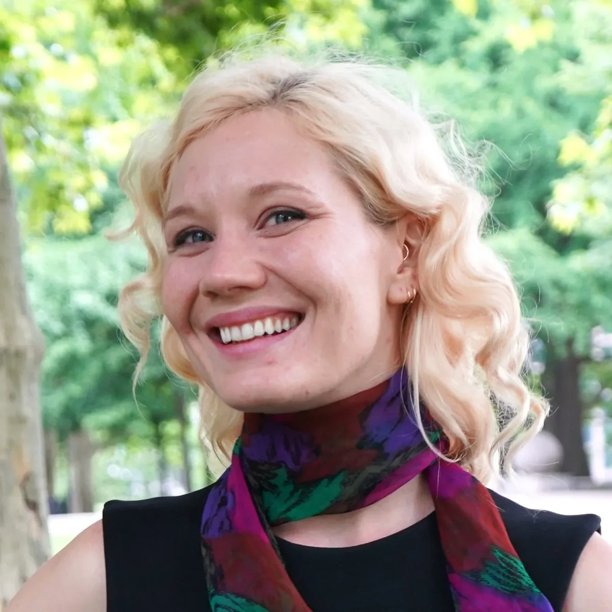

*Left: David seated in The Cybernetics Library at Prime Produce in NYC. Photo by Yuko Kudo. Right: Photo of Dorothy Howard by Nassem Navab.*

*Dorothy Howard is a researcher and open knowledge advocate from Mount Vernon, Washington. Dorothy has organized around equity and human rights in Wikipedia and was Wikimedian-in-Residence at the Metropolitan New York Library Council, where she facilitated public knowledge and instructional technology projects. She has spoken about her work at The Society for the Social Studies of Science, Scientific Computing with Python, Art Libraries Society of North America, and in other venues and classrooms. Her research has been published in Computer-Human Interaction and Computer-Supported Cooperative Work and supported by the National Science Foundation and Ford/Sloan Foundations. Dorothy has an MA in Communication from the University of California San Diego, and a BA in History from Reed College. She lives in Brooklyn, NY.*

*David Isaac Hecht is Director of Facilities for the Prime Produce Apprentice Cooperative, co-founder and Principal of The Cybernetics Library, and Research and Design-Build Coordinator for Seeds to Soil. David’s work is oriented around collaborative, community-based projects to help people gain access to and make use of resources to make their visions real. He operates between communities, technologies, knowledge structures, physical structures, ecological networks, organizational dynamics, and collaborative labor practices. He has an M. Arch from Columbia University GSAPP and a B.A. in Cognitive Science from Vassar College. His work has included crafting and facilitating community agreements and consensus processes, and implementing conflict resolution frameworks. He has served as Communications Coordinator for the Architecture Lobby. His work has been published in AD: Architectural Design, ARPA Journal, ARQ, and the Are.na Blog, and exhibited in the Queens Museum, Printed Matter PS1 Art Book Fair, and Current Museum.*

*Follow Dorothy on* [*Twitter/X @hexatekin*](https://x.com/hexatekin)*,* [*Instagram @hexjelica*](https://www.instagram.com/hexjelica/)*,* [*Mastodon @hexatekin*](https://mastodon.sdf.org/@hexatekin)*,* [*LinkedIn (Dorothy Howard)*](https://www.linkedin.com/in/dorothyhoward/)*, and* [*Dorothy’s website*](http://dorothyhoward.com/)*.*

*Follow Dave on* [*Instagram @wileycount*](https://www.instagram.com/wileycount/)*,* [*Twitter/X @wileycount*](https://x.com/wileycount)*,* [*LinkedIn (David Isaac Hecht)*](https://www.linkedin.com/in/david-isaac-hecht-9626673/)*,* [*Are.na (David Hecht)*](https://www.are.na/david-hecht/channels)*, and* [*David’s website*](https://www.primeproduce.coop/membership/dave)*.*

#### **Amad Ansari (he/him) | Palestine Online**

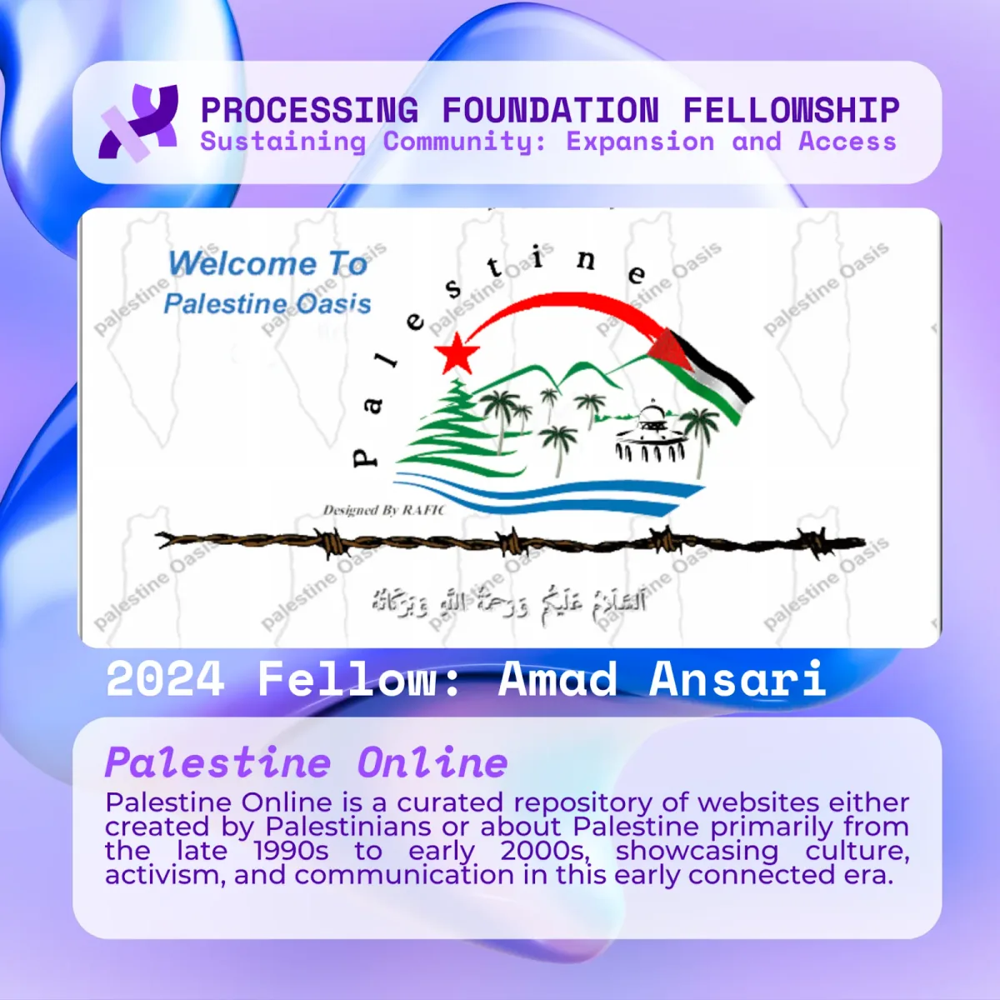

*2024 Fellow Project: Palestine Online*

‘Palestine Online’ is a collection of web pages created by Palestinians (and friends), primarily in the late 90s and early 00s, sourced from the [Internet Archive’s Wayback Machine](https://wayback-api.archive.org), including but not limited to: personal homepages, news websites and online magazines, sites showcasing Palestinian art and culture, and online memorials.

The project preserves Palestinian web presence during or close to the Second Intifada and showcases the overlooked yet rich early history of Palestinian internet presence, tracing the World Wide Web as a crucial tool for resistance, connection, and expression that has given Palestinians an unprecedented platform under ongoing occupation, and which to this day is a primary commons for a people repeatedly silenced or misrepresented by mainstream media outlets.

Palestine Online is also an exploration of using the capabilities of the modern web, the most important global connectivity tool today, to create a rich and interactive archive that revitalizes and makes newly visible the digital contributions and expression of oppressed peoples.

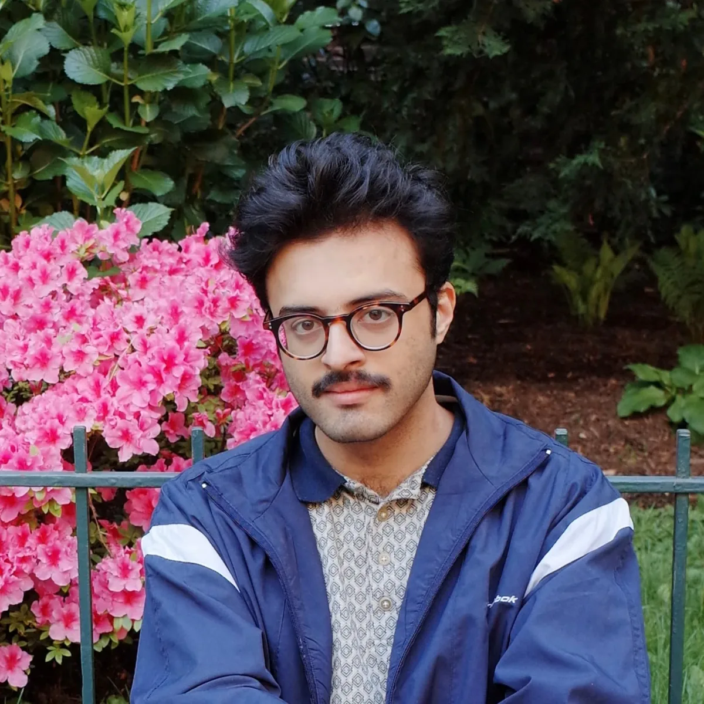

*Photo of Amad enjoying a sunny spring day in Jackson Heights, Queens*

*Amad Ansari is a software engineer with an educational background in Computer Science and Art History. He is beginning to delve into a practice of computer-based art and digital archiving. His archival work aims to make accessible and reorganize that which has become obscured or is at the risk of being lost, from Web 1.0 content scavenged from the Internet Archive to contemporary content created by marginalized communities in the third world and posted on social media. His artistic work ponders the aesthetic perceptions arising from rapid technological computing, through which graphics and visual norms from the 80s-mid 2000s look older than they are. He aims to bridge this gap by emulating low/slow tech and highlighting the beauty and charm of early computing, excavating from the digitally discarded, and embracing the visual patterns and signifiers that emerged from eras when computing was more limited, demanding creativity and imagination within these bounds.*

*Follow Amad on* [*Instagram @badgalansari*](https://www.instagram.com/badgalansari/)*,* [*Linkedin (Amad Ansari)*](https://www.linkedin.com/in/amad-ansari-902b6a11a/)*, and* [*Amad’s Website*](https://amad.cool)*.*

#### **Anh (Autumn) Pham (they/them) | How do We Care for Each Other**

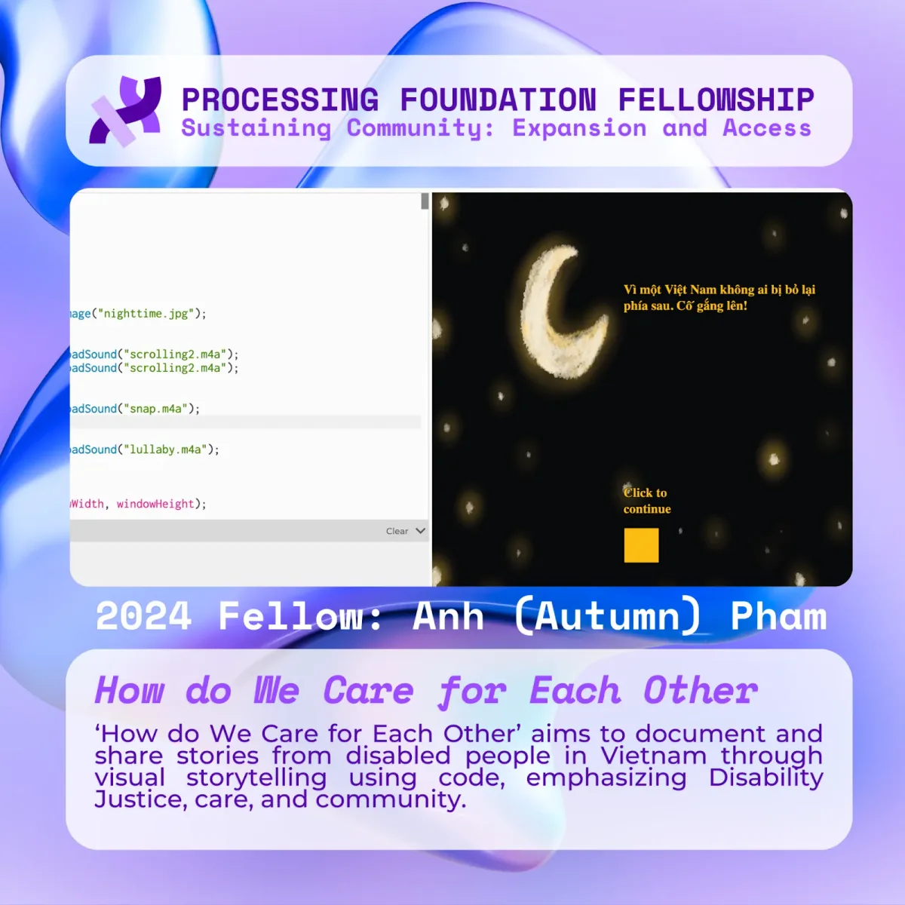

*2024 Fellow Project: How do We Care for Each Other*

‘How do We Care for Each Other’ (“Vì Mình Thương Nhau”) aims to create an archival website that documents the actual lived experiences of disabled people in Vietnam through visual storytelling using code, such as Processing and p5.js. By collecting first-person narratives, the project seeks to highlight and celebrate the diverse stories of Vietnamese disabled individuals, recognizing that all bodies deserve to be celebrated. Using creative technology tools, the project hopes to bring visibility to Disability Justice, care, and community. How can we celebrate disabled people as they are and dismantle ableism, especially within all the nuances of the Vietnamese cultural context? Beyond the fellowship period, the project aspires to cultivate a solid community for Disability Justice in Vietnam, continually documenting and celebrating disabled stories. It hopes to inspire more conversations and research on disability from Vietnamese scholars, students, and the general public. In the long term, the vision is to present this website as archival documentation to various levels of government. Better data informs better policies; the project hopes to advocate for better support for disabled people in housing, education, healthcare, and other social services.

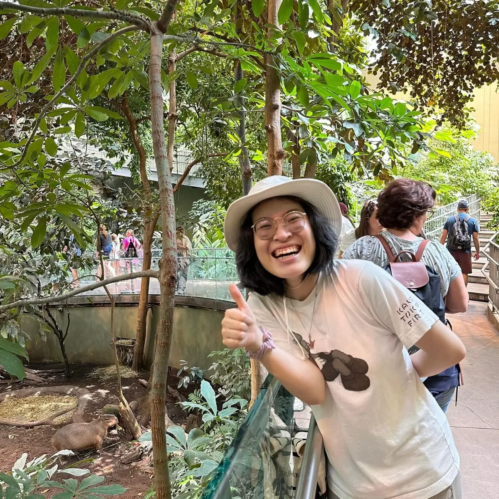

*Anh Pham at Montreal Biodome with capybara, taken by their wonderful partner.*

*Anh (Autumn) Pham is a Deaf Queer tech worker and writer from Vietnam, based in Vancouver, British Columbia. They currently work a 9-to-5 at a financial tech company. Outside office hours, you can find them writing “Letters from Anh” newsletter on accessible tech, disability, and humanity (both in English and Vietnamese), or helping organize mentorship and fellowship programs for young people with their friends (namely Reboot and Viet Tech!). They also make decent matcha and love hosting dinner and board game nights with friends! Anh cares a lot about accessibility and community care and is broadly curious about people, histories, cultures, policies, and the intersection of tech, art, and society. They received an award from Apple for a visualization project that teaches people how to read audiograms and interned at their iOS Accessibility team, working on hearing accessibility. They and their partner have a black cat named Tep and occasionally will send his pictures your way!*

*Follow Anh on* [*Twitter/X @anhphamprog*](https://twitter.com/anhphamprog)*,* [*LinkedIn (Anh Hathu Pham)*](https://www.linkedin.com/in/anh-hathu-pham/)*, and* [*Anh’s Substack*](https://anhpham.substack.com/)*.*

#### **Roopa Vasudevan (she/her) | Aligning an Open-Source Ethos**

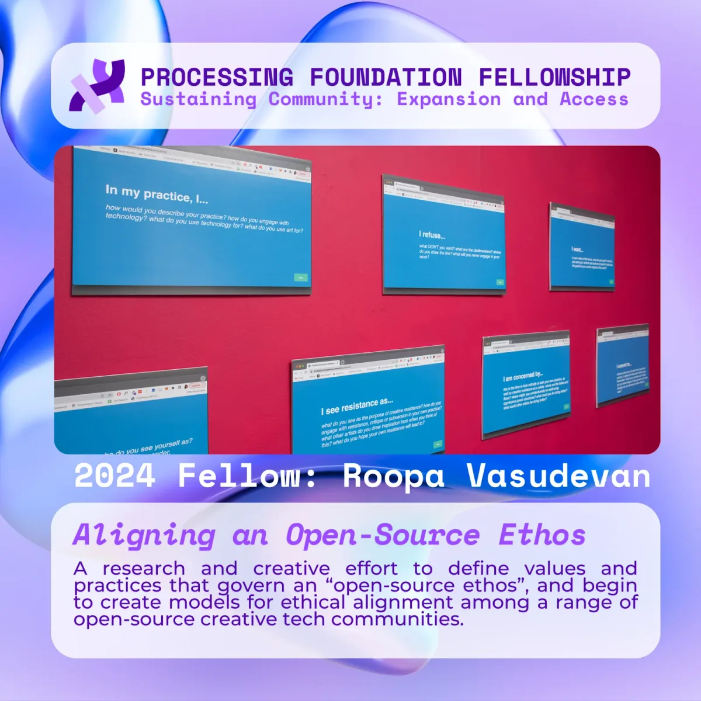

*2024 Fellow Project: Aligning an Open-Source Ethos*

Working with the Processing Foundation community, along with other creative technology projects that draw inspiration from Processing’s pioneering history, Roopa Vasudevan will begin a research and creative effort to develop both a definition of values and practices that govern an “open-source ethos”, and models for ethical alignment among a range of open-source creative tech communities.

While different protocols and practices are necessary for different languages and technical systems, the ethos surrounding the larger software art community should be consistent if it strongly believes in expanding access to and literacy with technology. Drawing from Vasudevan’s long-term work engaging the complex relationships between art, technology, and power — along with her history of facilitating exchange between tech-based artists about values, practices, and things they would like to see in the field — this project attempts to take steps towards reconciliation and alignment of value-based goals among open-source communities.

As part of the fellowship, Vasudevan will build a Web-based resource collecting her research; outlining findings; and soliciting feedback, ideas, and visions from community members for their hopes for the open-source creative software community. The work from the fellowship period will also be produced as a PDF and printed zine to be distributed in the fall of 2024.

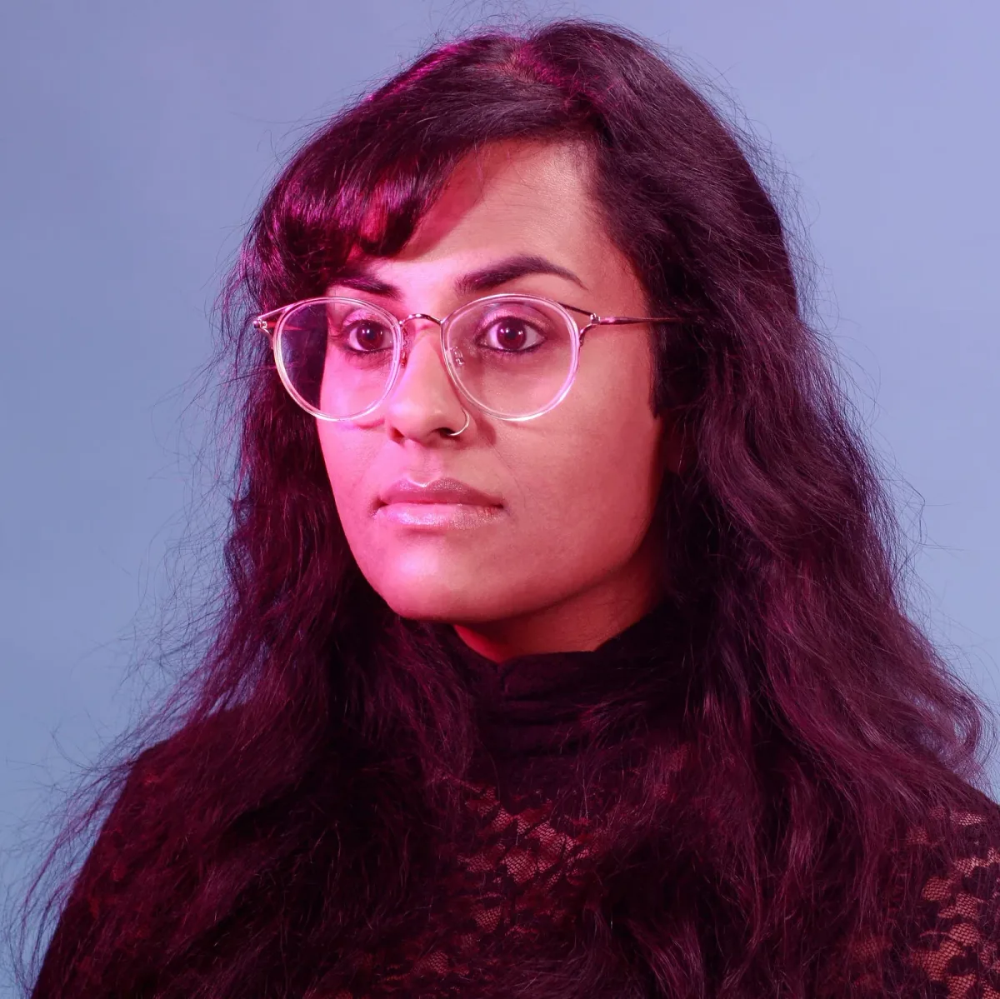

*Photo of Roopa Vasudevan by [Natalie Hijinx](https://www.hijinx.wtf/%29).*

*Roopa Vasudevan is a new media artist, computer programmer, and researcher investigating default technical practices and protocols, and how they intersect with larger social and economic power structures. Her work has been exhibited and featured by press outlets internationally, and she has demonstrated a particular and steadfast commitment to artist-led organizations throughout her career. She was additionally an Eyebeam Rapid Response for a Better Digital Future Fellow in 2020; is currently a community member at NEW INC, the art and technology incubator at the New Museum (New York), where she was a member of the Art & Code track (in partnership with Rhizome) between 2021 and 2023; and is a co-investigator on the Data Fluencies Project, an international research team funded by the Mellon Foundation. Roopa received her PhD in Communication from the University of Pennsylvania in 2023, and an MPS from the Interactive Telecommunications Program (ITP) at NYU in 2013. She is currently an Assistant Professor in the Department of Art at the University of Massachusetts, Amherst.*

*Follow Roopa on* [*Instagram @rouxpz*](https://www.instagram.com/rouxpz/) *and* [*Twitter/X @rouxpz*](https://twitter.com/rouxpz)*.*

#### **Buffy Sierra (she/her) | Synthetic Moans**

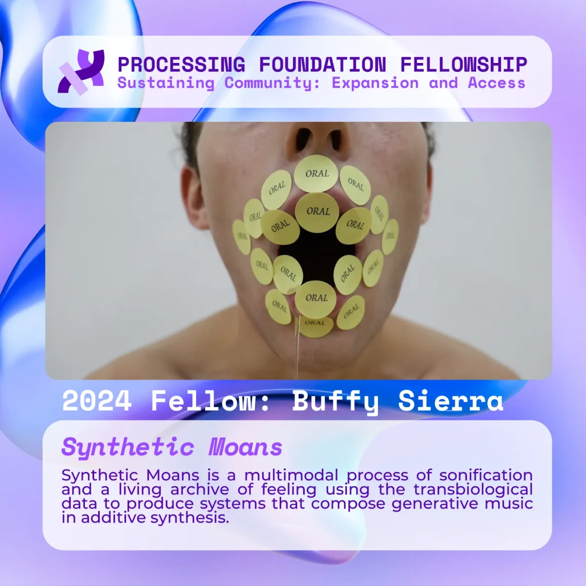

*2024 Fellow Project: Synthetic Moans*

‘Synthetic Moans’ is a piercing scream into the void and a soft whisper to a lover, sister, or mother. Synthetic Moans indexes a process, a practice, and a palimpsest of trans life, and of transfeminine lineages between aesthetics, music, and science. The process at the heart of Synthetic Moans is a system for identifying and assembling transbiological data (hormone levels, frequency of medical visits, embodied memories of sexed and gendered becoming) and sonifying it into tones, sequences, and scores. The practice that will enable the emergence of Synthetic Moans is a method of memory work and archival research between transfeminine people sharing and recording documents, ephemera, and feelings related to broad and variable interpretations of transition. The palimpsest generated through the process and the practice of Synthetic Moans will both disclose and obfuscate felt dimensions of transfeminine life. It will be a digital archive and an evolving compendium of sounds and resources composed with transfeminine contributors. Inspiration for this project comes from many sources: Arca, ARCHANGEL, Annie Sansonetti, ANOHNI, Ita Segev, Jeanne Vaccaro, Juliana Huxtable, Keioui Keijaun Thomas, Mary Maggic, Mira Bellwether, SOPHIE, troizel xx, and many more.

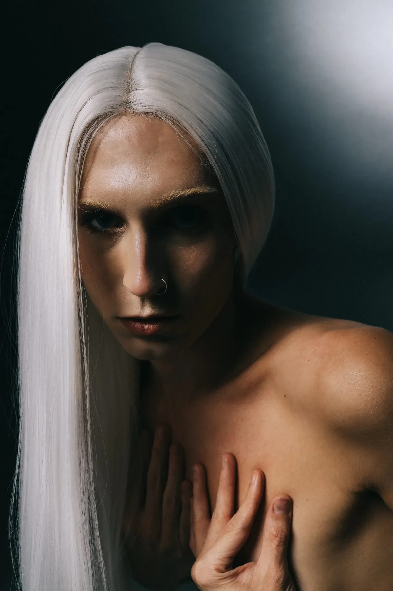

*Photo of Buffy by MTHR TRSA.*

*Buffy is an artist and writer producing work about living horrors and dying beauties. Buffy’s fixation on living horrors and dying beauties is an inverted obsession with life. She produces art to unravel how we live through this world’s horrors, always with a retaliatory affirmation of beauty and its heartbreaking ephemerality. Her work slips promiscuously between sensuousness and severity: erotic live performance and its documents, stark technical design for stage and screen, unrelenting electronic music, and volatile choreographies that turn bodies inside-out. Her performances live in the gothic, gore-geous, and grotesque spaces between sex work, burlesque, drag, synthesized sound, tragic theater, and histories of transsexual futurity. She composes discordant music from open-source software, performance scores from metabolic memories implanted by medicalized technologies, operatic theater from the social engine of queer nightlife, dance from the felt dimensions of her synthetic biology’s chronic pains, and rapturous events where audiences converge for exhilarating, unsettling, and transformative intimacies.*

*Follow @buffysierra on all platforms and* [*Buffy’s Website*](http://buffysierra.com)*.*

#### **Roxanne Harris (she/her) | Ephemeral Experiments: Decoding Tendencies in Live Coding**

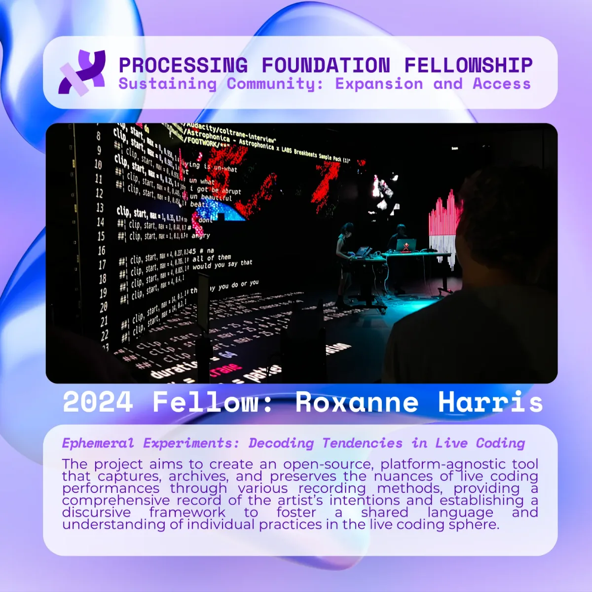

*2024 Fellow Project: Ephemeral Experiments: Decoding Tendencies in Live Coding*

This project aims to capture and preserve the nuances of live coding performances, detailing artistic decisions and challenges. The project involves developing a platform-agnostic tool that records live performances through keypress detection and state changes within the source code. This tool will effectively archive live coding performances, providing a comprehensive record of the real-time coding process and the artist’s intentions. Ensuring compatibility with any live coding platform, the tool will extend its use across various artistic practices and workflows. Code analysis will reveal patterns, trends, and potential areas for innovation, offering insights into live coding interactions. The project will open-source all tools and research outputs, promoting transparency and collaboration. This approach allows others to observe, contribute to, and build upon the findings. Additionally, the project aims to establish a discursive framework around individualistic practices in live coding, fostering a shared language and a clearer understanding of intent and purpose. By documenting and archiving live coding performances, this project seeks to contribute valuable knowledge and resources to the live coding community and the broader field of creative technology.

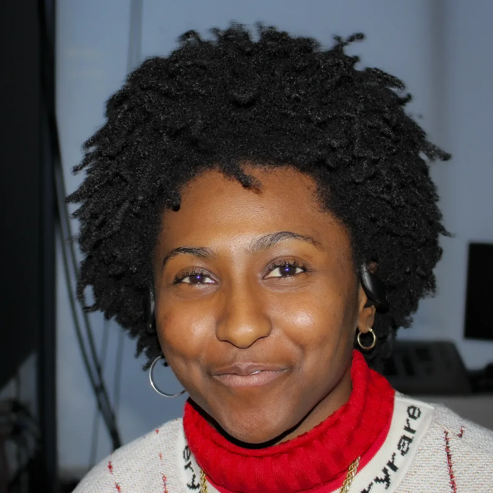

*Photo of Roxanne Harris by Justin Berry. Jacquard knit by Raf Reyes.*

*Roxanne Harris “alsoknownasrox” is a new media artist-researcher and musician-programmer based in New York City. Embracing programming as an artistic medium, she parameterizes on-the-fly, pushing the boundaries of improvisational dexterity within computational limitations. Through iterative cycles of research and craft, Roxanne designs sensitive systems for emergent play. Her interest in building interpersonal synergistic networks and experiential, ephemeral techno-encounters drives her practice. She advocates for algorithmic transparency, projecting her code and embracing vulnerability by exposing her externalized thought processes. Her recursive practice rejects utilitarian efficiency in favor of a computational understanding of the world and the forces that govern it. Currently, Roxanne serves as a mentor at NEW INC, an engineer at Indistinguishable from Magic, and a member of LiveCode.NYC. She holds a B.A. in Computer Science and Music from Yale University and is pursuing an M.F.A. in Design | Media Arts at UCLA. Roxanne has presented at the International Conference on Live Coding, Open Source Arts Contributors’ Conference, SXSW, and Dweller Festival. Her contributions have been featured in Office Magazine and Alternative Press. She has performed at venues including ZeroSpace Brooklyn, MoMA PS1, Gray Area (SF), TivoliVredenburg, and Synapse VP.*

*Follow Roxanne on* [*Twitter/X @alsoknownasrox*](https://twitter.com/alsoknownasrox)*,* [*Instagram @alsoknownasrox*](https://www.instagram.com/alsoknownasrox/)*,* [*Roxanne’s Website*](https://alsoknownasrox.com)*,* [*Bandcamp @alsoknownasrox*](https://alsoknownasrox.com)*,* [*Tiktok @alsoknownasrox*](https://www.tiktok.com/@alsoknownasrox)*, and* [*Soundcloud @alsoknownasrox*](https://soundcloud.com/alsoknownasrox)

We’re so excited to see what our Processing Fellows will work on this summer! We hope to keep supporting new artists, designers, activists, educators, engineers, researchers, coders, and collectives, year after year. Want to support the Processing Foundation in this work? [Donate here](https://processingfoundation.org/donate) to support our ecosystem of open-source contributions!
