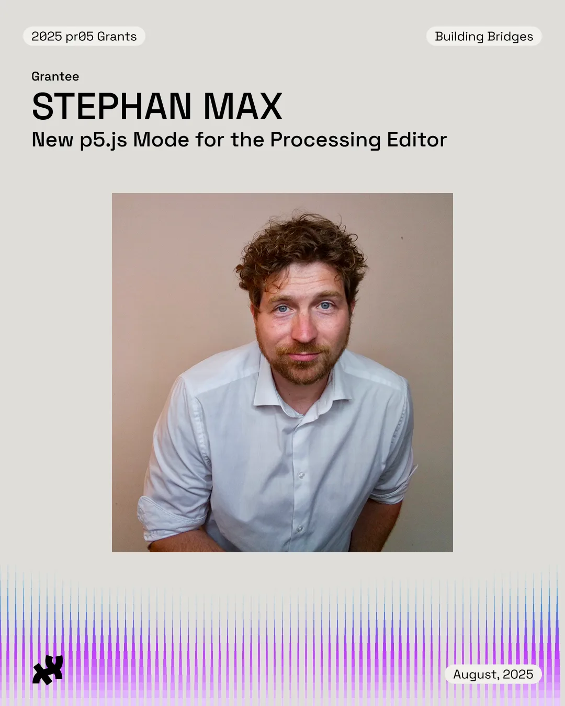
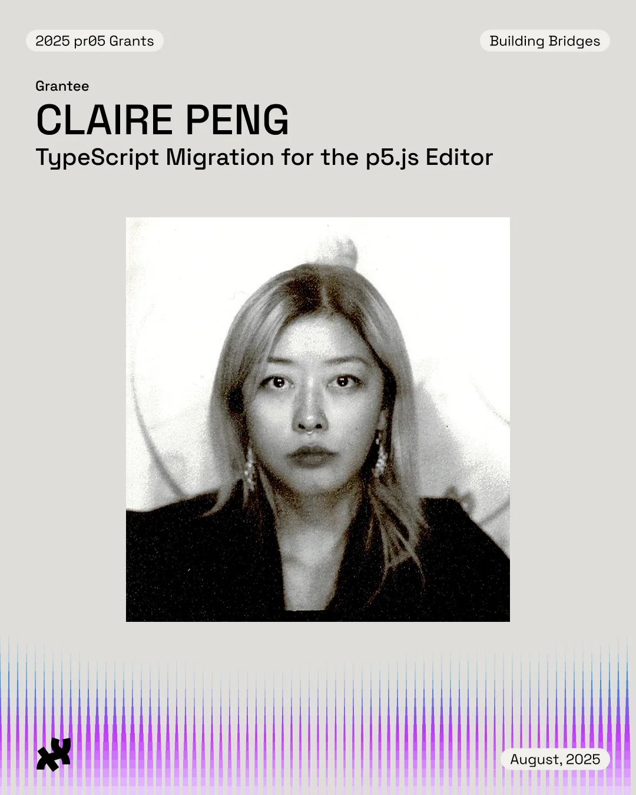
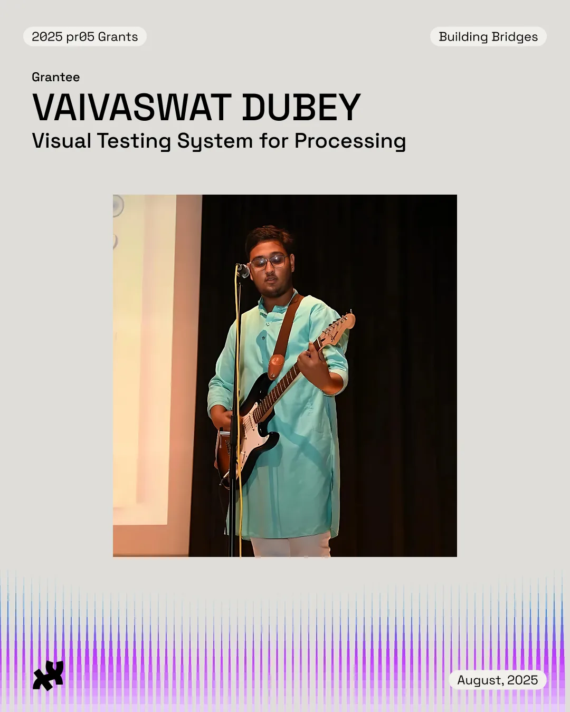

> pr05 (pronounced “pros”) is a grant and mentorship initiative by the Processing Foundation designed to support the professional growth of early to mid-career software developers through hands-on involvement in open-source projects. This is a unique opportunity to grow as a developer while making a tangible impact on software projects used by millions of creatives, artists, educators, and students globally.

> This year’s theme is “Building Bridges”, with a focus on supporting interoperability across the [Processing](http://processing.org/) and [p5.js](http://p5js.org/) ecosystem and beyond. We have curated a list of three projects around that theme. Each project will be mentored by a developer/contributor experienced in this specific area.

We received 105 incredible applications and were able to award a total of three candidates to join our 2025 cohort. Special thanks to our Processing Community Lead and pr05 grant coordinator, Raphaël de Courville, who made this work possible. We’re proud of the vital contributions this amazing group has made over the past few months!

To learn more about the pr05 grant, check out our [pr05 Grant Website](https://processingfoundation.org/grants). You can also take a look at our [Project List](https://github.com/processing/pr05-grant/wiki/2025-pr05-Project-List), which outlines each project’s description and outcomes.

[**Stephan Max**](https://stephanmax.com/) **(he/him) | New p5.js Mode for the Processing Editor**

*2025 pr05 Grantee: Stephan Max*

This project aims to bring full support for writing and running p5.js sketches directly inside the PDE, bridging the gap between web-based and desktop coding, via Node and Electron. With this mode, p5.js users will be able to go beyond the browser: saving and loading files locally, accessing system resources, and even creating standalone desktop applications. It opens the door for hybrid workflows that combine the accessibility of p5.js with the power of Processing’s native capabilities.

*Stephan is a freelance software developer based in Cologne, Germany. With a focus on working with NGOs/NPOs and civil society associations, he aims at teaching, producing, and maintaining tech for those who don’t have natural access to it. He can offer expertise in developing web platforms, data analysis tooling, and playful creative experiences. Stephan is an avid moviegoer, takes regular field trips to museums and exhibitions, and lately dabbles in making art with his trusty pen plotter.*

*Follow Stephan on* [*his website*](https://stephanmax.com/)*.*

*Mentor Stef Tervelde is a Dutch developer and designer based in Berlin. Educated as a designer with a natural inclination towards all things digital, he loves to shift bits around, from hardware to high-level programming. Starting initially with Processing, his work has expanded to include many other coding languages. He also co-organizes the Creative Code Berlin meetups every month.*

*Follow Stef on GitHub* [*@Stefterv*](https://github.com/Stefterv)*.*

[**Claire Peng**](https://claire-peng.vercel.app) **(she/her) | TypeScript Migration for the p5.js Editor**

*2025 pr05 Grantee: Claire Peng*

This project focuses on initiating the migration of the p5.js editor to TypeScript. The goal is to improve maintainability and the developer experience by enhancing readability, enforcing consistency, and reducing the likelihood of errors. The migration process will involve selecting portions of the editor, converting them to TypeScript, and ensuring compatibility with the existing codebase. Rather than a full migration, this is an initial step to provide a reference for future contributors as they continue this work. Additionally, updating tests and documentation will be important to onboard future contributors.

*Claire is a Chinese-Canadian developer and designer based in London. Formerly a menswear designer (Burberry, A-COLD-WALL\*, DOM REBEL), her designs have been worn by artists like Chance the Rapper and Machine Gun Kelly. Now working as a software engineer, she specialises in UX/UI design, web accessibility, and advocates for making tech approachable and inclusive to those from non-traditional backgrounds. Outside of work, she is exploring creative/live-coding, makes clothes, and sings in the shoegaze-inspired band, Sunnbrella.*

*Follow Claire on* [*Instagram @claiire.png*](http://www.instagram.com/claiire.png)*,* [*Linkedin (Claire Peng)*](https://uk.linkedin.com/in/pengclaire)*, and GitHub* [*@clairep94*](https://github.com/clairep94)*.*

*Mentor Connie Ye is an artist and engineer based in San Francisco, specializing in rat-based mini games and interactive web art. She is a member of the tech-art collective Algorat, known for creating “The Ratchelor,” a dating game trilogy that has engaged over a million players since its inception in 2021. Connie has previously contributed to the p5.js editor by mentoring a 2024 pr05 project and by working on the testing suite.*

*Follow Connie on Instagram* [*@c0n5tants*](https://www.instagram.com/c0n5tants/) *and* [*her website*](https://connieye.com/)*.*

[**Vaivaswat Dubey**](https://www.linkedin.com/in/vaivaswathehe/) **| Visual Testing System for Processing**

*2025 pr05 Grantee: Vaivaswat Dubey*

This project aims to design and implement a visual regression testing suite [for Processing](https://processing.org/) inspired by the visual testing suite for p5.js. Any synergies between the testing suites for Processing and [p5.js](https://p5js.org/) will be explored. The system should be focused on comparing the visual output of code sketches, making it easier for contributors to detect regressions, validate changes, and contribute with confidence. The testing approach should account for differences across platforms, and renderer configurations where applicable. The system should also be easy to run both locally and in CI environments, allowing the community to help test across diverse setups.

*Vaivaswat is a developer and student passionate about technology and music. He is currently pursuing a Bachelor’s degree at IIIT Gwalior and serves as a steward in the DevOps category for the p5.js project, helping improve infrastructure and workflows. Vaivaswat enjoys working across the stack, especially with technologies like Next.js, Golang, and cloud services. His work often involves building scalable systems and automating development pipelines. Outside of tech, he’s a music enthusiast and guitarist who finds creativity both in code and on stage.*

*Follow Vaivaswat on* [*Linkedin (Vaivaswat Dubey)*](https://www.linkedin.com/in/vaivaswathehe/) *and GitHub* [*@Vaivaswat2244*](https://github.com/Vaivaswat2244)*.*

*Mentor Dr. Claudine Chen is a software programmer and artist based in Dublin, Ireland. She got her PhD in applied physics and worked previously in atmospheric science and climate policy. While living in Berlin she connected with her inner creative coder, and she co-organized Science Hack Day, was a student at the School of Machines, Making, and Make Believe, and was infinitely inspired by the community in Creative Code Berlin. It was at this time that she first worked with Processing. She is enthusiastic about building communities with cooperative structures, and is a founding member of arts cooperative Prachtsaal in Berlin, and is working to establish something similar in Dublin.*

*Follow Claudine on* [*Instagram @mingness*](https://www.instagram.com/mingness)*,* [*Linkedin (Claudine Chen)*](https://www.linkedin.com/in/claudinechen/)*, and GitHub* [*@mingness*](https://mingness.github.io/)*.*

We’re so proud of what this year’s pr05 grantees have accomplished. Their work continues to strengthen our open-source creative coding community. If you’d like to support programs like this, consider making a donation to the Processing Foundation [here](https://processingfoundation.org/donate)!
