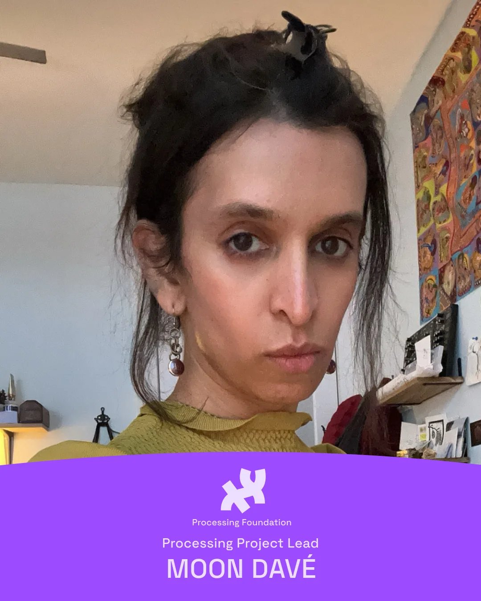
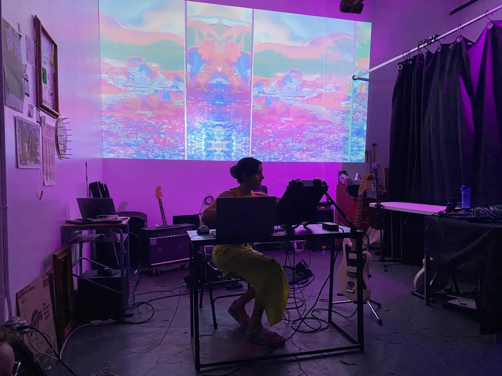
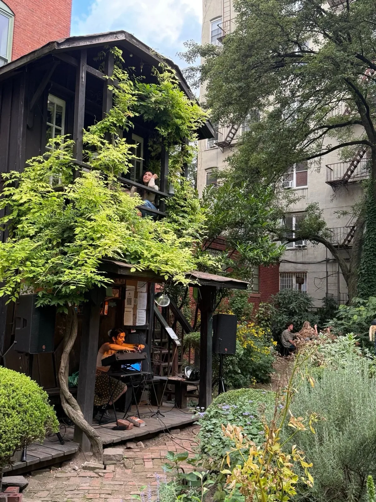
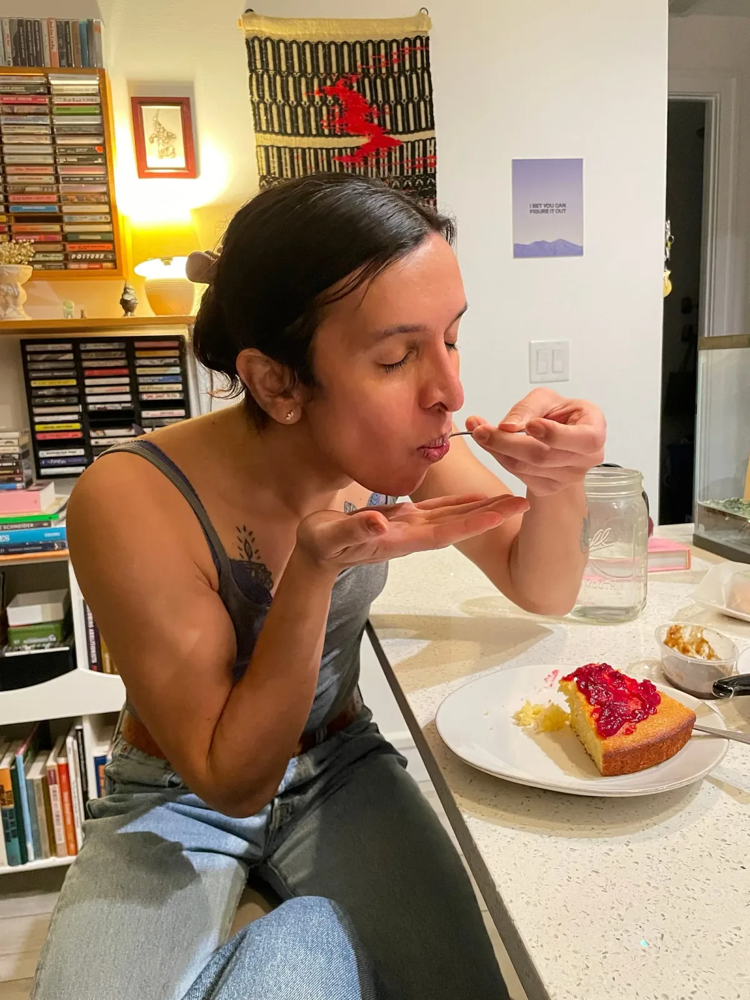

*Photo of Moon Davé*

She has almost 2 decades of experience working in the tech industry, and was first introduced to Processing and creative code in 2007. Moon loves to explore creative possibilities in the dark corners of computer systems and think critically about education, access, and technology’s place in the world.

Moon has spent the last few years primarily focused on slightly more traditional art. Improvising noise and ambient music using synthesizers and her guitar. Thinking back to her time in LivecodeNYC, she eventually folded some code into her practice using SuperCollider as an orchestration tool for her modular synthesizers. Now she is working to migrate all her creative tools to Linux and is unafraid of writing some tools specifically designed for her creative process.

She believes anyone of any background can learn anything if given access. Education is a right, and to learn deeply and meaningfully is a radical act that we must all strive for. This is why we are so excited to have her join The Processing Foundation. As the new Processing Project Lead, Moon will focus on clearing the path for contributors of all skill levels, bringing best practices and modern graphics APIs into the codebase, and collaborating with the contributor community to breathe new life into the project.

