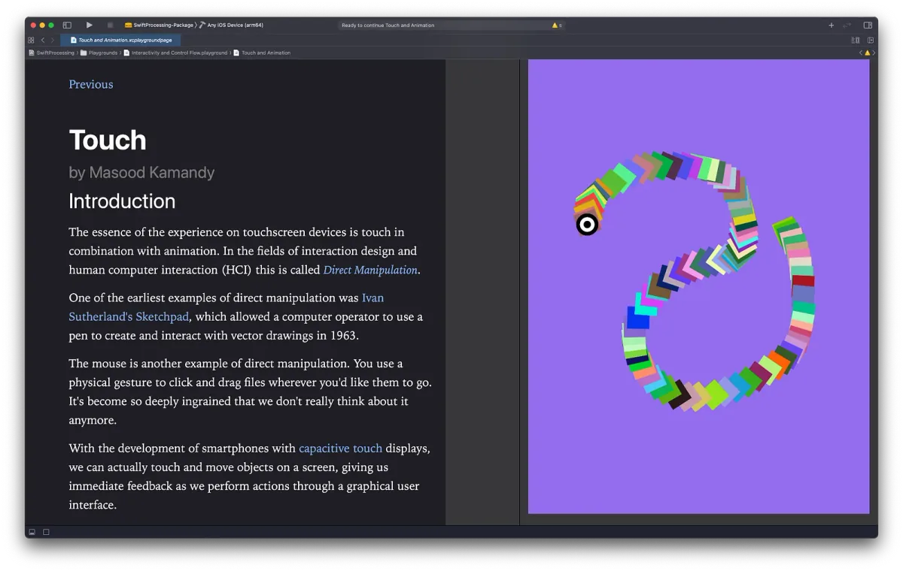

mentored by [Jon Kaufman](https://github.com/jjkaufman)

---

*As of 2021, Processing Foundation has been participating in Google Summer of Code for a whole entire decade! Each year we’ve been honored to work with students on open-source projects that range from software development to community outreach, and this year’s cohort was no exception. Over the next couple weeks, we’ll post articles written by some of this year’s GSoC students, explaining their projects in detail and in their own words. The series will conclude with a wrap-up post of all the work done by this year’s GSoC students. Congrats, everyone, on a great summer!*

---

*A screengrab of a chapter from the SwiftProcessing Playground textbook that is now included with the framework. \[**image description**: A screenshot of the online textbook. On the left side is white text on a black background that reads: “Touch by Masood Kamandy. Introduction: The essence of the experience on touchscreen devices is touch in combination with animation. In the fields of interaction design and human computer interaction (HCI) this is called Direct Manipulation. One of the earliest examples of direct manipulation was Ivan Sutherland’s Sketchpad, which allowed a computer operator to use a pen to create and interact with vector drawings in 1963. The mouse is another example of direct manipulation. You use a physical gesture to click and drag files wherever you’d like them to go. It’s become so deeply ingrained that we don’t really think about it anymore. With the development of smartphones with capacitive touch displays, we can actually touch and move objects on a screen, giving us immediate feedback as we perform actions through a graphical user interface.” On the right side of the image is an illustration of many colored squares in a snake shape against a purple background.\]*

This summer, as a part of Google’s Summer of Code (GSoC) with the Processing Foundation, I had the opportunity to work with mentor Jon Kaufman to move the SwiftProcessing framework forward through examples and bug fixes focused on the experience for new learners. The work we ended up doing together went a long way toward solidifying the foundation of SwiftProcessing and was far more comprehensive than either of us anticipated. Our goal was to make SwiftProcessing more like Processing while still utilizing the benefits of Swift.

I’m a programmer, educator, researcher, and artist, and have used and taught Processing for many years at Pasadena City College and now at the University of California, Santa Barbara. Developing inclusive course materials for a broad spectrum of new learners has been a particular passion of mine. When I proposed participating in GSoC, it was through the lens of leveraging the time I’ve spent with new learners to shape the user experience of the framework. I’ve also developed a curriculum around teaching the Swift language from a creative coding perspective *without* Processing, and I understand the challenges inherent to the language, the development environment, and working with graphics in iOS.

### A Free Open-Source SwiftProcessing Textbook Based on Playgrounds

From the outset, the goal that shaped all of the work we did this summer was **the creation of a free SwiftProcessing textbook that uses Xcode Playgrounds** to broaden access and hopefully make the framework more inclusive. This textbook was the hub around which all other activities revolved. Playgrounds are a literate programming environment that enable you to combine pages of text with runnable code. They include a live-view to preview code changes within the editor beside the code. Our textbook has three main sections: Basics, Interactivity & Control Flow, and Modularity. Within these sections are 25 Playgrounds that operate as chapters that cover programming topics one would expect to find in a beginning programming course, from drawing basic shapes to object-oriented programming. Every “chapter” is also an executable code example.

Writing the textbook and testing examples created the feedback loop that propelled us all summer, in which features were debugged and added in order to accommodate how best to teach programming to new learners. The core idea behind most of these changes was making sure we **reduced the cognitive load for new learners** as they were starting their SwiftProcessing journey. For example, in Swift a common source of cognitive load is compile-time type-mismatch errors, because the type system is very strict. This benefits production code but can hinder and intimidate new learners. Types are one of the most challenging topics for new learners in programming courses. Many of our design decisions were shaped by our goal of enabling new learners to get their artwork on the screen as fast as possible with as few errors as possible. Wherever we could enable students to get their ideas on the screen faster, we refactored the framework.

### Fundamental Changes to SwiftProcessing

There were several fundamental changes to the library that necessitated large rewrites that focused on the user experience of the framework for new learners. Among these changes were:

-   Using **generics** throughout the framework so that new learners can simply declare a variable without a type and have all of the functions work through Swift’s type inference system.
-   Implementing a **protocol that automatically converts numeric types** to work around Swift’s strict type system.
-   We decided on `Double`s as the main user-facing data type of SwiftProcessing and removed references to Apple’s `CGFloat` data type, which is a proprietary type used to interface with Apple’s Core Graphics framework. That is now only used internally and there is a strong effort to distinguish between what is used internally and what is user-facing.
-   Adding quick-help (`///`) comments to the entire library so that almost **every method and property is documented**

### Feature Additions and Bug Fixes

There were also many feature-oriented additions and bug fixes:

-   Enabling the use of **Playgrounds** and leveraging them for our textbook.
-   **Color literal support** to allow for use of Xcode’s color picker within the editor.
-   Adding support for hue, saturation, and brightness (HSB) color mode.
-   **Curves** were added to the library via Catmull-Rom splines and `curveVertex()`.
-   A new UI **label** class was added for UI elements.
-   **Slider** and **touch** were rewritten to fix bugs.
-   `get()` was fixed for sampling colors.
-   `push()` and `pop()` were overhauled and rewritten.
-   `pushStyle()`, `popStyle()`, `pushMatrix()`, and `popMatrix()` were added and a more comprehensive accounting system was implemented to reconcile differences between SwiftProcessing and Apple’s Core Graphics graphics states.
-   Operator overloads for arithmetic operators were created that leverage generics so that expressions can mix types and still work as a new learner might expect. For example, the `%` (modulus) operator works as new learners might expect if they were transitioning from Processing or p5.js. In raw Swift, the modulus operator is a method attached to types for floating point numbers and the `%` operator is reserved for `Integer`s.
-   All framework all-caps value-less Processing constants have been converted to Swift enums that only operate within specific contexts and auto-complete when a user types a period. Leveraging code completion in this way reveals context-specific options whenever a new learner needs to make a choice. For example text alignment can be `.left`, `.center`, `.right`, or `.justified` and only those options will show when the `textAlign()` function is called.
-   A `Math` struct was created to store commonly used math constants.
-   This included a `Default` struct to store default SwiftProcessing states.
-   Microphone input support was added.

  <iframe src="https://player.vimeo.com/video/590410050?h=50564e77e4&amp;app_id=122963" frameborder="0" scrolling="no"></iframe>

### Changes for to Encourage Contributions

The user experience of future maintainers was also considered in our work this summer. Many bread crumbs were added to the library that point to possible future contributions. Wherever research was done, links and relevant information were left in the library. And wherever there might be confusion about how something works, explanatory comments have been added. The hope is that this encourages open-source developers to help with the framework.

### A Thanks to the Processing Community and GSoC

This has been a wonderful experience for me that really reminded me why I appreciate the open-source community so much and why I will always be proud to contribute to Processing’s future. It was my first experience contributing to open-source but it won’t be my last. For me the experience reinforces that so many of the aspects of contributing to open source that were intimidating came from a lack of confidence rather than objective barriers. GSoC and my experience with my generous mentor gave me that experience and I’m immensely grateful to the program.
