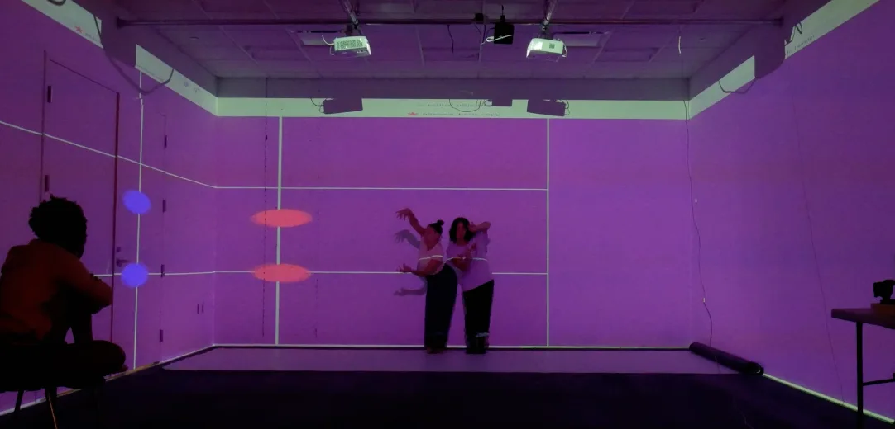
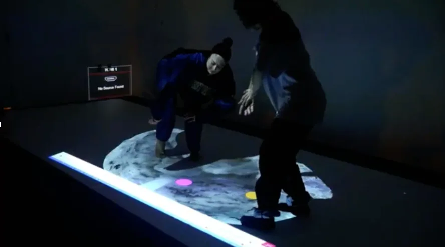
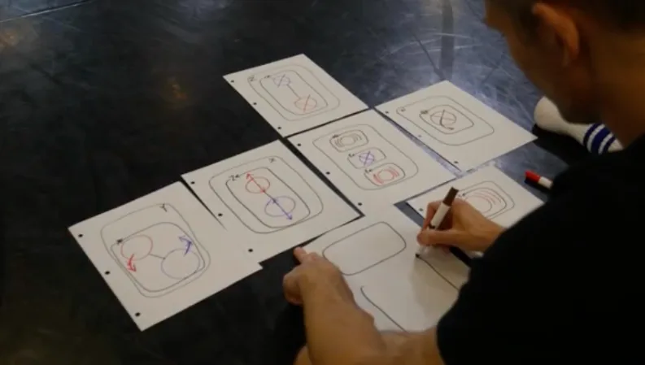

#### p5.score and the Interplay of Algorithmic Choreography — Processing Foundation Fellowship Project 2025

<iframe src="https://www.youtube.com/embed/cex5mzhTpKk?feature=oembed" width="700" height="393" frameborder="0" scrolling="no"></iframe>

#### Fellowship Project: p5.score

-   Artists: [Kate Sicchio](https://www.instagram.com/sicchio/)
-   Links: [Project website](https://www.sicchio.com/p5score)

“I’m interested in this idea of a set of instructions, guidelines, or tasks for a starting point for improv or for generating movement,” says Kate Sicchio, the media artist and choreographer behind [p5.score](https://www.sicchio.com/p5score). “It’s about how the score can become this contract or negotiation point between movement, a performer, and a creator.” Developed during her 2025 Processing Foundation Fellowship, p5.score is a JavaScript library that harmonizes the physical world of dance with the digital logic of p5.js. By translating creative technology into a choreographic language, Kate has built a framework where visual patterns on a screen serve as a catalyst for physical improvisation, positioning the code as a new partner on the stage.

*Dancers interpret a projected p5.score during the workshop, using the visual grid and shapes as prompts for improvisation. The digital score acts as a shared language between code and movement, guiding how performers navigate space and timing.*

The core mission of p5.score is to provide choreographers an entryway into creative coding. For many dancers, traditional programming can feel like a technical hurdle; Kate bridges this gap by integrating terminology from both dance and computing. Kate states that “simple things lead to complex things” when using p5.score, and the library’s API is intentionally paired down to remain accessible while also allowing for sophisticated structures as the dance evolves. The project draws inspiration from historical scores by choreographers like Trisha Brown who used systems and annotations rather than rigid notation to indicate movement.

The library’s “magic sauce” is the \`Dancer class\`, which represents a performer within the digital score. To bring the dancer to life, users employ a specific constructor that defines the performer’s initial state:

-   new Dancer(x, y, durations, positions, color, shape): This allows the creator to set the starting coordinates, a list of positions for the dancer to loop through, and the duration (in milliseconds) for each moment.
-   Movement Qualities: By changing the shape (radius size) or color, choreographers can represent different movement dynamics or qualities, such as a large shape indicating a lumbering flow or a small dot representing fast, sharp movements.

The movement is then animated using two primary methods: moves(), which initializes the timed sequence, and show(), which renders the dancer on the canvas with the draw() loop familiar in p5.js. One of the most impactful features is the Stage Direction functions. In response to community feedback that raw X and Y coordinates were “tricky,” Kate programmed familiar terms like center() (Center Stage), ul() (Upstage Left), and dr() (Downstage Right) to return coordinate objects, allowing artists to plot space using the language of the theatre.

*Dancers engage with floor-based p5.score projection, using colored shapes and spatial cues to guide their movement. The score becomes an interactive surface, inviting performers to respond physically to timing and position visual prompts.*

Underpinning the project is an open-source ethos rooted in Kate’s background in live coding. She views p5.score not as a static product, but as a tool for the community to “take, adapt, and change.” For Kate, this is a matter of empowerment: “Having agency when you move, having agency when you code.”

To ground the library in practice, Kate hosted a two-day workshop in Richmond, Virginia, with ten choreographers and creative coders. The process followed a call-and-response between analog and digital mediums. Participants began by drawing scores by hand and using paper and markers, a familiar starting point that allowed them to realize that p5.js fundamentals like strokes, weights, and coordinates were simply digital extensions of drawing.

*Workshop participants begin by sketching choreographic scores by hand, using shapes, lines, and arrows to map movement. These analog drawings serve as a foundation for translating choreography into digital form using p5.score.*

As they transitioned to the screen, participants realized that “when you code, it’s like choreography,” as you are telling an element what to do and how to do it. The workshop atmosphere was one of mutual exploration, where users experimented with adding images and theatrical scenery, transforming the scores into immersive backdrops.

The collaboration culminated with live dancers performing the generated scores. Two improvisers interpreted the digital patterns, which ranged from intimate floor projections that dancers followed closely to large-scale theatrical visuals. For Kate, witnessing the interpretation was a “sigh of relief,” proving that the tool could generate “beautiful movement” and that the dance community saw it as an innovative and valuable addition to their practice.

---

The Processing Foundation Fellowship supports artists and creative technologists developing open-source creative tools and practices that expand access to creative technology. Through financial support, mentorship, and community partnerships, fellows create tools, artistic works, and research that contribute to a more open and accessible creative coding ecosystem.

-   Learn more about the Fellowship → [here](https://processingfoundation.org/fellowships)
-   Support programs like this → [here](https://processingfoundation.org/donate)
