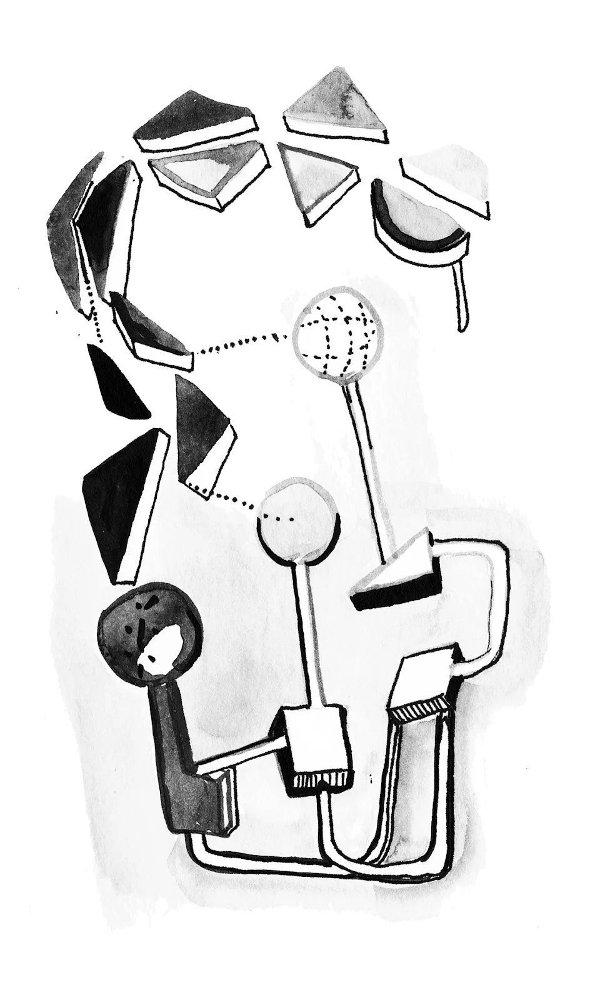

This text was originally written for the p5.js 1.0 Contributors Zine. You can [view the zine online](http://contributors-zine.p5js.org/), or [purchase a physical copy](https://processingfoundation.press/product/p5-js-1-0-contributors-zine-entries/) and support Black Lives Matter.

**This drawing by Taeyoon Choi was originally commissioned for the “*Getting Started with p5.js” *book by Lauren McCarthy, Casey Reas, and Ben Fry.**

I’m an oddkin of p5.js contributors. Oddkin is a word Donna Haraway uses to describe an unlikely intimacy. The word oddkin captures the essence of friendship I have in personal life, intellectual kinship with my students and peers at the School for Poetic Computation, and in the geographically diverse nature of the Processing community. I’m bilingual; it’s natural for me to try to translate the word into Korean. I looked up “kin,” which is 친척 (親戚 in Chinese). I don’t think the word oddkin has been translated into Korean. I asked if anyone would help translate it, and the media artist Masayuki Akamatsu suggested 기묘한동류 (妙な同類 in Japanese). It doesn’t have the earthy, critter-y feel of oddkin, but it’s close enough. In this essay, I take an opportunity to think about you, my oddkins.

Dear oddkins: I’ve been lucky to participate in and help with the [p5.js Contributors Conference](https://processingfoundation.org/advocacy/p5-js-contributors-conference-2015) at the STUDIO for Creative Inquiry in 2015, and I remain a fan of the project. Some of my colleagues and students say they are trying to “democratize” technology by making tools or resources. I’d like to challenge the implications created by the use of the word “democracy” in this context. Democracy, unlike “accessibility,” implies a fair distribution of power, representation, and equity for everyone, but is complicated by ongoing questions of citizenship. How many times have you heard a hacker say, “I made this open-source tool. Now everyone can do what I do!” What they don’t say is that to use it, you need to be technically fluent, accepted as a technical person, and have access to computers and networks. In reality, tools and resources alone cannot be democratic.

What the p5.js project has done differently from the beginning is demystify stereotypes of who is seen as technical and/or artistic — the myth of the lone engineer capable of creating a powerful framework—and create a technical community where non-technical contributions are valued equally. This approach is truer to the reality of software and hardware development. There are almost always non-technical contributors who are integral to the success of any technology, including but not limited to writers, educators, testers, designers, and quality control professionals.

The questions of whiteness in the technology field remain. I’ve attended numerous software and hardware conferences over the years. Some were highly exclusive and self-selective, others were open and inviting to newcomers. In the U.S. and Europe, the conference attendees were dominatingly white males. I could write a book about the troubling experiences I’ve had and witnessed at tech conferences. Older, established, white male engineers and academics making rude comments to female, gender non-conforming, people of color might need a few chapters. Young tech dudes promising to solve the world’s greatest challenges with code. “Introverts” who are actually just snobbish, escaping to their devices to avoid human contact but invasively stalking women with confidence. The most insidious forms of racism that happen offstage. How our speaker badge isn’t enough for us to enter the speakers’ lounge, how white bartenders treat us with offhand racist jokes, how we are tokenized for photo opportunities and a shout out on diversity statement. They can all get a chapter of their own in my book.

To survive in white spaces as a person of color, I’ve learned to adapt to the expectations of others at first. Once I felt grounded, I leveraged my place to give voice to the others. Speaking my truth made some people uncomfortable and I may have lost some opportunities. Speaking up brought me the respect of others, especially those who hold the power in white spaces.

How does one speak up to challenge the establishment? I think nuance and candor are essential to start a conversation. No one likes to be criticized, but everyone loves to be understood. When I was learning to code, a friend told me to “treat your computer like your younger sibling.” This approach of care and play is essential in exploratory and poetic computing. I think a similar approach is necessary to navigate the tech community. As the p5.js project grows in its scale and diversity, I want to ask: Who do we make our oddkins?

---

**Taeyoon Choi** is an artist and a cofounder of the School for Poetic Computation. [https://taeyoonchoi.com](https://taeyoonchoi.com), [https://sfpc.io](https://sfpc.io)
