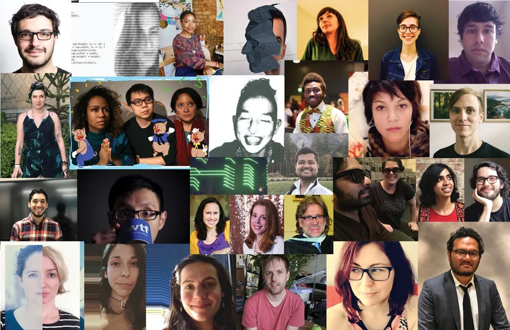

**Application Deadline: Wednesday, December 19, 2018, 11:59PM PST**

*The Open Call for 2019 Fellowships has ended. Thank you for your applications and interest. If you applied, we’ll be in touch in 2019 after we review the proposals.*

*Processing Foundation Fellows 2013–2018. \[image description: A collage of 32 people who make up the Processing Foundation Fellowship Alumni.\]*

Processing Foundation Fellowships support artists, coders, and collectives in visionary projects that conceive a new direction for what Processing as a software and a community can do. Fellowships are an integral part of the Processing Foundation’s work toward developing tools of empowerment and access at the convergence of art and technology.

Projects can range from software development of the existing Processing projects (Processing, p5.js, Processing.py, Processing for Android), to creative and exploratory research for new iterations. We place the most emphasis on projects that activate and cultivate community, speaking to the needs of specific groups through outreach initiatives that address barriers to access and diversity. We are less interested in funding an individual’s art practice, and more interested in supporting work that uses our software to creatively connect a group of people — be they students and educators, creators and users, artists and the public, or activists and organizers.

Proposals that involve education and the development of distinctive curriculum are encouraged. In the next few years, we are taking on ambitious initiatives and collaborations within the realm of education. We plan on expanding our educational material to provide greater access of tools and resources for educators around the world.

We support investigations into what a fellow may not already know how to do. We are open to applicants from all backgrounds and skill levels. We are attentive to proposals that demonstrate enthusiasm, innovation, and the evolution of a fellow’s practice rather than their pre-existing technical skills. We choose projects that will have a significant impact on the fellow’s practice, and offer them much-needed resources and support.

Our past fellowships are good examples of work we believe is important, and of how those projects have evolved into self-sustaining projects in their own right. Applicants should familiarize themselves with [previously supported work](https://processingfoundation.org/fellowships) and read [The Processing Foundation Medium account’s series of articles](https://medium.com/tag/pf-fellowships/latest) about fellowship projects of the 2017 and 2018 Fellows in their own words.

See Fellowship Guidelines below before applying. Fellowships are open to U.S.-based and international applicants.

Application period is open November 14–December 19, 2018. Selected fellows will be notified by early February 2019. Late applications will not be accepted. Fellows will be selected by the Processing Foundation’s [Board of Directors.](https://processingfoundation.org/people)

[Apply here.](https://docs.google.com/forms/d/e/1FAIpQLSdOxocNIkGhPV1IGosVhoEWetoSGDysZUBtCE1sz-ooCGwxNQ/viewform) If you have questions, please email foundation@processing.org.

The Foundation is looking for potential funders who would be interested in sponsoring part or all of a fellow’s project. If you are interested in sponsoring a fellow, contact Dorothy Santos, Program Manager at dorothy@processing.org!

---

#### **Fellowship Guidelines**

*Timeline*

Processing Foundation Fellows are expected to commit 100 hours to proposed projects, over the course of March 1, 2019 to May 31, 2019. The 100 hours of the fellowship must take place during this timeline. How the 100 hours are completed is flexible and decided upon between the mentor and the fellow. For example, if a fellow wants to work 100 hours over 2.5 weeks in March, that is fine. Or, if they want to log a few hours per week throughout the entire fellowship period, that is also fine.

Agreement of schedules and milestone dates is to be decided upon between the fellow and their mentor (and advisors, if applicable).

*Mentorship*

Mentors are assigned to each fellow from within the Processing Foundation’s community.

If a specific mentor is desired, please indicate this in the application.

Regular bi-weekly meetings with a mentor throughout the fellowship are required, either in-person or virtually.

*Project Documentation*

Progress updates, via social media, blogs, etc., are required to be posted after each bi-weekly progress meeting with the fellow’s mentor.

Fellowship projects are featured on the Processing Foundation’s website, with a fellow’s bio, images, and a link to the project. These materials must be provided by the start of the fellowship.

At the culmination of the fellowship, the fellow must produce a written account of their work for the Processing Foundation Medium.

In addition to the Medium article, final online documentation of fellowship projects are required. Documentation can take many forms, and we are open to what fits best for the work.

*Project Legacy*

Fellowship projects must be open source.

Project legacy is an important component of fellowships. We encourage applicants to think about how projects may support future sustainability or archiving of the work. This includes, but is not limited to: code commenting and reusability, documentation, prioritized @todo lists / roadmaps (if there’s more to do after your fellowship is completed), laying out infrastructure that enables others to carry on, summary of discoveries for research focused projects, etc.

*Stipend*

The stipend for the 2018 Fellowship is $3,000USD, calculated at $30 per hour for 100 total hours. Payment of the stipend will be made in 50% installments: $1,500USD paid at the start of your fellowship, and the remaining $1,500USD upon its completion.

*Community*

At the start of the fellowship, an introductory meeting for all 2019 fellows will take place virtually. The meeting is an opportunity for this year’s cohort to meet each other and learn about each other’s work. Attendance is required.

We follow the [community guidelines of p5.js](https://p5js.org/community/) for our code of conduct.

#### Contact Info

For questions, contact foundation@processing.org.
