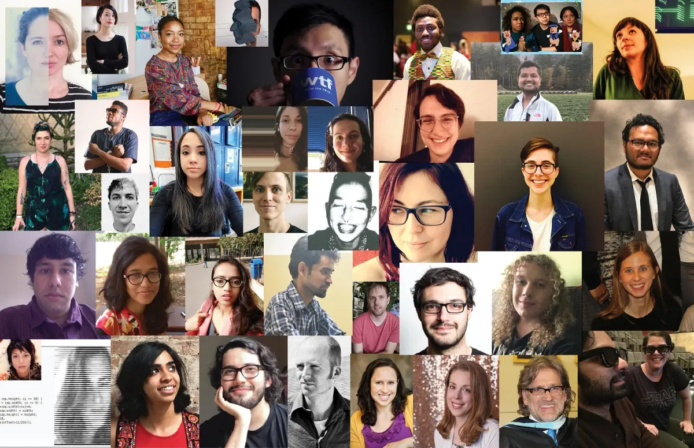

The Processing Foundation is currently accepting applications for the 2020 Fellowship Program.

[Apply here.](https://forms.gle/qmDg3jxg3ttMokzL7)

---

*The Processing Foundation Fellow cohort of five years!*

Five years of fellowships! With this open call, Processing Foundation celebrates its Fellowship Program’s fifth year of supporting members of our community in projects that converge and expand the fields of art, technology, education, and activism. The Fellowship program has sponsored inspired, ambitious, and visionary work from artists, designers, activists, educators, engineers, researchers, coders, and collectives — and many combinations of these — in projects that conceive a new direction for what Processing as a software and a community can do.

Fellowships are an essential element of Processing Foundation’s work toward developing tools of empowerment and access, and in nurturing the needs of the communities who use our software. Fellowships are self-initiated projects proposed by members of our community, which we support with mentorship; infrastructural, technical, and practical resources; and community connections. The Foundation chooses a cohort for the year that comprises a range of distinct and dynamic work, and much of our decisions are based not only on the strength of the proposal, but how we feel we can best support the fellow in the trajectory of their practice.

Projects can range from development of the existing Processing software projects (Processing, p5.js, Processing.py, Processing for Android), to creative and exploratory research for new iterations. We place the most emphasis on projects that activate, foster, and cultivate community, speaking to the needs of specific groups through outreach and engagement. Barriers to access and diversity should be thoughtfully addressed and included in the project’s scope. We are less interested in funding an individual’s art practice, and more interested in supporting work that uses our software to creatively connect a group of people — be they students and educators, creators and users, artists and the public, or activists and organizers.

We are open to applicants from all backgrounds and skill levels, and support proposals that involve investigations into what a fellow may not already know how to do. We are attentive to proposals that demonstrate enthusiasm, innovation, and the evolution of a fellow’s practice rather than their pre-existing technical skills. We choose projects that will have a significant impact on the fellow’s practice, offering the fellow much-needed resources and support.

Our past fellowships are good examples of work we believe is important, and of how those projects have evolved into self-sustaining projects in their own right. Applicants should familiarize themselves with [previously supported work documented on our website](https://processingfoundation.org/fellowships), and read [our Medium’s series of articles](https://medium.com/processing-foundation/https-medium-com-tag-pf-fellowships-la/home) where past Fellows describe, in their own words, what they accomplished during their Fellowships.

See Fellowship Guidelines below before applying. Fellowships are open to U.S.-based and international applicants. Only one application per person is allowed.

Application period is open November 18–December 19, 2019. Selected fellows will be notified by early February 2020. Late applications will not be accepted. Fellows will be selected by the Processing Foundation’s [Board of Directors and Board of Advisors](https://foundation.processing.org/people/).

If you have questions, please email [foundation@processing.org](mailto:foundation@processing.org).

The Foundation is looking for potential funders who would be interested in sponsoring part or all of a fellow’s project. If you are interested in sponsoring a fellow, contact Dorothy Santos, Program Manager at [dorothy@processing.org](mailto:dorothy@processing.org)!

---

### **Fellowship Guidelines**

**Timeline**

Processing Foundation Fellows are expected to commit 100 hours to proposed projects, over the course of March 1, 2020 to May 31, 2020. The 100 hours of the fellowship must take place during this timeline. How the 100 hours are completed is flexible and decided upon between the mentor and the fellow. For example, if a fellow wants to work 100 hours over 2.5 weeks in March, that is fine. Or, if they want to log a few hours per week throughout the entire fellowship period, that is also fine.

Agreement of schedules and milestone dates is to be decided upon between the fellow and their mentor (and advisors, if applicable) by Friday, March 6, 2020.

**Mentorship**

Mentors are assigned to each fellow from within the Processing Foundation’s community.

If a specific mentor is desired, please indicate this in the application.

Regular bi-weekly meetings with a mentor throughout the fellowship are required, either in-person or virtually.

**Project Documentation**

Progress updates, via social media, blogs, etc., are required to be posted after each bi-weekly progress meeting with the fellow’s mentor.

Fellowship projects are featured on the Processing Foundation’s website, with a fellow’s bio, images, and a link to the project. These materials must be provided by the start of the fellowship.

Final online documentation of fellowship projects is required. Documentation can take many forms — a GitHub repository, a series of video tutorials, a website, etc. — and we are open to what fits best for the work.

**Medium Wrap-Up Post**

At the culmination of the fellowship, the fellow must produce a written account (approximately 750 words) of their work for the Processing Foundation Medium. The fellow will work directly with the Director of Advocacy, either to be interviewed, or to write an article in their own words. The fellow must be available for the editorial process, which will occur in summer 2020. Because the article must include 3–5 high-quality images that represent the fellowship project, the fellow should produce photo documentation throughout their work period.

**Project Legacy**

Fellowship projects must be open source.

Project legacy is an important component of fellowships. We encourage applicants to think about how projects may support future sustainability or archiving of the work. This includes, but is not limited to: code commenting and reusability, documentation, prioritized @todo lists / roadmaps (if there’s more to do after your fellowship is completed), laying out infrastructure that enables others to carry on, summary of discoveries for research focused projects, etc.

**Stipend**

The stipend for the 2020 Fellowship is $3,000 USD, calculated at $30 per hour for 100 total hours. Payment of the stipend will be made in 50% installments: $1,500 USD paid at the start of your fellowship, and the remaining $1,500 USD upon its completion.

A fellow must complete the requirements of the fellowship for the stipend to be paid in full.

**Community**

At the start of the fellowship, an introductory meeting for all 2020 fellows will take place virtually. The meeting is an opportunity for this year’s cohort to meet each other and learn about each other’s work. Attendance is required.

We follow the [community guidelines of p5.js](http://p5js.org/community/) for our code of conduct.

**Contact Info**

For questions, contact [foundation@processing.org](mailto:foundation@processing.org).

[Apply here!](https://forms.gle/qmDg3jxg3ttMokzL7)
