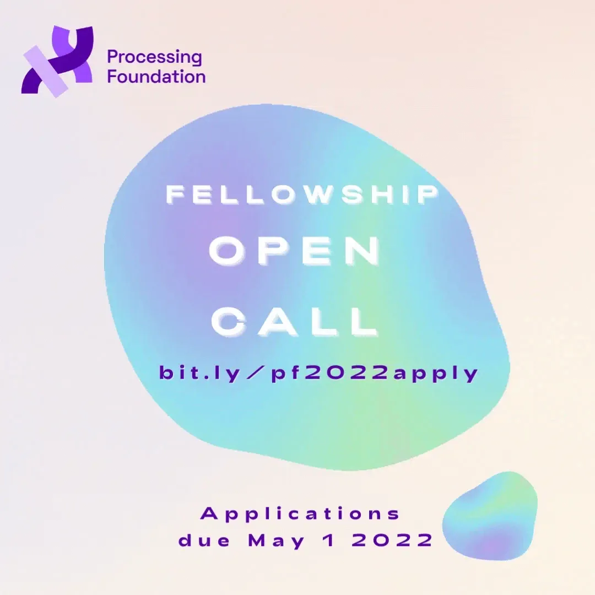

The Processing Foundation is currently accepting applications for the 2022 Fellowship Program.

**Apply here** [https://processing.formstack.com/forms/processing\_fellowship\_2022](https://processing.formstack.com/forms/processing_fellowship_2022)

The Processing Foundation Fellowship program supports artists, designers, activists, educators, engineers, researchers, coders, and collectives — and many combinations of these — in projects that conceive new directions for what our software, our community, and open source can do. Fellowships are an essential element of our Foundation’s work in developing tools of community power, connection, stewardship and in nurturing the aims and needs of the people and communities who use our software.

Fellowships are self-initiated projects proposed by members of our community, which we support with mentorship, infrastructural, technical, and practical resources as well as community connections. Fellowship projects can range from development of the existing Processing software projects and related Processing projects (Processing, p5.js, Processing.py, Processing for Android, ml5.js), to creative and exploratory research for new iterations. We are interested in supporting work by fellows that connect groups — be they students and educators, creators, artists, activists and organizers.

We are open to applicants from all backgrounds and skill levels, and support proposals that center investigations, experiments and learning. We are attentive to proposals that demonstrate enthusiasm and the evolution of a fellow’s practice rather than their pre-existing technical skills.

For 2022, we will support seven (7) Processing Fellows and four (4) Teaching Fellows with stipends, mentorship and other public opportunities. The number of fellows this year has been expanded, thanks to the generous support and collaboration of [SOSO Limited](https://www.sosolimited.com/). We are additionally grateful for the support of [Bocoup](https://bocoup.com/) and our other outside mentors. To learn more about the fellowship priority areas, stipends and guidelines, read on!

### **Fellowship Priority Areas for 2022**

Fellowship projects can range from development of the existing Processing software projects and related Processing projects (Processing, p5.js, Processing.py, Processing for Android, ml5.js).

This year we aim to support fellowships that respond to and meet the needs of the priority areas below. Applicants are asked to address at least one of the below, describing how their project responds to the concerns of the topic.

**Accessibility**

-   Foregrounds accessibility on the internet as core for building online communities.
-   What kinds of accessible, inclusive design tools can we use? For example, increasing accessibility on the p5 editor?
-   How can we translate accessibility guidelines across disciplines, for example, from [design patterns](https://w3c.github.io/aria-practices/) to art made using p5?
-   How can we expand accessibility of existing tools, whether assistive technology on the web, integrations with screen readers, or assistive features in p5?

**Internationalization**

-   Supports translations, educational materials, and documentation in different languages.
-   What are new ways to think about working across languages, borders, cultural contexts?

**Continuing Support**

-   Maintains and sustains projects that have already been initiated by past fellows (which you can learn about [here](https://processingfoundation.org/fellowships) and [here](https://medium.com/processing-foundation/https-medium-com-tag-pf-fellowships-la/home)) and/or members of the open-source community.
-   How can we continue the work of previous projects, communities, environments, and knowledge systems?

**AI Ethics and Open Source**

-   Advocates for ethical and inclusive approaches to new machine-learning and AI tools in the form of creative, artistic, and/or critical projects, for example, projects using [ml5.js](https://ml5js.org/).
-   How do we forefront accessibility, diversity, equity and belonging in the process of machine learning?

**Ecology & The Environment**

-   Focuses on the ways design and technology can steward the environment, ecology and sustainability, thinking holistically about tech and the conditions it creates.
-   How can we center the environment and materiality in creating designed experiences using technology?

See Fellowship Guidelines below before applying.

The application period opens **March 30, 2022 and closes May 1, 2022**. Selected fellows will be notified no later than the last week of May 2022. Late applications will not be accepted. Fellows will be selected by the Processing Foundation’s team and [Board of Directors](https://foundation.processing.org/people/).

Apply here [https://processing.formstack.com/forms/processing\_fellowship\_2022](https://processing.formstack.com/forms/processing_fellowship_2022). If you have questions, please email [foundation@processing.org](mailto:foundation@processing.org).

The Foundation is looking for potential funders who would be interested in sponsoring part or all of a fellow’s project. If you are interested in sponsoring a fellow for next year, contact Xiaowei R. Wang, Fellowship Director, at [xiaowei@processing.org](mailto:xiaowei@processing.org).

### **2022 Fellowship Guidelines**

We place the most emphasis on projects that activate, foster, and cultivate community, speaking to the needs of specific groups through outreach and engagement. Barriers to access and commitments to equity should be thoughtfully addressed and included in the project’s scope.

Our past fellowships are good examples of work we believe is important, and of how those projects have evolved into self-sustaining projects in their own right. Applicants should familiarize themselves with [previous fellowship projects](https://processingfoundation.org/fellowships) and read [our Medium’s series of articles](https://medium.com/processing-foundation/https-medium-com-tag-pf-fellowships-la/home) where past fellows describe, in their own words, what their fellowships entailed.

Fellowships are open to U.S.-based and international applicants. For a collective body of work/project, only one person (a lead applicant) should apply. Only one application per person is allowed.

**Timeline**

Processing Foundation Fellows are expected to commit 100 hours to proposed projects, over the course of June 1 to August 31, 2022. (Please note that the number of hours for Teaching Fellows is different; see below.)

The 100 hours of the fellowship must take place during this timeline. How the 100 hours are completed is flexible and decided upon between the mentor and the fellow. For example, if a fellow wants to work 100 hours over 2.5 weeks in July, that is fine. Or, if they want to log a few hours per week throughout the entire fellowship period, that is also fine.

Agreement of schedules and milestone dates is to be decided upon between the fellow and their mentor (and advisors, if applicable) by the first week of the fellowship.

**Stipend**

The stipend for the 2022 Fellowship is $3,000 USD, calculated at $30 per hour for 100 total hours. This applies to Fellows and Teaching Fellows. Payment of the stipend will be made in 50% installments: $1,500 USD paid at the start of your fellowship, and the remaining $1,500 USD upon its completion. Additionally, there is a small amount of discretionary project funds for the fellowship projects.

A fellow must complete the requirements of the fellowship for the stipend to be paid in full.

**Mentorship**

Mentors are assigned to each fellow from within the Processing Foundation’s community. The role of mentors is to provide guidance (creative, technical), as well as serve as an advocate for the fellow’s work.

If a specific mentor is desired, please indicate this in the application.

Regular bi-weekly virtual meetings with a mentor throughout the fellowship are required.

**Community**

We follow the [community guidelines of p5.js](http://p5js.org/community/) for our code of conduct.

At the start of the fellowship, an introductory meeting with all 2021 fellows will take place virtually. The meeting is an opportunity for this year’s cohort to meet each other and learn about each other’s work. Attendance is required.

Fellows are encouraged to build community with their cohort throughout the fellowship period, in group chats like Signal, Slack, or Discord, as well as Zoom meetups. Additionally, 2–3 Fellowship Program Alumni will deliver online talks and workshops with this year’s cohort. Attendance to these Alumni talks is strongly encouraged but not required, as they are meant to create connections and support knowledge-sharing within the fellowship community.

Along with mentorship, the Foundation staff will work to provide fellows with connections to other community members who might be able to support the fellow with specific needs in the roles of advisors and consultants; we will also look for organizations and spaces that might be able to host the fellow for future events and collaborations.

**Project Documentation**

Progress updates, via social media, blogs, etc., are required to be posted after each bi-weekly progress meeting with the fellow’s mentor.

Fellowship projects are featured on the Processing Foundation’s website, with a fellow’s bio, images, and a link to the project. These materials must be provided by the start of the fellowship.

Final online documentation of fellowship projects is required. Documentation can take many forms — a GitHub repository, a series of video tutorials, a website, etc. We are open to what fits best for the work.

**Medium Wrap-Up Post**

At the culmination of the fellowship, the fellow must produce a written account (approximately 750 words) of their work for the Processing Foundation Medium. The fellow will work directly with Xiaowei, the Fellowship Director, to either be interviewed, or to write an article in their own words. The fellow must be available for the editorial process, which will occur at the end of summer 2021, with publication in fall 2022. Because the article must include 3–5 high-quality images (photos, screenshots, videos, gifs, etc.) that represent the fellowship project, the fellow should produce visual documentation throughout their work period.

**Project Legacy**

Fellowship projects must be open source.

Project legacy is an important component of fellowships. We encourage applicants to think about how projects may support future sustainability or archiving of the work.

This includes, but is not limited to: code commenting and reusability, documentation, prioritized todo lists / roadmaps (if there’s more to do after your fellowship is completed), laying out infrastructure that enables others to carry on, summary of discoveries for research focused projects, etc.

### **2022 Teaching Fellowships**

In 2022 we are sponsoring a separate cohort of four (4) Teaching Fellows, who will produce teaching materials to be published on our Medium publication and Education Portal. With the changes COVID has brought to education, we believe it is imperative to support a multitude of perspectives for teaching in new contexts: from zoom classrooms, to homeschooling, to teaching accessibility and social-justice issues to a range of students.

This year we will support Teaching Fellows to develop teaching materials, which can range from a syllabus to reading lists, video tutorials to lesson plans. These materials will be published on the Processing Foundation Medium and Education Portal. Applicants to the Teaching Fellowships must select one of the core priorities above, and explain how the topic(s) will be incorporated into their project.

The Teaching Fellows will be expected to commit 90 hours of work over the course of summer 2022. Some of those hours will be used for 1:1 meetings with a mentor and as a cohort of Teaching Fellows. This time will be used for generating ideas, researching existing materials, and creating materials. There is an additional commitment of 10 hours to be fulfilled over the course of the school year, during which time the materials will be finalized, presented, and the fellow is interviewed for the Medium publication. These commitments include presenting a workshop at CC Fest and a long interview published on Medium.

Teaching Fellows will work with mentors, as well as be advised by Education Community Director, Saber Khan, at [saber@processing.org](mailto:saber@processing.org). Teaching Fellows will be paid the same rate as the other fellows, $30/hour, for a total stipend of $3000 USD.

### **Timeline**

March 30, 2022 — Applications open

May 1, 2022 — Applications close

Late May, 2022 — Interviews with finalists and fellowship announcement

June 1, 2022 — Fellowship period begins

June 10, 2022 — Kickoff meeting

July 15, 2022 — Mid-point check-in

August 31, 2022 — Fellowship period ends

September 2022 — Interviews & Documentation wrap up posts for Medium

October 2022 — All fellowship medium posts and documentation are online & live

January 2023 (for Teaching Fellows) — Participate in a virtual CC Fest

### **About us**

Processing Foundation’s mission is to promote software literacy within the visual arts, and visual literacy within technology-related fields — and to make these fields accessible to diverse communities.

Processing Foundation is committed to diversity in its programming and in nurturing a community culture and environment that is reflective of the diversity of the US as well as the global community networks we operate within. We aspire to create a climate where diversity is an asset for creativity and innovation. We strongly encourage applicants representing a range of differences that include — but are not limited to — age, national origin, ethnicity, race, religion, ability, sexual orientation, gender and sexual identity. Processing will consider all qualified applicants with criminal histories in a manner consistent with the requirements of the San Francisco Fair Chance Ordinance and New York City Fair Chance Act.

**Further questions?**

Contact [foundation@processing.org](mailto:foundation@processing.org).
