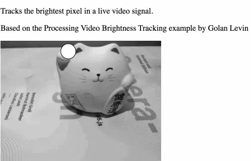
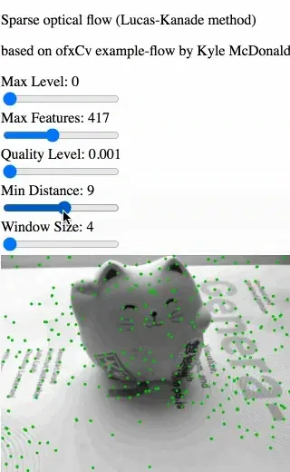
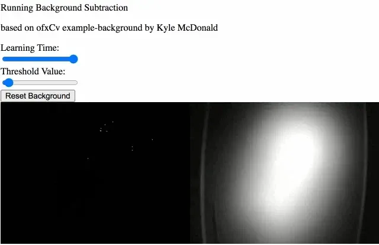
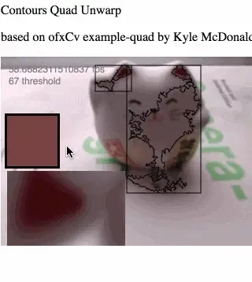

The 2020 Processing Foundation Fellowships sponsored six projects from around the world that expanded the p5.js and Processing softwares and nurtured their communities. In collaboration with NYU’s [Interactive Telecommunications Program](https://tisch.nyu.edu/itp), we also sponsored four Fellows to work on [ml5.js](https://ml5js.org/). Because of COVID-19, many of the Fellows had to reconfigure their projects, and this year’s cohort, both individually and as a whole, sought to address issues of accessibility and inclusion in their projects. Over the last couple months, we’ve published our annual wrap-up articles on how the Fellowship projects went, some written by the Fellows in their own words, and some in conversation with Director of Advocacy Johanna Hedva. You can read about our past Fellows [here](https://medium.com/processing-foundation/https-medium-com-tag-pf-fellowships-la/home).

*(Image descriptions are included in the caption when they are too long to fit in alt text.)*

---

*Brightness tracking example: a circle tracks the highlight as a light moves. [George Profenza](http://sensori.al/) is a London-based, Romanian-born creative technologist, most-of-the-time socially functioning nerd, all-around fix-it-code-champion, and chaser of rabbit holes. He spends his spare time bringing robots and puppets to life and finding artistic inspiration in paper folding, doodling, and complex geometry. His GitHub is [here](https://github.com/orgicus/). George was mentored by Golan Levin.*

**Johanna Hedva: Hi George! Tell me about your Fellowship project. What were your intentions and goals, and what did you accomplish?**

**George Profenza:** Hi Johanna. The Fellowship project is about OpenCV to Processing integration. OpenCV is the most popular open-source library for computer vision. Interestingly enough, one of the first Processing Fellowship projects, back in 2013, was Greg Borenstein’s OpenCV Processing library, which was the initial inspiration for my project. Currently the library still uses version 2.4.5, while the current version is 4.4.0 with many useful additions.

The core goal is in tune with OpenCV’s Processing library goals and Processing’s goals in general: abstracting complexity to lower the entry barrier for designers and artists. Personally I was excited about the library’s new deep neural network (DNN) module, which simplifies loading computer-vision models trained with popular frameworks such as TensorFlow, Caffee, etc. Luckily my mentor Golan Levin steered my focus away from this (since it’s already nicely supported in other creative coding tools such as the ml5.js library or RunwayML). Instead I focused on making sure the experience for new users is the best it can be, by:

-   abstracting complex tasks into simpler functions and classes
-   naming variables thoughtfully to avoid confusion (often overlooked)
-   making examples: the more the merrier, covering basic to advanced topics (great foundations for mini projects)

One interesting aspect of the modern OpenCV library is the fact that it can be compiled from C++ to JavaScript. While there are limitations in terms of performance and features, it’s a brilliant opportunity to take advantage of p5.js’s scripting environment for faster prototyping and learning.

There are wrappers out there for other open-source creative toolkits such as Cinder and OpenFrameworks; one stood out for its simplicity and elegance: Kyle McDonald’s ofxCv addon.

*The sliders above control a few Lucas-Kanade sparse optical flow. \[image description: Sparse optical flow example displaying green points overlaid on top of the porcelain cat and book. The green points represent tracked features.\]*

The accomplishment of the Fellowship project lies in the sum of: updating the underlying OpenCV library to enable brand new features, adapting the best of ofxCv in terms of ease of use as well as code legibility, and, of course, the library examples.

(Note: I studied the landscape of how creative coders are using OpenCV.)

The system used was inspired by and sometimes a direct port of the following:

-   Golan Levin’s Processing Video examples ([Background Subtraction](https://github.com/processing/processing-video/blob/master/examples/Capture/BackgroundSubtraction/BackgroundSubtraction.pde), etc.)
-   OpenFrameworks [ofxOpenCv](https://openframeworks.cc/documentation/ofxOpenCv/)
-   Kyle McDonald’s [ofxCv](https://github.com/kylemcdonald/ofxCv) examples
-   Kyle McDonald’s [cv-examples](https://kylemcdonald.github.io/cv-examples)
-   Greg Borenstein’s [OpenCV port for Processing](http://atduskgreg.github.io/opencv-processing/reference/)

The project currently lives on [github here](https://github.com/orgicus/p5.js-cv). It’s worth noting that this is a work in progress.

The majority of ofxCv have been ported, however there are few implementations missing at this point in time. I’ve documented these on the [repo’s wiki](https://github.com/orgicus/p5.js-cv/wiki/Contribution).

*Background Subtraction example. \[image description: A video loop of a dark hand silhouetted on a bright background that emerges to display one, two, then three fingers before circling out of the frame. The example displays the processed background on the left side of the image, as an accumulated binary image (where black represents background and white represents foreground). Above the two are a few UI elements to control the example: a learning time slider, a threshold value slider and a reset button.\]*

**JH: Many of our Fellows had their projects change completely because of COVID-19. Did this happen to you? What was the most difficult issue you encountered in the project? How did you work through it?**

**GP:** I was expecting a few difficulties along the way, but got more than what I bargained for and that’s a good thing.

What I assumed was simply updating an underlying library and adding more examples became a chance to research and design the library as well as dive deeply into the computer vision.

Regarding the OpenCV Processing Java wrapper, one of the challenges was compiling OpenCV from source for all the platforms the older library supported:

-   OSX
-   Windows (32 and 64bit)
-   Linux (64 bit, armv6 ,and armv7 (tested from Raspberry Pi Zero to Raspberry Pi 4)

I expected this would take some time, but I didn’t expect some interesting curve balls, including installing OSes and setting up build environments multiple times.

While a lot of the technical challenges have been solved in the meantime, it didn’t leave enough time for the p5.js wrapper. This meant shifting priorities back to p5.js, pausing the Processing java work for the time being.

On top of that, porting thousands of lines of code from C++ was no easy feat but an amazing opportunity to expand my knowledge in an organized manner. It was insightful to read about the process behind encapsulating computer vision algorithms in [Learning OpenCV](https://www.oreilly.com/library/view/learning-opencv-3/9781491937983/), the O’Reilly title by Adrian Kaehler and Gary Bradski.

In the past I would have used Processing, OpenCV, and many other tools for very different projects which, fun as it may be, would leave me with a feeling of being a “jack of all trades, master of none.” That’s not necessarily a bad thing in itself, however it’s so nice to delve deep into one area.

The most difficult issue, surprisingly, wasn’t related to technology per se: it was staying positive and on track.

I am grateful to Golan’s wise advice and Processing Foundation’s overall support, patience, and flexibility.

*Contours Quad example: a color can be selected to track by clicking and threshold adjusted moving the mouse. Contours are visualized as well as a quadrangle fitting around the contour, which is used to perspective warp content within the quadrangle. \[image description: The stream processed is a webcam view of a ceramic cat on top of the Generative Design p5.js book.\]*

**JH: I like that you say the Processing Foundation’s goals were reflected in your project, in terms of “abstracting complexity to lower the entry barrier for designers and artists.” Why do you feel like this is important for computer vision?**

**Another way of asking this is: Who are the intended users and community for your project? Why is your project helpful to them?**

**GP:** That’s a very good question. Computer vision is such a complex topic on its own. While the area would be mostly dominated by computer science researchers with many years of engineering experience, I was always inspired by its creative potential. There are so many good examples of software art using computer vision. Myron W. Krueger’s [Videoplace](https://en.wikipedia.org/wiki/Videoplace) feels so ahead of its time now. In terms of both tools and projects, more recent inspirations include JT Nimoy’s webcamxtra/JMyron library, Greg Borenstein’s work, and, of course, my mentor Golan Levin’s artworks and collaborations with Kyle McDonald, Zack Lieberman, Chris Sugrue, etc. I am interested in seeing how designers and artists will express themselves with such a library. What will future software art and interaction look like? Hopefully this will also serve as a foundation for understanding computer vision’s limitations and strengths, which can apply to specialized areas such as augmented reality and mixed reality.

**JH: What’s the future look like for you? Will you continue this work on the library, and/or contributing to open source generally?**

**GP:** I am very interested in computer vision for its potential as an intuitive human-computing interface for playful experiences. I look forward to expanding my knowledge and sharing with the community whenever I can.

There are more exciting features to develop for this library, which would’ve probably filled enough time for at least two more Fellowships. I would love to slowly and surely contribute more examples for amazing OpenCV features the library conceals.

I am also super excited about what new projects and examples the community will share and contribute.
