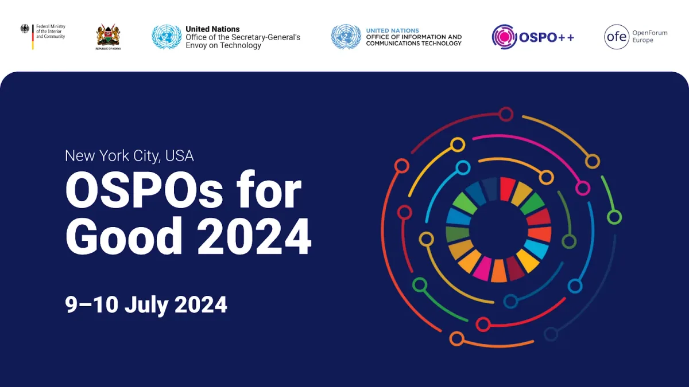
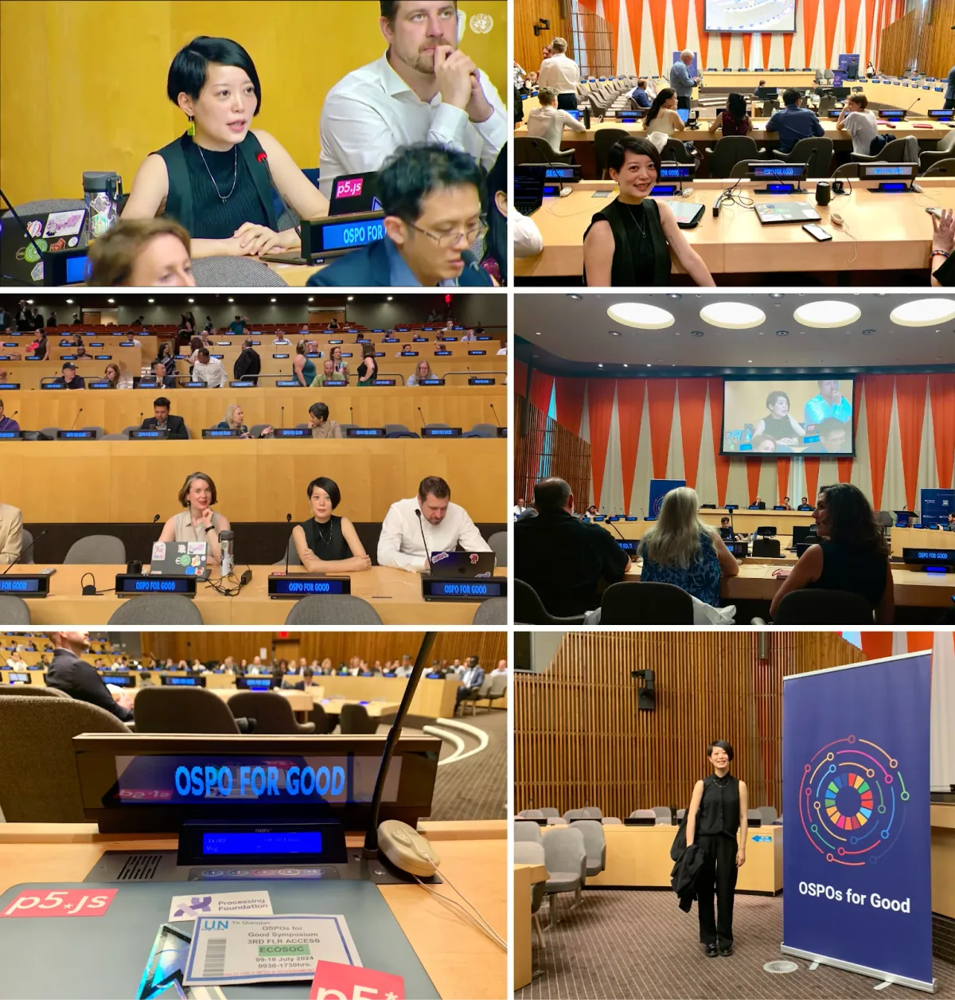
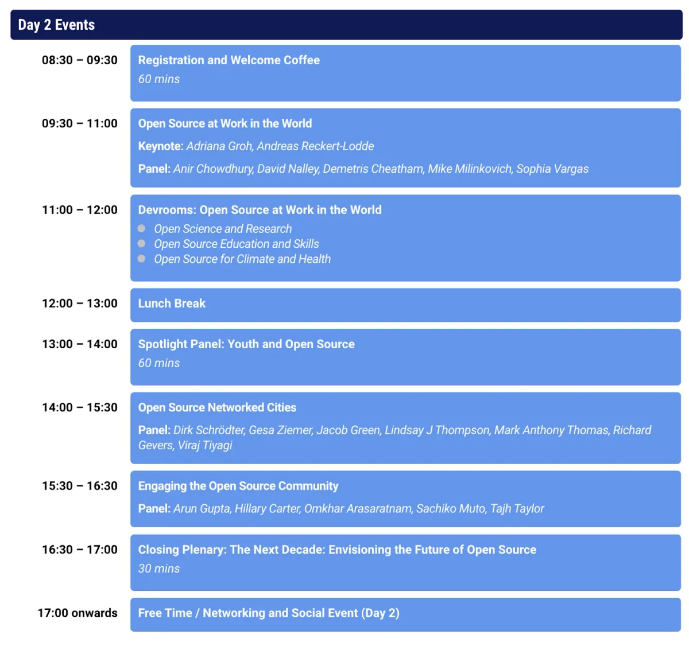

#### About the [Open Source Program Office (OSPO) for Good Symposium](https://www.un.org/techenvoy/content/ospos-good-2024)

*OSPOs for Good 2024 Banner. Image Source: [United Nations’s Open Source Program Office for Good Symposium website](https://www.un.org/techenvoy/content/ospos-good-2024).*

**Organizers:**

-   [United Nations Envoy on Technology](https://www.un.org/techenvoy/)
-   [UN Office of Information and Communications Technology](https://unite.un.org)
-   Government of Germany
-   Government of Kenya
-   [OpenForum Europe](https://openforumeurope.org)
-   [OSPO++](https://www.linkedin.com/company/ospoplusplus/)

> “Open Source Program Offices (OSPOs) are dedicated to facilitating the adoption of open source at every scale, from individual projects to the open source infrastructure critical for the day-to-day function of our technological world. Although OSPOs started in tech organisations, these are becoming a common phenomenon in the public sector, government, and more recently in the universities.”

> *—[Unlocking Global Innovation: The Transformative Power of Open Source Software](https://www.linkedin.com/pulse/unlocking-global-innovation-transformative-power-mz7vc/?trackingId=vljdBmTCGhFR0f3hbQEUQA%3D%3D), published by The Alan Turing Institute*

For more information regarding OSPO, please check out the [OSPO website](https://www.un.org/techenvoy/content/ospos-good-2024)*.*

  <iframe src="https://www.youtube.com/embed/f2weoUWJYPo?feature=oembed" frameborder="0" scrolling="no"></iframe>

In this clipped video, our p5.js Project Lead Qianqian Ye raised questions about diversity and accessibility in open-source and how governments and organizations can better support QTBIPOC (Queer, Trans, Black, Indigenous, People of Color) women or femme open-source leaders, maintainers, and contributors.

### Qianqian’s Reflections from OSPO

When I first received the invitation to attend the symposium a few months ago, I had no idea that the UN was interested in open-source, let alone host an event with global attendees. I’m so glad I went, as it allowed me to meet people working on open-source across governments, the public and private sectors, and academia.

It’s always heartwarming to connect with people we typically only interact with online. I finally met some p5.js community members in real life, like [Ruth Ikegah](https://www.linkedin.com/in/ruth-ikegah/?originalSubdomain=ng), the Open Source Manager at OSPO Now and a p5.js contributor who worked on tutorials for the [p5.js x STF project](https://p5js.org/es/events/stf-2024/). It was also wonderful to connect with folks from the [Sovereign Tech Fund](https://www.sovereign.tech) team and the [Google Open Source](https://opensource.google) Programs and Operations team, who have supported p5.js projects over the past few years.

*p5.js Project Lead, Qianqian Ye, at the United Nations OSPO for Good Symposium*

#### **Symposium Tracks**

-   Open Source and AI
-   Open Source in the Global South
-   Open Source at the UN
-   Open Source and Governments
-   Open Source at Work in the World
-   Youth and Open Source
-   Open Source Networked Cities
-   Engaging the Open Source Community

#### Symposium Schedule

The OSPO for Good Symposium, organized by the United Nations and critical partners, underscored the importance of open-source collaboration. By bringing together a global network of incredible people in the open-source ecosystem, the symposium strengthened connections and supported critical dialogue on what open-source is and should be.

If you would like to support Processing Foundation in our advocacy of open-source, [donate here](https://processingfoundation.org/donate) to contribute! We are grateful for our larger community of advocates, who continually shape the possibilities of open-source and creative coding.
